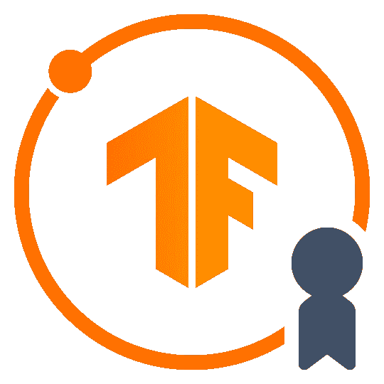
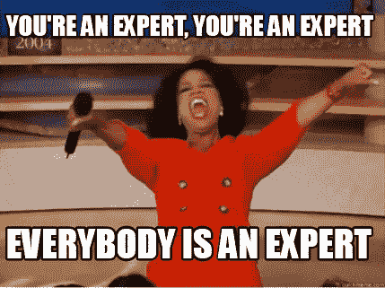
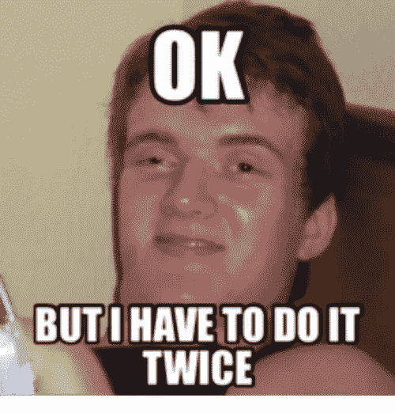
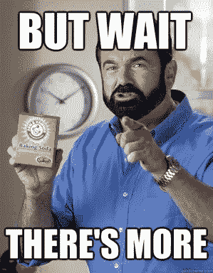
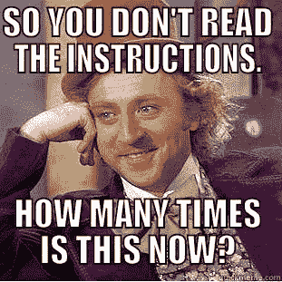
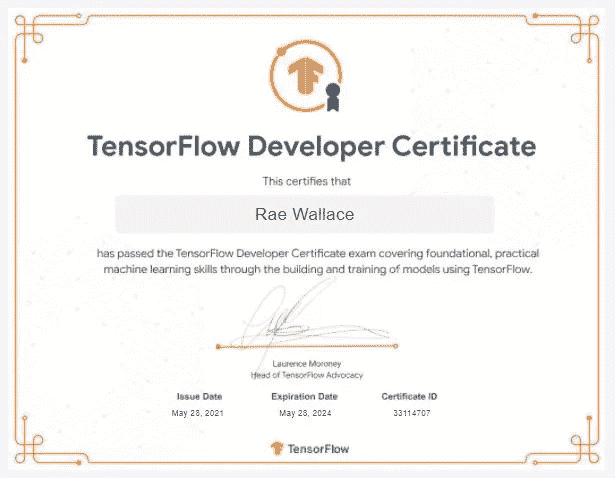

# 通过 TensorFlow 开发者证书的 5 个步骤

> 原文：<https://medium.com/analytics-vidhya/5-steps-to-passing-the-tensorflow-developer-certificate-4f6a1dbf7c69?source=collection_archive---------2----------------------->

深度学习是市场上最受欢迎的技能之一，TensorFlow 是最受欢迎的 DL 框架。在我看来，表明你对 DL 基础感到满意的最好方式之一就是参加 TensorFlow 开发者证书。我上周(2021 年 5 月)完成了我的，现在我给那些想验证你的数字图书馆技能的人一些建议，我希望你喜欢迷因！

[https://www . meme creator . org/meme/you-a-expert-you-a-expert-every one-a-expert/](https://www.memecreator.org/meme/youre-an-expert-youre-an-expert-everybody-is-an-expert/)

1.  **做深度学习。人工智能 TensorFlow 开发人员专业证书课程。**

唯一可以不参加该课程的人是那些在 TF 拥有多年数据科学家或机器学习工程师经验的人，即使这样，这些人也不需要证书。

**2。在 PyCharm 中并行做课程题。**

[https://me.me/i/ok-butihaveto-do-it-twice-11105290](https://me.me/i/ok-butihaveto-do-it-twice-11105290)

这是为了熟悉 PyCharm 环境。如果 Pycharm 不是你的首选 IDE，你就必须学习它，因为考试只在 Pycharm 中进行。在我做的时候(2021 年 5 月)，它使用 Pycharm 2021 和 Python 3.8。从课程的 Jupiter 笔记本中提取问题并保存为。py 文件，或者将它们复制并粘贴到 PyCharm 中，并将每个问题所需的所有库安装到您的环境中。

**3。完成课程后，查看他们网站上的其他 TensorFlow 问题。**

[https://i1 . WP . com/dearkidlovemom . com/WP-content/uploads/2014/10/but-wait-theres-more . jpg](https://i1.wp.com/dearkidlovemom.com/wp-content/uploads/2014/10/but-wait-theres-more.jpg)

这些是课程中问题类型的扩展，但是它们可以将所有四周的 NLP 或计算机视觉模块中的概念捕获到一个综合问题中。我特别推荐的两个问题是:

例 1:[[https://www.tensorflow.org/tutorials/images/classification](https://www.tensorflow.org/tutorials/images/classification)

例 2:[[https://www.tensorflow.org/tutorials/text/word_embeddings](https://www.tensorflow.org/tutorials/text/word_embeddings)

**4。在文本编辑器中保存课程示例，如 Atom**

你绝对应该把你学到的最重要的东西保存在你想要的任何文本文件中。除了深度学习概念，您还必须知道如何通过以下方法加载数据集:

tensorflow.keras.datasets 方法

直接从网站链接下载数据集到 pycharm 的文件夹中

**5。正确阅读说明！仔细阅读 PyCharm 环境要求！认真阅读每一个问题！**

http://www.quickmeme.com/p/3w2zwr

作为技术人员，我们偶尔会跳进一个问题，但请记住这是关于通过测试！这不是一个 Kaggle 竞争，通过测试，只给他们想要的，正是他们想要的！他们给你在考试期间测试你的代码的能力，所以如果你的代码完全失败，那么你没有正确地阅读问题！

**6。额外步骤:放松…………。…你能行的！**

[https://giphy.com/explore/kermit-tea](https://giphy.com/explore/kermit-tea)

考试长达 5 个小时。考试的创造者真的希望你通过。考试期间，你有足够的时间来泡杯茶、伸伸懒腰或查看足球比赛结果。如果您参加了专业化课程并遵循了其他 5 个步骤，那么您肯定会在不到 5 个小时的时间内通过考试。我用了不到 4 个半小时通过了考试，这是因为我没有按照第 5 步做其中的一道题。从本质上讲，其中一个模型一直失败，因为我没有给出问题具体要求的内容，尽管我提交的模型在逻辑上是正确的，但这个误判又花了 30 分钟才弄清楚。

祝你好运！希望能在 TensorFlow 网站上看到你们的认证！

