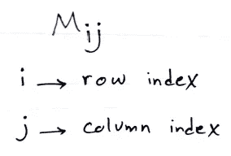
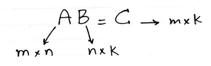
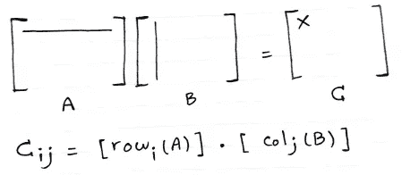
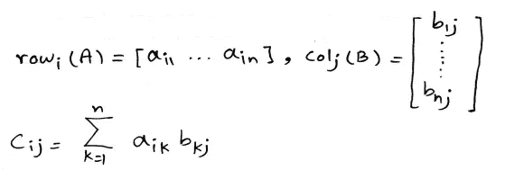
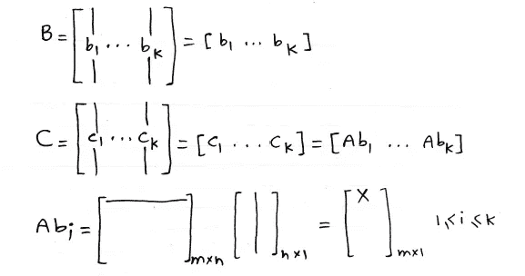
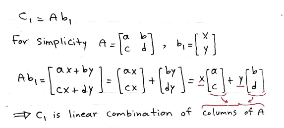
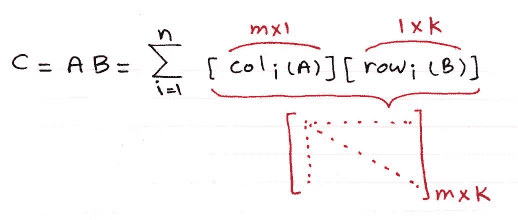
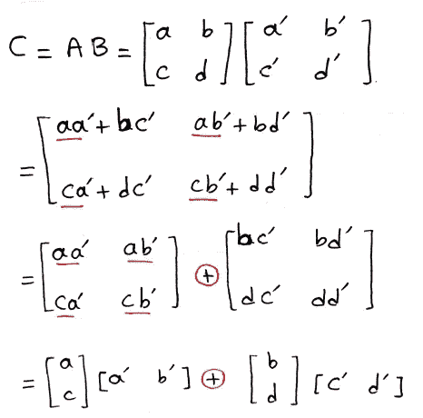
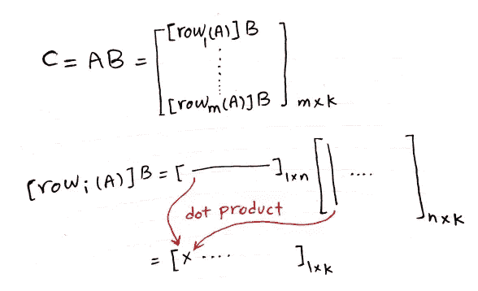
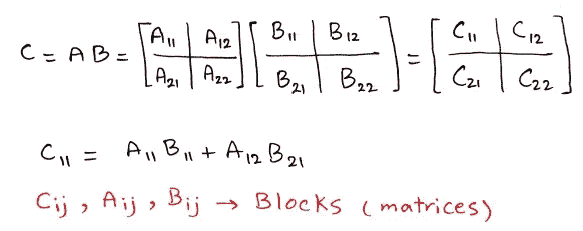

# 看待矩阵乘法的 5 种方式

> 原文：<https://medium.com/analytics-vidhya/5-ways-to-look-at-matrix-multiplication-ab374d16971c?source=collection_archive---------19----------------------->

你好，我来解释一下机器学习和数据科学需要了解的矩阵乘法的 5 种解读。

内森·弗蒂格在 [Unsplash](/s/photos/windows?utm_source=unsplash&utm_medium=referral&utm_content=creditCopyText) 上的照片

关于矩阵符号的提醒:

图片 1

我们正在考虑以下所有 5 个部分的一般情况。

图片 2

第一种方式其实就是矩阵乘法的定义。

1.  矩阵 C 的每一项都是矩阵 A 的相应行和矩阵 b 的相应列的点积。

图 3

点积提醒:

图 4

从现在开始，下面的一切只是对第一个的不同解释。

2.C 的每一列是 A 的列的线性组合，B 中相应列的值作为权重。

我已经把它记在图 5 和图 6 中了:

图 5

让我们用图 5 的透视来看看 C 的第一列:

图 6

3.当**矩阵 i** 是 A 的**列 I 和 b**的 r **行 I 的乘积时，矩阵 C 可以通过增加与 C 大小相同的 **n 个矩阵**来计算**

图 7

让我们用一个例子来阐明它:

图 8

4.C 的每一行都是 A 乘以矩阵 b 的对应行。

图 9

5.我们可以将矩阵 A 和 B 分块，并按如下方式计算 C:

我们将 A 和 B 分成块的方式可能有不同的选择，但是我们应该考虑到得到的块的维数符合矩阵乘法的规则。

图 10

感谢阅读。祝你平安。如果你喜欢它，你可以按拍手图标。