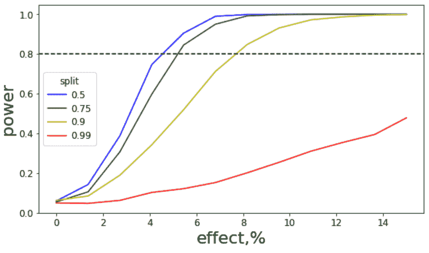

# 对半分还是不分？

> 原文：<https://medium.com/analytics-vidhya/50-50-split-or-not-6bdac4fb1b01?source=collection_archive---------0----------------------->

每当我们听到 A/B 测试时，我们都会自然而然地认为我们平等地分离了我们的流量。让我们试着找出不仅仅按 50/50 分割的潜在原因。

尝试这样做有两个主要的相关原因:

1.  如果实现存在一些问题，或者出现了重大错误，我们会降低风险。
2.  我们存钱以防实验失败。

总的来说，这两个原因与 A/B 测试的总体目标是一致的。更快、更有信心地得出哪个变体(A 或 B 或 C……)更好？

我们是否可以改变比例(例如 95 / 5)并期望得到与 50 / 50 比例相同的结果？。 ***一般来说，经典的统计检验没有关于不平衡数据的假设，然而我们可以使用一个具有相同准确度的不等分裂吗？***

幸运的是，我们不应该深究其背后的理论，我们可以只是模拟数据并检查它。为了做到这一点，我们创建了一个对照组和一个治疗组，一个已知的差异。所以我们的基本事实是，这是有区别的，我们应该拒绝 H0 假说。我们怎么计算我们的准确度？ ***我们将计算每种拆分的检验功效= > 50/50、75 /25、95 / 5 和 99 /1。***

## 只是一个快速的提醒:一个**测试的威力**是检测一个结果的概率，如果它存在的话。

对于每个分割，我们将使用 1000 和 10000 个样本模拟数据，不同的已知提升高达 12 %。对于每个模拟，我们将从具有恒定平均值和方差的正态分布中抽取样本。

在这 N 次(在我们的例子中是 1000 次)模拟中，我们将计算多少次我们将检测到差异。

P 值低于显著性水平的模拟百分比是多少

n = 1 000 个样本

n = 10 000 个样本

在 X 轴上我们有一个真实的效果，用百分比来衡量，在 Y 轴上是发现这种差异的概率。

## 我们能从这些模拟中得到什么？

首先，我们达到的测试最大功率是在五五开。第二，50/50 分割和 75/25 分割之间存在边际差异。我们还可以从这些图中得出，随着真实效应的增加，50/50 和 95/5 分割之间的差异正在减小。除此之外，随着提升和组中样本数量的增加，功率也增加。

## 我们的结论

如果你没有足够的流量，例如总共只有 100 或 1000 DAU，我们甚至不应该考虑在不平等的分割中运行 AB 测试。我们应该尝试将我们的小组分成 75/25 或 95/5 的比例，只有当有足够的流量让我们观察到我们的预期差异，我们的预期提升足够大，更重要的是，我们有一些目标，例如我们的变化涵盖了产品的许多方面，这对于顺利进行非常重要。

## 为未来

在下一篇文章中，我们将讨论一个不相等的比率如何影响多重假设的情况。