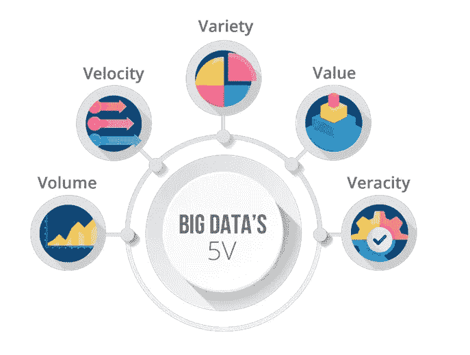

# 对于非 IT 人员来说，大数据的 5 倍

> 原文：<https://medium.com/analytics-vidhya/5vs-of-big-data-to-a-non-it-person-c498f8b56c86?source=collection_archive---------13----------------------->

大数据的 5v

如今的 5v 看起来就像大 v 一样花哨。

但是不管是谁想出来的，他都非常清楚大数据的定义。

所以他们在这里…

*数量、速度、多样性、准确性、价值*

所以让我们继续前进…

想象一下，你在同一天收到一堆来自不同科目的作业，每门科目都有很多工作表…

想象一下这一切都发生在同一天。现在想想你的压力水平，老师布置家庭作业的速度，工作量，科目的多样性，有些老师甚至可能会给你已经在其他网站上存在的工作表，而不需要他们为你付出努力，当他们说在一天内提交/归还所有的家庭作业和工作表时，他们能指望你有什么质量？。

对你的大脑来说似乎很困难，对吗？

这也正是大数据正在发生的事情。

在作业和工作表是数据的地方，它们的丰富或太多的作业表明**量**，这实际上是巨大的。(就像你的大脑无法接受一样，系统也很难保存这么多数据)

不同科目的家庭作业显示了多样性。(大量数据来自不同的**种类** - >不同科目的作业太多)

所有的老师在同一天给作业的速度很快，**速度**。(表示接收数据的速度)

许多老师从网站上复制粘贴的工作表，没有质量或信任，因为他们也没有付出他们需要的努力(这表明**真实性**，你真的能够信任和验证你收到的数据吗？)

当所有的提交都放在同一天，你真的能在规定的时间内完成吗？，我们中的许多人不会，然后我们大多去抄袭别人的作品。那么你在这里为你的工作创造的**价值**，好吗？

**注意:这种情况完全是假设的**

这正是 5v 试图解释的。

1.  卷，数据量
2.  速度，即创建和存储新数据的频率，或者数据更新的速度。
3.  多样性，数据类型是多么的不同
4.  真实性，数据的“真实”或“混乱”
5.  价值，数据的意义

希望对你有帮助。谢了。