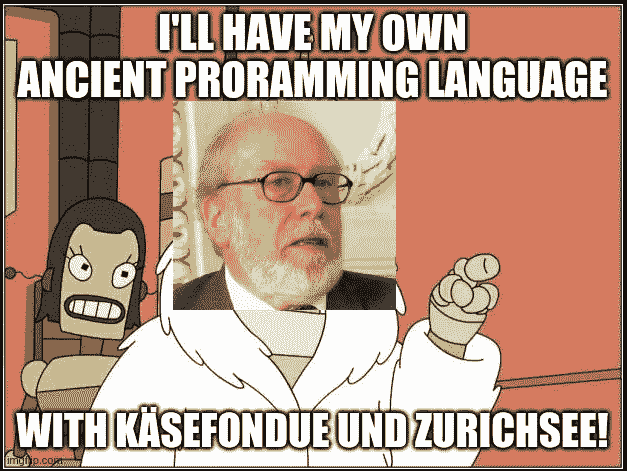
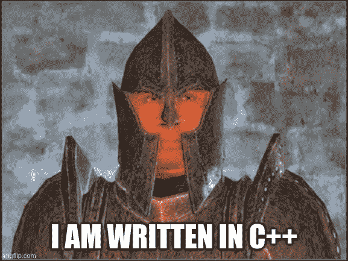
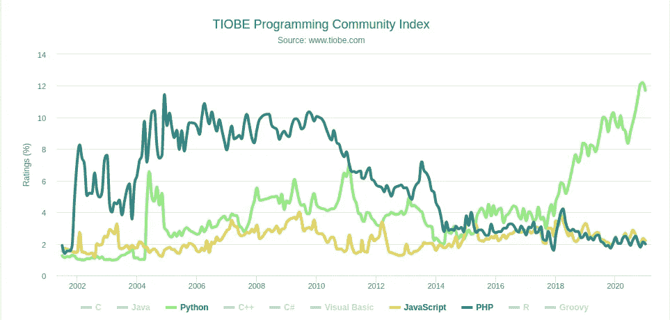
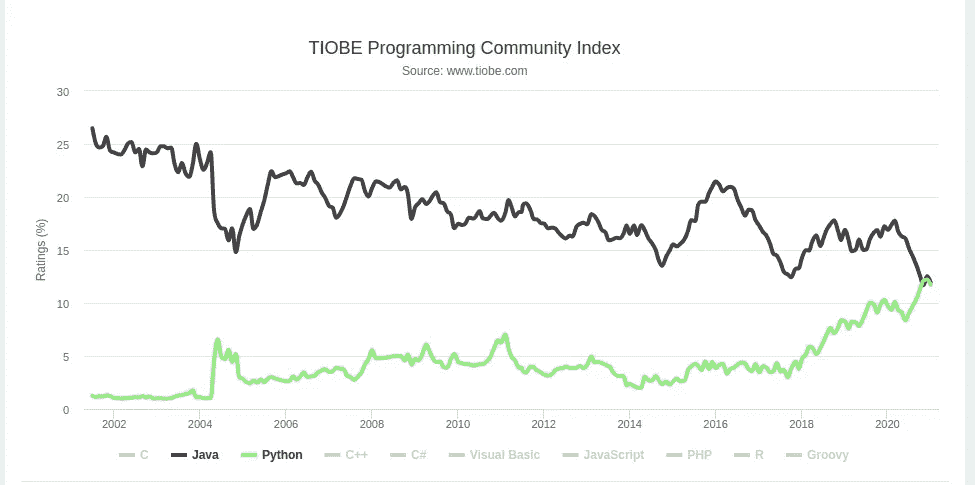

# 6 种重要的编程语言及其最初目的

> 原文：<https://medium.com/analytics-vidhya/6-important-programming-languages-and-their-original-purpose-52780c42f0ff?source=collection_archive---------13----------------------->


## 技术概述

## 古今流行的语言是为了什么而创造的？

编程的历史已经有 70 年了，不同的语言来来去去。他们每一个人都是为了某种目的而被创造出来的，他们都是为了解决上一代人的技术问题。查看六种编程语言的简史和它们最初的目的，以及它们的发展方向。

# FORTRAN 语言

最古老的编程语言之一是 Fortran(公式翻译)。它由美国宇航局使用，由 IBM 创建，如果你对数据科学不陌生，你可能会知道已经开发了几十年的突出的科学包。编程的爷爷 Fortran 有他的起伏，但自从 1957 年首次发布以来，它已经遭受了多个主要标准，最后一个是从 2018 年开始的。老一点的标准让后来的汇编版本想起来了(可能只是对我而言)。看看我在大学的超级旧代码:

用 Fortran 语言进行多项式样条计算

Fortran 77 有一些奇怪的特性，比如变量名的隐式类型:如果变量是 math i，j，k 等中常见的迭代器之一。，它们被认为是整数，否则是浮点数。这让我在使用它的时候很头疼。编程最初是一门纯粹的数学学科；计算机是一种奢侈的设备，价格昂贵(:D)，只有航天工业的科学家和工程师才能使用。

在创建 Fortran 的时候，没有多少选择。不像今天，任何东西都有一种编程语言，Fortran 在很长一段时间内主导着计算机科学。

> 当时创建 Fortran 的目标是摆脱难以理解的汇编程序，这是创建各种领域所需的大型程序的真正障碍。另一方面，数学家很难理解它，因为汇编程序是机器思考的方式。查看我的另一个 uni 程序进行比较:

还原一串符号的汇编程序

很罗嗦，是吧？这是你反转一个字符串需要的代码量。想象一下，向太空发送一架航天飞机需要多少代码！难怪他们需要更好的东西。

Fortran 引入了一些概念，没有这些概念，今天的编程似乎是不可能的:用 IFs 代替 goto，用寻址内存代替在连续内存区域内移动索引，用输入/输出例程代替中断，等等。

Fortran 是一场革命，但它的主要目的过去是，现在也是数学程序的有效编程。有些库已经存在很长时间了，比如 LAPACK 和 BLAS，它们现在是现代计算包的基础，比如 python 中的 NumPy。当然，还有许多优秀的替代方案，但是 Fortran 现在已经成为进行庞大计算的超级有效工具。

# 帕

以法国数学家和物理学家布莱士·帕斯卡的名字命名的编程语言是由瑞士程序员尼古拉斯·沃斯在 70 年代早期创造的。当时广泛传播的 ALGOL 语言，实际上是帕斯卡的灵感，还不够好，他决定创造自己的 ALGOL 语言。当然，用他的 21 点和妓女。



尼古拉斯·沃斯在苏黎士的历史性演讲，1970 年

尼克劳斯有一些底部爆炸，因为 ALGOL 夸大开发者不想合并他的建议。这些提议变成了帕斯卡。另一个例子是单个开发人员的努力在舞台上停留的时间更长，就像最初的 wannados 一样。

> 从一开始，Pascal 就应该激励年轻的程序员使用安全的编程技术，编写易于阅读和理解的代码，因此非常适合向学生介绍编程的基本概念。帕斯卡的主要目标是教学。

Pascal 已经成为 80 年代编程教学事实上的标准。虽然我在 80 年代并没有真的去上大学，但是苏联在适应西方技术方面有一定的滞后。我的第一个程序确实是用 Pascal 语言编写的。

我对 Pascal 又恨又爱，就像我对 MySQL 又恨又爱一样。


查看 Pascal 外观和感觉:

在帕斯卡中检查一个数是正数还是负数

# C


肯·汤普森，丹尼斯·里奇(创作者)。你可以看出他们发明了一种编程语言。

另一个受 ALGOL 启发的汇编语言战士，由美国程序员丹尼斯·里奇于 1972 年创造。那时候，Linux 甚至还不在计划之中，也没有任何操作系统像我们今天所知道的那样明显地主导着市场。对于普通人来说，电脑绝对是一种舶来品，并且只属于那些了解硅驯服技术的人。与当今最便宜的物联网节能一体式计算机相比，当时工程师可用的计算能力微不足道。

> 因此，我们需要的是一种能有效编译成机器代码，但仍能被人类理解的语言。除此之外，在具有不同命令集和体系结构的商业处理器世界中，没有一种简单的方法可以同时为多个平台编写程序。想象一下，你在街上遇到的每个人都会说不同的语言，这就是当时的计算世界。创建 C 语言的目标是可移植性和有效性。

虽然 C 语言统一了当时处理器的分散技术领域，但它的许多概念在未来已经成为一场真正的斗争。寻址数组的 n+1 元素使得二进制代码注入成为可能，因此恶意代码可以在被攻击进程的上下文中执行。几乎任何特权升级都利用这个缺陷来利用远程程序。

查看一些 C 语言代码:

添加两个数字，[https://www . programiz . com/c-programming/examples/add-numbers](https://www.programiz.com/c-programming/examples/add-numbers)

很丑，不是吗？在我非常主观的看法中，分号表示语句终止，花括号表示代码块，这使得大型程序特别不可读。许多人似乎不同意这种观点，所以许多其他语言继承了这种语法:Java、Objective C、C++、JavaScript、PHP。该语法的目的是机器代码的简单翻译，而不是可读性。然而，现在我们来了:编程史上最丑陋的语法变成了最流行的语法。

# C++

1989 年，比雅尼·斯特劳斯特鲁普决定用面向对象的编程特性来丰富 C 语言。由麻省理工学院和艾伦·凯提出，面向对象的编程不同于命令式和过程式编程，这是理解执行的方式。如果命令式程序读起来像烹饪食谱，那么面向对象的程序用对象、属性和可能的动作来操作，所以它更像一个有很长序言的剧本或法律文本。

> 我发明了“面向对象”这个术语，我可以告诉你，我脑子里没有 C++(艾伦·凯，计算机科学的大坏蛋)

不管 Alan Kay 怎么反对，几十年来，C++已经成为商业编程的主导，用这种语言编写的代码数量巨大。在这种形式下，任何比拉链更复杂的现代计算系统都有一部分是 C++中的ẇriten。桌面应用、游戏、服务器软件、嵌入式系统、智能手机软件、操作系统、科学编程——c++应用的清单是无限长的。

凭借其出色的性能，C 无法提供面向对象编程的表达能力，所以当这样一个工具到来时，它注定要征服编程遗忘的所有平面。



然后我的膝盖中箭了。等等，弄错了上古卷轴，soré！

代码看起来非常相似，但是有类。我用完了花括号和分号，所以没有代码示例。JK！一个用 C++写的四边形。

一些来自大学的丑陋的代码

更丑陋的语法，这一次永远无处不在。

# 服务器端编程语言（Professional Hypertext Preprocessor 的缩写）

早在 1994 年，托管内容的唯一方式几乎是静态 HTML 页面。像 C++这样的大玩家并没有真正受到青睐，因为网页的动态特性、不断变化的内容和奇特的执行模式。

编译语言与将源代码转换成可执行的二进制文件有关。该可执行文件随后不可更改，并以这种形式分发给最终用户，以便在他们的本地机器上执行。这就是现在桌面应用程序的工作方式。

在 HTTP 和万维网对最终用户可用之后，传播内容的新概念被引入。这里的执行分为两部分:远程部分和本地部分。在远程计算机上，一个称为 web 服务器的特殊程序读取文本文件，并通过网络将其传输到本地计算机。反过来，本地机器执行另一个程序，读取文本文件中的指令，命令它将文本放在屏幕的特定位置，对其进行布局，并在与网络上其他文本文件的连接处加下划线。

这个概念被称为超链接，连接文件和创建一个网站。这些文档当时被称为超文本，这种通信的正式描述——一种协议——被称为超文本传输协议或 HTTP。网络本身应该连接整个世界。它被称为万维网或 WWW 这些缩写今天是众所周知的。

托管静态 HTML 是一件痛苦的事情，因为与本地可执行文件不同，网页需要不断修改。需要的是我们今天称之为模板语言的东西:从数据库插入数据、迭代、条件语句、变量等等。

1994 年，拉斯马斯·勒德尔夫创建了 CGI→公共网关接口。想法是这样的:如果有一个浏览器能够呈现静态 HTML 文件，让我们假设我们保存了这些文件，但实际上，是在运行中生成它们。拉斯莫斯把它用在了他的主页上，所以我们又来了，懒惰点燃了一项绝对新的技术。

> 这就是为什么它被称为 PHP:个人主页解释器。创造者从来没有计划让它成为一种编程语言，所以在它的整个生命周期中，PHP 一直缺乏概念。

与现代 PHP 或其他 web 相关语言相比，这种语言的功能相当初级。1995 年，它增加了一些必要的东西，比如来自 Perl 的 variables。

让我们来看看来自维基百科的早期 PHP 代码示例:

早期 PHP 代码示例:模板中的 SQL 权限导致了很多安全问题

比较一下它现在在 Django 模板语言中的大概样子:

现代模板语言等价物。不过，现在你不会在模板中找到原始的 SQL。

随着时间的推移，PHP 语法滑向了 C 语言，但它并没有画出 C 语言。请记住，使用这种难看的语法的目的是为了提高性能和快速编译。为什么要把它改编成一种用于 web 应用程序的解释语言，这对我来说是一个谜。不过我有一个假设，让拉斯姆斯自己回答:

> 我不知道如何停止它，从来没有任何打算写一门编程语言……我完全不知道如何写一门编程语言，我只是不断地在这个过程中添加下一个逻辑步骤。(拉斯马斯·勒德尔夫)

所有这些都没有阻止 PHP 统治 web 编程长达 20 年，直到用它编写的劣质代码的数量达到临界质量。就像一首蹩脚的流行歌曲，到处都在播放。

PHP5 引入了面向对象编程，但是遗留代码的数量如此庞大，以至于社区已经为实现这种转变奋斗了多年。Php 已经逐渐转向了你爷爷用来娱乐他的极客伙伴们的老东西。今天，过去不可否认的领导者在 TIOBE 指数第 8 位(2021 年)，它的领导地位已经让给了… Python。谁能想到呢？



该学 Python 了，bebe。

# Java 语言（一种计算机语言，尤用于创建网站）

另一种使用有问题的 C 语法的语言是 Java。尽管编译语言因为被直接翻译成机器代码而明显更快，但这些程序缺乏可移植性。

1991 年，詹姆斯·高斯林、Patrick Naughton 和 Mike Sheridan 开始开发 Java 的第一个前身，五年后的 1996 年，第一个商业版本发布了。Java 在编程中引入了一个新概念——虚拟机。

与 C++不同，Java 使用一个中间件软件，一个运行在架构上的可执行程序，而不是编译和构建源代码到可执行程序中。这个软件读取被称为字节码的预处理过的 Java 代码，然后将其作为处理架构本身来执行。除此之外，虚拟机还承担了一些重要的辅助任务，比如内存管理和安全性，与令开发人员头疼的编译语言相比，虚拟机显示出了明显的优势。

> 尽管 Java 最初指向嵌入式系统，并与这一前景一致，但它的应用远不止于此。

“写一次，到处跑”改变了一切。Java 已经占据了众多的工程领域，首先是公司软件和 web 开发。在其漫长的历史中，Java 经历了几十个版本，几易其主，如今象征着公司编程的巨大而肥胖的世界。如今，虚拟机的概念是 Python 和 Javascript 等解释型编程语言的标准部分。

找出字符的 ASCII 来源。甚至比汇编程序还要冗长。来源:[https://www . programiz . com/Java-programming/examples/ascii-value-character](https://www.programiz.com/java-programming/examples/ascii-value-character)

Java 是将程序从其执行环境中分离出来的后续步骤。虚拟机已经将代码从硬件令人烦恼的细节中分离出来，因此实际的编程可以专注于解决任务本身，而不是玩弄本地计算资源。在 web 编程中，大部分执行都是在等待 I/O 时发生的，计算性能并不那么重要，这是一个巨大的好处。

当谷歌在 2008 年推出自己的 iPhone 竞争对手时，它决定将 Java 作为其新 Android 平台的编程语言。开始之后，很明显 Java 虚拟机的标准实现遭受了不可预测的性能下降，这是由自发的垃圾收集引起的。与脸书类似，但谷歌取得了更大的成功，它决定触碰 Java 世界的神圣之牛，创建自己的 Java 机器，适用于资源关键的实时最终用户应用程序，通常称为“应用程序”可以肯定的是，安卓应用。

按照今天的标准，Java 是一个不可支持的怪物。编码观念太死板，太独裁；Java 让位于易于使用的解释型语言。为了克服危机，Java 虚拟机上运行多种语言，但使用不同的语法，并包括像函数式编程这样的现代动态函数，众所周知的是 Scala 和 Kotlin。因为它们被翻译成 Java 字节码并可以被 Java 虚拟机执行，所以现有的 Java 库可以被注入并用作 Scala 或 Kotlin 本机代码。这是一个巨大的好处，因为它继承了 Java 辉煌时期的大量代码。

> 自 MS-DOS 以来，Java 是对计算造成最大冲击的东西。(艾伦·凯，我喜欢那个家伙)



与 Python 相比，Java 在过去二十年中的评价持续下降

```
Thanks for reading. Subscribe for more interesting content!
```

另外，看看我最近的文章:

🍑 [Fullstack 我的后端](/analytics-vidhya/fullstack-my-backend-c89d1126ae57):为什么 full stack developer 是一个神话

🕒[为什么你的软件质量随着时间退化](https://thorin-schiffer.medium.com/same-old-story-4d1ef4df0824):短篇故事

🐍 [RapidAPI:使用 Python 的第一步](/analytics-vidhya/rapidapi-and-fastapi-d720789a5b7e):综合指南