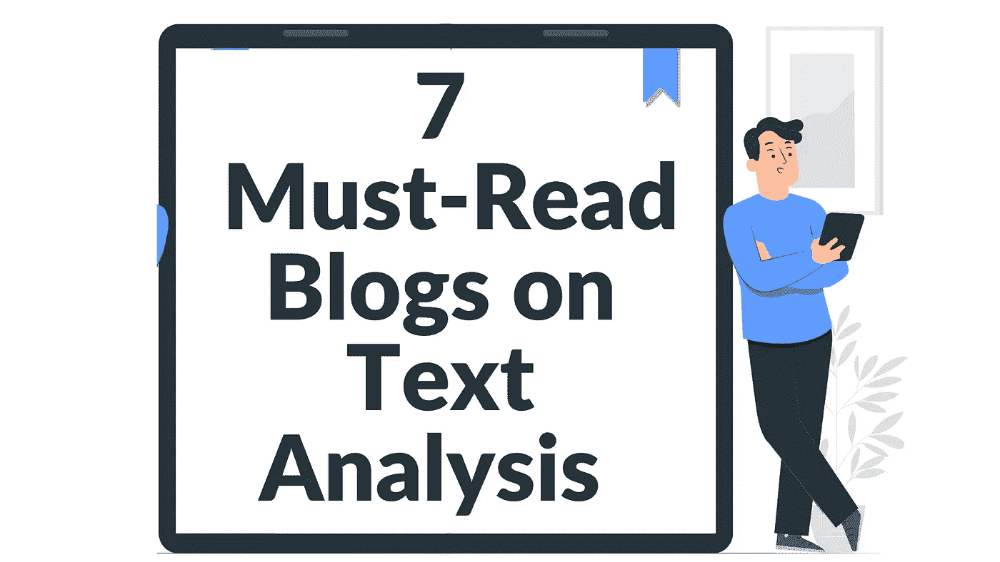
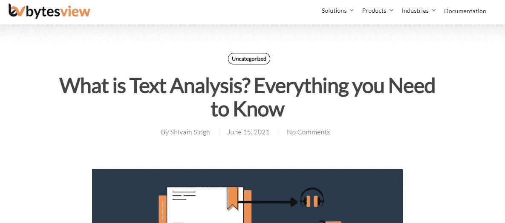
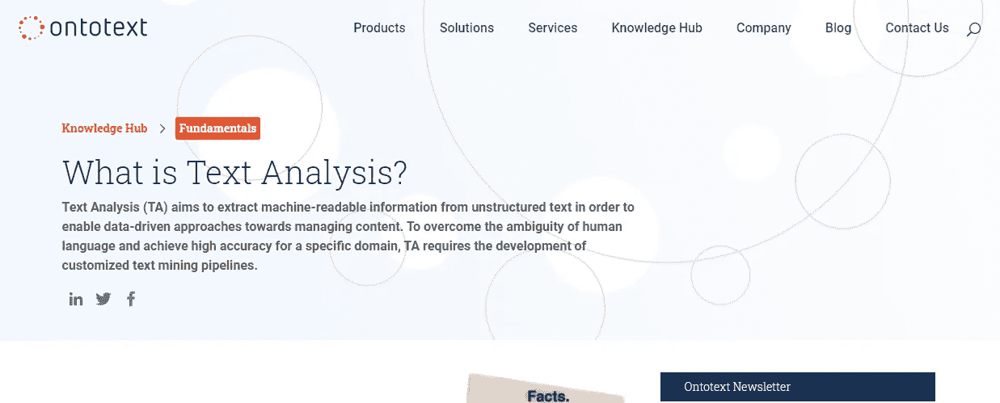
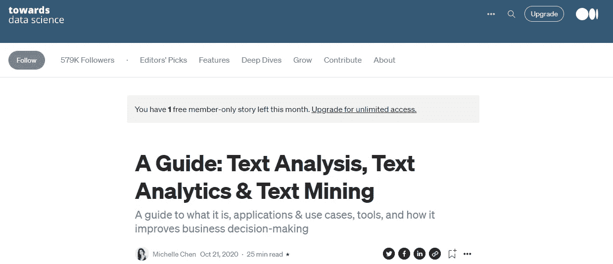
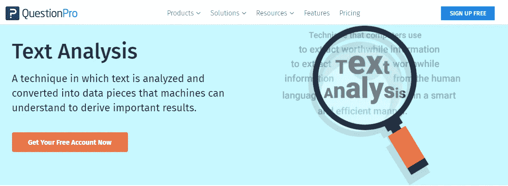
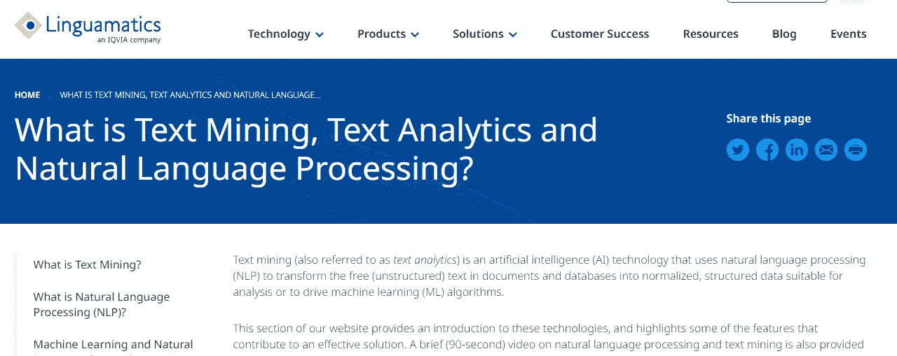
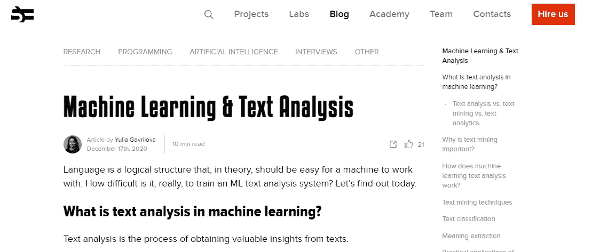

# 7 篇关于文本分析的必读博客

> 原文：<https://medium.com/analytics-vidhya/7-must-read-blogs-on-text-analysis-5b58a344b13f?source=collection_archive---------2----------------------->

如今网络上的数据量令人难以置信。并且直接评估该数据不是可行的替代方案。

文本分析是使用机器学习和 NLP(自然语言处理)技术从大量文本数据中收集、分析和提取有价值的见解或信息的过程。数据分析现在是任何组织日常运营的重要组成部分。

文本挖掘软件可以帮助你自动研究大量的文本数据。这可以显著提高效率，让你做出明智的决定。

文本分析工具可以收集和评估大量的非结构化文本，提供改变游戏规则的信息来帮助你的品牌发展。

本文的目的是为您提供理解文本分析所需的所有知识。这个列表包含了你应该阅读的各种文本分析博客，以便更深入地理解定义应用和各种用例。

# 什么是文本分析？你需要知道的一切

> “与我们的祖先相比，我们生活在一个联系更加紧密的世界，目前正经历着一场信息爆炸。互联网上有大量用户生成的内容，包含有价值的见解。但是手动分析非结构化数据会非常困难。

这篇文章是学习文本分析基础的直接而明确的指南。它描述了文本分析，以及分析技术和行业应用列表。

# 什么是文本分析？

> 文本分析，也称为文本挖掘，是从非结构化文本中自动分类和提取有意义信息的过程。它包括检测和解释趋势和模式，以便在几秒钟内从数据中获得相关的见解。

[这篇文章](https://monkeylearn.com/blog/what-is-text-analysis/#:~:text=Text%20analysis%2C%20also%20known%20as,from%20data%20in%20just%20seconds.&text=Another%20term%20you%20may%20have%20heard%20is%20text%20analytics.)深入探讨了文本分析如何让您的业务受益，以及文本分析技术和应用。

# 什么是文本分析？

> 文本分析(TA)旨在从非结构化文本中提取机器可读的信息，以实现数据驱动的内容管理方法。为了克服人类语言的模糊性并实现特定领域的高准确性，TA 需要开发定制的文本挖掘管道。

[这篇文章专业地解释了](https://www.ontotext.com/knowledgehub/fundamentals/text-analysis/)文本分析的定义、帮助文本分析的知识图表、文本分析、文本挖掘和文本分析的比较，以及文本分析如何为您的业务带来好处。

# 指南:文本分析、文本分析和文本挖掘

> *传统上，企业利用他们在实体店的存在来了解他们的客户——如何吸引、吸引和取悦他们。*

[本文](https://towardsdatascience.com/a-guide-text-analysis-text-analytics-text-mining-f62df7b78747)包括文本分析的定义、文本分析应用和用例，以及一些满足你的文本分析需求的软件或工具。

# QuestionPro —文本分析博客

> 一种技术，通过分析文本并将其转换为机器可以理解的数据片段，从而得出重要的结果。

这篇简短的文章将教你关于文本分析所需要知道的一切，包括技术和例子。

# 什么是文本挖掘、文本分析和自然语言处理？

> *文本挖掘(也称为文本分析)是一种人工智能(AI)技术，它使用自然语言处理(NLP)将文档和数据库中的自由(非结构化)文本转换为适合分析或驱动机器学习(ML)算法的标准化、结构化数据。*

[在通常的定义、应用以及与文本分析相关的](https://www.linguamatics.com/what-text-mining-text-analytics-and-natural-language-processing)的基础上，本博客更进了一步，涉及文本分析的技术方面，并提供了关于自然语言处理、大数据、关键词搜索本体的局限性、词汇表和自定义词典的附加信息，以及企业级自然语言处理。

# 机器学习和文本分析— Serokell.io

> 语言是一种逻辑结构，从理论上讲，它应该易于机器使用。训练一个 ML 文本分析系统真的有多难？今天就来一探究竟。

[Serokell.io 指南](http://Machine Learning & Text Analysis — Serokell.io)详细解释了文本分析和机器学习之间的关系、文本挖掘技术、检测数据中不同模式的 ML 算法以及 ML 文本分析挑战。

我希望这个列表能在某种程度上帮助你

下次见。