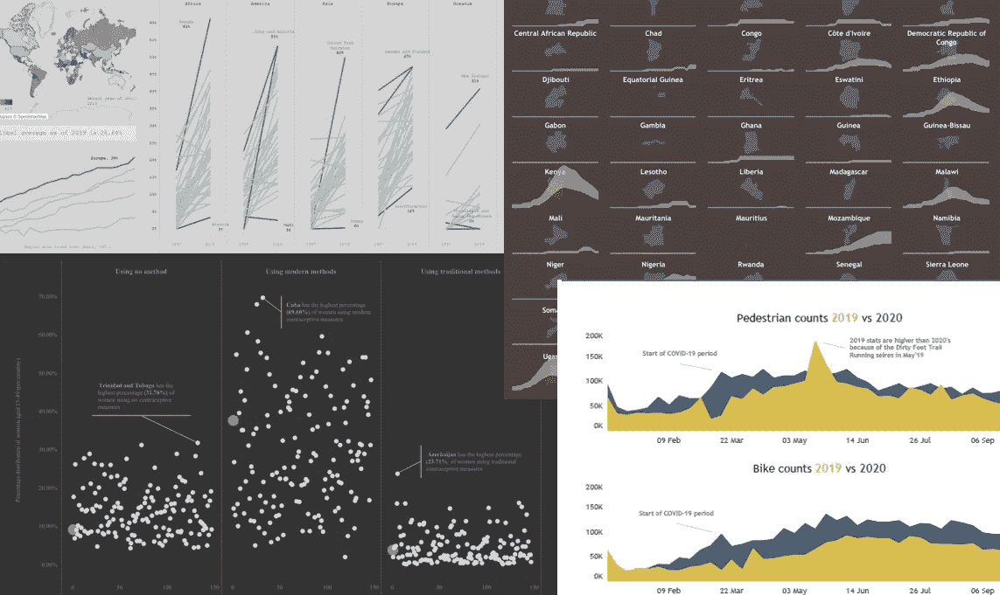
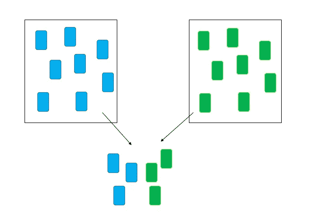
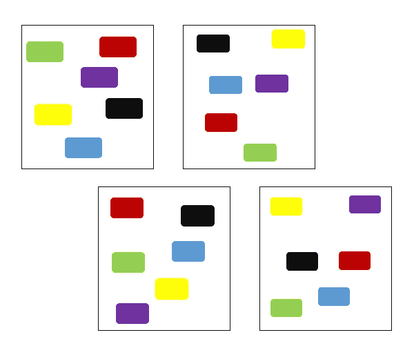
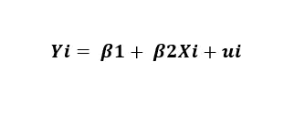
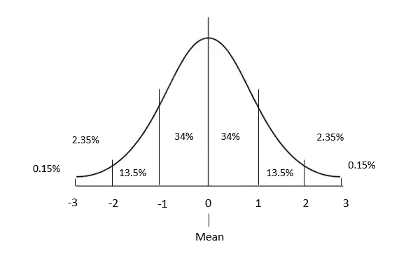
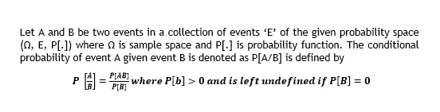
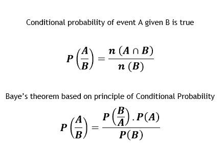

# 数据科学面试前你需要知道的 7 个统计概念

> 原文：<https://medium.com/analytics-vidhya/7-statistical-concepts-you-need-to-know-for-your-data-science-interview-e8bd875ff623?source=collection_archive---------20----------------------->

统计数据有时会非常庞大，尤其是在挑选最重要的话题时。平心而论，没有最重要、更重要或不太重要的话题，只有相关的话题。相关性可以是相对于情境的。可能是学术上的，在教学或面试中。

在这里，我从基于个人采访经验的统计数据中挑选了 7 个概念。我试图从应用的角度来解释这个概念。希望有帮助！

# 1) p 值

统计学中最常用的术语，p 值不过是计算出的概率，用于确定是否有证据拒绝零假设*(本文稍后解释)。*

在实践中，p 值以> 0.05 或< 0.05\. Lower the p-value higher the statistical significance or at least < 0.05\. It is equivalent to say 5% of the time there’s a chance of occurrence of an event.

# 2) Sampling Techniques

Sampling essentially defines the theory of Statistics proper; suppose a researcher desires to study religious habit of 25-year-old female in North India or plans on studying the yield of a certain variety of paddy in let’s say 2 paddy producing states in India. It is practically impossible for the researcher to study the whole population of 25-year-olds who identify as females, and the production of all paddy fields for the latter scenario, in the geographies of interest.

It is then the concept of Sampling comes into play. Assisting the researcher to draw probabilistic conclusions from a ‘sample of the population of interest’. However, it is of **表示，即选择用于研究的样本代表研究的目标人群**。否则，估计会有偏差，违背了研究的目的。

取样的类型因研究的目的和人群的性质而异。几种广泛使用的采样类型是

a)**:从“N”(目标人群)中选择“N”(样本)个单位的过程，使得每个单位的选择机会均等。**

**b) **分层抽样**:该过程包括将人口分成具有相同特征的小层或亚人口。优选用于极度异质的人群。地层内部是同质的，而彼此之间是异质的。**

****

**每个大盒子都是由同质单元组成的地层**

**c) **整群抽样**:当群体内部同质但内部异质时，对群体的整群进行该过程。**

****

**每个大盒子都是一群不同种类的取样单位**

> **在分层抽样中，抽样是以每一层为单位进行的，而在整群抽样中，每一个整群就是一个抽样单位。**

# **3)置信区间和假设检验**

**用非常简单的术语来说，置信区间为不确定性推理提供了一个很好的例子。本质上，总体中未知参数的值的范围与真实参数在“所述范围”内的置信水平相关联。**

**医学研究的一个非常重要的部分是为研究目标提供强有力的估计，如[15，1.25]或[ 13.75，16.25]。**

****统计假设**是关于人口的断言或定义人口特征的概率分布，问题陈述基于来自人口样本代表的可用信息想要验证该假设或分布。**

**假设检验本质上就是证明一些事情不是偶然发生的。也许把问题陈述分成无效假设和替代假设。零假设表明统计学家应该对问题采取不偏不倚、中立的态度。而后者暗示了一种对立的、完全有偏见的说法，其发生的可能性正在受到质疑。**

**例如，一个灯泡制造商想要测试用标准程序生产的灯泡和用新工艺生产的灯泡的质量。**

****零假设**:两个过程没有区别**

****替代假设**:标准流程产生更好的质量结果，还是新流程产生更好的质量结果*(一种对立的说法，质疑某一事件发生的合法性)***

# **4)回归**

**它是根据原始数据对两个或多个变量之间关系的数学度量。本质上分为因变量和自变量，测量因变量上每个单位的变化在自变量上的变化。**

**回归中有三个主要假设，让回归模型表示为**

****

**a)参数的线性:参数是线性的，与变量的线性无关**

**b)同方差:误差项的方差是相同的，与 X 的值无关**

**c)独立性:变量的观测值相互独立**

# **5)卡方检验、t 检验和 z 检验**

**了解卡方检验、t 检验和 z 检验以及何时使用它们**

****卡方检验**是对 n(样本)大值的近似检验。它也被称为理论和实验之间的“吻合度”。要进行测试，必须满足以下条件**

**a)样本观察应该是独立的**

**b)总频率应该更大，比如说大于 50**

**c)单元频率必须大于 5**

****t 检验**基于 t 统计，用于均值已知而总体方差未知的情况。样本大小应大于 30*。*假设-所有数据点都是独立的。***

****理论上说，t 检验在样本量≤ 30 的情况下效果最好，然而，所有因素都认为在大样本上使用 t 检验是合理的，这也是事实。假设人口方差未知。t 检验用于较小的样本，以克服 z 检验在小样本上的无能为力。***

****z 检验**基于 z 统计量，在总体方差已知或者是大样本时使用。*假设——所有样本观察值都是独立的。***

# **6)正态分布**

****

**正态分布具有以下特征:**

****#** 对称的钟形**

****#** 平均值=中位数**

****#** 68%的数据落在平均值的 1 个标准差内**

****#** 95%的数据落在平均值的 2 个标准差内**

****#** 99.7%的数据落在平均值的 3 个标准偏差内**

**它在统计学中起着非常重要的作用。a)大多数分布，即二项式分布、poison 分布等，可以使用正态分布进行近似。b)变量可以很容易地转化为正态分布。c)简单统计量的许多分布在大样本下趋于正态*(中心极限定理)。* d)在统计质量控制中有大量应用，用于设定控制极限。e)小样本理论基于一个基本假设，即从中抽取样本的总体具有正态分布。**

# **7)条件概率**

****

**Baye 定理是基于条件概率的，它描述了一个事件在过去条件下的概率。**

****

**感谢阅读，如果你喜欢阅读这篇文章，或者相信其他人可能喜欢，请分享并鼓掌以示支持。也请随意发表评论。您可以在[*LinkedIn*](https://www.linkedin.com/in/palakhanna/)*上找到我，并可以查看我的*[*Tableau Public*](https://public.tableau.com/profile/palak.khanna#!/)*个人资料和我的* [*博客*](https://www.instagram.com/data.chatter/) *。***