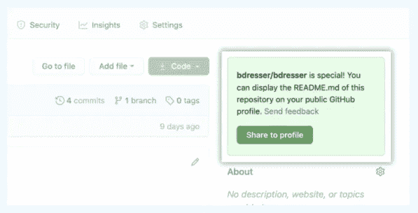
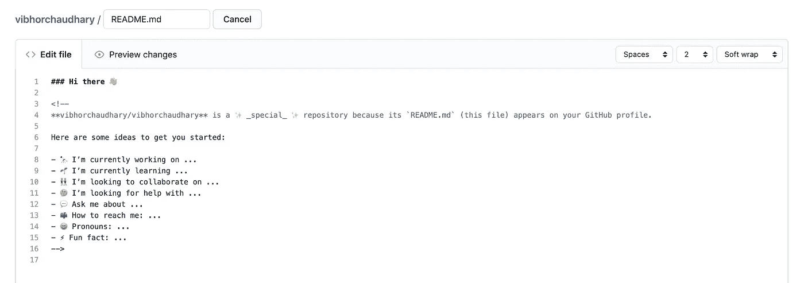
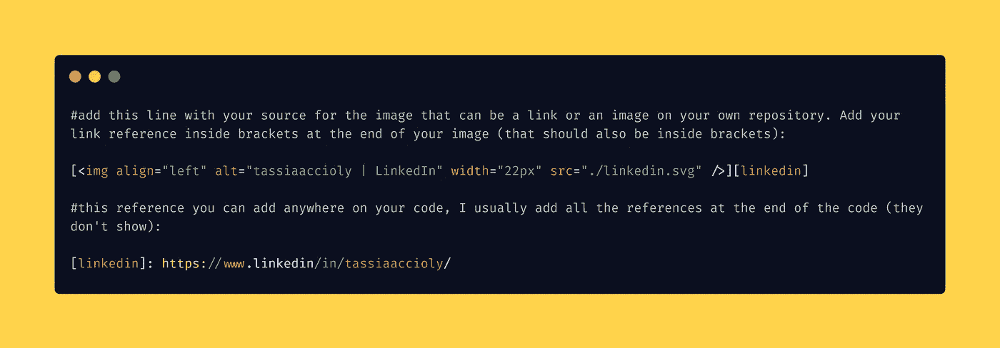
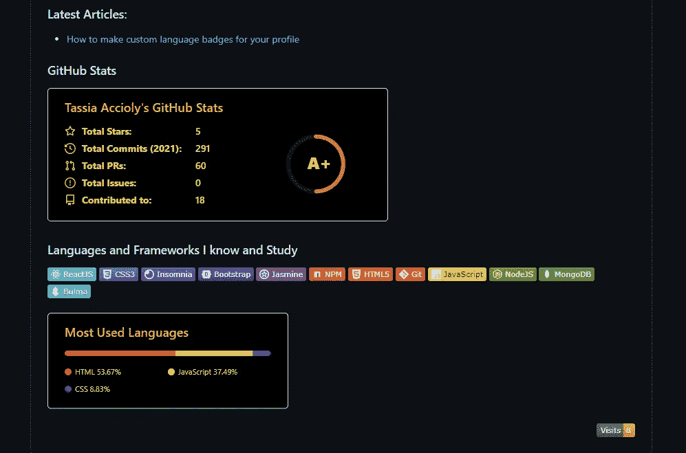
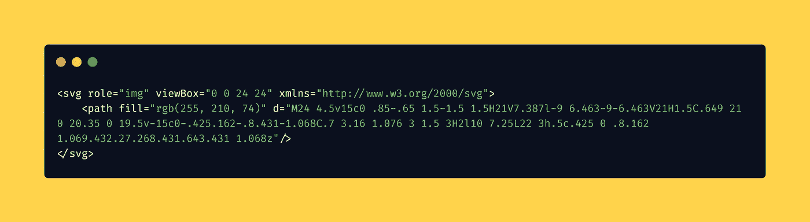

# 让你的 GitHub 档案更好的 7 个技巧

> 原文：<https://medium.com/analytics-vidhya/7-tips-to-make-your-github-profile-better-3913971c357d?source=collection_archive---------4----------------------->

去年，GitHub 推出了个人资料功能。这个特性允许 GitHub 用户创建一个自述文件，并把它作为他们的个人资料来显示兴趣、项目和任何他们认为对他们和他们所做的事情感兴趣的东西。

个人资料绝对是一个你应该使用的特性，它可以提升你的 GitHub，让人们对你有更多的了解，下面是如何做到这一点，以及如何使它变得更好的一些技巧！

# F **首先制作简介**

创建一个配置文件非常简单:创建一个与你的 GitHub 帐户同名的存储库，在我的例子中是[**tassiaaccioly**](https://github.com/tassiaaccioly)**。**创建此存储库时，添加一个自述文件，这将是您的正式个人资料。

一旦创建了存储库(确保这个存储库是公共的！)，GitHub 会在存储库页面右侧创建一个绿色按钮，说明这是一个特殊的存储库，您可以将它作为您的个人资料。只要点击它:

来自[https://docs . github . com/en/free-pro-team @ latest/github/setting-up-and-managing-your-github-profile/managing-your-profile-readme](https://docs.github.com/en/free-pro-team@latest/github/setting-up-and-managing-your-github-profile/managing-your-profile-readme)

单击按钮后，这个存储库现在就是您的配置文件，因此您所要做的就是编辑自述文件！

当你第一次打开它的时候，GitHub 会给你一些提示:

来自 vibhorchaudhary([https://medium.com/@mr.vibhorchaudhary](/@mr.vibhorchaudhary))

## 但是我该怎么做呢？

有一些方法。GitHub 上的 readme 文件接受 Markdown 和纯 HTML——我说的纯是指没有内联样式——所以你只需要使用其中一种或两种语言就可以了。

GitHub 的文档中有一个很好的部分解释了如何使用 Markdown:

 [## 基本书写和格式语法

### 要创建标题，请在标题文本前添加一到六个#符号。你使用的#的数量将决定大小…

docs.github.com](https://docs.github.com/en/free-pro-team@latest/github/writing-on-github/basic-writing-and-formatting-syntax) 

或者，如果你想深入了解降价:

 [## 降价:语法

### 注意:本文档本身是使用 Markdown 编写的；您可以通过添加'来查看它的源代码。“文本”到网址…

daringfireball.net](https://daringfireball.net/projects/markdown/syntax) 

GitHub 也接受表情符号！要使用它们，你可以复制并粘贴完整的表情符号👍或者表情符号代码 ***:thumbsup:*** ，两个都可以，选一个就行了！

这里有两种表情符号的字体，第一种是代码，第二种是表情符号本身:

 [## GitHub、Basecamp 和其他服务的表情符号备忘单

### 然而，一些表情符号代码不太容易记住，所以这里有一个小备忘单。✈得到了一个现代化的浏览器…

www.webfx.com](https://www.webfx.com/tools/emoji-cheat-sheet/)  [## 情绪百科

### 表情符号搜索引擎。快速表情符号搜索体验，可选择按名称、类别或……浏览每个表情符号

emojipedia.org](https://emojipedia.org/) 

更多添加内容的提示就在前面！继续进行风险自担(Tl；博士)！

# 1.添加关于您自己的信息

在你的个人资料上，你应该做的第一件事是介绍一下你自己:你是谁，你一直在做什么，如果你有一些成就(炫耀它们！)，你关注的技术领域是什么，你对 GitHub 的关注点是什么，那么，关于你作为一个技术人员的基本情况。

这里是你更自由交谈的地方，你也可以添加 gif 和图片。我将在技巧#5 中讨论它！

我见过的另一个名字不同的人做的事情，应该添加在这一部分，就是添加一个音频文件，告诉人们如何读你的名字。这有助于人们正确地说出你的名字，如果你不想一直纠正他们，或者如果他们不好意思问的话！

# 2.联系信息

这一点非常重要:

> 给出 GitHub 之外的人联系你的方式。

这可以是电子邮件、Twitter、LinkedIn、脸书、Instagram、Telegram、Whatsapp 等等。选择至少两种联系您的方式，并将其添加到您的个人资料中。

GitHub 是一个拥有公共知识库的社交网络的产物，但它使人们很难相互交流，所以如果有人想和你说话，他们不会打开问题并等待你回应(他们可能会，但让我们同意，twitter 或 instagram 更容易)。所以给他们一个比 GitHub 更容易和你对话的方式。

这些方式可以使用 Markdown 或 HTML 作为普通链接添加，但也可以作为附加图标的图像链接添加，作为它自己的部分:

或者在您的姓名/开场白下面显示图片链接:

制作这些图标的一个简单方法是使用 Markdown 上的链接参考:

这也使得图像之间有一些空间

一些找到图标的好地方是[简单图标](https://simpleicons.org/)(品牌、语言和应用程序图标)[平面图标](https://www.flaticon.com/)(混杂图标)，或者你可以在网上找到的任何地方！只要记得给创造图标的人以信任就行了！

此外，我建议使用 svg 图标，因为你可以更容易地控制它们的颜色，使它更容易做一个有凝聚力的配置文件。我在技巧 5 中解释了如何做！

# 3.徽章

徽章有助于以快速和有组织的方式向人们展示你所知道的语言、框架、库和技术。我有一整篇关于如何制作简单的定制徽章的文章:

 [## 如何使用 shields.io 为您的个人资料制作自定义语言徽章

### 几个月前，当我开始我的开发之旅时，我经常在……

tassiaaccioly.medium.com](https://tassiaaccioly.medium.com/how-to-make-custom-language-badges-for-your-profile-using-shields-io-d2aeaf016b6b) 

一些人将他们的徽章进行分类，以进一步组织他们的个人资料。根据你的工作领域，你的部分可能是:语言、框架、开发运营、应用和数据、商业工具、实用工具，或者任何你能找到的展示你能力的工作。

# 4.状态卡

GitHub 用户 [Anurag Hazra](https://github.com/anuraghazra) 制作了几个状态卡，你可以很容易地将它们添加到你的个人资料中，它们可以显示你的热门语言、你的 GitHub 状态、将特定的库卡添加到你的个人资料中等等。它们也有许多不同的风格和主题:

 [## anuraghazra/github-readme-stats

### 获取动态生成的 GitHub 统计数据！查看演示报告错误请求功能喜欢这个项目…

github.com](https://github.com/anuraghazra/github-readme-stats) 

它很容易使用，只需阅读自述文件并选择您想要使用的卡。您可以将他们添加到您的个人资料中，并向全世界展示您的状态:

这里我使用紧凑的布局和了不起的盖茨比主题

你可以在这里找到所有可用的主题。你也可以根据自己的喜好定制卡片，添加或删除统计数据，只需查看文档就可以了。

# 5.添加图像和 gif

要添加图片和 gif，你可以使用 markdown 或 HTML。但是使用 HTML 你也可以定义图片/gif 的大小和在页面上的位置，所以大多数人倾向于使用 HTML 来显示他们的图片。

人们可以使用图像来说明他们个人资料的某些方面，但我也见过许多人制作漂亮的自我展示横幅，并使用它，例如:

 [## WaylonWalker -概述

### 我主要创建关于 python 和数据工程的博客帖子和开源包。我热爱学习…

github.com](https://github.com/WaylonWalker) 

如果你想看看韦伦的资料，你会对他印象深刻！他还包括一些实时更新的部分，真的很好看！

***图片最后一个重要提示！***

自去年年底以来，GitHub 实现了黑暗模式，所以在制作您的个人资料时，请注意您的 gif、SVG 和 png，因为如果有人使用黑暗模式，而您使用黑色图标，它将消失！试着找到对暗模式和亮模式都适用的颜色。

使用 SVG 的一个优点是，你可以很容易地改变它们的颜色，只需在 path 标签中添加一个“fill”属性，并添加你想在 CSS 接受的任何格式(rgb、hex 等)中使用的颜色，例如:

每当您在代码编辑器上打开 svg 文件时，您都可以编辑它的代码

正如我之前说过的，svg/png 图标的一个很好的来源是简单的图标，它们还包括该品牌/公司的官方颜色:

 [## 简单图标

### 流行品牌的 1512 个免费 SVG 图标。

simpleicons.org](https://simpleicons.org/) 

只需搜索你想要的图标并下载或使用他们的链接！

# 6.你一直在学习的语言/框架

除了你知道的语言和框架，你还可以在你的个人资料中添加一个部分，介绍你最近在学习的东西，以此表明你在不断努力提高自己。

这一部分还将展示你现在感兴趣的东西，这使它变得非常有趣，因为如果你愿意，你也可以从科技领域转向其他领域。

同样，这个部分可以是一个列表、各种图像、徽章或者你能想到的任何东西。可能是 gif？谁知道呢？天空才是极限！

# 7.让它成为你自己的

此个人资料最重要的一点是与他人分享你是谁、你在做什么以及如何联系你，因此，请让你的个人资料独一无二，并确保它代表你是谁！

如果你对数据非常感兴趣，也许添加一个图表或图形会是一个好主意。如果你是一个比较喜欢开玩笑的人，也许添加一些 gif 或者一个有趣的主题会很有趣。我曾经看过一个以星球大战为主题的简介，所有的文字都是以电影为主题的笑话。如果你是一名作家和技术研究者，也许炫耀你的文章和一些社交号码是个好主意！

嗯，我想你已经明白了它的要点:让你的个人资料成为你自己！你越是这样，越多人会和你联系！

但是，我在这里说的都不是一成不变的，我一直在改进我的个人资料，添加和删除部分，改变颜色，添加和删除图像。作为一名技术人员，随着你的成长和发展，你可能会改变你想要展示的东西，或者可能会出现新的资产(比如状态卡)，你想要将它们合并。开始吧！

在这篇长文章的结尾，你可以看看下面的一些资料，从中获得一些灵感:

 [## coder jojo/creative-profile-readme

### 开发者 Github 档案精选列表，激发你的灵感。请遵循本指南:GitHub 新增功能添加自述文件…

github.com](https://github.com/coderjojo/creative-profile-readme) 

另外，Waylon Walker 在 Dev.to 上与几个人分享了他们的个人资料:

 [## 🤓您的 GitHub 个人资料自述文件上有什么

### GitHub 个人资料功能只对一部分用户开放。只需创建一个以您的用户名命名的回购，然后…

开发到](https://dev.to/waylonwalker/what-s-on-your-github-profile-40p3) 

如果你已经做到了这一步，我希望你能利用这些技巧，充分利用你在 GitHub 上的个人资料。如果你想联系我:我的 [GitHub](https://github.com/tassiaaccioly) 和 [Twitter](https://twitter.com/itsmetherogue) 已经开通！

你也可以在 dev.to 上关注我:【https://dev.to/tassiaaccioly 