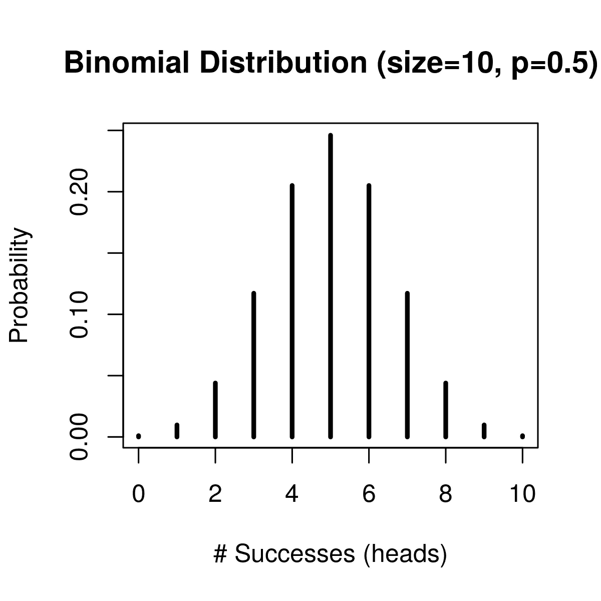
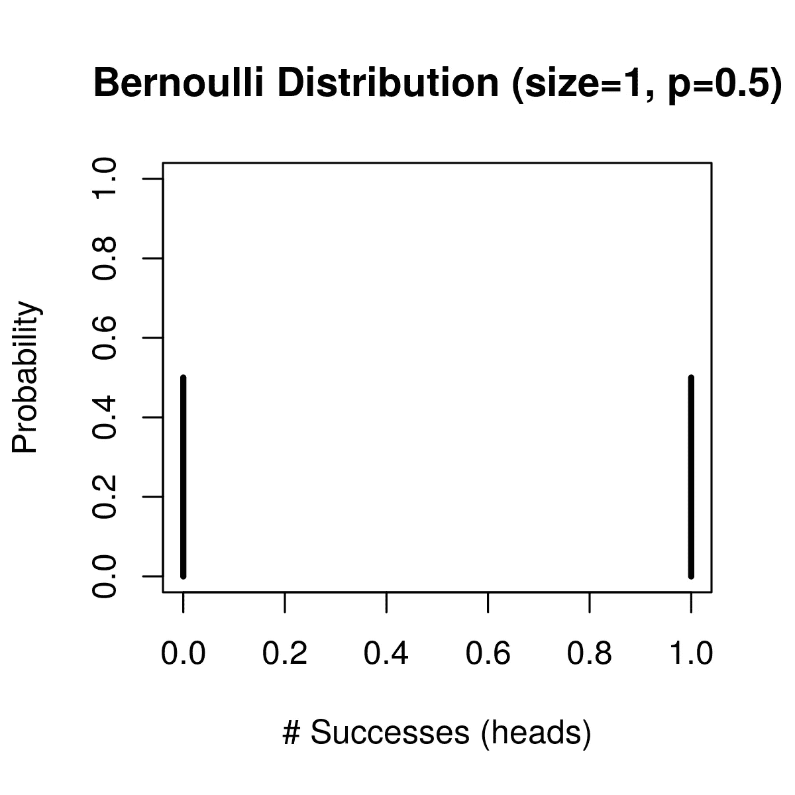
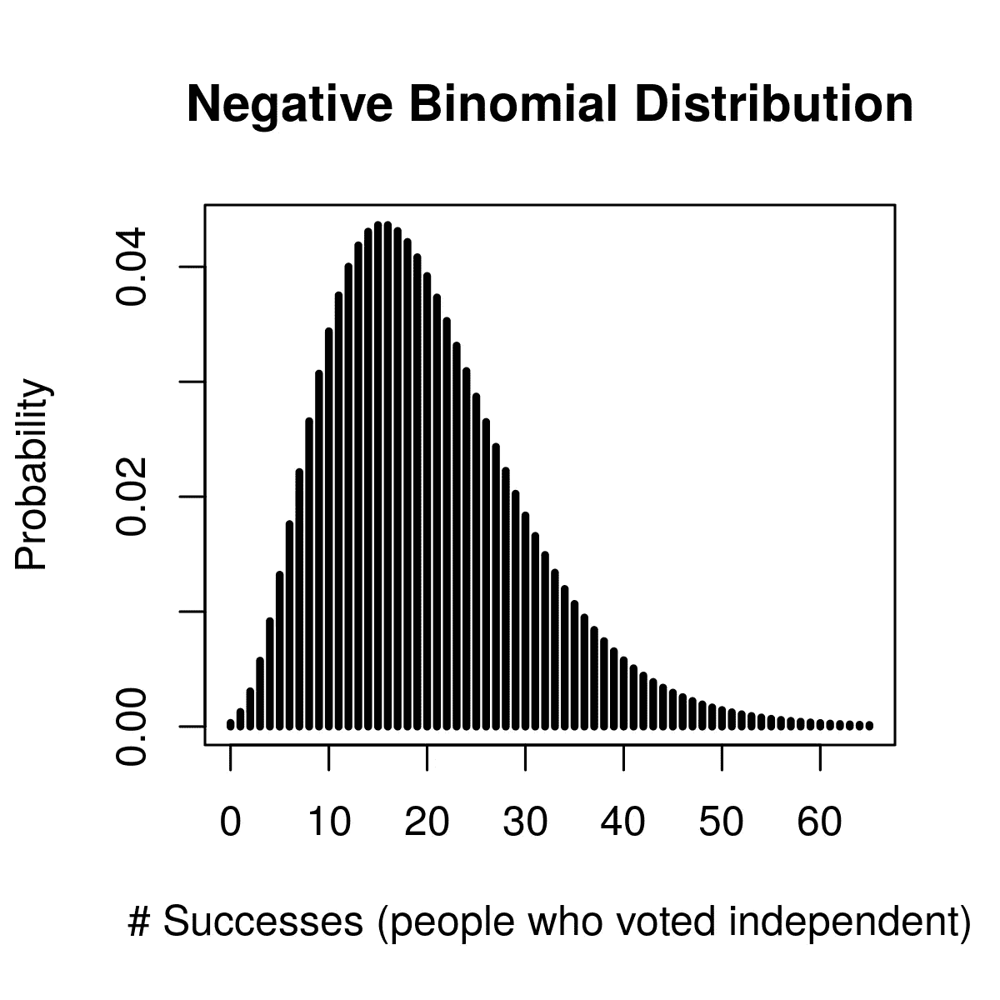
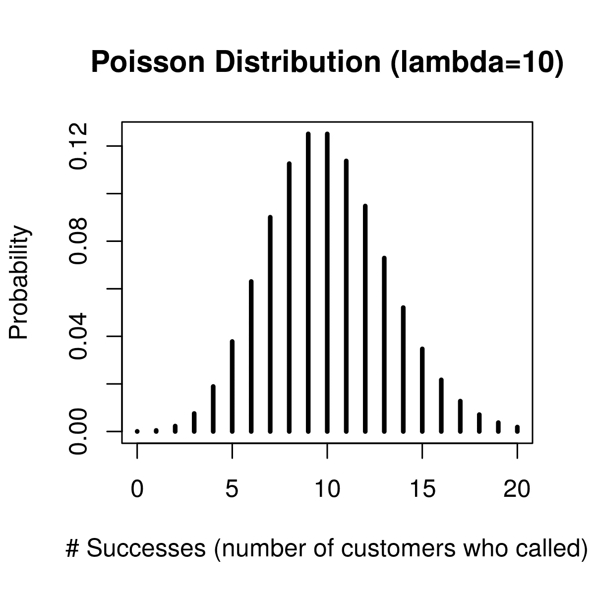
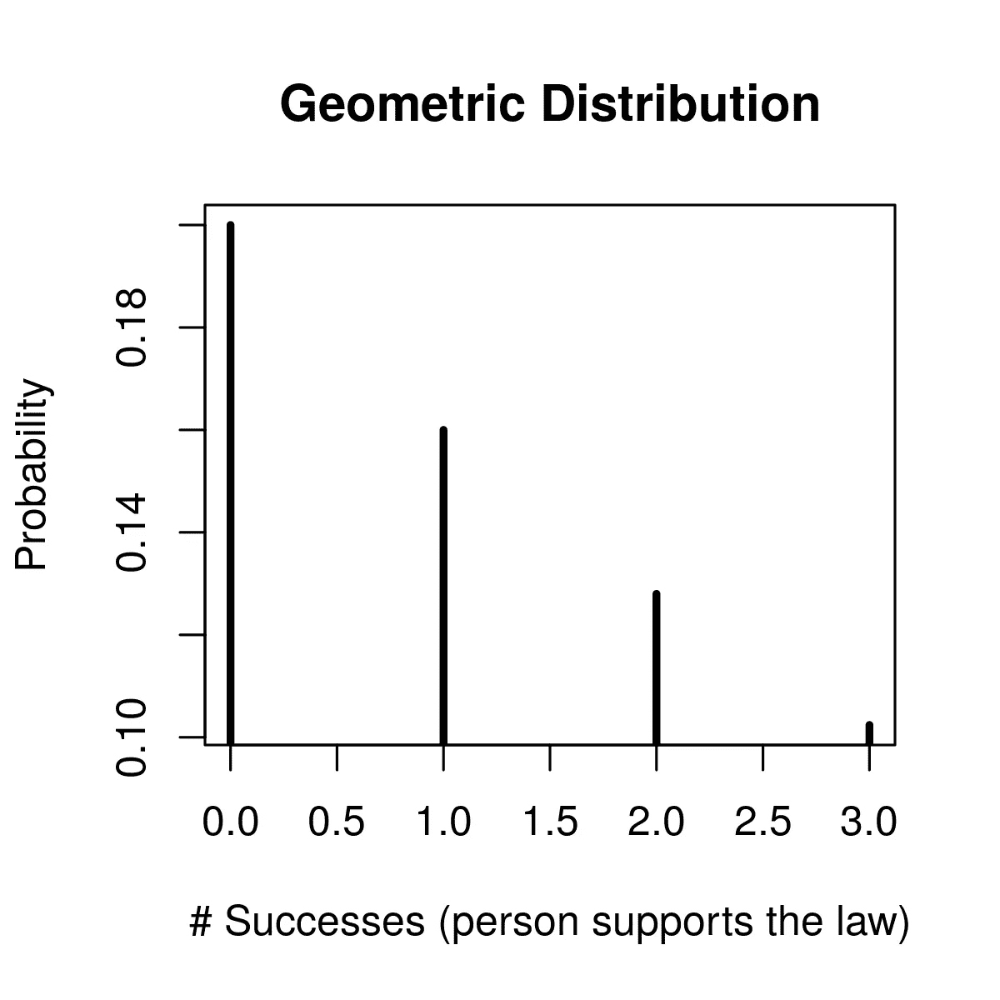
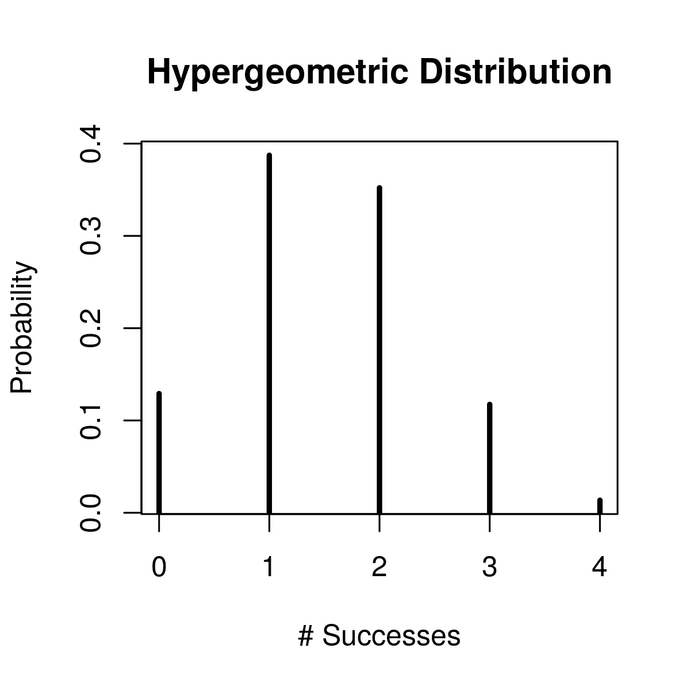

# 离散概率分布及其在 R 中的应用指南

> 原文：<https://medium.com/analytics-vidhya/7-types-of-discrete-probability-distributions-and-their-applications-in-r-ba5e2e263bd5?source=collection_archive---------0----------------------->


照片由 [Lucas Santos](https://unsplash.com/@_staticvoid?utm_source=unsplash&utm_medium=referral&utm_content=creditCopyText) 在 [Unsplash](https://unsplash.com/s/photos/chance?utm_source=unsplash&utm_medium=referral&utm_content=creditCopyText) 上拍摄

概率分布是描述获得随机变量可能取值的可能性的统计函数。本文将探讨不同类型的离散概率分布以及它们在 r 中的代码。

广义而言，概率分布可以分为两类:

****离散概率分布****

**它对随机变量的概率进行建模，这些随机变量的结果可以是离散值。离散随机变量是具有可计数值的随机变量，例如一列非负整数。离散概率函数也称为*概率质量函数。***

****例子**:如果你在数图书馆每小时借出的书的数量，你可以数出 15 或 16 本书，但没有介于两者之间的。**

**离散概率分布可以进一步分为**

**[**1。二项式分布**](#f328)**

**[②**。多项分布**](#0435)**

**[**3。伯努利分布**](#e512)**

**[4。负二项分布](#6bc1)**

**[**5。泊松分布**](#9bc4)**

**[**6。**几何分布](#7216)**

**[**7。超几何分布**](#34bf)**

****b .**T42【连续概率分布**

**它模拟连续随机变量的可能值的概率。连续随机变量是具有一组无限且不可数的可能值的随机变量。连续变量通常是在一个尺度上的测量，例如重量和温度。连续概率函数也被称为*概率密度函数*。**

**让我们看看离散概率分布的类型:**

1.  ****二项分布****

**二项式分布通常用于模拟从`N`人口中抽取替换的`n`样本的成功数量。每个实验都有一个布尔值结果，比如成功/是/真/1(有概率`p`)或失败/否/假/零(有概率`q=1-p`)。要将实验定义为二项式实验，必须满足以下条件*:***

***一、`n`审判次数固定。***

***二。每次审判都是独立的。***

***三。只有两种可能的结果(成功或失败)。***

***四。每次试验的成功概率(`p`)是恒定的。***

***动词 （verb 的缩写）一个随机变量`Y` =成功次数。***

*****举例**:对于抛`n`次的硬币，可以用二项式分布来模拟成功次数的概率(比如说，正面)。***

*****代码**:为了找出 10 次投掷硬币得到 6 个正面的概率，我们使用`dbinom(x, size, prob)`。***

*   ***`x` =在`0:size`中整数的长度`k`的向量***
*   ***`size` =试验总次数。***
*   ***`prob` =每次试验成功的概率。不允许无限值和缺失值。***

```
*dbinom(6,size=10,prob=0.5)*
```

***要绘制 R 中二项式函数的概率质量函数:***

```
***dbinom(x, size, prob)** is used to create the probability mass function**plot(0:x, dbinom(0:x, size, prob), type = ‘h’)** to plot the probability mass function, specifying the plot to be a histogram (type=’h’)*
```

***假设一枚硬币被抛 10 次，二项式分布可以用来模拟人头数的概率(1 到 10)。这是用`size=10`和`p=0.5`创建的二项式分布的概率质量函数***

```
*success <- 0:10plot(success,dbinom(success,size=10,prob=0.5),type=’h’,main=’Binomial Distribution (size=10, p=0.5)’,ylab=’Probability’,xlab =’# Successes (heads)’,lwd=3)*
```

******

***二项分布的概率质量函数|作者图片***

***注意:***

*   ***`dbinom` =二项式概率质量函数(pmf)。***
*   ***`pbinom` =二项式分布(累积分布函数)。***
*   ***`qbinom`=二项式分位数函数。***
*   ***`rbinom`=二项式伪随机数生成。***

***由于本文报告的是概率质量函数，我们将只使用与离散概率分布类型相关的 pmf ( `dbinom`)。***

*****2。** **多项式** **分布*****

***这是二项式分布对`k`类别的推广，而不仅仅是二元分布(成功/失败)。对于`n`个独立试验，每个试验都导致恰好一个`k`类别的成功，多项分布给出了各种类别成功数量的任何特定组合的概率。***

*****例**:多项分布模拟滚动`k`面骰子`n`次的每一面的计数概率。***

*   ***当`k = 2`和`n = 1`时，多项式分布为伯努利分布。***
*   ***当`k = 2`和`n > 1`时，就是二项分布。***
*   ***当`k > 2`和`n = 1`时，就是分类分布。***
*   ***当`k > 2`和`n > 1`时，称为多项式分布。***

*****代码:**我们用`dmultinom(x, size, prob, log = FALSE)`***

*   ***`x` =在`0:size`中整数的长度`K`的向量***
*   ***`size` =试验总次数。对于`dmultinom()`，默认为`sum(x)`***
*   ***`prob` =每次试验成功的概率。不允许无限值和缺失值。***
*   ***`log` =合乎逻辑。如果`TRUE`，则报告对数概率。***

***假设两个棋手 A 和 B 赢一局的概率分别为 0.40 和 0.35。比赛以平局结束的概率是 0.25。***

***我们可以用多项式分布来回答:如果这两个棋手下了 12 局，甲赢 7 局，乙赢 2 局，剩下 3 局和棋的概率是多少？***

```
*dmultinom(x=c(7,2,3), prob = c(0.4,0.35,0.25))*
```

*****3。** **伯努利分布*****

***这是二项分布的一个特例，只进行一次试验。对于`n = 1`(一个实验)，二项分布可以称为伯努利分布。单个成功/失败实验也称为伯努利试验或伯努利实验，一系列结果称为伯努利过程。***

*****例子**:考虑一次掷硬币，得到正面的概率是 0.5，得到反面的概率是 0.5。***

*****代码**:我们使用`dbern(x, prob)`***

*   ***`x` =长度 1 的向量***
*   ***`prob` =每次试验成功的概率。不允许无限值和缺失值。***

***要计算一次投掷一枚硬币得到一个正面的概率:***

```
*dbern(1, prob = 0.5)*
```

***为了绘制 R 中伯努利函数的概率质量函数，我们可以使用以下函数:***

```
***dbern(x, prob)** is used to create the probability mass function**plot(0:x, dbern(0:x, prob), type = ‘h’)** to plot the probability mass function, specifying the plot to be a histogram (type=’h’)*
```

***对于投掷一次的公平硬币，伯努利分布的概率质量函数为:***

```
*success<-0:1plot(success,dbern(success, prob = 0.5) , type='h', main='Bernouli Distribution (size=1, p=0.5)', ylab='Probability', xlab ='# Successes (heads)', lwd=3,ylim=c(0,1))*
```

******

***伯努利分布的概率质量函数|图片由作者提供***

*****4。** **负二项分布*****

***这是一种二项式分布，其中试验次数 n 不固定，随机变量`Y`等于取得`r`成功所需的试验次数。负二项分布被称为**帕斯卡分布**。***

*****例子**:你正在调查从投票站出来的人，问他们是否投了独立的票。一个人投独立票的概率(`p`)是 20%。必须问 70 个人才能找到投独立票的 5 个人的概率是多少？***

*****代码**:我们用`dnbinom(x, size, prob)`***

*   ***`x` =达到所需成功次数之前需要发生的失败次数。***
*   ***`size` =成功次数。***
*   ***`prob` =每次试验成功的概率。不允许无限值和缺失值。***

***要回答上述问题:***

```
*dnbinom(65,5,0.2)*
```

***要绘制 R 中负二项式函数的概率质量函数，我们可以使用以下函数:***

```
***dnbinom(x, size, prob)** is used to create the probability mass function**plot(0:x, dnbinom(0:x, size, prob)** **, type = ‘h’)** to plot the probability mass function, specifying the plot to be a histogram (type=’h’)*
```

***为上述问题绘制概率质量函数:***

```
*success<-0:65plot(success,dnbinom(success,5, prob = 0.2) , type='h', main='Negative Binomial Distribution', ylab='Probability', xlab ='# Successes (people who voted independent)', lwd=3)*
```

******

***负二项分布的概率质量函数|作者图片***

*****5。** **泊松分布*****

***它用于模拟给定时间间隔内发生的独立事件的数量。它显示了一个事件在固定的时间间隔内可能发生的次数，如果这些事件以已知的平均速率发生，并且与上次事件后的时间无关。***

***例子:考虑一个客户帮助中心。平均来说，一个小时内会有 10 个客户打电话来。因此，泊松分布可用于模拟不同数量的客户在一小时内打电话的概率(比如，5 或 6 或 7 等)。***

*****代码**:我们用`dpois(x, lambda, log=FALSE)`***

*   ***`x`=长度向量`K`***
*   ***`lambda` =均值向量。***
*   ***`log` =逻辑；如果`TRUE`，则概率`p`为`log(p)`。***

***让我们找出一个小时内 20 个客户打电话的概率。***

```
*dpois(20, lambda=10)*
```

***为了绘制 R 中泊松函数的概率质量函数，我们可以使用以下函数:***

```
***dpois(x, lamda)** is used to create the probability mass function**plot(0:x, dpois(0:x, lambda)** **, type = ‘h’)** to plot the probability mass function, specifying the plot to be a histogram (type=’h’)*
```

***为上述问题绘制概率质量函数:***

```
*success<-0:20plot(success,dpois(success, lambda=10) , type='h', main='Poisson Distribution (lambda=10)', ylab='Probability', xlab ='# Successes (number of customers who called)', lwd=3)*
```

******

***泊松分布的概率质量函数|作者图片***

*****6。** **几何分布*****

***它是在重复的独立伯努利试验中获得第一次成功所需的试验次数的概率分布。几何分布也可以定义为第一次成功发生之前的失败次数。***

***如果下列假设成立，则几何分布是一个合适的模型:***

***被模拟的现象是一系列独立的试验。***

***二。每次试验只有两种可能的结果，通常被指定为成功或失败。***

***三。每次试验的成功概率`p`都是一样的。***

***一名研究人员在图书馆外等着询问人们是否支持某项法律。给定的人支持法律的概率是`p = 0.2`。研究者与之交谈的第四个人是第一个支持该法律的人的概率是多少？***

*****代码**:我们用`dgeom(x, prob, log = FALSE)`***

*   ***`x` =达到`n`成功之前需要发生的失败次数。***
*   ***`prob` =每次试验成功的概率。不允许无限值和缺失值。***
*   ***`log` =符合逻辑。如果`TRUE`，则报告对数概率。***

***要回答上述问题:***

```
*dgeom(x=3, prob=0.2)*
```

***为了绘制 R 中几何函数的概率质量函数，我们可以使用以下函数:***

```
***dgeom(x, prob)** is used to create the probability mass function**plot(0:x, dgeom(0:x, prob), type = ‘h’)** to plot the probability mass function, specifying the plot to be a histogram (type=’h’)*
```

***绘制概率质量函数:***

```
*success<-0:3plot(success,dgeom(success, prob = 0.2) , type=’h’, main=’Geometric Distribution’, ylab=’Probability’, xlab =’# Successes (person supports the law)’, lwd=3)*
```

******

***几何分布的概率质量函数|作者图片***

*****7。超几何分布*****

***它描述了在没有替换的情况下从有限总体*中成功抽取 k 次的次数，正如二项式分布描述了在*替换的情况下抽取*的成功次数一样。****

*****例**:一副牌有 20 张:6 张红卡，14 张黑卡。随机抽取 5 张牌*不更换*。恰好抽 4 张红牌的概率是多少？***

*****代码**:我们用`dhyper(x, m, n, k, log = FALSE)`***

*   ***`x` =一个`0:n`中的整数向量***
*   ***`m`=群体中被归类为成功的项目数。***
*   ***`n`=总体中未被归类为成功的项目数。***
*   ***`k`=样本中被归类为成功的项目数。***
*   ***`log` =符合逻辑。如果`TRUE`，则报告对数概率。***

***要回答上述问题:***

```
*dhyper(4,6,14,5)*
```

***为了绘制 R 中超几何函数的概率质量函数，我们可以使用以下函数:***

```
***dhyper(x, m, n, k)** is used to create the probability mass function**plot(0:x, dhyper(0:x, m, n, k), type = ‘h’)** to plot the probability mass function, specifying the plot to be a histogram (type=’h’)*
```

***绘制概率质量函数:***

```
*success<-0:4plot(success,dhyper(0:4,6,14,5) , type=’h’, main=’Hypergeometric Distribution’, ylab=’Probability’, xlab =’# Successes’, lwd=3)*
```

******

***超几何分布的概率质量函数|作者图片***

***希望你现在已经熟悉了离散概率分布的技术和理论广度！***

***参考资料:***

***[1]:[https://www . math . UCLA . edu/~ Anderson/rw 1001/library/base/html/geometric . html](https://www.math.ucla.edu/~anderson/rw1001/library/base/html/Geometric.html)***

***[2]:[https://www . statistics show to . com/negative-binomial-experiment/](https://www.statisticshowto.com/negative-binomial-experiment/)***

***[3]:[https://www . r-bloggers . com/2011/02/using-r-for-introductive-statistics-第五章-超几何分布/](https://www.r-bloggers.com/2011/02/using-r-for-introductory-statistics-chapter-5-hypergeometric-distribution/)***

***[4]:[https://www . statistics show to . com/hypergeometric-distribution-examples/](https://www.statisticshowto.com/hypergeometric-distribution-examples/)***