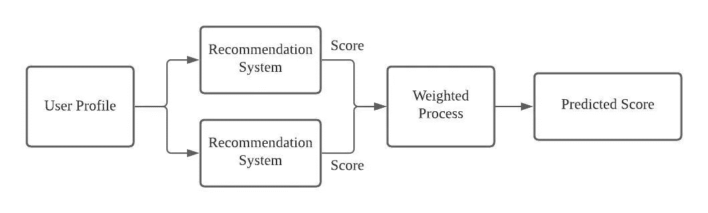
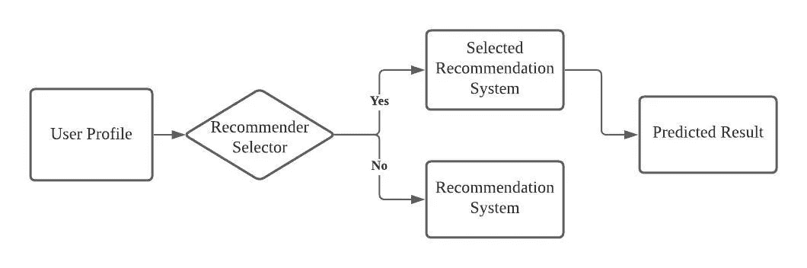
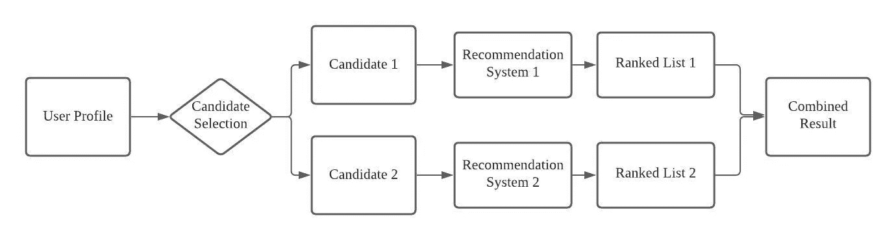
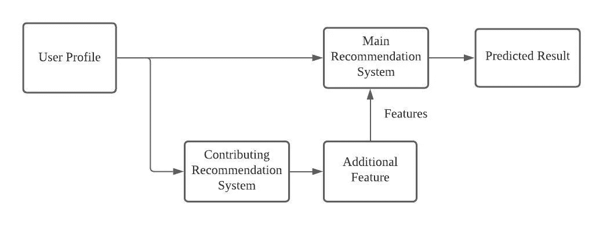
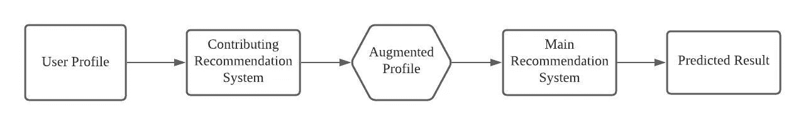
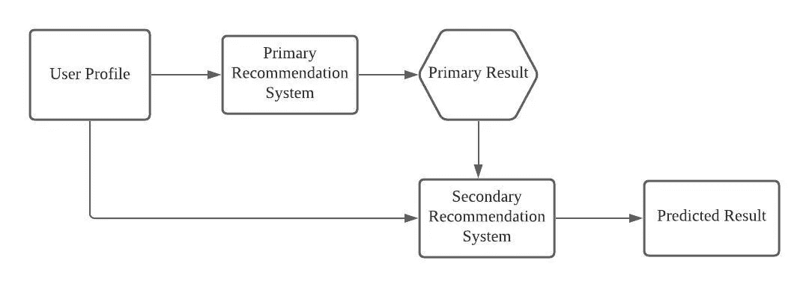
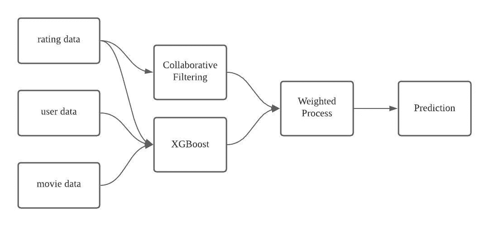
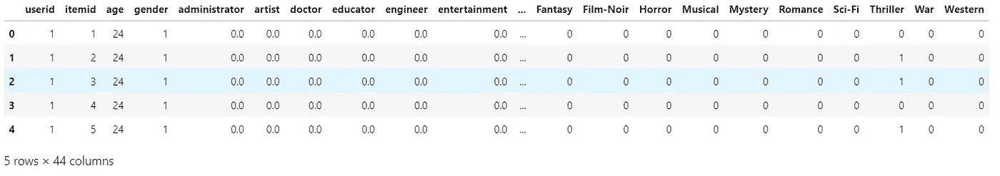
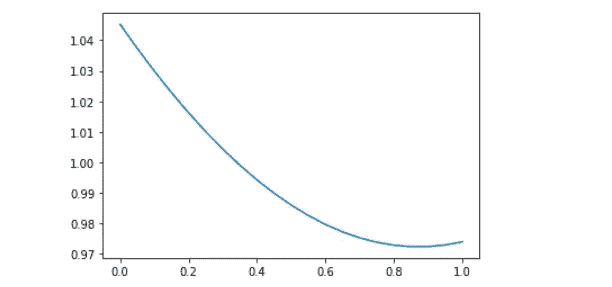

# 7 种混合推荐系统

> 原文：<https://medium.com/analytics-vidhya/7-types-of-hybrid-recommendation-system-3e4f78266ad8?source=collection_archive---------0----------------------->


Emile Perron 在 [Unsplash](https://unsplash.com?utm_source=medium&utm_medium=referral) 上的照片

结合多种推荐系统技术有效预测用户习惯

# 推荐系统

简单来说，推荐系统就是预测用户的习惯。

随着技术的进步，客户行为发生了变化，人们搜索所需产品的方式也发生了变化，网上购物极大地改变了零售生态系统。产品的数量增长很快，但只有一小部分产品受到关注，这导致了**长尾**效应。推荐系统可以帮助广告具有较低流行度的项目。

实际上，很难找到适合我们数据集的单一模型。大多数时候，组合多个推荐模型能够产生更好的性能。

# 混合推荐系统

在文章 ***混合推荐系统:调查与实验*** 中，Burke 将混合推荐系统分为 7 种构建混合推荐系统的方法。

在这篇文章中，我们将讨论这 7 种方法，并构建一个简单的混合推荐系统。

> 参考文献:伯克，r。混合推荐系统:调查和实验。*用户模型 User-Adap Inter* **12，**331–370(2002)。[https://doi.org/10.1023/A:1021240730564](https://doi.org/10.1023/A:1021240730564)

# 1.衡量过的



图一。按作者加权的混合推荐系统图像

在加权推荐系统中，我们可以定义一些能够很好地解释数据集的模型。加权推荐系统将从每个模型中获取输出，并将结果组合成静态权重，该权重不会在训练和测试集之间改变。

例如，我们可以将基于内容的模型和项目-项目协同过滤模型相结合，并在最终预测中各占 50%的权重。

使用加权混合的好处是，我们集成了多个模型，以线性方式支持推荐过程中的数据集。

# 2.转换



图二。按作者切换推荐系统图像

切换混合基于情况选择单个推荐系统。该模型用于建立项目级敏感数据集，我们应该基于用户简档或其他特征来设置推荐器选择标准。

交换混合方法在推荐模型上引入了一个附加层，用于选择要使用的适当模型。推荐系统对成分推荐模型的优点和缺点很敏感。

# 3.混合的



图 3。作者的混合推荐系统图像

Mixed hybrid 方法首先利用用户简档和特征来生成不同的候选数据集。该推荐系统相应地把不同的候选集输入到推荐模型，并且组合该预测来产生结果推荐。

混合的混合推荐系统能够同时进行大量的推荐，并且将部分数据集拟合到合适的模型中，以便具有更好的性能。

# 4.特征组合



图 4。图作者组合推荐系统图片

在特征组合混合中，我们在系统中添加了一个虚拟的贡献推荐模型，作为对原始用户简档数据集的特征工程。

例如，我们可以将协作推荐模型的特征注入到基于内容的推荐模型中。混合模型能够考虑来自子系统的协同数据，而不仅仅依赖于一个模型。

# 5.特征增强



图 5。作者的特征增强推荐系统图像

采用贡献推荐模型来生成用户/项目简档的评级或分类，其进一步在主推荐系统中使用以产生最终的预测结果。

特征增强混合能够在不改变主推荐模型的情况下提高核心系统的性能。例如，通过使用关联规则，我们能够增强用户简档数据集。通过扩充数据集，基于内容的推荐模型的性能将得到提高。

# 6.串联



图 6。作者的级联推荐系统图像

Cascade hybrid 定义了一个严格的层次结构推荐系统，使得主推荐系统产生主结果，而我们使用次级模型来解决主结果的一些小问题，如打破评分中的平局。

在实践中，大部分数据集是稀疏的，二次推荐模型可以有效地解决评分相等或缺失数据的问题。

# 7.元级别

元级混合类似于特征增强混合，使得贡献模型向主推荐模型提供增强的数据集。与特征增强混合不同，元级用来自贡献模型的学习模型替换原始数据集，作为主推荐模型的输入。

# 入门指南

在这个例子中，我们将使用 movielens 数据集展示一个简单的加权混合推荐系统。



图 7。作者对电影镜头图像的加权混合

通过使用用户数据和电影数据，我们可以用 XGBoost 构建一个基于内容的模型。我们将使用项目-项目协同过滤和 XGBoost 构建加权混合。

首先，我们加载数据和包。

接下来，我们对我们的用户和电影数据集执行特征工程以适应模型，例如

*   用户职业和电影类型的一键编码
*   用户性别的标签编码



## 推荐模型设置

```
content-based rmse = 0.973963698032199
```

为了构建模型 2——项目-项目协同过滤模型，我们从之前的[帖子](/geekculture/overview-of-item-item-collaborative-filtering-recommendation-system-64ee15b24bb8)中获取代码。

```
rmse of item-item collaborative filtering = 1.0452369678411928
```

我们可以通过以线性方式组合这两个模型来构建加权混合，这能够产生更好的性能。如下图所示，我们可以看到，在我们的数据集中，当权重在 0.8 左右时，权重是最佳的。



# 结论

一个好的推荐系统对于促进销售和更好地预测用户习惯是必不可少的。混合推荐系统是改进我们模型的最有效的方法之一。通过结合上述不同的方法，我们可以更好地定制我们的模型，以适应推荐条件和数据集要求。

感谢您的阅读，祝您有美好的一天。