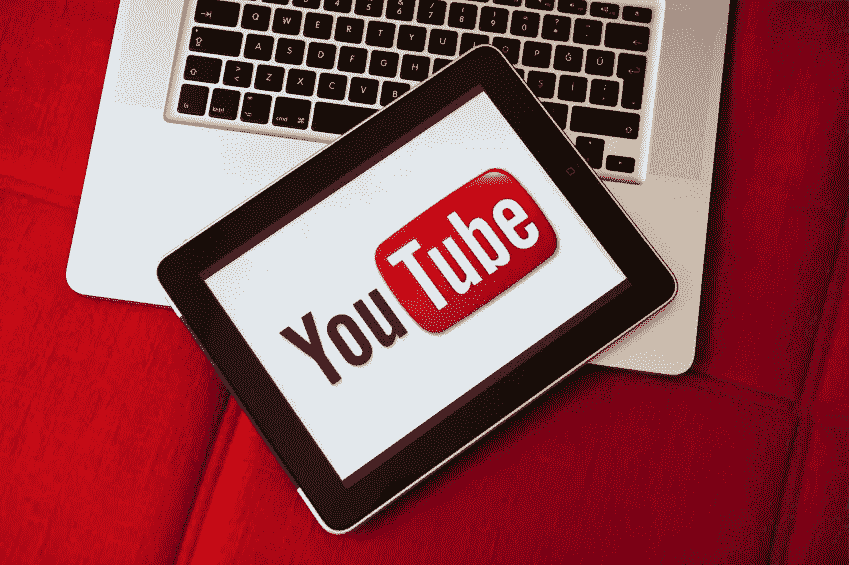

# 如果你是一名有抱负的数据科学家，可以关注 7 个 Youtube 频道

> 原文：<https://medium.com/analytics-vidhya/7-youtube-channels-to-follow-if-you-are-an-aspiring-data-scientist-42a2ff3df6d7?source=collection_archive---------5----------------------->

如今，Youtube 已经成为我们生活中的一个重要部分。无论是听音乐、看节目还是学习。我当然是 youtube 的超级粉丝，无法想象没有它的生活。如果你是一个有抱负的数据科学家，你一定遇到过大量的内容，你可能会担心从哪里开始。

我遇到了一些很棒的 youtube 数据科学内容频道，它们在我的旅程中给了我很大的帮助，我相信分享它们肯定会帮助那些开始数据世界之旅的人。

## 克里斯·纳伊克

 [## 克里斯·纳伊克

### 我是一名首席数据科学家，在机器学习、深度学习和计算机视觉方面处于领先地位，还是一名教育工作者和…

www.youtube.com](https://www.youtube.com/user/krishnaik06/videos) 

克里斯·纳伊克有一个非常棒的 youtube 频道，里面有非常棒的数据科学内容，涵盖了从 python 基础到高级 NLP 和计算机视觉的所有内容。他甚至上传关于简历准备、求职和职业建议的内容。每当我不得不修改一些东西或需要任何与数据科学职业相关的指导时，我都会去 youtube 频道。如果你只想关注一个频道，那就应该是这个。

## **代码基础**

 [## 代码基础

### 我是达瓦尔·帕特尔，职业是软件工程师，内心是教师。我与英伟达和彭博合作过。我…

www.youtube.com](https://www.youtube.com/c/codebasics/videos) 

Dhaval Patel 是一个人的瑰宝，也是一个不可思议的数据科学内容创作者。他的频道 codebasics 涵盖了从基础到高级数据科学和数据分析的内容。我非常尊敬他，因为他在制作完全无广告的顶级内容上付出了如此多的努力。他还采访了目前在数据科学领域工作的人，这将有助于任何人了解数据科学如何在这些公司中使用，以及进入数据科学需要什么。我个人喜欢他的端到端项目播放列表，这有助于了解数据科学管道。

## 肯·吉

 [## 肯·吉

### 数据科学和体育分析是我的爱好。我叫 Ken Jee，一直在数据科学领域工作…

www.youtube.com](https://www.youtube.com/c/KenJee1/videos) 

Ken 的频道有许多与跟进项目、惊人的数据科学播客、构建投资组合、生产力和动机相关的精彩内容。我个人喜欢他的投资组合建设和生产力内容。后续项目也很有帮助。

## 数据科学杰伊

 [## 数据科学杰伊

### Jay 是一名数据科学家，也是 Interview Query 的创始人。了解全栈数据科学、数据科学面试…

www.youtube.com](https://www.youtube.com/c/DataScienceJay/videos) 

Jay 是数据科学面试准备网站 Interview Query 的创始人。他的 youtube 频道也有一些令人惊叹的内容，主要从采访的角度报道数据科学。我个人很喜欢模拟面试视频。他们为您提供了许多关于产品公司如何使用数据科学的知识和观点，以及从业务用例角度来看数据科学，这对于理解非常重要。

## Josh Starmer 的 StatQuest

 [## Josh Starmer 的 StatQuest

### 统计学、机器学习和数据科学有时看起来是非常可怕的话题，但由于每种技术都是…

www.youtube.com](https://www.youtube.com/c/joshstarmer/videos) 

如果你想了解特定算法背后的数学或直觉，这是一个可以遵循的渠道。Josh Starmer 制作了高质量的内容，主要包括与统计学、概率和算法背后的数学直觉有关的一切，并使用了故事和图像。这无疑有助于理解 ML 算法的幕后。

接下来的两个 youtube 频道不是特别关于数据科学，而是数据科学的一些重要组成部分。

## 科里·斯查费

 [## 科里·斯查费

### 欢迎来到我的频道。这个频道专注于为软件开发人员创建教程和演练…

www.youtube.com](https://www.youtube.com/c/Coreyms/videos) 

我们都知道编程在数据科学中有多重要。如果你正开始学习 python 或者已经知道 python，请务必查看科里·斯查费的频道。他上传优秀的编程相关内容，从初级到高级都有。我从他的渠道学习了 python 编程，相信我，当我开始学习数据科学时，我的编码技能非常差。但是这个频道非常有用，所以请订阅他的频道。

## 分析师亚历克斯

 [## 分析师亚历克斯

### 我的名字是亚历克斯·弗雷伯格，在这个频道里，我将讲述成为一名数据分析师所需要知道的一切。如果…

www.youtube.com](https://www.youtube.com/c/AlexTheAnalyst/videos) 

现在，这个频道更多地面向数据分析，而不是数据科学，但即使是数据分析也是数据科学生命周期中非常重要的一部分。这个频道有一些关于数据分析的惊人内容，包括 SQL，Tableau，Power BI 等。他有很棒的数据分析组合项目视频。但 Alex 的频道最棒的一点是，他是一个曾经从事非技术工作的人，现在他的职业生涯转向了数据分析师。关注他的内容肯定会给你很多关于如何进入数据职业的实用技巧。他还分享了许多简历准备、求职和 LinkedIn 社交技巧，这对任何人都很有帮助。

## 外卖食品

嗯，我们都知道学习数据科学需要你掌握很多东西，一开始可能会觉得力不从心。但是记住你并不孤独，每个人都从某个地方开始。所以不要担心，只要坚持下去，好事就会到来。如果你们中的任何人知道我错过的其他特殊渠道，请随时在评论中提及。此外，如果你喜欢读它，那么请跟我来这里。

感谢阅读！我也是一名学习者，在工作的同时学习数据科学，这些渠道迄今为止对我帮助很大，我相信它们也会对你有所帮助。请通过 Linkedin 与我联系，我很乐意与您聊天并分享这一学习之旅。