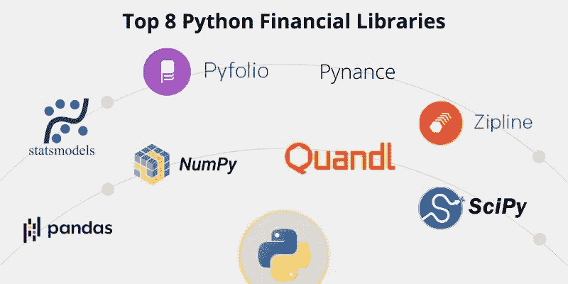

# 金融行业流行的 8 个 Python 库

> 原文：<https://medium.com/analytics-vidhya/8-popular-python-libraries-in-finance-industry-29d936c40ca4?source=collection_archive---------0----------------------->


冠状病毒在全球范围内增加了金融科技行业的崛起。据报道，未来 3-5 年，金融科技公司将获得超过 10 亿美元的投资。金融科技植根于银行、保险、贷款、贸易和其他支付服务等领域。所有这些部门都在采用 python，通过使用其库和框架来解决具有挑战性的问题，如风险管理、交易、定价、合规性和分析。Python 语言用更简单的语法以更快的速度解决复杂问题的能力使它成为金融业的理想编程语言。

Python 作为除了 R、Java 之外最好的数据分析语言越来越受欢迎。Python 提供的强大库使得对任何数据集进行分析变得更加容易。在 Python 库的帮助下，金融专业人士在其分析和财务报告中获得了更清晰的洞察力。



这个列表包含了金融行业中使用最广泛的 Python 库，每个有抱负的金融数据科学家都必须知道。

# 1.熊猫

Pandas 是一个开源 python 库，广泛用于数据分析和数据科学，构建在 Numpy 等其他库的基础上。它的主要目的是对结构化数据执行数据分析，并侧重于基础数据处理。

这款高性能数据分析和处理工具提供了一个名为 [**的扩展模块，pandas data-reader**](https://pandas-datareader.readthedocs.io/en/latest/) ，可以从雅虎财经、谷歌财经、必应财经等网站收集最新的财经数据。

**如何安装:**

```
pip install pandas-datareader
```

#读取弗雷德数据

```
import pandas_datareader as pdr
pdr.get_data_fred('GS10')
```

# 2.NumPy

像熊猫这样以科学计算为主，擅长数组运算的数值库。NumPy 包附带了大量的数值函数，这使得它成为学术界和金融行业的一个重要库。

## 注意:

在新发布的 numpy-financial 包(一个包含所有财务函数的库)中，不推荐在 numpy 中使用财务函数。

# 3.SciPy

在 NumPy 之后，Python 提供了另一个数学函数和计算库，称为 Scipy。NumPy 的扩展，用于金融计算和金融行业中的其他数字集成。如果您正在寻找高级数据可视化和并行编程，那么 SciPy 是最佳选择。

**如何安装:**

```
pip install numpy scipy matplotlib
```

# 4.文件夹

借助 Pyfolio 可以很容易地评估交易业绩。它是一个开源库，提供基于回报的风险分析报告和金融投资组合的绩效结果。这是由 [Quantopian](https://github.com/quantopian) 开发的，与 Zipline 配合得很好，zip line 是一个[回溯测试](https://www.investopedia.com/terms/b/backtesting.asp#:~:text=Backtesting%20is%20the%20general%20method,to%20employ%20it%20going%20forward.)库(将在后面讨论)。 [Pyfolio](https://pypi.org/project/pyfolio/) 擅长创建撕单模型和贝叶斯分析。有各种绘图功能，以获得您的投资组合概况。

**如何安装:**

```
pip install pyfolio
```

#获取苹果股票

```
stock_rets = pf.utils.get_symbol_rets('AAPL')
```

# 5.统计模型

Statsmodel 正在成长，并且是一个用于金融和统计分析的强大 Python 工具。您可以使用 [Statsmodel](https://www.statsmodels.org/0.9.0/index.html) 提供的类和函数构建不同的统计模型。其他功能包括统计测试和统计数据探索。一些最好的统计模型包括线性回归模型、离散模型、时间序列分析、贝叶斯分析。

**如何安装:**

```
pip install statsmodels
```

# 6.派南斯

派南斯将为股票交易者创造奇迹。它是一个开源的 python 包，可以检索、分析和可视化来自股票市场衍生品的数据。有了这个库，你可以为机器学习模型生成标签和特征。要使这个库工作，建议安装 numpy、pandas 和 matplotlib，或者预先安装其中的任何一个。Pynance 依赖于这些强大的库。

**如何安装:**

```
pip install numpy
pip install pandas
pip install pandas-datareader>=0.1.1
pip install matplotlib
pip install lxml
pip install pynance
```

#检索雅虎和谷歌股票

```
import pynance as pn
ge = pn.data.get('ge', '1962', '2015')
```

# 7.滑索

如前所述， [Zipline](https://pypi.org/project/zipline/) 是用于回溯测试和实时交易的最常用的开源 python 工具。这主要是为了[算法交易](https://www.investopedia.com/terms/a/algorithmictrading.asp#:~:text=Algorithmic%20trading%20is%20a%20process,to%20the%20market%20over%20time.)的需要。它也由 Quantopian 维护和开发。这个算法模拟器库模拟不同的成本削减，交易和下滑。该库易于使用，并支持用于数值分析的其他 python 库。

**如何安装:**

```
pip install zipline
```

# 8.Quandl

没有提到 Quandl，任何 python 库列表都是不完整的。这是最大和最强大的市场，为金融分析师提供现代格式的金融、经济和替代数据。这是纳斯达克开发的一个平台，帮助对冲基金和银行的分析师了解市场最新动态。Quandl Python 库将把你的财务数据直接放入 Python。

**如何安装:**

```
pip install quandl 
import quandl
```

或者:

```
easy_install quandl
```

在这里阅读更多关于 Quandl 的信息:【https://www.quandl.com/

*Github 来源:*[https://github.com/wilsonfreitas/awesome-quant](https://github.com/wilsonfreitas/awesome-quant)

*总而言之，python 凭借其强大的库和有用的工具正在改变金融业的面貌。在金融中使用了更多的库，但是大多数都是建立在流行的库 Pandas 和 Numpy 之上的。在金融科技中使用 Python 是大多数成功创业公司的原因。对于金融数据科学家来说，预测市场价格、预测回报、风险分析、交易是一项单调乏味的任务，python 库和工具简化了这项任务。*