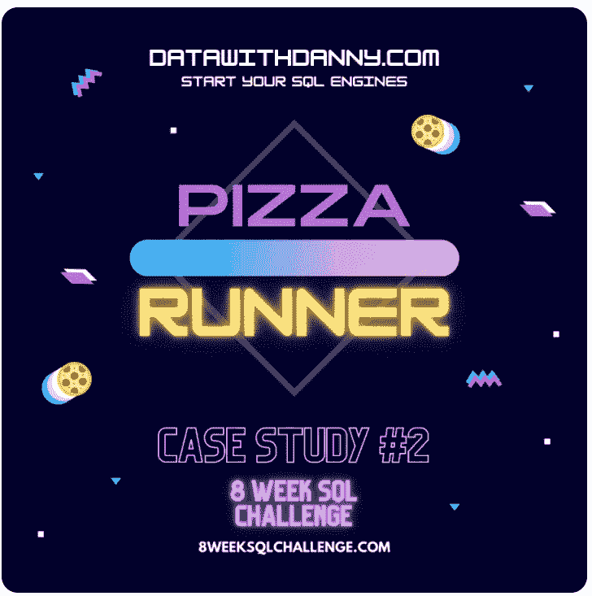

# 为期 8 周的 SQL 挑战:案例研究#2 比萨饼店老板

> 原文：<https://medium.com/analytics-vidhya/8-week-sql-challenge-case-study-2-pizza-runner-ba32f0a6f9fb?source=collection_archive---------1----------------------->

# 介绍

丹尼正在浏览他的 Instagram，突然有样东西吸引了他的眼球——“80 年代的复古风格”🎸还有披萨🍕就是未来！”

丹尼接受了这个想法，但他知道单靠披萨并不能帮助他获得种子基金来扩张他的新披萨帝国——所以他又有了一个天才的想法与之结合——他打算…