# 8 周 SQL 挑战:案例研究#1 丹尼餐厅

> 原文：<https://medium.com/analytics-vidhya/8-week-sql-challenge-case-study-week-1-dannys-diner-2ba026c897ab?source=collection_archive---------0----------------------->

感谢马得精彩的案例分析！你可以在这里找到[自己试试。](https://8weeksqlchallenge.com/case-study-1/)

我也在 [GitHub](https://github.com/katiehuangx/8-Week-SQL-Challenge/tree/main/Case%20Study%20%231%20-%20Danny's%20Diner) 上发布了解决方案和完整语法。

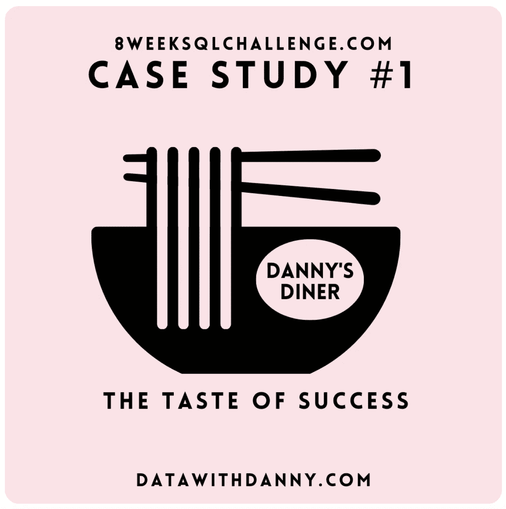

图片来源:【https://8weeksqlchallenge.com/case-study-1/ 

# 介绍

丹尼非常喜欢日本食物，所以在 2021 年初，他决定进行一次冒险，开了一家可爱的小餐馆，出售他最喜欢的 3 种食物:寿司、咖喱和拉面。

Danny's Diner 需要您的帮助来维持餐厅的运营——餐厅从几个月的运营中获得了一些非常基本的数据，但不知道如何使用这些数据来帮助他们经营业务。

# 问题陈述

Danny 希望使用这些数据来回答一些关于他的客户的简单问题，尤其是关于他们的

*   **访问模式**，
*   他们已经花了多少钱
*   **哪些菜单项是他们最喜欢的**。

与客户建立更深层次的联系将有助于他**为忠诚的客户提供更好、更个性化的体验****。**

**他计划利用这些见解来帮助他**决定是否应该扩展现有的客户忠诚度计划** —此外，他需要帮助来生成一些基本数据集，以便他的团队可以轻松检查数据，而无需使用 SQL。**

**数据集包含以下 3 个表，您可以参考下面的关系图来了解这种联系。**

*   **销售**
*   **成员**
*   **菜单**

# **表关系**

**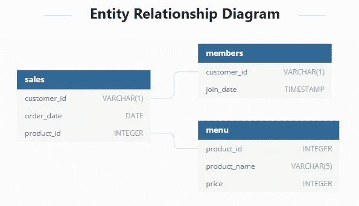**

# ****案例研究问题****

1.  **每位顾客在餐厅消费的总额是多少？**
2.  **每位顾客光顾餐厅有多少天了？**
3.  **每位顾客从菜单上购买的第一个项目是什么？**
4.  **菜单上购买最多的项目是什么？所有顾客购买了多少次？**
5.  **每位顾客最喜欢的商品是什么？**
6.  **顾客成为会员后最先购买的物品是什么？**
7.  **顾客在成为会员之前购买了哪件商品？**
8.  **每位会员在成为会员前的总物品和消费金额是多少？**
9.  **如果每消费 1 美元相当于 10 个积分，寿司有 2 倍的积分乘数——每个顾客会有多少个积分？**
10.  **在客户加入计划后的第一周(包括他们的加入日期),他们在所有项目上都获得了 2x 积分，不仅仅是寿司——客户 A 和 B 在 1 月底获得了多少积分？**

# **解决办法**

**我使用的是微软 SQL 服务器和这些函数。**

*   **聚合函数—总和、最小值、最大值**
*   **数值函数—顶部**
*   **连接-内部连接，左连接**
*   **临时表(CTE)**
*   **Windows 功能**

1.  ****每位顾客在餐厅消费的总金额是多少？****

**我们使用 SUM 和 GROUP BY 函数来找出每个客户和 JOIN 函数的总支出，因为 customer_id 来自 *sales* 表，而 price 来自 *menu* 表。**

```
SELECT s.customer_id, SUM(price) AS total_sales
FROM dbo.sales AS s
JOIN dbo.menu AS m
ON s.product_id = m.product_id
GROUP BY customer_id; 
```

**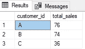**

**回答:**

*   **顾客 A 花了 76 美元。**
*   **顾客 B 消费了 74 美元。**
*   **顾客 C 花了 36 美元。**

****2。每位顾客光顾餐厅有多少天了？****

**使用 DISTINCT 和 wrap with COUNT 函数找出顾客光顾餐馆的天数。**

**如果我们不对 order_date 使用 DISTINCT，则天数可能会重复。例如，如果客户 A 在“2021–01–07”两次光顾该餐厅，则天数可能会计为 2 天，而不是 1 天。**

```
SELECT customer_id, COUNT(DISTINCT(order_date)) AS visit_count
FROM dbo.sales
GROUP BY customer_id;
```

**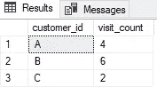**

**回答:**

*   **客户 A 访问了 4 次。**
*   **客户 B 访问了 6 次。**
*   **客户 C 访问了 2 次。**

****3。每位顾客从菜单上购买的第一个项目是什么？****

**首先，我们必须使用 WITH 函数创建一个 CTE。在*汇总* CTE 中，我们使用 DENSE _ RANK and OVER(PARTITION BY ORDER BY)基于 *order_date* 创建一个新列 *rank* 。**

**我选择使用 DENSE_RANK 而不是 ROW_NUMBER 或 RANK，因为 order_date 没有时间戳，因此，如果在同一天订购了 2 个或更多项目，我们不知道先订购哪个项目。**

```
WITH ordered_sales_cte AS
(
 SELECT customer_id, order_date, product_name,
  DENSE_RANK() OVER(PARTITION BY s.customer_id
  ORDER BY s.order_date) AS rank
 FROM dbo.sales AS s
 JOIN dbo.menu AS m
  ON s.product_id = m.product_id
)
```

**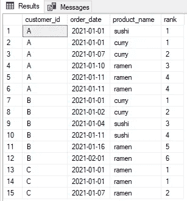**

**随后，我们按列分组，只显示秩= 1。**

```
SELECT customer_id, product_name
FROM ordered_sales_cte
WHERE rank = 1
GROUP BY customer_id, product_name;
```

**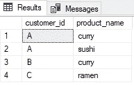**

**回答:**

*   **顾客 A 的第一份订单是咖喱和寿司。**
*   **顾客 B 的第一份订单是咖喱。**
*   **顾客 C 的第一单是拉面。**

****4。菜单上购买最多的项目是什么？所有顾客购买了多少次？****

```
SELECT TOP 1 (COUNT(s.product_id)) AS most_purchased, product_name
FROM dbo.sales AS s
JOIN dbo.menu AS m
 ON s.product_id = m.product_id
GROUP BY s.product_id, product_name
ORDER BY most_purchased DESC;SC;
```

**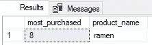**

**回答:**

*   **菜单上购买最多的是拉面。好吃！**

****5。每位顾客最喜欢的商品是什么？****

**同样，我们创建了一个 CTE，通过每个客户的 DESC 订单对每个产品的订单数量进行排序。**

```
WITH fav_item_cte AS
(
 SELECT s.customer_id, m.product_name, 
  COUNT(m.product_id) AS order_count,
  DENSE_RANK() OVER(PARTITION BY s.customer_id
  ORDER BY COUNT(s.customer_id) DESC) AS rank
FROM dbo.menu AS m
JOIN dbo.sales AS s
 ON m.product_id = s.product_id
GROUP BY s.customer_id, m.product_name
)
```

**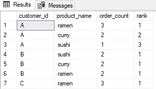**

**然后，我们生成产品排名= 1 的结果，作为单个客户最受欢迎的产品。**

```
SELECT customer_id, product_name, order_count
FROM fav_item_cte 
WHERE rank = 1;
```

**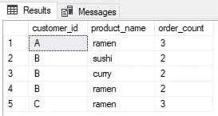**

*   **顾客 A 和 C 最喜欢的食物是拉面。**
*   **顾客 B 喜欢菜单中的所有项目。他/她是一个真正的美食家。**

**6。顾客成为会员后最先购买的物品是什么？**

**是的，你能猜到！我们正在创造另一个 CTE。**

**在此 CTE 中，我们将 order_date 筛选为等于或晚于其 join_date，然后按 order_date 对 product_id 进行排序。**

```
WITH member_sales_cte AS 
(
 SELECT s.customer_id, m.join_date, s.order_date,   s.product_id,
         DENSE_RANK() OVER(PARTITION BY s.customer_id
  ORDER BY s.order_date) AS rank
     FROM sales AS s
 JOIN members AS m
  ON s.customer_id = m.customer_id
 WHERE s.order_date >= m.join_date
)
```

**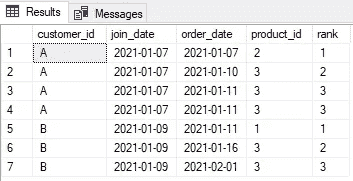**

**接下来，我们通过 rank = 1 过滤该表，以显示客户购买的第一件商品。**

```
SELECT s.customer_id, s.order_date, m2.product_name 
FROM member_sales_cte AS s
JOIN menu AS m2
 ON s.product_id = m2.product_id
WHERE rank = 1;
```

**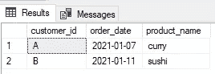**

**回答:**

*   **顾客 A 成为会员后，他/她的第一份订单是咖喱，而顾客 b 的订单是寿司。**

**7。顾客在成为会员之前购买了哪件商品？**

**基本上这是问题#6 的反转。创建一个 CTE**

*   **通过将 customer_id 除以 DESC order_date 来创建新的列 rank，以找出客户成为成员之前的 order_date**
*   **在加入日期之前筛选订单日期。**

```
WITH prior_member_purchased_cte AS 
(
 SELECT s.customer_id, m.join_date, s.order_date, s.product_id,
         DENSE_RANK() OVER(PARTITION BY s.customer_id
         ORDER BY s.order_date DESC) AS rank
 FROM sales AS s
 JOIN members AS m
  ON s.customer_id = m.customer_id
 WHERE s.order_date < m.join_date
)
```

**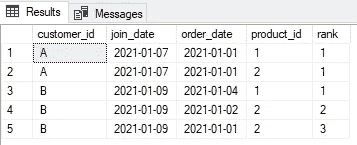**

**然后，拉动表格，显示客户在成为会员之前订购的最后一件商品。**

```
SELECT s.customer_id, s.order_date, m2.product_name 
FROM prior_member_purchased_cte AS s
JOIN menu AS m2
 ON s.product_id = m2.product_id
WHERE rank = 1;
```

**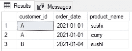**

**回答:**

*   **顾客 A 在成为会员之前的订单是寿司和咖喱，顾客 B 的订单是寿司。那一定是一顿真正美味的寿司！**

****8。每位会员在成为会员前的总物品和消费金额是多少？****

**首先，在他们的加入日期之前过滤订单日期。然后，计算唯一的 product_id，并合计成为会员之前的总花费。**

```
SELECT s.customer_id, COUNT(DISTINCT s.product_id) AS unique_menu_item, SUM(mm.price) AS total_sales
FROM sales AS s
JOIN members AS m
 ON s.customer_id = m.customer_id
JOIN menu AS mm
 ON s.product_id = mm.product_id
WHERE s.order_date < m.join_date
GROUP BY s.customer_id;
```

**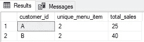**

**答:在成为会员之前，**

*   **顾客 A 花了 25 美元买了两件商品。**
*   **顾客 B 花了 40 美元买了两件东西。**

****9。如果每消费 1 美元相当于 10 个积分，寿司有 2 倍的积分乘数——每个顾客会有多少个积分？****

**我们来分解一下这个问题。**

*   **每花 1 美元= 10 分。**
*   **但是，寿司( *product_id* 1)可以获得 2 倍积分，这意味着每消费 1 美元= 20 积分**

**因此，我们使用 CASE WHEN 来创建条件语句**

*   **如果 *product_id* = 1，那么每 1 美元的价格乘以 20 点**
*   **所有其他不为 1 的 *product_id* ，将 1 美元乘以 10 点**

**所以，你可以看到下表中有新的列，*分*。**

```
WITH price_points AS
 (
 SELECT *, 
 CASE
  WHEN product_id = 1 THEN price * 20
  ELSE price * 10
  END AS points
 FROM menu
 )
```

**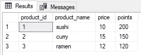**

**使用上表，我们对价格求和，将其与 *product_id* 匹配，并对 *total_points* 求和。**

```
SELECT s.customer_id, SUM(p.points) AS total_points
FROM price_points_cte AS p
JOIN sales AS s
 ON p.product_id = s.product_id
GROUP BY s.customer_id
```

**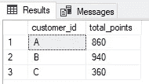**

**回答:**

*   **客户 A、B 和 C 的总积分分别为 860、940 和 360。**

****10。在客户加入计划后的第一周(包括他们的加入日期),他们在所有项目上都获得了 2x 积分，不仅仅是寿司——客户 A 和 B 在 1 月底获得了多少积分？****

**我们再一次分解这个问题。**

*   **找出客户的有效日期(在 *join_date* 之后 6 天，包括 join_date)和 2021 年 1 月的最后一天(“2021–01–21”)。**

```
WITH dates_cte AS 
(
 SELECT *, 
  DATEADD(DAY, 6, join_date) AS valid_date, 
  EOMONTH('2021-01-31') AS last_date
 FROM members AS m
)
```

**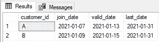**

**然后，使用按日期和*产品名称*分配积分的情况。**

```
SELECT d.customer_id, s.order_date, d.join_date, 
 d.valid_date, d.last_date, m.product_name, m.price,
 SUM(CASE
  WHEN m.product_name = 'sushi' THEN 2 * 10 * m.price
  WHEN s.order_date BETWEEN d.join_date AND d.valid_date THEN 2 * 10 * m.price
  ELSE 10 * m.price
  END) AS points
FROM dates_cte AS d
JOIN sales AS s
 ON d.customer_id = s.customer_id
JOIN menu AS m
 ON s.product_id = m.product_id
WHERE s.order_date < d.last_date
GROUP BY d.customer_id, s.order_date, d.join_date, d.valid_date, d.last_date, m.product_name, m.price
```

**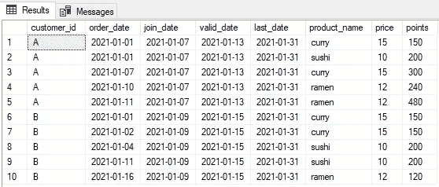**

**我们的假设是**

*   **从第 X 天到第 1 天(顾客成为会员( *join_date* )，每消费 1 美元可获得 10 点积分，对于寿司，每消费 1 美元可获得 20 点积分。**
*   **第 1 天( *join_date* )到第 7 天( *valid_date* )，所有物品每消费 1 美元就是 20 积分。**
*   **从第 8 天到 2021 年 1 月的最后一天( *last_date* )，每消费 1 美元可获得 10 点积分，寿司可获得 2 点积分。**

**回答:**

*   **顾客 A 有 1370 分。**
*   **客户 B 有 820 分。**

# ****加分题****

## ****加入所有的东西****

****使用以下内容重新创建表:客户标识、订单日期、产品名称、价格、成员(Y/N)****

```
SELECT s.customer_id, s.order_date, m.product_name, m.price,
CASE
 WHEN mm.join_date > s.order_date THEN 'N'
 WHEN mm.join_date <= s.order_date THEN 'Y'
 ELSE 'N'
 END AS member
FROM sales AS s
LEFT JOIN menu AS m
 ON s.product_id = m.product_id
LEFT JOIN members AS mm
 ON s.customer_id = mm.customer_id;
```

**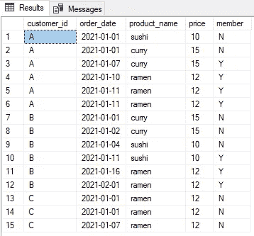**

## **对所有的事情进行排序**

**Danny 还需要关于客户产品的`ranking`的进一步信息，但是他故意不需要非会员购买的排名，所以他希望当客户还不是忠诚度计划的一部分时，记录的值为空`ranking`。**

```
WITH summary_cte AS 
(
 SELECT s.customer_id, s.order_date, m.product_name, m.price,
  CASE
  WHEN mm.join_date > s.order_date THEN 'N'
  WHEN mm.join_date <= s.order_date THEN 'Y'
  ELSE 'N' END AS member
 FROM sales AS s
 LEFT JOIN menu AS m
  ON s.product_id = m.product_id
 LEFT JOIN members AS mm
  ON s.customer_id = mm.customer_id
)SELECT *, CASE
 WHEN member = 'N' then NULL
 ELSE
  RANK () OVER(PARTITION BY customer_id, member
  ORDER BY order_date) END AS ranking
FROM summary_cte;
```

**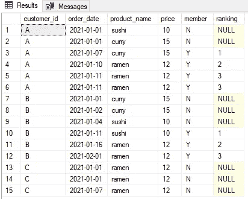**

# **洞察力**

**从分析中，我们发现了一些有趣的见解，对丹尼肯定有用。**

*   **客户 B 是最频繁的访问者，在 2021 年 1 月访问了 6 次。**
*   **丹尼餐馆最受欢迎的食物是拉面，其次是咖喱和寿司。**
*   **顾客 A 和 C 喜欢拉面，而顾客 B 似乎同样喜欢寿司、咖喱和拉面。谁知道呢，我可能是客户 B！**
*   **顾客 A 是丹尼餐馆的第一位成员，他点的第一份菜是咖喱。必须满足他对咖喱的渴望！**
*   **顾客 A 和 B 在成为会员前最后点的菜是寿司和咖喱。是不是说这两项都是决定性因素？他们报名成为会员一定是真的好吃！**
*   **在成为会员之前，顾客 A 和 B 分别消费了 25 美元和 40 美元。**
*   **在整个 2021 年 1 月，客户 A 的积分为 860，客户 B 为 940，客户 C 为 360。**
*   **假设会员从成为会员的那一天起每周可以获得 2x 积分奖励寿司，到 2021 年 1 月底，客户 A 有 660 个积分，客户 B 有 340 个积分。**

**谢谢大家！**

**现在轮到你分享一些我的分析和 1(或更多)的趣事了！)需要改进的地方。**

**干杯！(我渴望寿司和拉面现在:D)**