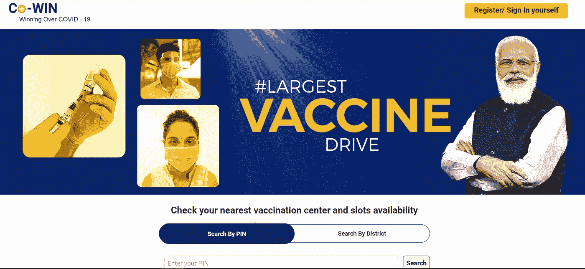
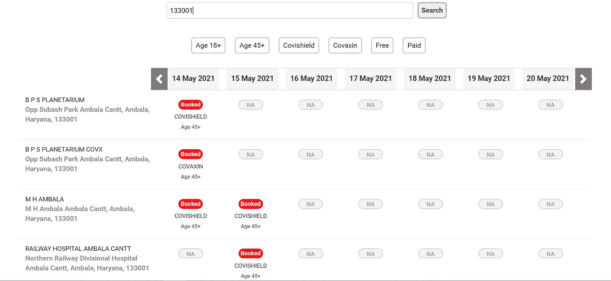
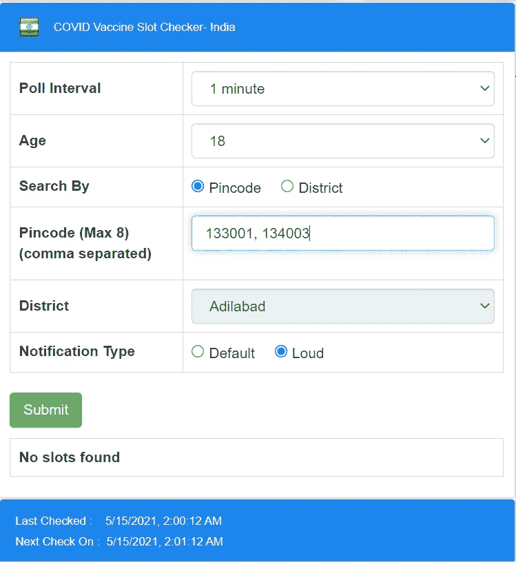
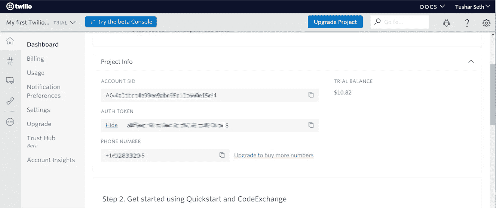
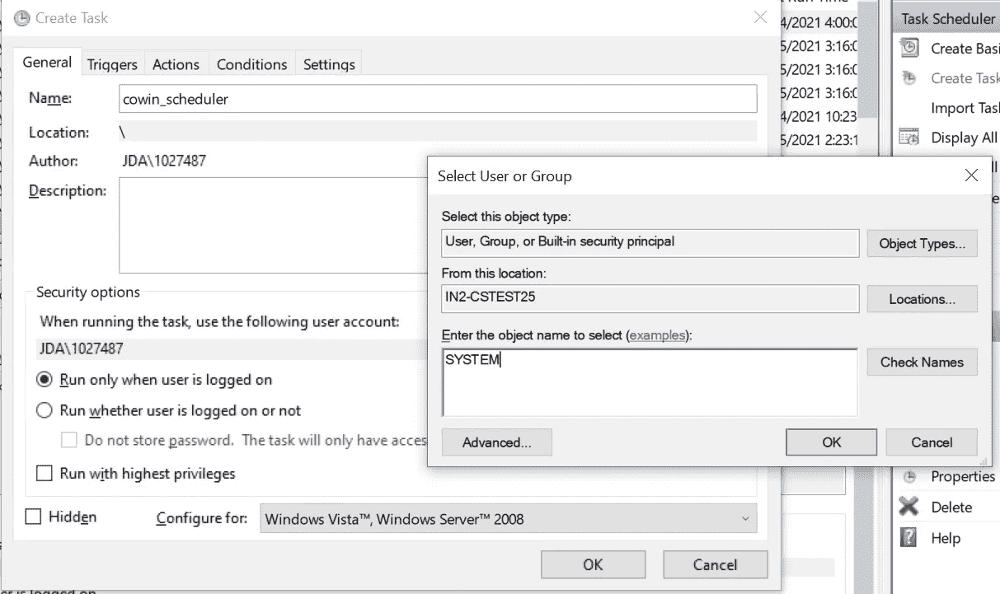
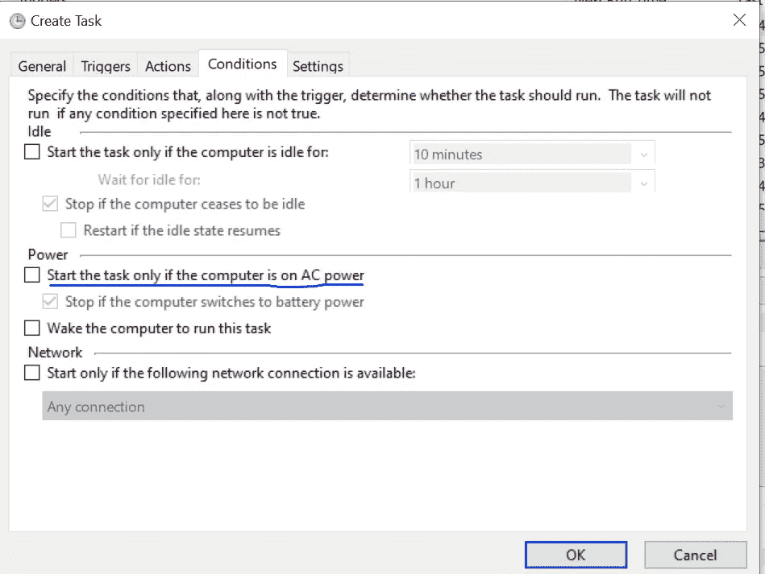
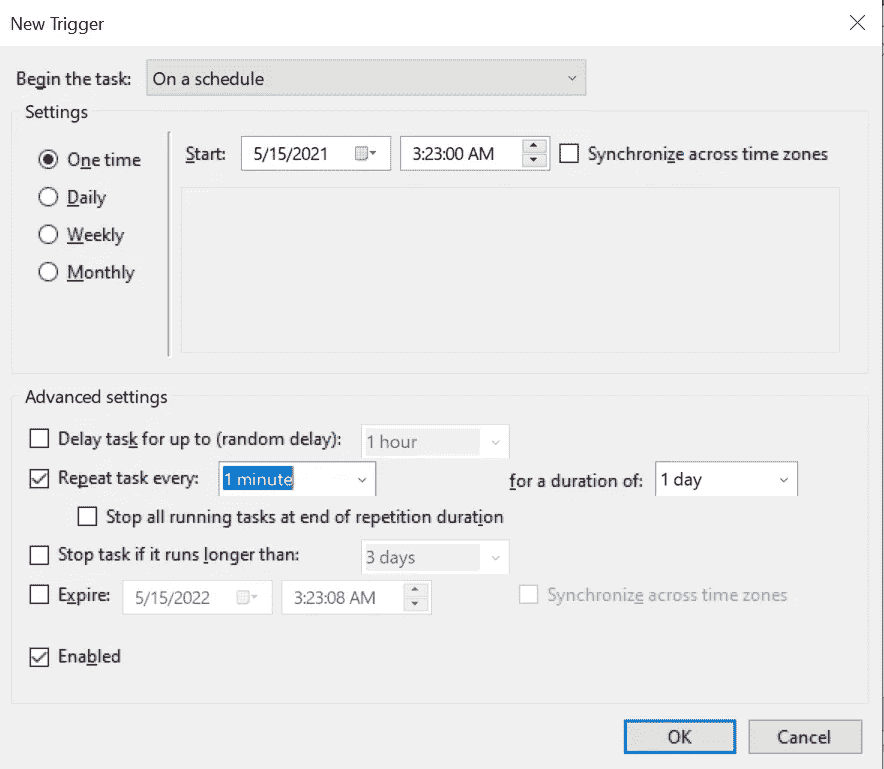
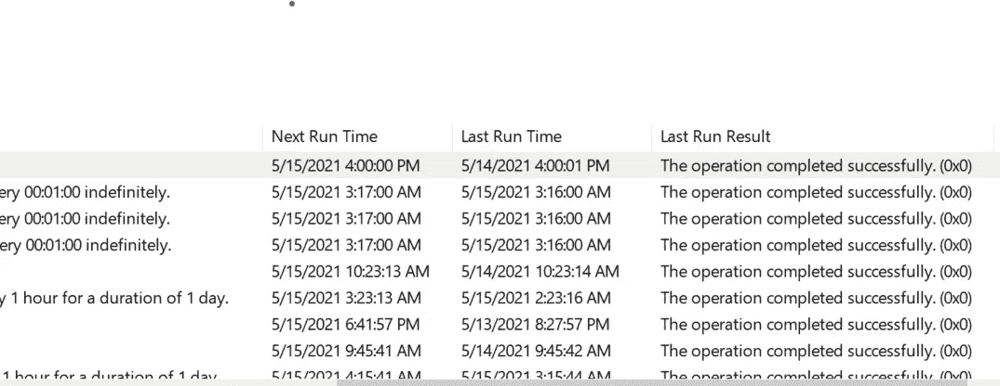

# 距离新冠肺炎疫苗只有 9 行代码

> 原文：<https://medium.com/analytics-vidhya/9-lines-of-code-away-from-covid-19-vaccine-f0bfddf5b8b8?source=collection_archive---------18----------------------->

只有旗舰手机或电影票在闪购的日子已经一去不复返了。现在是疫苗快速预订的时候了。

在疫情袭击后，情况是相似的，但它不仅仅是一部电话或一张票，它是一个救命的“疫苗”。在印度这样拥有超过 13 亿人口的国家大规模生产疫苗并不容易。因此，需求远远高于供给。



来源:图片来自政府的 COWIN 应用程序。印度的

最近，印度政府宣布 18-45 岁的人也将接种疫苗。因此，一个门户网站被创建，人们可以在那里注册和预订他们的位置。但是考虑到一个地区有 200-300 个位置，预订的人数成千上万，预订一个位置是一个挑战。



来源:图片来自政府的 COWIN 应用程序。印度的。这是特定密码可用或预订的插槽图像

作为一名程序员，我必须让我的生活变得简单。我希望有人帮我检查是否有空位，然后通知我，这样我就可以轻松地预订空位。因此，我写了这个脚本，它将为我完成工作，而我可以专注于其他事情。

最容易做到的:Chrome 扩展

如果你不想编码任何东西，那么有一个简单的方法。可以下载的 chrome 扩展:[https://chrome . Google . com/web store/detail/covid-vaccine-slot-check e/hmmahfccoaoebmjhmcnbbomomkimomhi](https://chrome.google.com/webstore/detail/covid-vaccine-slot-checke/hmmahfccoaoebmjhmcnbbomomkimomhi)

在这里，您只需提供您希望它轮询的密码或您所在的地区，它就会以您选择的时间间隔为您进行轮询。



所以，如果你不想做任何设置，我会强烈推荐给你。但是我想要额外的东西。如果我不在笔记本电脑旁，该怎么办？在另一个房间还是外面？所以，我想通过短信得到通知。这是构建这个脚本背后的动机。这是一个简单的设置；可能需要 5-10 分钟来设置，一旦完成，你可以自由移动(显然，没有面具:)。

**剧本是做什么的？**

我们可以使用一个公共 API 来查询我们的结果。

该脚本每分钟轮询一次 COWIN 服务器，并检查是否有可用的插槽。如果是，它会给我发短信。我每分钟都在这么做，因为我不想因为更高的频率 doing 服务器而使服务器不堪重负。

设置此功能有三个步骤:

1.  **获得一个 Twilio 账户:**这里的第一步是获得一个 Twilio 账户。它非常简单，不需要你提供信用卡的详细信息，也是免费的。只需访问 https://www.twilio.com/[并注册免费试用。你将获得 15 美元的免费试用，这对你的脚本来说绰绰有余。在此之后，您只需获得一个免费电话号码，您的仪表板将类似于以下内容:](https://www.twilio.com/)



来源:我的个人 Twilio 账户(一些信息被模糊了)

2.**第 9 行** **为 2 剂疫苗的代码**

在这里，我使用 Twilio python API 来发送 SMS，只要有任何中心可供预订。

所以，没有进一步的讨论，让我给你看这 9 行，它们为我做了重复的工作。但在此之前，让我们写一些配置，如个人识别码，网址等。

```
import requests
import json
from twilio.rest import Client
import datetime**############################################################## Twilio SID, Auth Token, pincodes, TO_NUMBER, FROM_NUMBER, MIN_AGE_LIMIT to be configured as per your Twilio Account and requirements 
##############################################################**
*client = Client("AC4a****************************94",
          "a8f**********************18") #Twilio SID and Auth Token
pincodes = ["133001", "134003"] # Pincodes as per your requirements
TO_NUMBER = "+91*******596" # To_Number on which SMS will be sent
FROM_NUMBER = "+16*******65" # Phone number provided by Twilio
MIN_AGE_LIMIT = "18" # Either 18 or 45* ***##############################################################***next_date = (datetime.datetime.today().date() + 
                     datetime.timedelta(1)).strftime("%d-%m-%y")
cowin_base_url = "[https://www.cowin.gov.in/api/v2/appointment/sessions/public/calendarByPin?pincode=](https://www.cowin.gov.in/api/v2/appointment/sessions/public/calendarByPin?pincode=)"**1.** **for each_pincode in pincodes:
2\.     cowin_url = cowin_base_url + \
                    each_pincode + \
                    "&date=" + 
                     next_date
3\.     cowin_response = requests.get(cowin_url)
4\.     cowin_json = 
5\.     json.loads(cowin_response. \
                content.decode('utf8'). \
                replace("'", ‘"’))
6\.    for each_center in cowin_json.get('centers'):
7\.        for each_session in each_center.get('sessions'):
8\.            if int(each_session.get('available_capacity')) > 0 \
                and int(each_session.get('min_age_limit')) == \                               
                                            int(*MIN_AGE_LIMIT)*:
9\.                client.messages.create(to=TO_NUMBER,
                                       from_=FROM_NUMBER,                                             
                                       body= script_name +                    
                             each_session.get('vaccine').upper() +
                                     " Vaccine is available at " +
                                         each_center.get('name') + 
                                                          " on " +
                                        each_session.get('date') + 
                                               " for age above " +
                          str(each_session.get('min_age_limit')) +
                                           ". Slots available: " +    
                                  str(each_session.get('slots')) +
                                                       ". Only " + 
                     str(each_session.get('available_capacity')) +                      
                 " bookings left. Book now and get Vaccinated !!")**
```

只需复制上述代码并将其放入任何文本文件中，然后保存为. py 文件。从您的 twilio 帐户更新 SSID 和 Auth 令牌，并提供您感兴趣的 pin 码。我们把它命名为 cowin_scrape.py，或者你可以直接从下面我的 github 库获取代码:

[](https://github.com/tseth92/vaccine_booking) [## t Seth 92/疫苗 _ 预订

### 此储存库通过向您发送以下信息，帮助您从 COWIN portal 预订在印度接种新冠肺炎疫苗的位置

github.com](https://github.com/tseth92/vaccine_booking) 

3.**安排脚本:**

Windows:如果您拥有 windows 系统，您可以使用内置调度程序来调度任务:

**i)创建任务调度程序:**进入 windows 任务调度程序- >点击右侧面板上的创建任务- >为任务提供一个名称- >点击更改用户或组，输入系统，然后点击确定。



用户/组中需要 SYSTEM，以便每次运行作业时不会显示黑屏

**ii)设置动作:**转到动作，并添加新动作。浏览到脚本，然后单击确定。然后转到“条件”并取消选中“仅当计算机使用交流电源时才启动任务”。



取消选中此选项，这样即使您没有接通电源，您的脚本也会运行。

**iii)设置触发器:**转到触发器，选择开始任务的时间，并在“重复任务间隔”中添加 1 分钟:



添加 1 分钟，或您希望它检查的任何持续时间



点击确定，你就完成了。如图验证一次即可。它应该显示您的下一次运行时间在接下来的 1 分钟，它应该每分钟更新一次。

恭喜你！！现在你可以高枕无忧了。只要您感兴趣的密码中有疫苗，您就会收到通知。只要它可用，您就会通过短信收到类似以下内容的通知:

这些看起来是大量的准备工作，但实际上只是 5-10 分钟的工作。在 Twilio 上创建一个帐户，将代码复制到某个位置并更新凭证和密码，然后设置调度程序。

**如果是 MAC 或者 Ubuntu？**

如果你在 MAC 或 Ubuntu 上，这种调度技术将不起作用。我们古老而强大的工具 CRONtab 出现了。为此，玉米工作将按照您的计划进行。

转到终端，键入如下内容:

```
crontab -e
In the vim editor, type i for insert, then write the following:*/1 * * * * C:\Users\tseth\Documents\cowin_scripts\cowin_script.py >> C:\Users\tseth\Documents\cowin_scripts\cowin_script_log.txt 2>&1## Path to your log file can be the absolute path of your 
```

结束了。坦白说，比起调度程序，我更喜欢 cron。但是调度程序在某些情况下给你更多的灵活性，比如你想只用交流电源运行，等等。

**代码详情:**

代码非常简单，但是如果有人感兴趣的话，我想给出一些代码的细节。

首先，我声明了导入和一些我们将在代码中使用的变量，它们非常简单。

1 到 5 行，我们只迭代用户指定的所有 pin 码。接下来的 6 到 9 行，我们只是对每个会话和每个中心进行迭代，并为每次迭代发送消息。

我希望这能帮助你建立你的疫苗通知系统，让你更快地接种疫苗。

如果你在设置过程中遇到任何问题，请在 [linkedIn](http://linkedin.com/in/tusharseth92) 上发表评论或与我联系。

暂时结束，下一篇文章再见。在那之前，注意安全，呆在家里，戴上口罩，接种疫苗！！