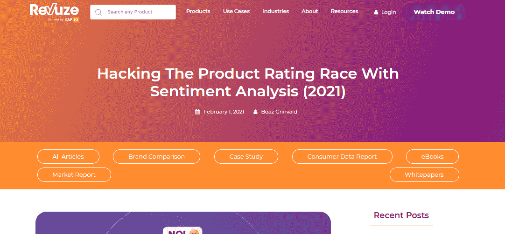

# 你应该阅读的 9 个情绪分析博客

> 原文：<https://medium.com/analytics-vidhya/9-sentiment-analysis-blogs-you-should-read-d3d63f4d87b0?source=collection_archive---------12----------------------->

从表面上看，情感分析似乎只是将文本分为积极、消极或中性的过程。然而，在今天的竞争环境中，它已经演变成一种要求。为了保持相关性并找到一种合适的方式来推进他们的业务，企业必须不断地监控和了解他们的客户群。

这为政治、股市预测和产品开发等领域的情绪分析带来了新的机遇。因此，需要对它有全面的了解。

因此，如果你正在寻找这方面的信息，并且想知道应该阅读哪些博客或使用哪些工具，这里有一个简单的列表，列出了一些关于情感分析的已有和新的博客，以帮助你更好地理解它。

# [Bytesview —什么是情感分析？权威指南](https://www.bytesview.com/blog/what-is-sentiment-analysis/)

让我们从一个相对较新的博客开始；这是一篇文笔优美、易于理解的文章，包括定义、内部工作原理、开发情感分析模型时遇到的挑战以及情感分析应用程序。

这里的语言简单易懂，对于不熟悉这个话题的人来说是最好的选择。

# [Brand24 —什么是情感分析，如何自己做](https://brand24.com/blog/sentiment-analysis/)

在本文中，您将了解到关于情感分析您需要知道的一切，包括谁使用它，它是如何完成的，在执行情感分析时您可能会面临什么挑战，以及最重要的是，您如何自己执行情感分析。

# [**Callminer —什么是情感分析？范例，最佳实践，&更多**](https://callminer.com/blog/sentiment-analysis-examples-best-practices)

这篇文章包含了对情感分析的深入指导，包括例子、用例、好处和你可能面临的挑战，以及关于这个主题的最佳技巧和建议。

# [Algorithmia —情感分析简介](https://algorithmia.com/blog/introduction-sentiment-analysis)

在通常的定义、应用和与情感分析相关的挑战的基础上，本博客更进一步，涉及了情感分析的技术方面，并为我们当中更好奇的人提供了额外的阅读材料。

# [Talkwalker —情绪分析指南](https://www.talkwalker.com/blog/sentiment-analysis-guide)

Talkwalker 的指南详细解释了他们的在线情绪分析工具及其对您的品牌的重要性、执行情绪分析的其他方法，以及一家公司使用情绪分析的真实例子，以及它如何使他们受益。

# [**Unamo——理解社交媒体监控中的情感分析**](https://unamo.com/blog/social/sentiment-analysis-social-media-monitoring)

Unamo 的博客解释了情绪分析在我们日常生活中的用途，它是如何执行的，以及情绪分析在社交媒体监控中的重要性。

# [**Revuze——用情感分析破解产品评级竞赛。**](https://www.revuze.it/blog/sentiment-analysis#:~:text=Hacking%20The%20Product%20Rating%20Race%20With%20Sentiment%20Analysis%20In%202021,12%25%20more%20revenue%E2%80%A6)

Revuze 发表的这篇文章是理解情绪分析的客户反馈分析应用的一个很好的方式，因为它包括所有常见的定义挑战和用例，以及它在评级和评论上的应用，以特定行业为例。

# [走向数据科学—情感分析](https://towardsdatascience.com/tagged/sentiment-analysis#:~:text=Sentiment%20analysis%20is%20a%20commonly%20used%20NLP(natural%20language%20processing,doing%20analysis%20on%20text%20data.)

这篇文章采用了一种更具技术性的方法，因为它解释了 uber 公司的组成部分，并深入分析了所有社交媒体渠道和新闻中围绕该品牌的公众情绪

# [monkey learn——关于情绪分析的所有知识](https://monkeylearn.com/sentiment-analysis/)

最后，也是最恰当命名的博客以高调结束。它包含了你需要知道的关于情感分析的所有信息。它涵盖了基本原理、内部工作、用例、应用，以及一系列在线工具和教程(免费和付费)

它还包含一个研究论文、书籍和课程的集合，您可以使用它来更好地理解这个过程。

我希望这个列表能在某种程度上帮助你

下次见。