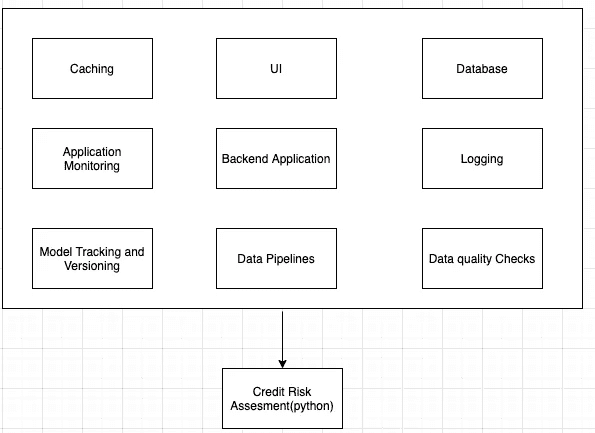

# 生产中的机器学习-信用风险用例。

> 原文：<https://medium.com/analytics-vidhya/90-of-the-ml-models-dont-make-it-to-production-credit-risk-use-case-cac702f3a60d?source=collection_archive---------19----------------------->

# 背景:

因此，对于那些刚刚接触到这篇文章的人来说，给我们在上一篇文章中所做的事情一点背景知识([生产中的 ML 问题](https://rohan-mudaliar.medium.com/90-of-the-ml-models-dont-make-it-to-production-really-a1847fbc4e95))。我们看了 ML 在生产中的情况，ML 在生产中的问题，以及机器学习的工程组件。最后是我们如何打造我们的汽车人工智能产品。

因此，我们在这篇文章中所做的是看看下面的工程组件，并将它们应用到我工作中的一个真实用例中。信用风险评估。

# 用例分析

我们看到了存在的问题，讨论了制造汽车的简单模板，现在让我们看一个制造汽车的例子。

## **信用风险评估模型:**

## **要求:**

我们有一家银行希望他们评估贷款申请的风险。他们有申请人过去的数据，我们想利用这些数据来检查风险。一个分类问题。

**申请详情:**

*   搜索和导出单个或多个申请人(最多 100，000 个申请人)的应用程序
*   能够上传他们每个月计算的商户参数。
*   UI 来查看预测的准确性。

## **我们从什么开始:**

*   我们让我们的数据科学家建立了一个信用评分模型。
*   所以机器学习模型是用 python 写的。此处不涉及模型的细节。
*   让我们考虑一下，我们已经有了一个不错的运行引擎。
*   ML 的不同阶段。即预处理、训练、评分、后处理等。这些是简单的 python 脚本。我们将从命令行传递一个 CSV 路径，完成一个步骤，然后运行每个 ML 步骤。我们的输入文件已经由不同的系统生成。获取最终输出，更新数据库。

## **我们需要什么:**

用户可以使用的产品。现在让我们回到盒子上。

**现在对每个盒子稍微思考一下:**

现在我们有了背景，让我们考虑一下制造汽车。我们已经有了一个可以工作的引擎。即。信用风险评估模型。

在设计相同的产品时，我们会问一些问题:

**用户界面:**

**后端:**

**数据管道:**这分为两个阶段，1。2)从不同来源摄取 ML 模型的数据。)自动化机器学习的不同阶段。

**数据质量检查:**

这一过程中非常关键的一部分是实际监控数据质量。在你的清洁数据之前和 Ml 阶段完成之后，我们需要这个。

**模型跟踪:**

**模型版本化和部署:**

**数据库:**

**外部存储器:**

**App 监控:**

**测井:**

**缓存:**

**数据和应用安全:**

**资源需求:**

# 结论:

这只是对我们看到的问题和思维过程的一个小小的探索，现在让我们回到这张图片上来结束我们的谈话。

我所说的是一个分类模型和一个特定的金融科技用例。因此，每个模型和每个工业用例的用例及要求都是不同的。有些像 fintech 需要安全，有些像电商需要规模。但是，核心概念保持不变。是的，如你所见，ML 不仅仅是机器学习模型。它是关于数据的，是关于分布式系统的，是的，也是关于引擎的。所以，是的，我确实期待在未来制造更多的汽车。如果不造一台新的，我想学习如何修理这台发动机