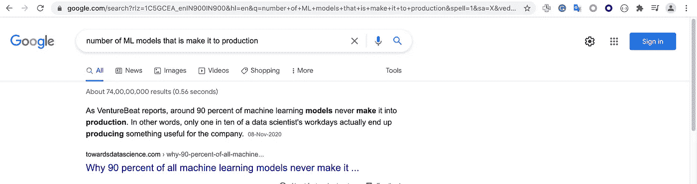
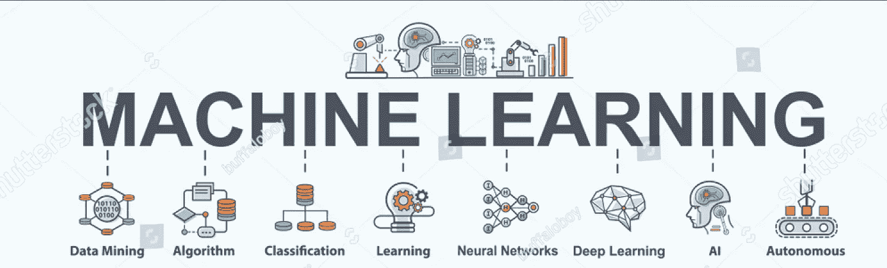
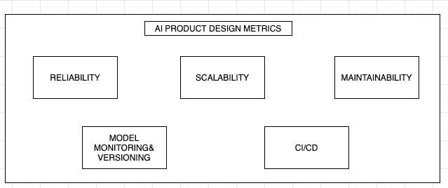
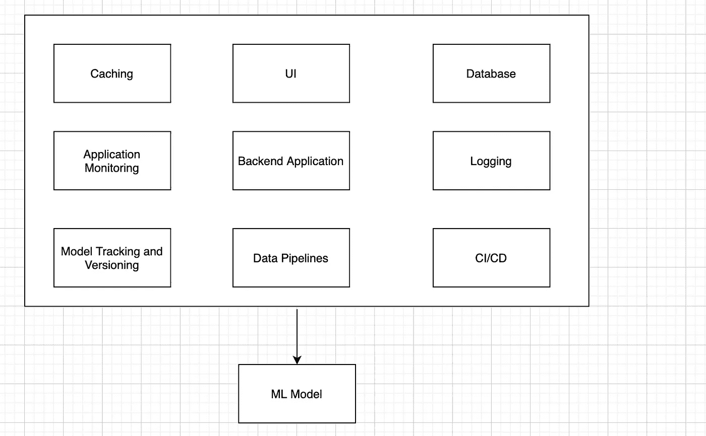

# 生产中的机器学习——概述

> 原文：<https://medium.com/analytics-vidhya/90-of-the-ml-models-dont-make-it-to-production-really-a1847fbc4e95?source=collection_archive---------14----------------------->

所以这篇文章开始于不久前谷歌上关于 ML 的搜索，是 ML 模型的百分比使它成为产品

这实际上引起了我的兴趣。我是说，我就是为了工作才这么做的。我在一家 Ecomerce 公司的数据科学团队担任软件开发人员。

因此，写一篇关于 10%的生产模型的文章，分享一些设计原则。

所以我们要做的是:

*   查看问题的**介绍，建立问题的背景和人工智能产品的想法。**
*   查看**信用风险评估 ML 模型**的一个特定用例，并在下一篇文章中应用我们所学的所有知识([信用评分用例](https://rohan-mudaliar.medium.com/90-of-the-ml-models-dont-make-it-to-production-credit-risk-use-case-cac702f3a60d))。

# ML 在生产中是什么样子的？

所以我们先从大家想到机器学习和人工智能时的想法说起。我确信它在下面。

对于这个行业的任何新手来说，机器学习就是以下内容:

*   我们定义问题陈述
*   我们已经有数据了
*   我们为我们的 ml 问题选择正确的算法。
*   调整模型，我们就完成了。

这与事实相去甚远。问题是，ML 本身有价值吗？或者，这个价值是由使用最终产品的企业产生的吗？。

因此，让我们看看 ML 模型在生产中的应用方式:

1.  **作为一项功能添加到现有产品中的 ML 型号**

添加推荐或改进推荐的电子商务网站。已经存在一个产品。

2.**为使用 ML 模型而构建的应用程序。**

一家银行想对贷款申请人进行信用风险评估。所以银行想要一个 ML 模型来解决这个用例，供他们的信贷员使用。

# 生产中的 ML:挑战

当谈到生产中的 ML 时，我们有一些工程上的挑战和一些非工程上的挑战。让我们简单地看一下它们:

## 领导力和关注点:

因此，一家公司希望致力于机器学习，但他们可能**不**确定他们到底想要**实现什么**。

## 数据:

*   机器学习的核心是数据，以一种干净、可消费的方式获取所需的**数据。**
*   我们知道我们需要数据，但是即使系统是内部的，我们从哪里获得数据以及如何获得数据呢？
*   每个系统都有自己的方案、不同类型的存储等。

## 人工智能开发需要但无组织的团队

数据科学家构建模型，工程师构建软件产品，DevOps 进行部署。

*   你没有数据科学家在构建模型时考虑规模和可靠性。
*   工程在围绕 ML 代码开发他们的产品时，没有充分考虑机器学习。
*   DevOps 只是想到了 CI/CD。

现在我们知道了一些挑战，让我们来看看如何利用这些知识来构建能够投入生产的人工智能产品。

# ML 模型 vs AI 产品

事实是， **ML 型号**就是可以独立使用的**发动机**。

或者你可以制造人工智能产品(汽车)。

为了制造产品，你需要知道汽车的里程数、最高速度、0-60、能容纳多少人(模型指标、性能、所需的输入数据等)。但是您还需要以下内容:

*   你需要一个坚固的底盘，在此基础上你可以构建其他部件(后端)
*   你需要一个座位一个**方向盘**来驾驶汽车(用法和 UI)
*   你需要门、窗、发动机罩等。(用户界面)
*   燃油指示器、速度计和附件(度量和监控)

# 人工智能产品设计指标

AI 产品开发需要跨职能知识。分布式系统、机器学习和 DevOps。让我们来看看可以应用于人工智能产品的跨功能核心设计概念。

*   **可靠性** —我们是否考虑过如何处理软件错误、核心错误和人为错误？
*   **可扩展性** —您知道您的系统必须应对的负载吗？每天或每月的用户数量，搜索次数，如果系统负载增加，你会怎么做。如果你需要支持批处理和实时操作。
*   **可维护性/可用性** —我们是否有足够的应用程序日志和度量标准。这可能会影响模型性能并处理应用程序故障。应用程序是以可配置的方式构建的吗？这使得运营团队可以处理简单的维护任务。
*   **模型监控和版本控制-** 我们能监控**ML 模型是如何执行的吗。？是否如预期，模型随时间的退化情况如何？我们是否考虑到了这样一个事实，即我们可能需要在生产中有几个版本的模型？应该有能够切换版本的能力吧？**
*   CI/CD——考虑一下，我们有应用程序代码、数据管道、ml 模型和工具。哪些是必须 CI 的，哪些不是？

# 人工智能产品技术模板

我们看了一下赛车和一些设计原则，下一步是定义赛车的部件。就这么办吧。

在下一篇文章中，我们将研究单个组件，并将它们应用到我们的用例中。

**总结:**

我们看了生产中的 ML，AI 产品，定义了一些要考虑的设计原则，以及我们的 AI 产品的不同组件。我们将在下一篇文章中看到我工作中的一个实际例子([信用评分用例](https://rohan-mudaliar.medium.com/90-of-the-ml-models-dont-make-it-to-production-credit-risk-use-case-cac702f3a60d)