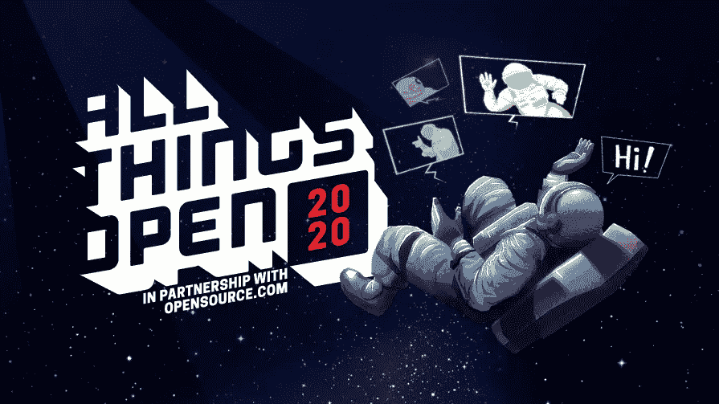
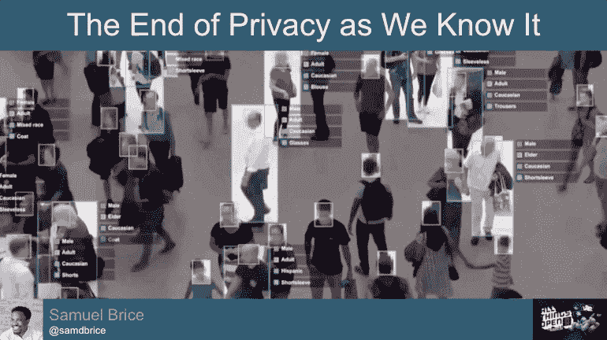

# Clearview AI 在所有开放会议上的演讲视频

> 原文：<https://medium.com/analytics-vidhya/980b955b1c8c?source=collection_archive---------35----------------------->

## 美国东海岸最大的开放式技术活动！

All Things Open 是一个多语种技术会议，主要关注工具、过程和使开源成为可能的人。

2020 年，ATO 走向虚拟化，向全球 10，000 多台设备传输世界级开源 TED 风格的讲座和研讨会。

在 YouTube 频道的 [All Things Open 上查看 Clearview AI talk 和 Q&A 录音！](https://www.youtube.com/watch?v=oYXp29Upm-U)

youtube.com/watch?v=oYXp29Upm-U