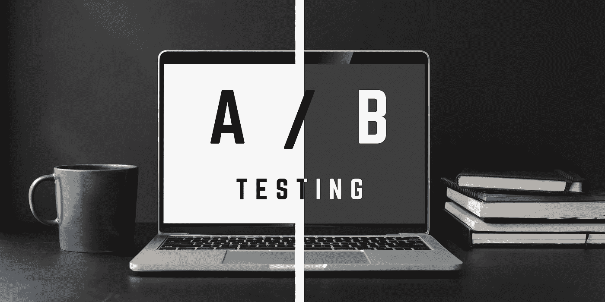

# A/B 测试以及如何使用几行代码在 Python 中实现它

> 原文：<https://medium.com/analytics-vidhya/a-b-testing-and-how-to-implement-it-in-python-70b21697efcc?source=collection_archive---------4----------------------->

作者图片

*简单解释 A/B 测试如何帮助企业做出战略决策，以及如何使用几行代码用 Python 实现它*

# 什么是 A/B 测试？

一个 ***A/B 测试*** 是一个包含两组的随机实验，A & B 接受不同的体验。在 A/B 测试中，我们希望了解和衡量每个小组的反应。

# 如何衡量和理解 A/B 测试结果？

为了衡量和理解你进行的 A/B 测试的结果，你可以使用双样本假设检验或独立样本 *t* 检验。

> “两样本*t*-检验(也称为独立样本*t*-检验)是用来检验两组未知总体均值是否相等的方法。”

# A/B 测试在实践中的一些例子

*   在线广告策略
*   联系客户时发送电子邮件主题行
*   测试给顾客邮寄优惠券和对照组的效果
*   网飞为同一部电影测试不同的图像
*   亚马逊测试新的网站功能以保持竞争优势

# 如何用 Python 实现？

**示例问题**:确定一封更好看的促销邮件是否会吸引更多客户注册一个售价 100 美元的送货俱乐部。完整问题及代码[和*见此处*和](https://github.com/ZL63388/grocery-signup-rate)。

**导入所需包**

**得到观察到的频率**

**陈述假设**

**计算并得到结果**

**结果汇总**

我评估了两个不同的邮件发送者在俱乐部注册率上的差异。根据所提供的数据，并使用卡方检验独立性，我现在可以建议 ABC 杂货店，也许是其营销部门，他们可以停止发送昂贵的邮件，甚至是简单的邮件，以节省成本，因为这无助于让客户注册送货俱乐部的促销活动。

***参考文献:***

 [## 双样本 t 检验

### 双样本 t-检验(也称为独立样本 t-检验)是一种用于检验未知样本是否为未知样本的方法。

www.jmp.com](https://www.jmp.com/en_ph/statistics-knowledge-portal/t-test/two-sample-t-test.html)  [## GitHub-ZL 63388/杂货店注册率

### 在 GitHub 上创建一个帐户，为 ZL 63388/杂货店注册率的发展做出贡献。

github.com](https://github.com/ZL63388/grocery-signup-rate)  [## 数据科学无限

### 以正确的方式学习正确的内容，并提供无限的支持和指导，我致力于帮助您成为一名…

data-science-infinity.teachable.com](https://data-science-infinity.teachable.com/courses/data-science-infinity?affcode=716157_jcwmqdhh)