# A/B 测试:简单解释背后的数学

> 原文：<https://medium.com/analytics-vidhya/a-b-testing-simple-explanation-of-maths-behind-a3b2f059e619?source=collection_archive---------9----------------------->

图片作者。

# **简介**

在将数据科学解决方案或任何功能更新集成到产品中之前，假设测试或 A/B 测试是至关重要的一步。这基本上是一种统计方法，用来衡量我们试图在产品中添加/更新的功能的影响。

根据维基百科，

*A/B 测试是一种比较单个变量两个版本的方法，通常通过测试受试者对变量 A 和变量 B 的反应，确定两个变量中哪个更有效。A/B 测试包括统计假设测试的应用。*

由于 A/B 测试是一种测试，它应该有三个基本组成部分，因为它们在任何类型的测试中，一个需要测试的指标/变量，一个执行测试的方法和一个评估结果/通过标准的方法。

例如，如果我们试图添加一个功能，将提高点击率，那么我们将比较两个版本，A 和 B 的点击率变量。版本 A 中的变量值与当前产品一致，版本 B 中的变量值与产品的更新版本一致。

# **待测变量**

测试变量/指标应量化新功能的性能，如更新网站的点击率、推荐页面的成功支付等。

我们可以从两个版本的用户样本集中测量变量的样本值。版本 A 是与原产品相同的样品组，这个组称为控制组。版本 B 是更新产品的样本集，这个组称为目标组。

就统计假设检验而言，零假设是指新特性对变量没有任何影响。另一个假设是，新特性将对变量产生影响，换句话说，由于新特性，版本 B 的值将偏离版本 A 的值。我们需要根据实际情况具体说明这两个假设。

# 执行测试的方式

我们可以比较两个版本的值并声明结果吗？不尽然！假设版本 B 给出了更好的值。我们仍然不能宣布版本 B 是赢家(拒绝零假设)，因为我们不知道变量的改善是偶然的(可能我们很幸运)还是新产品确实有影响，因为我们只是从总体中抽取了一个样本。

那么我们实际上是如何进行测试的呢？答案是，如果我们以某种方式知道我们试图测量的变量的实际总体分布，那么我们可以推断出变量至少与版本 b 中测量的一样极端的可能性。这种概率可以帮助我们决定结果是否是偶然的。这种可能性被称为统计假设检验的 **p 值**。p 值越低，版本 B 值受新功能影响的可能性就越大。

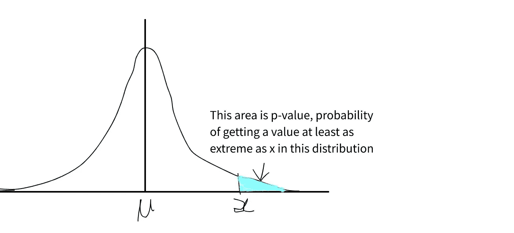

作者图片

假设零假设为真，我们要计算 B>A 的概率 P(B>A |零假设)。

但问题是我们永远不知道变量的总体分布，所以我们不能只计算可能性。 [**中心极限定理**](https://en.wikipedia.org/wiki/Central_limit_theorem) 此时来拯救我们了。

中心极限定理指出，如果样本容量变大，样本均值的抽样分布接近正态分布。也就是说，如果我们从总体中抽取大量相同大小的样本，无论总体分布如何，如果每个样本的大小都很大(大于 30 的样本大小就足够大)，这些样本的均值分布(这称为样本均值的抽样分布)将是正态分布。

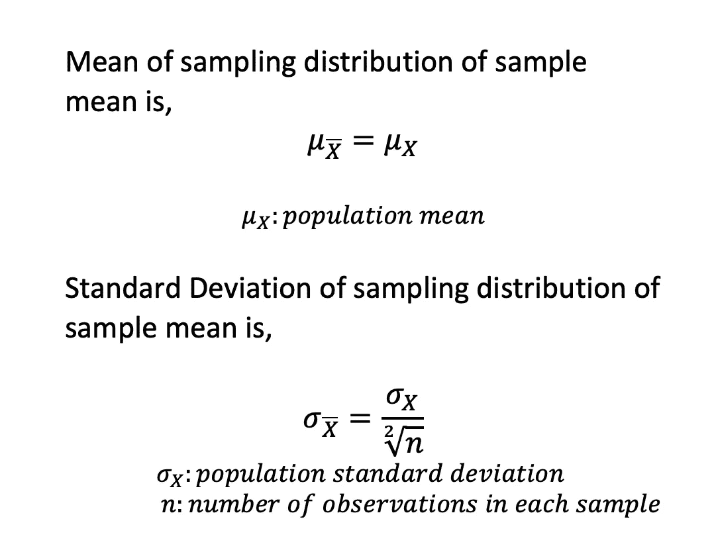

作者图片

检查下面的模拟，实际人口不正常，但样本均值的抽样分布是。根据上述等式验证平均值和标准偏差。

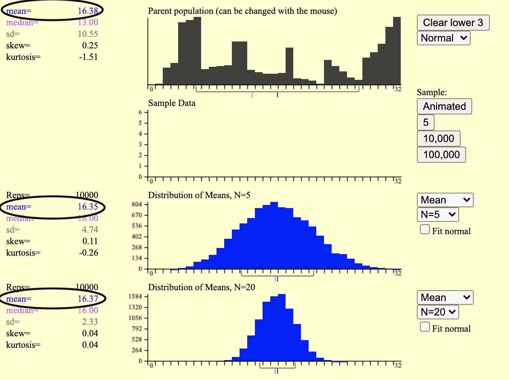

图片作者，生成自[http://onlinestatbook.com/stat_sim/sampling_dist/index.html](http://onlinestatbook.com/stat_sim/sampling_dist/index.html)

例如，如果我们从用户群体中抽取 100 个用户，每个用户抽取 1000 个样本，并计算每 1000 个样本的变量平均值(样本平均值)，那么这些平均值的分布(样本平均值的采样分布)将是正态分布。这个正态分布的平均值是总体平均值的近似值。

由于我们不知道人口分布，我们也不知道人口的标准差。因此，我们不能直接计算样本平均值的抽样分布的标准偏差(也称为平均值的标准误差),但我们可以使用下面的公式来估计它。

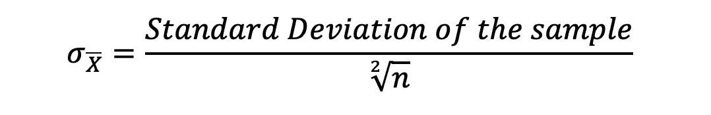

作者图片

# 评估结果/通过标准的方式

由于我们现在知道样本均值的抽样分布是正态分布，我们还可以计算我们在版本 B 中测量的值的似然性。一种方法是计算 A 和 B 之间的偏差的似然性，这就是 A-B 分布的似然性。

版本 A 和版本 B 的样本均值的抽样分布为:

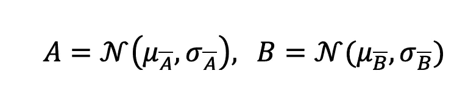

作者图片

由于 A 和 B 是独立的，A-B 也将遵循正态分布，

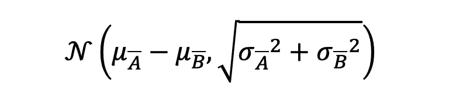

作者图片

根据零假设和标准误差的估计，

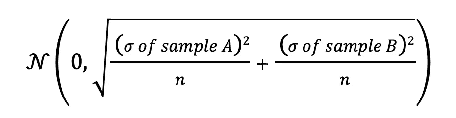

作者图片

A-B 是以零为中心的正态分布。我们可以通过使用 z-score 来计算版本 A 和版本 B 值中观察到的差异的可能性。

z-score 表示一个数据点距离(分布的)平均值有多少标准差。一旦我们有了 z 值，我们就可以使用 z 表来计算该数据点的 p 值。如果样本小于 30，我们用类似的方法使用 t 表。

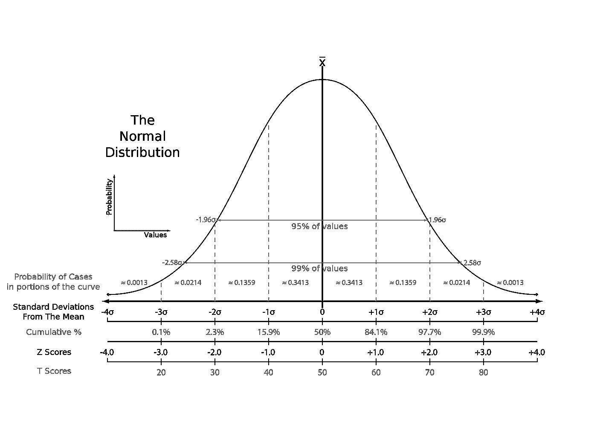

图片来自维基百科([https://en.wikipedia.org/wiki/Standard_score](https://en.wikipedia.org/wiki/Standard_score))

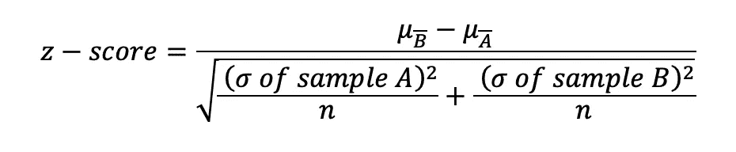

作者图片

一旦我们从 z 表或 t 表中获得了相应的 p 值，我们就可以设置一个阈值来接受或拒绝零假设。这个阈值称为显著性水平，用α表示。5%的 Alpha 在行业中被广泛使用。这意味着如果 p 值小于 5%，那么我们将拒绝零假设。5%的α对应于 95%的显著性水平。

这意味着我们只拒绝无效假设，

p(B > A |零假设)

Consider the following example,

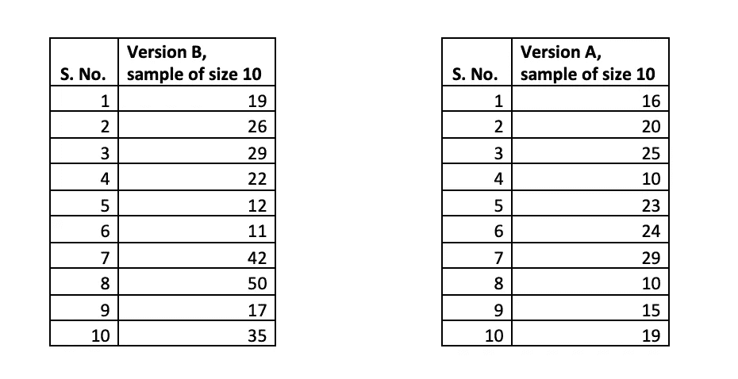

Image by author

As the sample size is less than 30, we will use t-table,

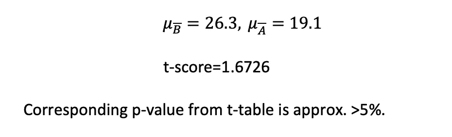

Image by author

If the alpha is 5%, we can not reject null hypothesis in this case.

P(B>A |零假设)> 5%为观察病例。这意味着在版本 B 中观察到的值实际上不是一个罕见的事件，这可以在原始群体中观察到，这是旧版本。

***参考文献***

 [## 模拟

### 编辑描述

onlinestatbook.com](http://onlinestatbook.com/stat_sim/index.html)  [## 中心极限定理

### 在概率论中，中心极限定理(CLT)确定，在许多情况下，当独立随机…

en.wikipedia.org](https://en.wikipedia.org/wiki/Central_limit_theorem)  [## 标准分数

### 在统计学中，标准分数是标准偏差的数量，原始分数的值(即，一个…

en.wikipedia.org](https://en.wikipedia.org/wiki/Standard_score)