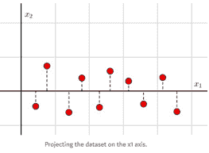
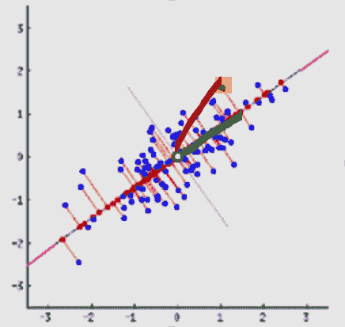

# PCA 的一次赤裸裸的采访

> 原文：<https://medium.com/analytics-vidhya/a-bare-it-all-interview-with-pca-ffbe36879381?source=collection_archive---------15----------------------->

马特·博茨福德在 [Unsplash](https://unsplash.com?utm_source=medium&utm_medium=referral) 上的照片

**我:**PCA 小姐，请给我们介绍一下你自己，你是做什么工作的？

PCA: 我是数据降维的专家。人们雇我把高维数据投射到低维子空间。

**我:**好吧！那么你的指导原则是什么，你如何实现这种转变？

**PCA:** 在将原始数据投影到低维子空间的同时，我尽量保留数据的尽可能多的方差。此外，我总是确保我创建的新坐标系中的轴相互正交。

**我:**有意思！你如何在低维空间中组织这种变化？

**PCA:** 我将最大可能方差分配给较低维度中的第一个轴，然后将第二大方差分配给第二个轴，第三大方差分配给第三个轴，依此类推。通过这种方式，我没有把一个特定的低维系统强加给我的雇主，而是让他们根据他们想要保留的原始数据的差异来选择他们想要保留的维数。

**我:**好了，抓到你了！所以，在工作时，你首先要确定一个轴，然后试着最大化这个轴上的方差。

不，那对我来说会是很大的工作量。我聪明地工作，我宁愿尝试最小化数据的投影误差，同时将它从高维空间转换到低维空间。当我去最小化投影误差时，方差自动得到最大化，这要感谢我的朋友毕达哥拉斯定理先生。

我:他怎么帮你的？你能详细说明一下吗？

**PCA:** 投影误差是我要损失的信息量，如果我希望把高维数据投影到低维的话。在数学上，它是从创建的轴到每个数据点的垂直距离的总和。请看下图，如果我希望将该图中的 2D 数据投影到横轴上，我必须放开虚线表示的距离，所有这些虚线的总和就是投影误差。

我:好的，但是最小化这些虚线的总和是如何导致方差最大化的呢？这个数字没有帮助我得到直觉。

**PCA:** 该图中的数据相关性很低，我依赖相关性。让我们看另一个图，理解毕达哥拉斯定理是如何帮助我的。

**PCA:** 蓝点是数据点。如你所见，这个数据是正相关的。现在，如果您要求我将 2D 数据简化为一个轴，我需要做的就是创建一个穿过该数据的轴，这样投影误差(图中的红线)就会最小化。它类似于线性回归，但这里我最小化垂直距离，而线性回归最小化垂直距离。所以，类似于线性回归，我需要找出这个轴的方向。但是，不管方向如何，这个数据集的平均值(中间的白点)不会改变。现在，考虑用黄色突出显示的点。棕色线是该点到平均值的最短距离。因为中间点和高亮点都是固定的，所以不管方向如何，棕色线都保持不变。绿线是所选轴上高亮点的方差(因为方差是沿轴与平均值的距离)。绿线和红线的长度取决于此图中的轴方向。红色和绿色线的总和将等于棕色线(这些绿色、红色和棕色线一起形成一个直角三角形)，但由于棕色线是恒定的，这意味着如果我选择最小化红色线，绿色线将自动最大化。

**我:**牛逼！是的，我知道你很聪明，从现在开始就很容易了，所以你把所有的投影误差相加，然后解方程求最小值，类似于线性回归如何最小化与直线的垂直距离？

**PCA:** 哇！你是认真的吗，把我的工作比作线性回归？线性回归要做的就是拟合一条线就这样，她的工作结束了。但对我来说它不仅仅是一个单一的轴(或者你可以称之为线)，有时人们会向我扔出数百个维度。如果我开始按顺序最小化每个轴的投影误差，我会在一个问题上花费太多时间，人们会开始寻找其他专家。我不想丢掉我的工作。

我:那你是怎么做到的？

**PCA:** 创建数学公式，求解最小值不是我的事。工作太多了！我所需要的只是一个旋转。仅此而已。为了执行这个旋转，我叫另一个朋友，本征分解先生。*他只要求协方差矩阵，并为我执行旋转，只需一次操作*。我唯一的工作是确保在构建协方差矩阵之前对数据进行归一化，以避免被单个特征尺度所迷惑。

我:但是在我们讨论特征分解之前，我们能不能说线性回归也能最大化方差，你们两个看起来很接近，至少对于单轴问题是这样的？

**PCA:** 没有！回到图中自己去看，离线的垂直距离和离线的垂直距离不是一回事。从直线上取垂直距离不会产生直角三角形，因此线性回归与方差无关。

**我:**好了，言归正传！所以你说你只是旋转坐标轴，然后根据需要的方差，人们选择轴的数量来表示数据。

**PCA:** 对，就这些。我只是执行协方差矩阵的特征分解，以正交方式旋转轴，只需一次。

我:好吧，但在我询问特征分解之前，我好奇为什么协方差矩阵要保护方差？

**PCA:** 因为光有方差是不够的。方差只能解释数据沿特征空间轴的分布。它不能帮助解释数据的方向，但协变可以。协方差矩阵具有作为对角元素的方差和作为非对角元素的协方差。因此，协方差矩阵定义了数据的分布(方差)和方向(协方差)。此外，协方差矩阵是一个正方形和对称矩阵的事实对我帮助很大。

**我:**我不服气。同意，协方差矩阵包含了所有有用的信息，但是我想不通，你是怎么用协方差矩阵来旋转你的数据的坐标轴的？

**PCA:** 对我来说，矩阵无非就是应用于向量的线性变换。想想吧！向量的元素代表它的方向，值代表它的大小。当你用一个向量乘一个矩阵时，你会得到另一个向量。这个向量与原始向量具有不同的元素和大小。这意味着，矩阵乘法改变了向量的方向(应用旋转)和大小(应用缩放)。它转换了向量。协方差矩阵也只是一个变换。而是一种特殊的转变。*将数据集的所有向量(观察值)向数据变化最大的方向旋转*。这个方差最大的方向是我唯一感兴趣的，因此我使用协方差矩阵来计算这个方向。

**我:**我还是没有完全明白。

**PCA:** 让我重申一下，**我利用了这个事实，即，协方差矩阵将数据集的所有向量(观测值)向数据的最大方差方向旋转。**我需要什么？数据最大方差方向。**这意味着，我需要知道的是，哪些向量不会被协方差矩阵旋转(因为这些向量已经在最大方差的方向上)**。*因此，如果一个向量的方向与最大方差的方向相同，那么它就不会被协方差矩阵旋转。在线性代数中，这个向量称为* ***本征向量*** *。这意味着我只需要知道协方差矩阵的特征向量，这将给出最大方差的方向，这些将是我的新维数。*

**我:**逮到你了！所以你是说，协方差矩阵将所有向量旋转到最大方差的方向，因为本征向量没有旋转，这意味着它们是最大方差的方向。你的工作只是找出这些特征向量？

**PCA:** 正是！看就这么简单。

我:你能举一个特征向量和其他向量的例子吗？

**PCA:** 正如我之前所说，当一个矩阵对一个向量进行操作时，它会旋转和缩放向量。然而，对于任何一个矩阵，都可能存在一些不旋转的向量，矩阵运算只能缩放它们。所以，基本上这些向量的矩阵乘法等价于这些向量的标量乘法。这些向量称为本征向量，比例因子称为本征值。让我们看一个例子。考虑一个 2D 矩阵，M =[1 ^ 2；8 1]并考虑两个向量，A=[1 2]和 B=[3 4]。让我们看看他们的产品。MA = [5 10] = 5[1 2]。因此，A 是矩阵 M 的特征向量，因为 M 所能做的就是将向量拉伸 5 倍。这个缩放因子 5 将被称为本征向量 a 的本征值。现在，MB =[11 ^ 28]，这个向量不能被写成向量 B 的倍数，因此向量 B 不是矩阵 M 的本征向量，并且 M 将旋转和缩放这个向量。

我:明白了，那你怎么找特征向量呢？

**PCA:** 很简单，对协方差矩阵进行特征分解。对于一个协方差矩阵，比如说 C，如果存在一个本征向量，比如说 A，它只根据它的本征值，比如说λ，对它进行缩放，这意味着我们可以把它写成一个简单的乘法方程。c * A =λ* A .如果存在许多特征向量和特征值，我们可以使用两个单独的矩阵来存储它们中的每一个。这就是我们在特征分解中所做的。

对于协方差矩阵 C，存在一个特征向量矩阵 E，和一个特征值矩阵 V，使得 CE=VE，两边乘以 E 的逆，我们得到，C=V*E*E(逆)，这叫做特征分解。这里，V 是本征向量矩阵，E 是本征值的对角矩阵。

正如我前面提到的，选择协方差矩阵对我有帮助，因为特征分解只对平方矩阵有效，因为非平方矩阵不存在逆矩阵。协方差矩阵的另一个额外好处是，由于它是对称的，它具有正交本征向量，如果特征表现出多重共线性，这将非常有帮助，应用 PCA 可以保证提供一个不再是问题的基础。

因此，本征分解导致使用本征向量的轴旋转和使用本征值的沿每个轴的独立缩放。这里，每个随后的特征向量代表方差递减的维度。您可以根据满足需求的方差来选择维度的数量。一旦选择了特征向量的数量，特征向量与原始数据点的点积将在新的坐标系中投影原始数据。

我:但是我认为奇异值分解是解决矩阵分解问题更流行的方法。

**PCA:** SVD 是特征分解的简单推广。SVD 总是存在于任何类型的矩阵中，而特征分解只存在于可对角化的矩阵(也需要满足一些其他要求的方阵)。此外，SVD 总是产生正交向量矩阵，而对于提供正交向量的特征分解，输入矩阵必须是对称的。所以，你看，特征分解只是奇异值分解的一个特例。现在，SVD 更受欢迎，因为它可以在任何矩阵上工作，这使得它对许多其他应用都很有用，而特征分解的应用需要矩阵来满足上述要求。然而，协方差矩阵总是正方形的、对称的和可逆的。因此 SVD 或协方差矩阵的特征分解将给出相同的结果。对于降维，您也可以直接对数据矩阵进行 SVD，而不是使用协方差矩阵，但是在这种情况下，您会增加计算要求，因为您会给出一个更大的矩阵作为输入(假设您的数据具有比特征更多的观察值)。此外，确保您的意思是在对数据矩阵应用 SVD 之前集中您的数据，而协变会自动处理这一点，因为从平均值中减去是协变定义中内置的。

**我:**谢谢！你已经解释清楚了。我没有问题了，你有什么最终的想法吗？

**PCA:** 对！很多时候，人们雇佣我，然后抱怨低维数据没有意义。不幸的是，他们没有意识到的是，我有局限性，我至少需要近似高斯特征来提供有意义的结果。如果特征是非高斯的，你应该接近我的堂兄 ICA(个体成分分析)。而且，我只做线性降维。只有当有用数据的子空间被假定为线性时，才需要我。当有用数据的子空间可能是非线性的时候，你应该去找我的另一个堂兄核主成分分析或者他的朋友，他们是非线性降维的专家。

鸣谢:[https://towards data science . com/https-medium-com-Abdulla TIF-h-dimensionalization-for-dummies-part-1-a 8 c 9 e 7c 7 b 7 e 7](https://towardsdatascience.com/https-medium-com-abdullatif-h-dimensionality-reduction-for-dummies-part-1-a8c9ec7b7e7)

[https://stats . stack exchange . com/questions/2691/making-sense-of-principal-component-analysis-features vectors-environments](https://stats.stackexchange.com/questions/2691/making-sense-of-principal-component-analysis-eigenvectors-eigenvalues)

*原载于*[*https://www.linkedin.com*](https://www.linkedin.com/pulse/bare-all-interview-pca-arvind-shukla/)*。*