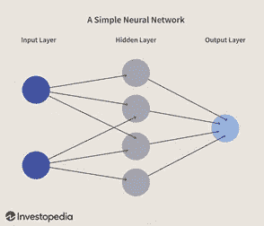
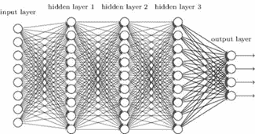
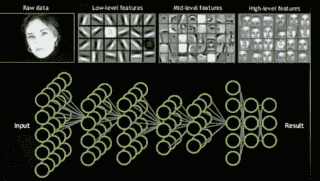
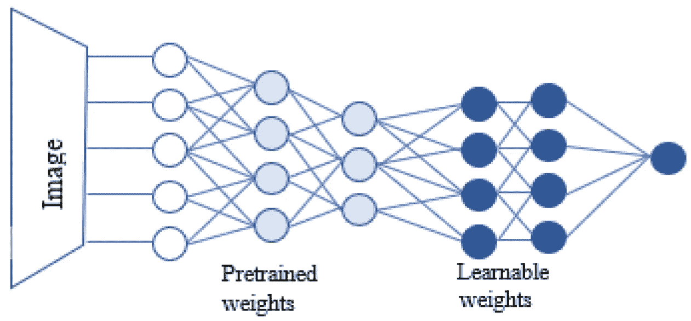

# 深度学习中学习概念转移的基本指南

> 原文：<https://medium.com/analytics-vidhya/a-basic-guide-to-transfer-learning-concepts-in-deep-learning-b9996ac99099?source=collection_archive---------13----------------------->

艾莉娜·格鲁布尼亚克在 [Unsplash](https://unsplash.com/s/photos/neural-network?utm_source=unsplash&utm_medium=referral&utm_content=creditCopyText) 上的照片

# 概观

随着机器学习变得越来越强大和先进，提供这种先进能力的模型变得越来越大，并开始需要大量的时间、能力和数据来训练它们。目前没有迹象表明这一过程正在放缓，因为模型继续以越来越快的速度变得更大、更复杂。

这些需求开始将对最强大的模型和功能的访问转移到除了最大的技术公司之外的所有公司，如微软、IBM 和谷歌。每当有人希望为新任务重新训练一个模型时，这也需要招致巨大的成本。

例如，尖端的自然语言处理(NLP)模型，如 BERT 和 GPT-3，在它们的全尺寸模型版本中分别有 3.4 亿和 170 亿个参数，训练它们包括优化所有这些参数。据报道，BERT 花了 4 天时间在高端计算硬件上训练成一个完整的模型，在这个过程中消耗了大量的电力。GPT 3 号如何训练的具体细节仍不清楚，但据信它在此过程中使用了 45tb 的数据，估计训练成本为 460 万美元。

这些模型有简化版本，它们遵循较大版本的一般概念和架构，牺牲了一定程度的性能，然而，即使这些也是相当大的。例如，目前可用的较小版本的 BERT 包含 1.1 亿个参数。

幸运的是，有一种方法可以处理这些模型，这种方法可以避免为每个使用它的任务完全重新训练模型。一旦这些庞大的模型被训练出来，它们通常会被发布到公共领域，因此每个人都可以使用它们。然后可以对这些发布的模型进行微调，以处理手头的特定任务。正是这个被称为“迁移学习”的微调阶段，我们将嵌入在训练模型中的知识转移到特定的目的。

这个博客将解释这种迁移学习是如何实现的，我希望在以后的文章中提供这方面的演示。

# 迁移学习

简而言之，迁移学习是采用一种先进且非常复杂的机器学习模型，该模型已经过大量数据的预训练，然后对其进行微调以完成特定任务。例如，我们可以下载预训练版本的 BERT，它可以在互联网上免费获得，“冻结”模型的大部分，保持所有这些学习到的参数不变。

然后，我们允许模型的剩余部分根据特定于当前文本相关任务的数据进行训练。这里的目的是利用嵌入模型中的一般知识，并将其应用于一个狭窄的任务。这比每次使用时从头重新训练模型要便宜和容易得多，通过合理的硬件，模型可以在几个小时内进行微调，而不是几天或几周进行完整的训练。

为了更详细地理解迁移学习，我们首先需要理解一个*人工神经网络*的一般概念。下面的图 1 显示了一个非常简单的神经网络的概念布局。从左到右，数据被送入*输入层*的*节点*(图中用圆圈表示)，沿着连线(用线表示)传递，在*隐藏层*处理，最后在*输出层*输出结果。这个输出可能是我们试图预测的一个数字，比如一栋房子的价值，我们已经把它的细节作为输入输入到模型中。或者，它可能是一条推文是“假新闻”的可能性，推文的文本是输入，或者我们希望通过给定的相关输入来预测的任何其他东西。

图 1 —一个简单的神经网络。图片由 Sabrina Jiang 提供

每一层都包含许多需要优化的参数，控制数据处理的方式。本质上，数据通过网络输入，根据参数进行处理，输出与正确答案进行比较，然后相应地调整参数。使用所有的数据重复这个过程，直到输出给出可接受的准确度。然后模型被说成是*训练过的*。

除了这种简单的网络，我们还有深度学习，网络有许多隐藏层，如下图 2 所示。

图 2 —深度神经网络

由于连接一个节点的每条线代表一个计算，以及一组要优化的参数，我们可以看到，随着层数的增加，计算的数量也增加。现代模型的每一层都有数百个节点，以及数百个隐藏层，这并不罕见。这可能会导致在训练中需要调整大量的参数，并且这种复杂性增加了完成这些工作所需的时间和计算能力。

关于这些神经网络，需要注意的一件非常有用的事情是，每一层(或每一组层)自然倾向于对应于输入其中的数据的特定特征，一般来说，在左侧，即过程的开始，这些往往更加抽象和概括，随着您在网络中进一步移动，每一层都变得更加特定于任务。

为了更具体地说明这一点，考虑下面图 3 中的网络。这是一个图像识别任务，面部的照片在输入层被传入。第一层识别低层次的简单特征，例如边缘、暗斑和亮斑。接下来的几层识别更复杂的中级特征，如眼睛、鼻子、嘴等。然后最后一层把所有这些放在一起，得到脸部的细节。然后，该模型输出其结果，在本例中，该结果可以是原始图像中的人名。

图 3-深度神经网络中的特征层-图像是 Nvidia

如果给我们这个已经被预训练的模型，但是我们希望使用它来执行与它已经被训练的稍微不同的面部识别任务，那么我们有三个选择:

1.  使用模型的给定架构(节点/连接等的布局)。)，而是从头开始重新训练整个模型，寻找合适的参数。正如所讨论的，如果模型非常强大和庞大，这可能需要大量的努力和成本，同时很少利用以前所做的工作。
2.  我们可以试着照原样使用这个模型。在某些情况下，当新数据接近原始训练数据时，这可能相当有效。例如，一个被训练来识别推文情绪的模型，可能在识别其他类型文本的情绪方面工作得相当好。这实际上不需要做任何工作，只需要确保模型可以接收新数据，但可能不会像预期的那样执行。
3.  我们可以尝试使用网络中已经嵌入的知识，并根据我们想要使用它的新任务对其进行微调。这就是所谓的迁移学习。

对于迁移学习，我们采用预先训练的模型，*冻结*网络早期层(图中最左边的层)中的参数。换句话说，当我们训练模型时，我们不允许早期阶段的那些参数发生变化，只允许更接近输出的后期层中的那些参数发生变化。

如下图 4 所示,“预训练权重”指的是冻结的参数，而“可学习权重”是我们允许适应新数据的层。

图 4 —具有冻结层的神经网络

如上所述，这意味着我们保留模型中更抽象的部分，然后只允许模型中更具体部分的参数发生变化，以适应所使用的新数据。为了获得良好的性能，我们需要重新训练的实际层数将取决于原始数据、新的用例以及模型的结构。

迁移学习有以下三个主要优势:

1.  训练起来更快更容易。因为我们只需改变模型中的一小部分参数，所以需要的计算量要少得多，因此需要的时间也少。
2.  我们正在利用已经花费的努力，我们不试图以一定的代价重新创建已经被原始模型识别的相同特征。
3.  与从头开始训练整个模型相比，迁移学习通常只需要一小部分数据量来进行训练。

# 结论

希望你现在已经很好地理解了什么是迁移学习，使用它的优势，以及这样做的原因。它允许我们利用大量的工作和力量来构建大规模复杂的模型来解决我们自己的问题。