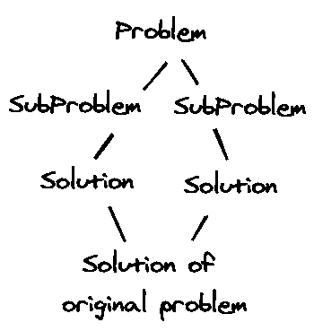
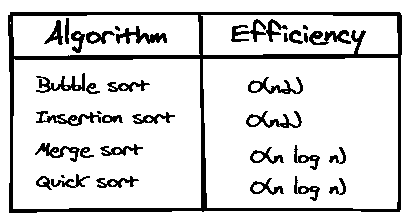

# 使用 Python 的一篮子排序算法

> 原文：<https://medium.com/analytics-vidhya/a-basket-of-sorting-algorithms-using-python-84a6c43f6aba?source=collection_archive---------12----------------------->


由[苏拉娅·欧文](https://unsplash.com/@traxing?utm_source=medium&utm_medium=referral)在 [Unsplash](https://unsplash.com?utm_source=medium&utm_medium=referral) 拍摄的照片

“排序”本质上是指“按升序排序”，除非另有说明。

> 排序算法能够做多种不同寻常的事情，想象一下，一个人需要花多少时间来排序成千上万个名字的列表以制作电话簿，或者成千上万个食谱、档案、动物等的列表。

让我们创建一个要排序的数字列表作为示例！

`nums`:数字列表，如`[4, 2, 6, 3, 4, 6, 2, 1]`

## **1。冒泡排序**

之所以叫这个名字，是因为这里较小的元素*泡*到顶部，较大的元素*沉*到底部。

冒泡排序的核心操作是“比较”和“交换”。

```
def bubble_sort(nums):
    # Create a copy of the list, to avoid changing it
    nums = list(nums)

    # 4\. Repeat the process n-1 times
    for _ in range(len(nums) - 1):

        # 1\. Iterate over the array (except last element)
        for i in range(len(nums) - 1):

            # 2\. Compare the number with  
            if nums[i] > nums[i+1]:

                # 3\. Swap the two elements
                nums[i], nums[i+1] = nums[i+1], nums[i]

    # Return the sorted list
    return nums
```

## 2.插入排序

这里我们保持数组的初始部分排序，并在正确的位置一个接一个地插入剩余的元素。

```
def insertion_sort(nums):
    nums = list(nums)
    for i in range(len(nums)):
        cur = nums.pop(i)
        j = i-1
        while j >=0 and nums[j] > cur:
            j -= 1
        nums.insert(j+1, cur)
    return nums
```

为了更有效地执行排序，应用了一种称为**分而治之**的策略，其一般步骤如下:

1.  将输入分成大致相等的两部分。
2.  分别递归求解这两个部分的问题。
3.  合并结果以解决原始输入的问题。
4.  包括小的或不可分割的输入的终止条件。



上述策略的可视化表示

## 3.合并排序

```
def **merge_sort**(nums):
    *# Terminating condition (list of 0 or 1 elements)*
    if len(nums) <= 1:
        return nums

    *# Get the midpoint*
    mid = len(nums) // 2

    *# Split the list into two halves*
    left = nums[:mid]
    right = nums[mid:]

    *# Solve the problem for each half recursively*
    left_sorted, right_sorted = merge_sort(left), merge_sort(right)

    *# Combine the results of the two halves*
    sorted_nums =  merge(left_sorted, right_sorted)

    return sorted_nums
```

现在，如何合并两个排序后的数组呢？

为此，我们可以重复比较每个数组中最少的两个元素，并将较小的元素复制到一个新的数组中。

```
def **merge**(nums1, nums2):    
    *# List to store the results* 
    merged = []

    *# Indices for iteration*
    i, j = 0, 0

    *# Loop over the two lists*
    while i < len(nums1) and j < len(nums2):        

        *# Include the smaller element in the result and move to next element*
        if nums1[i] <= nums2[j]:
            merged.append(nums1[i])
            i += 1 
        else:
            merged.append(nums2[j])
            j += 1

    *# Get the remaining parts*
    nums1_tail = nums1[i:]
    nums2_tail = nums2[j:]

    *# Return the final merged array*
    return merged + nums1_tail + nums2_tail
```

## 4.快速排序

这是另一种基于**分治**的排序算法，其工作原理如下:

1.  如果列表为空或者只有一个元素，则返回它。已经整理好了。
2.  从列表中选择一个随机元素。这个元件被称为*枢轴*。
3.  对列表重新排序，使值小于或等于透视值的所有元素位于透视值之前，而值大于透视值的所有元素位于透视值之后。这个操作被称为*分区*。
4.  pivot 元素将数组分为两个部分，通过递归调用 quicksort 可以对这两个部分进行独立排序。

```
def **quicksort**(nums, start=0, end=None):
    *# print('quicksort', nums, start, end)*
    if end is None:
        nums = list(nums)
        end = len(nums) - 1

    if start < end:
        pivot = partition(nums, start, end)
        quicksort(nums, start, pivot-1)
        quicksort(nums, pivot+1, end)

    return nums
```

下面是 partition 的一个实现，它使用列表的最后一个元素作为支点:

```
def **partition**(nums, start=0, end=None):
    *# print('partition', nums, start, end)*
    if end is None:
        end = len(nums) - 1

    *# Initialize right and left pointers*
    l, r = start, end-1

    *# Iterate while they're apart*
    while r > l:
        *# print('  ', nums, l, r)*
        *# Increment left pointer if number is less or equal to pivot*
        if nums[l] <= nums[end]:
            l += 1

        *# Decrement right pointer if number is greater than pivot*
        elif nums[r] > nums[end]:
            r -= 1

        *# Two out-of-place elements found, swap them*
        else:
            nums[l], nums[r] = nums[r], nums[l]
    *# print('  ', nums, l, r)*
    *# Place the pivot between the two parts*
    if nums[l] > nums[end]:
        nums[l], nums[end] = nums[end], nums[l]
        return l
    else:
        return end
```

这里的关键观察是，在划分之后，pivot 元素在排序后的数组中处于正确的位置，并且数组的两个部分可以就地独立排序。

以上算法的效率总结→



因此，排序算法是基于应用和该应用所需的效率来选择的。