# 胸痛的贝叶斯方法

> 原文：<https://medium.com/analytics-vidhya/a-bayesian-approach-to-chest-pain-ad2e41131d05?source=collection_archive---------6----------------------->

# 1.介绍

胸痛是一种常见的主诉，有多种情况可以导致胸痛，从预后良好的疾病到危及生命的情况。然而，将患者胸部疼痛的经历转化为特定的病理继续困扰着临床医生的工作量。错误诊断的后果有时是严重的；将心脏病误诊为轻微的肌肉骨骼疼痛可能意味着死亡。因此，面临的挑战是及时确定一个非常危险的原因，但另一方面，避免不必要的测试和转诊。

不幸的是，医生经常依靠模式识别来得出正确的诊断。然而，这并不总是可靠的，因为许多病例最初可能以不常见的方式出现。临床医生在看似无害的胸痛中遇到意外的心肌梗死诊断可以证实这一点。这种诊断问题的解决方案是采用更系统的贝叶斯方法，在做出最终决定之前纳入多种因素。

## 1.1 贝叶斯定理

贝叶斯定理是一个描述事件概率的公式，它基于可能与事件相关的条件的先验知识。它简单地遵循条件概率的公理，但可以用于对涉及信念更新的广泛问题进行强有力的推理，如医疗诊断。数学上表述如下:

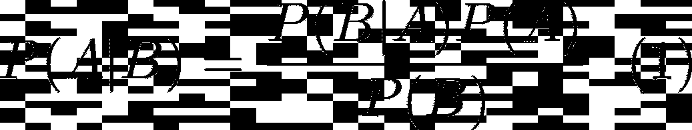

贝叶斯定理。

其中 A，B 是事件，P(A)，P(B) ≠ 0 是观测到 A 和 B 的概率，而 P(A|B)和 P(B|A)分别是给定 B and B 给定 A 的条件概率。
虽然这是一个适用于事件 a 和 b 的任何概率分布的等式，但在 a 代表假设 h(或多个假设 Hᵢ)而 b 代表一些观察数据 d 的情况下，它有一个特别好的解释。在这种情况下，公式(分别针对一个或 n 个假设)可以写成:

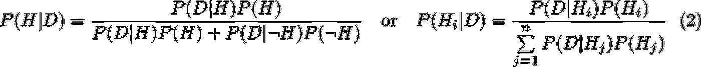

贝叶斯定理的另一种形式。

其中，P(Hᵢ|D 是假设 I 的后验概率，给定数据，P(D|Hᵢ是在假设 I 下观察到数据的可能性，P(Hᵢ是假设 I 的先验概率。分母包括观察到针对每个假设(即，分别为 2 或 n)划分的数据的可能性，并用作归一化常数。

## 1.2 问题表述

贝叶斯定理的后一种形式对于同时检验多个假设特别有用。我们将此应用于研究胸痛鉴别诊断过程中出现的挑战。具体来说，我们将尝试回答以下情景:“一名男性患者以胸痛为主诉。他心肌梗塞的概率有多大？一般来说，患心血管、呼吸系统等疾病的可能性有多大。，疾病？此外，女性患者的这些诊断会有什么变化？那种情况下对应的概率是多少？”本报告将试图以简明易懂的方式解决这些问题，并解释这一方法背后的基本概念。

# 2 种方法

## 2.1 以前的分配

首先，我们为一个有胸痛症状的病人创建了 30 个不同的假设。我们假设这些假设是互斥的(即，如果一个是真的，其他的一定是假的)并且是穷尽的(即，所有的假设合在一起，描述了所有可能的结果)。例如，在我们的模式中，胸痛患者将从这 30 个诊断中得到一个(且只有一个)诊断。然后，我们构建一个先验分布，认为每一个假设都有同等的可能性。因此，每个诊断将具有相等的(1/30)概率，并且所得的分布将不提供信息。为了更好地表示现有的知识，我们还创建了两个信息性的先验分布，每个分布反映了不同的人群。特别是，我们为在普通诊所(GP)出现胸痛的患者和在急诊科(ED)出现胸痛的患者构建了一个先验分布。以前的研究表明，这些人群有很大的不同，因此，他们应该分开研究。为了实现这一点，我们基于我们的直觉和先验知识，在全科医生和 ED 中创建了 1000 次虚拟访问。每次访问都有一个最终诊断，然后用于计算相应的概率。例如，我们在全科医生 1000 次就诊中观察到 50 次心肌梗死，导致概率为 0.05。由于篇幅所限，我们根据 30 个诊断所属的生物系统(如心血管、呼吸等)将它们分为 6 类。).补充 Excel 文件中显示了这些分布的摘要。图 1 清楚地展示了三种先验分布之间的差异。我们观察到，心血管疾病是急诊科最常见的疾病，而肌肉骨骼疾病在全科医生中也很常见。此外，精神疾病或其他各种原因并不常见，这与无信息分布所显示的情况相反。因此，为我们正在研究的问题创建和选择合适的先验分布是至关重要的，因为它将直接影响我们的结果。

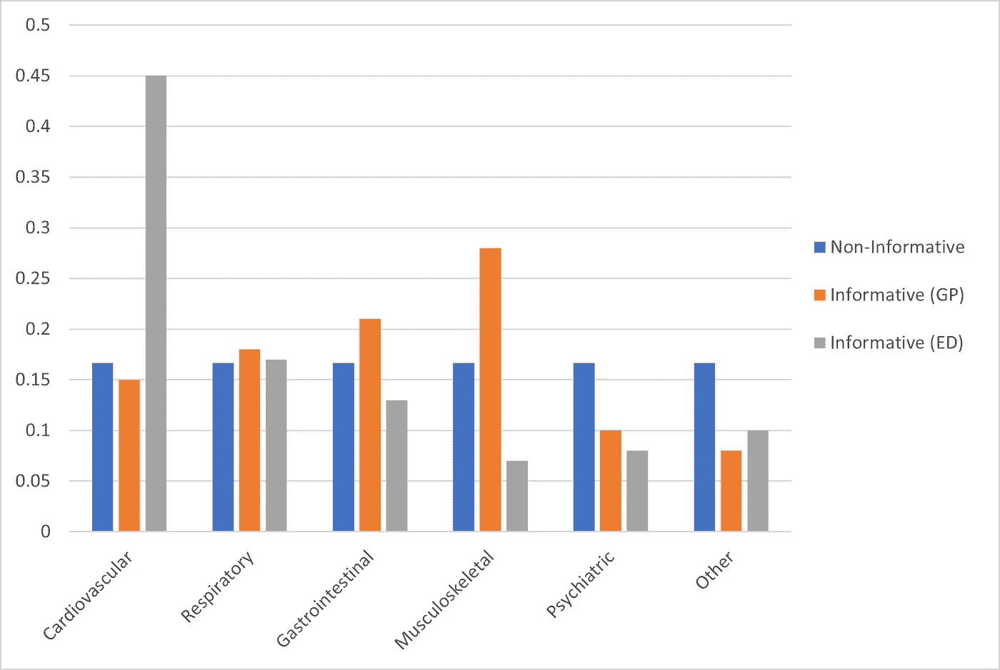

图 1:胸痛患者的先验分布。

## 2.2 可能性计算

在构造了适当的先验分布后，我们需要计算在每个假设下观察到数据的可能性，正如我们从等式 7 中看到的。2.这并不总是一件容易的事情，尤其是对于许多离散的假设，或者更糟的是对于连续的假设。在我们的案例中，我们使用来自 22304 次访问的数据将它们分成一个独特的诊断，并确定其中有多少是男性患者。然后我们可以计算在每个可能的假设下成为男性的可能性[P(Male | Hi)]；将男性患者人数除以每次诊断的总就诊人数，即可得出预期结果。此外，为了更清楚地说明，我们像以前一样将诊断分为 6 类。这种计算的另一个好处是，我们还可以在每种可能的情况下得出女性的可能性，因为这些事件是互补的(即患者可以是男性或女性)(图 2)。在下一节的分析中，我们使用这个事实作为最后的比较。首先，我们把注意力集中在一个男性患者出现胸痛的最初问题上。所有由此产生的可能性计算可以在附带的 Excel 文件中看到。我们观察到所有可能性的总和不等于 1。这种结果是意料之中的吗？此外，我们可以使用每个假设的可能性除以所有可能性的总和作为新的可能性吗？这些是在处理这类问题时经常出现的问题，应该加以考虑。在完成下一节的分析后，我们试图回答这些问题。

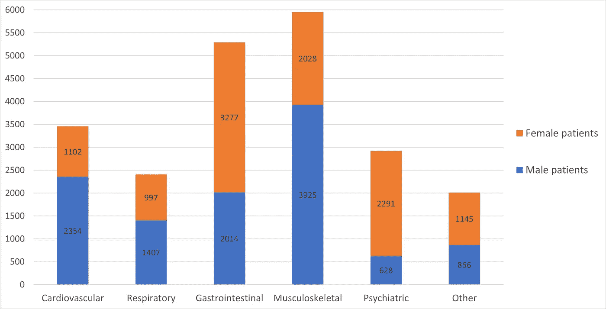

图 2:每个诊断类别的胸痛就诊。

## 2.3 后验分布

我们现在根据计算的可能性和我们定义的先验分布来计算后验分布。由于篇幅有限，我们将把结果分成 6 个有代表性的类别进行演示。每个诊断和类别的完整结果可以在相应的 Excel 文件中看到。

# 3 个结果

在本节中，我们将展示我们的分析结果。首先，我们说明按照我们描述的过程后构造的后验分布。特别地，图 3 示出了由我们使用的非信息先验产生的后验分布。在这种情况下，数据显示，大多数胸痛的男性患者患有心血管、肌肉骨骼或呼吸系统疾病的可能性较高。观察数据后，这些情况的后验概率增加。因此，我们观察到后验概率主要遵循似然的趋势；因此，它是数据驱动的。然而，尽管男性患者对心血管和肌肉骨骼疾病有强烈的偏见，但由此产生的概率与最初的概率没有实质性的差异。

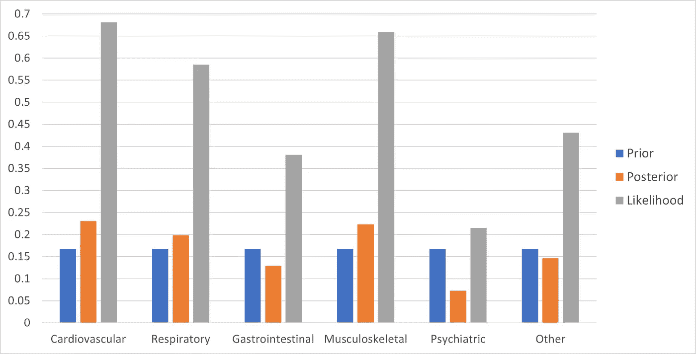

图 3:具有非信息先验的后验分布。

另一方面，图 4、5 示出了每个设置的不同后验分布。具体来说，GP 的先验概率主要是肌肉骨骼疾病。同样，数据显示大多数男性患者患有心血管、呼吸或肌肉骨骼疾病(即，他们的可能性更高)。在观察数据之后，这三个的后验概率增加了(后者更多)。由此可见，在全科医生那里出现胸痛的男性患者患肌肉骨骼疾病的可能性大大增加。相比之下，胃肠道疾病在全科医生中很常见，但更经常影响女性患者；因此，男性患者由于这种情况而出现胸痛的可能性通常较低。急诊病人的分布也有很大差异。特别是，在医疗机构中，胸痛主要由心血管疾病引起(图 5)。由于这个原因，已经处于心血管疾病风险中(即，高可能性)的男性患者将很可能面临这样的诊断。相比之下，男性患者患肌肉骨骼疾病的可能性增加只会轻微改变其后验概率。在这种情况下，先验的形状有很大的影响，并以主要的方式驱动后验分布。

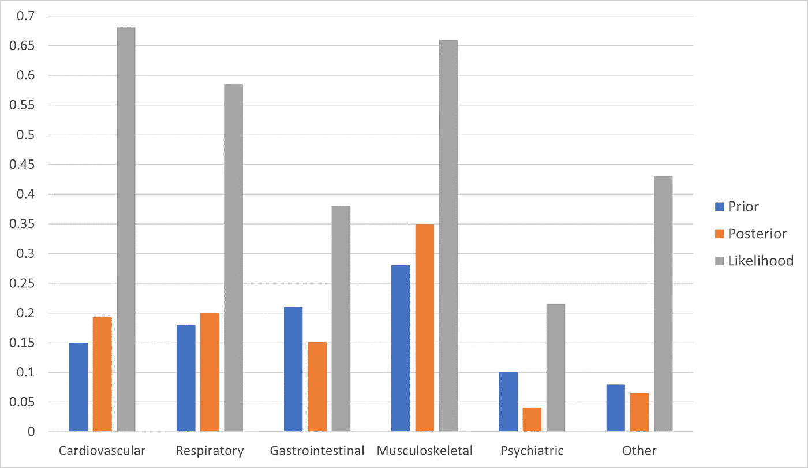

图 4:具有信息先验(GP)的后验分布。

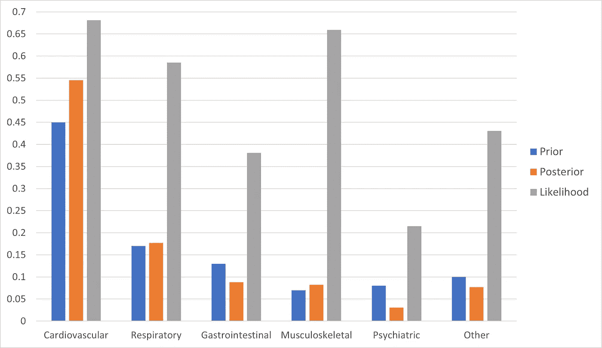

图 5:先验信息丰富的后验分布。

图 6 进一步显示了上述后验分布之间的差异。在评估后验分布时，我们确认了性别(男性患者)和医疗环境(GP、ED)的重要性。当男性患者出现胸痛时，应首先考虑心血管和肌肉骨骼疾病。另一方面，精神病学和其他各种原因引起的胸痛在男性患者中相当少见。最后，我们提供了两种性别后验分布的直接比较(图 7)。我们选择只比较那些涉及非信息先验的，以更好地捕捉可能性形成后验的概念。我们注意到，女性患者在出现胸痛时，更容易患胃肠疾病、精神疾病或其他疾病。我们还证实，可能性主要驱动每个后验分布。事实上，通过比较图 2 和图 7，很明显是这种情况，因为它们展示了非常相似的趋势。

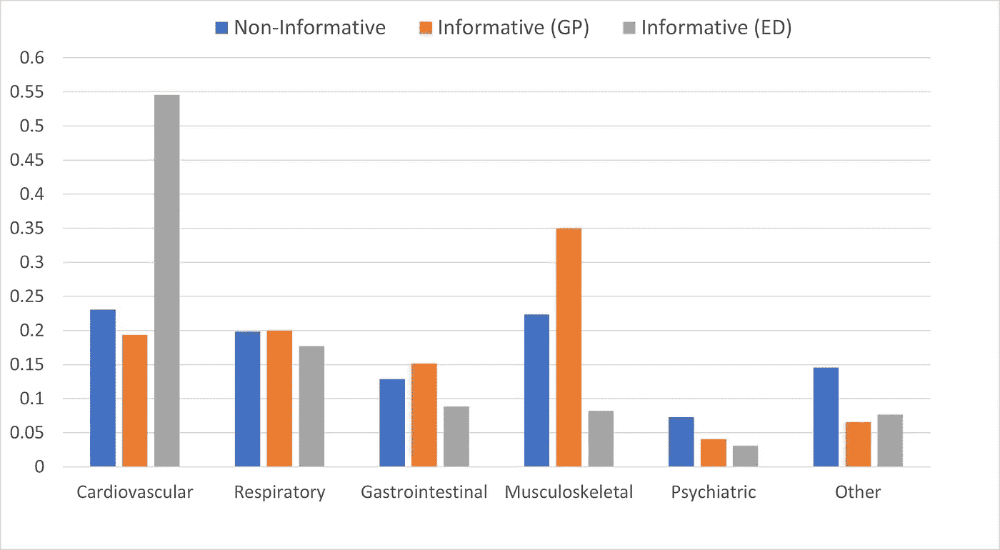

图 6:出现胸痛的男性患者的后验分布。

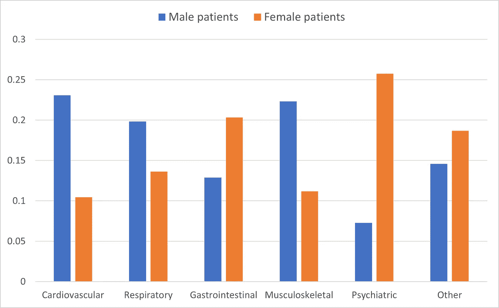

图 7:无信息先验的男性/女性患者的后验分布。

# 4 讨论

总结我们的结果，一个无信息的先验为每个假设提供了相等的概率，并允许后验仅由可能性来决定。在我们的分析中，我们用两种方式证明了这一点。关于这两个信息丰富的先验分布，我们也注意到有趣的结果。在第一个病例(GP)中，我们观察到男性患者患心血管和肌肉骨骼疾病的概率增加。这与男性患者增加的先验和增加的可能性是一致的。因此，先验和可能性都对结果有贡献。另一方面，在急诊科的介绍提供了一个独特的画面。具体而言，虽然上述三种疾病的可能性仍然很高，但由此产生的概率仅在心血管疾病方面有显著差异。另外两个只是略有增加。因此，在这种医疗保健环境中，先验知识在很大程度上驱动了后验知识。此外，在第 2.2 节中，我们提出了以下问题:

*   我们观察到所有可能性的总和不等于 1。这种结果是意料之中的吗？
*   我们可以用每个假设的可能性除以所有可能性的总和作为新的可能性吗？这个比例定义了什么有意义的东西吗？

其实这个结局是意料之中的。正如我们在 Excel 文件的相关表格(图 8)中看到的，所有可能的可能性之和(例如 2.95)不等于 1，但是每个条件的可能性分别加起来等于 1。这两个观察事实上回答了我们的问题。具体来说，当我们对每个诊断的可能性求和时，我们是对来自不同概率空间的概率求和。因此，结果不必是 1；它可以小于或大于 1。从形式上来说，P(D|Hᵢ概率不是 Hᵢ的分布，而只是 d 的分布。在我们的例子中，数据是患者的性别—男性或非男性(即女性)—在这个轴上求和得到的预期结果是 1。

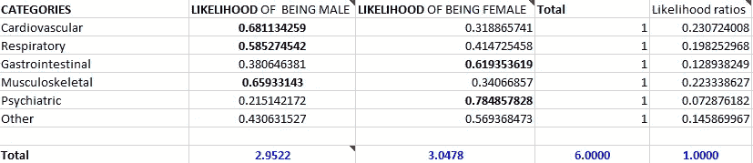

图 8:取自 Excel 文件的可能性示例。

关于第二个问题，有两个事实需要注意。首先，如果我们将每个假设的可能性除以所有可能性的总和，并将所得的可能性作为新的可能性，结果将是相同的。唯一的区别是，当我们执行归一化过程时，可能性总计为 1。我们可以如下正式证明这一点:让我们分别表示为 Lᵢ = P(D|Hᵢ)、Pᵢ = P(Hᵢ)每个假设 Hᵢ下的似然性和先验概率。此外，我们定义 s 为所有可能性的总和，L'ᵢ = Lᵢ/S 为新的可能性。那么每个假设 Hᵢ的新后验概率等于:

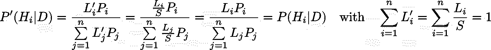

这就回答了第二个问题的第一部分。最后，比率 L'ᵢ = Lᵢ/S 也定义了一些有意义的东西。特别地，当所有假设具有相同的先验时(即，当我们使用非信息先验时)，它们代表每个假设的后验概率。事实上，如果每个假设的所有先验概率都等于某个常数 c (Pᵢ = c ),那么假设 Hᵢ的后验概率就是:

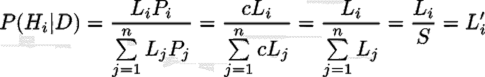

这是我们定义的新的可能性。实际上，这进一步说明了这样一个事实，当我们使用非信息先验分布时，可能性驱动后验分布。如果我们只是利用数据，这正是我们得到的。

# 5 结论

总之，本案例研究概述了贝叶斯定理是如何工作的，以及如何将其应用到医学诊断中。具体来说，贝叶斯定理提供了一个扩展的、系统的框架来处理涉及信念更新的复杂问题。医学是一个涉及此类问题的领域，需要综合多种因素才能做出最终决定。因此，理解贝叶斯推理的基础概念，它的好处和挑战，必将为它更准确和更广泛的应用铺平道路。当患者符合模式时，模式识别可以很好地执行。如果没有，就需要一个基于概率论的更正式、更系统的方法。这就是贝叶斯定理所提供的。

# 6 补充材料

PDF 报告和附带的 Excel 文件可在 [Github](https://github.com/VKonstantakos/MSc_Data_Science/tree/main/Large-scale%20statistical%20methods/Bayes'%20Theorem) 上获得。