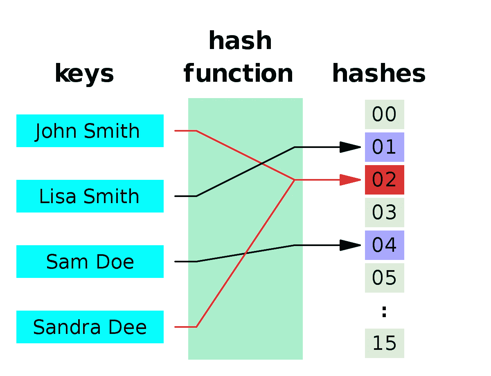

# 大数据初学者指南:第 1 部分

> 原文：<https://medium.com/analytics-vidhya/a-beginners-guide-to-big-data-part-1-a24d3a7bbe6c?source=collection_archive---------9----------------------->

最近，我开始参加大学的大数据讲座，发现教授的每一句话都是我要破解的神秘代码。一句话中的许多技术术语对我来说毫无意义，直到我决定成为艾伦·图灵来破解句子中的信息，以免被发现在课堂上睡觉！除了笑话，今天的帖子讨论了人们需要熟悉的术语，以便在大数据方面有一个良好的开端。我会从简单的开始，这样你就不会回避这篇文章。

**集群**

就像一群工作人员比一个工作人员用更少的时间完成一项工作一样，一群计算机比一个工作人员执行更快的计算。集群是一组计算机，称为节点(类似于图中的节点)，通过网络连接，由软件控制和调度。每台计算机/节点大部分时间都有相同的操作系统和硬件。然而，人类因打破他们制定的规则而臭名昭著。一组计算机，每个使用不同的操作系统，分布在不同的地理位置，被称为**网格。**就像一群工人有一个按照公司规则指导他们的主人一样，节点可以根据其执行的任务分为工人和主人或客户端和服务器。服务器管理任务，任务分布在客户机上完成。随着团队的成长，它变得更有效率，但很难管理。同样，随着群集中节点数量的增加，管理变得更加高效和复杂。你可以找到小的树莓派计算机集群到像 IBM Sequoia 这样的大集群。

左:树莓派集群右:IBM 红杉

**哈希和排序的双重性**

这个术语还有一个我不熟悉的术语，Hash！在继续之前，我给你出个问题。对以下数组进行排序:9，2，3，6，7！我知道你跳到了合并排序。然而，还有一个更好的解决方案。创建一个长度为 9 的数组，该数组存储数组中元素的出现次数，现在从数组的开始处移动，打印值为非零的索引。请注意，这个技巧使用了(key，value)思想，其中键是数组中的元素，值是具体值。Hash 只是一个将键映射到其值的函数。大多数情况下，它用于降低输入的维数。

观察上面例子中的一些要点:对于这样一个小例子，hash 排序方式需要大空间(长度为 9 的数组)和小计算量( *O(n)* )。相比之下，归并排序需要的空间小，计算量大( *O(nlogn)* )。

散列和排序状态的二元性在输入/输出行为方面是等价的。越过头顶，对吗？？我来简化一下。在合并排序中，你有效地做的是划分数组，排序数组的每个部分，然后组合它，直到你得到排序后的数组。在散列过程中，将输入键分组到一个散列表中，对每个组进行排序，并输出每个组，得到排序后的数组。简而言之，两者互为镜像。

排序—划分、排序和组合

哈希—组合、排序和划分

散列函数

**地图缩小**

它是一种编程模型，使用并行分布式算法来利用集群的能力。想象一下在一个大的非结构化字典集中查找一个单词(其中单词没有按字典顺序排列)。如果你有四个朋友和一本字典，你会得到与个人搜索一个单词相同的数量。但是，如果你有四个相似的字典，你可以在朋友之间划分页面，以将搜索时间长度减少到以前的四分之一。没有并行化的分布式算法，就无法利用集群的能力。

Map-reduce 框架由三个步骤组成:

1.  Map-Map 是一个用户定义的函数，它接受一系列键-值对，并处理每个键-值对以生成零个或多个键-值对。
2.  无序播放和排序—无序播放映射函数的输出，以便将具有相同键的键值对组合在一起。
3.  Reduce —组合每个组键值对以生成输出。

下图总结了每个步骤的说明。

地图-洗牌-缩小

这里重要的一点是，*减少*操作只有在所有*映射*操作完成后才开始。为此，map-reduce 遵循**屏障同步。**为了理解障碍同步，想象你和你的朋友要去旅行。在到达机场之前，你们决定在一个地方见面。第二天，无论谁来到那个地方，都要等到其他人都到了。当你和你所有的朋友都在那里时，你就计划继续前进。所以你的旅行是由那个地方同步的，由于它限制了其他人进一步移动，直到所有人都到达，所以它被称为障碍同步。

映射和缩减步骤都是无状态的，这意味着每个映射器和缩减器都是相互独立的。因此，如果其中一个映射失败，服务器可以分配另一个新的映射来执行任务。这是分而治之原则的典型例子。Map-reduce 避免过多内存优化其可伸缩性。由于它的无状态操作，可以通过添加更多的机器(计算机)来扩展集群。它提供对每个节点的监控和状态更新。简而言之，它提供了自动并行化或简单的可伸缩性、容错和监控。

对于深度视图:

**功能编程**

它是一种编程范式，其中函数定义是将值映射到其他值的表达式树，而不是更新程序运行状态的命令性语句序列。函数式编程中的一个关键概念是可以将函数作为参数传递，并将它们作为值返回。这个概念叫做一级函数。您经常在 python 中使用这种范式，其中使用了一级函数的概念。如果代码遵循这种范式，调试会更容易。

**大数据**

最后，整个讨论中的首要项。我把它包括在讨论中的原因是我的教授给它下的定义。如果你在谷歌上搜索，你可能会发现，大数据是一个 3v——容量、速度和多样性，或者是架构或技术。但是定义会随着时间的变化而变化，记住当前的时间，我们可以将大数据定义为遵循“所有数据、所有时间和所有方法”座右铭的设计原则。简而言之，获取在任何时间用任何方法产生的所有类型的数据。

希望你喜欢这个帖子。觉得有用就分享一下。