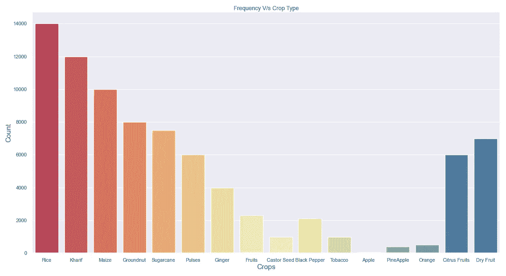

# 描述统计学入门指南——第一部分

> 原文：<https://medium.com/analytics-vidhya/a-beginners-guide-to-descriptive-statistics-part-i-9c7ba68459e8?source=collection_archive---------20----------------------->

Patrick Fore(@ Patrick Ian 4)| Unsplash 图片社区

数据科学家的关键角色是根据统计观察做出决策。由统计上可靠的见解支持的论点可以产生更好的结果，因为数据科学家经常需要根据他/她的见解部署关键应用程序。*例子* —一种新疫苗。因此，在这个特定的系列文章中，我将详细阐述描述性统计。

# 数据类型

照片由[桑帕斯·贡努鲁](https://www.linkedin.com/in/sampathgonnuru/)拍摄

## 定性数据(名义数据和序数数据)

> 定性或分类属性是那些使用有限的离散类集合来描述所考虑的对象的属性

照片由 [Sampath Gonnuru](https://www.linkedin.com/in/sampathgonnuru/) 拍摄

## 如何描述定性数据？

分类数据的一个典型特征是数据中的值不断重复。描述定性数据的一个好方法是使用

*   频率图
*   相对频率图
*   分组相对频率图

**频率图**

*   横轴:分类属性的值
*   纵轴:这些值的计数
*   条的高度与计数成正比

种植作物与计数的示例

作物与计数

一个好的做法是按照计数对值进行排序，以便更好地可视化。

**相对频率图**

相对频率比绝对频率更容易解释。这是因为当我们能够用百分比来表示数字时，我们人类在分析和理解数字方面要好得多。

我没有提及在 Instagram 上发送的消息数量，而是使用了相对频率图的方法来比较我一周内交换的消息的百分比。

**分组相对频率**

当我们想要 ***比较不同类型的数据*** 时，这是一个很好的绘图

这里每个条形对应一个集合。通过这种方式，我可以比较 2000 年至 2015 年间每个国家的 GDP，还可以比较某个国家(如中国)和其他国家(如美国)的 GDP。

## 定量数据(连续和离散)

数量数据是那些有数值的数据，用来计算或测量群体的某些特性

照片由 [Sampath Gonnuru 拍摄](https://www.linkedin.com/in/sampathgonnuru/)

## 如何描述量化数据？

处理定性数据时的主要问题是不同类别出现的频率是多少？这个问题对定量数据有意义吗？因此，为了回答这些问题，我们使用直方图。因为在定量数据中，我们处理离散和连续的数据，这些数据用直方图表示更好。

**直方图**

*   ***x 轴上的值现在是数字*** 而不是类别
*   x 轴上的值 有一个 ***自然排序***
*   ***按值*** 而不是频率排序

**问题**

*   绘制唯一值时有太多值

**解决方案**

*   将值分组到 ***箱***
*   现在，每个 bin 将显示其中所有值的 ***和*** 的频率总和

**直方图(什么是合适的箱大小—类间隔)？**

*   通常情况下，5-10 倍被认为是一个好的箱大小。有时，当我们增加 bin 的大小时，粒度会受到很少细节的影响
*   类间隔或 bin 大小也取决于 ***范围内的数据***
*   您也可以使用交互式直方图来快速[找到最佳直方图](https://towardsdatascience.com/how-to-quickly-find-the-best-bin-width-for-your-histogram-4d8532f053b0)

> 理想的箱子大小揭示了有意义的模式(既不隐藏也不揭示太多细节)

**相对频率直方图**

当想要比较不同的数据集时，相对直方图是有用的

**绘图程序**

*   按升序对值进行排序
*   选择类间隔，以便覆盖所有值(特别是，应覆盖最小值和最大值，如果有一些间隔没有值也没关系)
*   计算每个间隔的相对频率

*   每个音程的拉杆(使得杆的高度与上一步计算的相对频率成比例)

**比较多个直方图**

**选项 1:**

*   绘制单独的直方图并进行比较

***缺点—*** 难以比较和形象化

**选项 2:**

*   在一个图中绘制所有直方图

***缺点—*** 难以区分各个直方图

**选项 3:**

*   绘制分组条形图

***劣势—*** 很难看出每个玩家的整体趋势

**选项 4:**

*   使用频率多边形

**频率多边形**

*   这些更容易看到和比较不同数据的总体趋势

## 直方图的目的和典型趋势

直方图可以回答以下问题

*   数据中的值分布有多远？
*   一定区间密度高吗？
*   它会告诉您数据中是否有缺口(例如，是否有某些区间不包含任何数据)？
*   数据中有哪些异常值(即与典型值相差甚远的值)？

**柱状图中的标准模式或趋势**

**左偏—** 大部分**短条**朝向直方图的**左侧**

**右偏直方图** —大部分**短条**朝向直方图的右侧

****对称直方图—** 条几乎是彼此关于垂直中线的**镜像****

****

## **描述变量之间的关系**

*   **大多数数据集包含给定对象的几个属性**
*   **我们通常期望属性之间的某种关系，如
    *得分= f(击球面)
    *作物总产量= g(总面积)
    *价格= h(大小)**
*   **单个直方图没有揭示这种关系**
*   **为了回答这些问题，我们使用**散点图****

****散点图****

*   **不适用于定性变量**
*   **可用于**离散定量**变量**
*   **可用于**两个连续的**变量**
*   **可用于**一个连续一个离散的**变量**

****柱状图中的典型趋势****

*   **线性关系→y=mx + c**
*   **二次关系→ y = ax**
*   **指数关系→ y = e^x**
*   **没有明确的关系**

****

## **摘要**

**因此，基于您正在处理的数据类型，无论是定性的(标称的或有序的)，定量的(离散的或连续的)，使用各自的图和图表将帮助您获得更优化的洞察力。**

****

**希望你喜欢阅读这篇文章。在我的下一篇文章中，阅读所有关于中心性的测量。**

***如果有，一定要* *关注我上* [*领英*](https://www.linkedin.com/in/sampathgonnuru/) *。查看我的* [*网站*](https://gonnuru.github.io/#/) *或者我的其他一些作品* [*这里*](https://github.com/gonnuru) *。***

**参考**

**[1] [熊猫图形用户界面| bamboo lib(8080labs.com)](https://bamboolib.8080labs.com/)**

**[2] [在简单步骤+斯特奇法则中选择直方图的箱尺寸——统计指南](https://www.statisticshowto.com/choose-bin-sizes-statistics/)**

**[3] [描述性统计定义(investopedia.com)](https://www.investopedia.com/terms/d/descriptive_statistics.asp)**