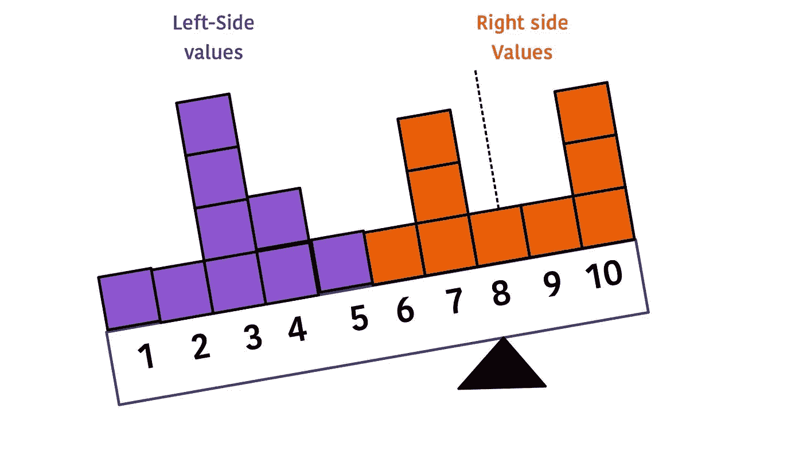
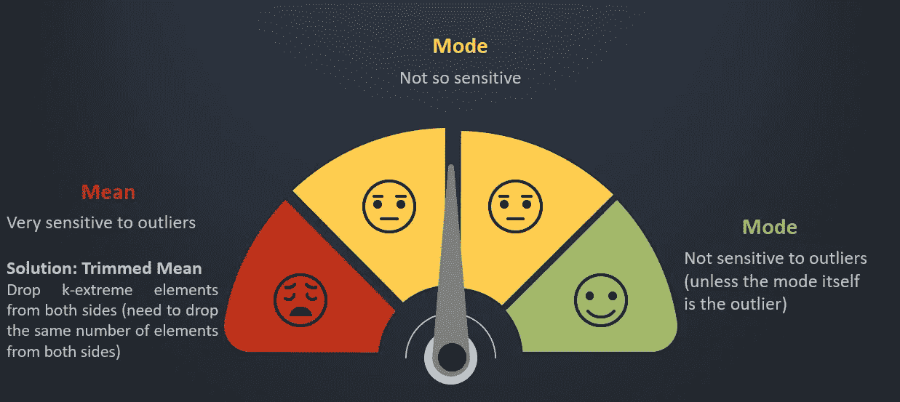

# 描述统计学入门指南——第二部分

> 原文：<https://medium.com/analytics-vidhya/a-beginners-guide-to-descriptive-statistics-part-ii-34dc6697ec02?source=collection_archive---------6----------------------->

杰斯·贝利在 [Unsplash](https://unsplash.com/) 上的照片

在我的[上一篇文章](https://sampathgonnuru.medium.com/a-beginners-guide-to-descriptive-statistics-part-i-9c7ba68459e8)中，我已经描述了各种类型的数据和用来描述这些数据的图表。在本文中，我们将了解中心性的度量。

# 为什么我们需要测量中心性和扩散性？

通常，在现实世界的应用中，我们可以访问大量的数据，例如。,

*   政府数据库
*   企业数据库
*   地理数据库

尽管图可以给出上述数据的很好的视觉摘要。在某些情况下，我们需要更简洁的摘要(比如，一个/几个数字)

**召回**

> 一个**参数**是被研究的整个群体的任何数字属性。
> 
> **统计量**是总体样本的任何数字属性(用作总体相应参数的估计值)

## 对定量数据使用汇总统计

1.  中心性的度量(平均值、中值、众数)
2.  百分位数(四分位数、五分位数、十分位数)
3.  传播度量(范围、IQR、方差、标准差)

# 中心性的度量

由 [Munro 工作室](https://unsplash.com/@universaleye?utm_source=medium&utm_medium=referral)在 [Unsplash](https://unsplash.com?utm_source=medium&utm_medium=referral) 拍摄的照片

均值、中值和众数被称为中心性的度量:旨在通过统计手段确定数据集中的中点。每个人做这件事的方式略有不同，可能会给出不同的答案。

**问题—数据集中某个属性的典型值是多少？**

## **的意思是**

*   数据中所有元素的总和除以元素总数
*   意思是重心
*   三个平均值中只有一个需要公式

其中，
x-bar =样本平均值
x1，x2，…xn = n 个数据点

## **中心性度量的特征**

点与平均值的**偏差定义为该点与平均值之间的差值。**

> 所有点与平均值的偏差之和为 0。

数据:x1，x2，x3，…。，xn
平均值:x-bar
偏差:Xi-x-bar

想象数字线是一个跷跷板，你的数据点是跷跷板上的权重，这些权重与 x-bar 的偏差成比例。

1.  让我们认为跷跷板的支点在 4 号

2.让我们把跷跷板的支点放在 8 号

跷跷板向右弯曲

3.当我们将支点移动到 6 时，没有一个数据点能够达到平衡。左侧值和右侧值是平衡的

平均值= 6.0 的平衡跷跷板

左侧的偏差=右侧的偏差

> 因此，平均值也被称为重心

## 中位数

Median 是对数据进行排序时，出现在数据中心的值。

*   当 ***n 为奇数*** 时，中值为 ***中心位置*** (或中点)的值
*   当 ***n 为偶数*** 时，中值为两个中心位置(或中点)的 值的 ***平均值***

## **模式**

众数被定义为数据集中出现频率最高的值。

*   **单一模式:**只有 1 个最频繁的值
*   **多种模式**:超过 1 个最常用值
*   **无模式:**所有值只出现一次

# 中心性度量对异常值的敏感性

非正式地，我们将离群值定义为远离数据中其他值的任何点。

# 不同类型分布的中心性度量？

照片由[作者](https://www.linkedin.com/in/sampathgonnuru/)拍摄

# 变换对中心性度量的影响

在现实世界的数据中，我们经常需要将现有的数据转换成另一种形式

*   **缩放:**(例如，千米到米)

*   **转移**:(例如，25 美元以上的订单一律降价 20 美元)

*   **缩放和移位:**(例如，温度单位为 F，温度单位为 C)

## 变换对平均值的影响

当我们执行缩放和移位变换时，平均值也会经历类似的变换。新的平均值将通过相同的常数 a 和 c 进行缩放和移动。

图片作者[作者](https://www.linkedin.com/in/sampathgonnuru/)

## 变换对中位数的影响

中间带的位置不会改变(它只是被缩放)

中位数-新= a *中位数+ c

## 变换对模式的影响

模式的缩放值将是新的模式

模式-新= a *模式+ c

在我的下一篇文章中。我将讨论关于分布的度量，百分位数，四分位数，四分位数间。

希望你喜欢阅读这篇文章。

*如果有，一定要* *关注我上* [*领英*](https://www.linkedin.com/in/sampathgonnuru/) *。查看我的* [*网站*](https://gonnuru.github.io/#/) *或者我的其他一些作品* [*这里*](https://github.com/gonnuru) *。*

参考

统计学如何做:对我们其他人的基本统计学！

[2] [中心性测量—概述|科学直接主题](https://www.sciencedirect.com/topics/computer-science/centrality-measure)