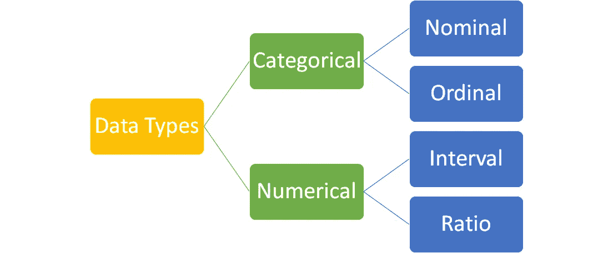
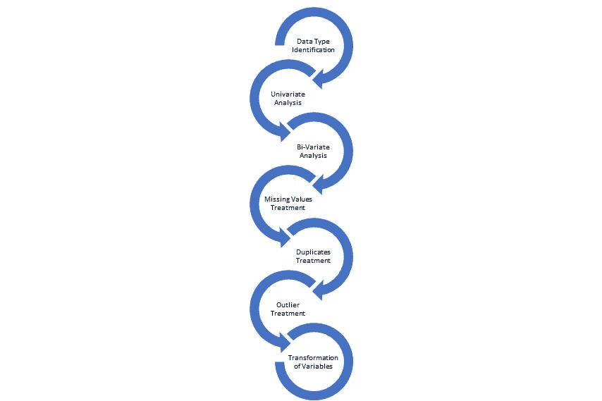
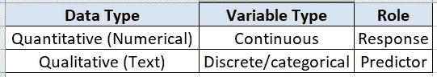
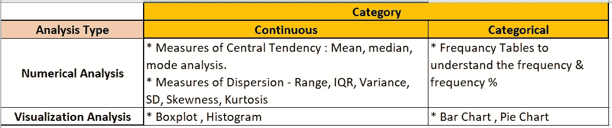
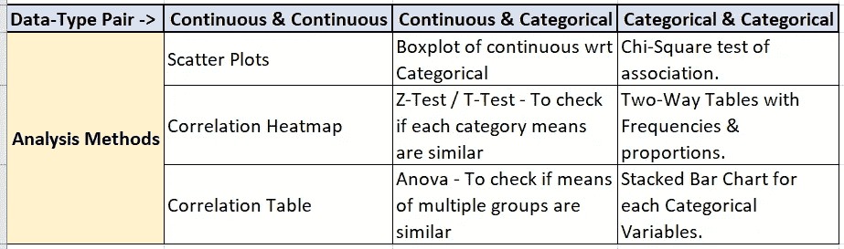
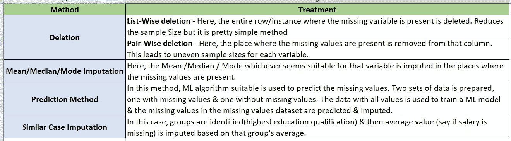
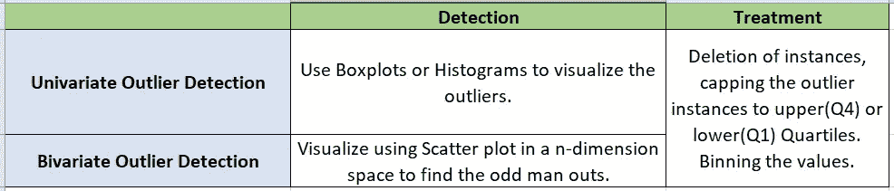
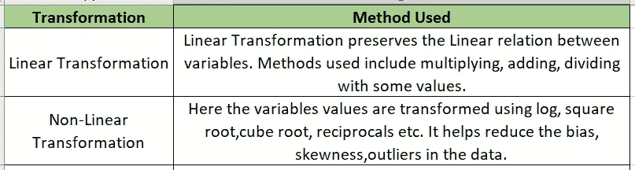

# 探索性数据分析(EDA)初学者指南

> 原文：<https://medium.com/analytics-vidhya/a-beginners-guide-to-exploratory-data-analysis-eda-c96b780f744d?source=collection_archive---------6----------------------->

探索性数据分析是数据分析/机器学习之旅中最重要的部分。在任何数据科学项目周期中，这通常需要大约 70%-80%的时间。数据探索、准备和理解是整个行业使用的标准方法的一部分，你可以在这里阅读我在 [CRISP-DM 上的博客。](/analytics-vidhya/crsip-dm-methodology-243b57a3d9b0)

理解数据类型是 EDA 的重要组成部分，因为它有助于我们了解在深入分析中对每种类型的数据应用什么样的统计方法。让我们简单了解一下数据类型。以下是数据类型。

数据类型

1.  **分类数据:**这是具有类别或特征的数据类型。可能是性别、种族、肤色、李克特等级等等。分类数据有两种类型。

a) *名义数据:*这里的数据是一些离散的&非量化的东西，比如性别、肤色、种族等。我们不能给它排名。

b) *有序数据:*这里的数据是离散的，但可以排序。例如李克特量表或教育背景、组织结构(助理、高级助理、经理..等等。).

2.**数值数据:**这是一种在本质上被称为定量的数据类型。有两种类型的数字数据。

a) *区间:*这里数据是有序的&我们可以计算两个数据点的差值。示例—温度。但是，这些数据点没有真正的 ***零*** 值。

b) *比率:*这里的数据类型也是有序的&与区间数据相同，但它有一个真零值。距离、重量等就是很好的例子。，不能为负&有真零。

现在我们知道了数据的类型，让我们看看执行 EDA 的步骤。

探索性数据分析的步骤

1.  ***数据类型标识:*** 结构化数据是以行&列的形式出现的。数据集中的列可以表示两种类型:预测器(输入)、响应(输出)，在监督学习模型中更是如此。在无监督学习的情况下，所有变量都充当要分组的输入。下表显示了数据识别类别。

分析变量。

2. ***单变量分析:*** 顾名思义，这是单个变量的分析。我们有两种变量，即连续的&分类变量。下面给出了每种数据类型的分析类型。

单变量分析

3. ***双变量分析:*** 这里我们分析一个数据集中任意两个变量之间的关系。了解这种关系对于目标变量或预测变量非常重要。这可以帮助我们了解可能导致我们在稍后阶段构建的模型性能出现不必要的噪声&降低的变量。分析取决于我们选择的数据类型对。

二元数据分析

4. ***缺失值处理:*** 数据集中的缺失值可能是由于数据不可用或人为错误造成的。考虑&处理任何数据集中的缺失值非常重要，因为它对模型性能至关重要。下表总结了处理缺失值的方法，

缺失值处理

5. ***重复值处理:*** 这里重复的实例只是从数据集中删除。重复会降低所创建模型的有效性。

6. ***异常值处理:*** 异常值是变量列中非自然的大值或低值。如果我们获取某个地区某些个人的净资产数据&并在收集的数据中发现异常高的价值，那么这可能意味着，这种特殊情况是指某个富商或高管居住在该地区。异常值不一定总是自然出现，也可能是数据录入时的笔误。找到下表，该表总结了异常值处理。

7. ***变量的变换:*** 为什么变换？我们并不总是以正确的形式得到变量。我们可能需要将它调整到一个共同的范围，或者减少列中的方差，使关系呈线性等等。让我们看看我们可以用来做同样事情的一些方法。

这是一个非常简短的总结，介绍了我们在从事任何数据科学项目时，如何为任何数据集进行 EDA。希望这篇文章对你有帮助。如果你觉得这篇文章有用，请鼓掌并分享。关注我更多文章。

*参考文献-*

*   [*https://www . analyticsvidhya . com/blog/2016/01/guide-data-exploration/*](https://www.analyticsvidhya.com/blog/2016/01/guide-data-exploration/)
*   [*https://towardsdatascience . com/data-types-in-statistics-347 e 152 E8 bee*](https://towardsdatascience.com/data-types-in-statistics-347e152e8bee)