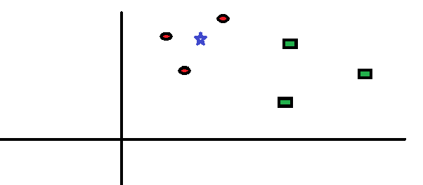
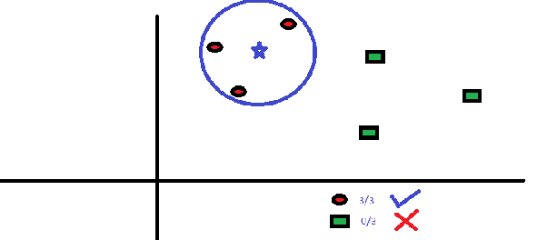
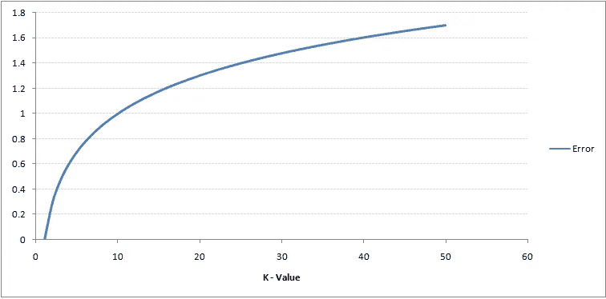
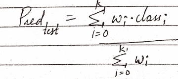
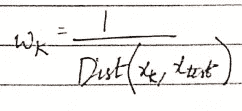
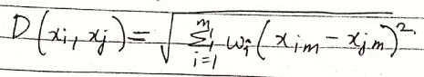
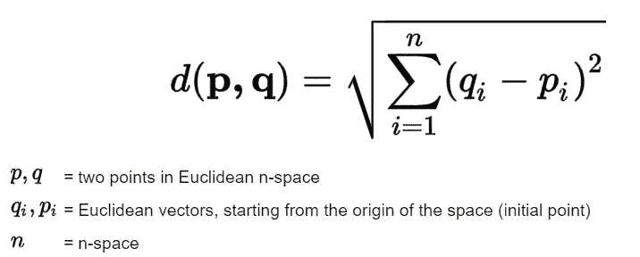
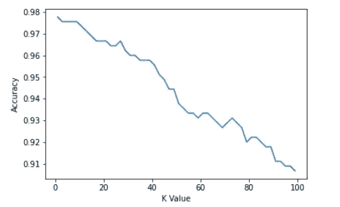

# 从头开始使用 KNN 识别 KNN 和 MNIST 手写数字的初学者指南

> 原文：<https://medium.com/analytics-vidhya/a-beginners-guide-to-knn-and-mnist-handwritten-digits-recognition-using-knn-from-scratch-df6fb982748a?source=collection_archive---------0----------------------->

*****【改良型国家标准技术研究院】*** *是计算机视觉事实上的“hello world”数据集。自 1999 年发布以来，这个经典的手写图像数据集一直是基准分类算法的基础。随着新的机器学习技术的出现，MNIST 仍然是研究人员和学习者的可靠资源。***

> ****最终目标是从数万张手写图像数据集中正确识别数字。****

****

**图片来源:维基百科**

**我们现在将尝试从 ***开始使用 ***KNN (K 近邻)算法*** 对数字进行分类。*****

> *在此之前，我们应该了解 KNN 到底是什么！*

# *什么是 KNN？*

****K 近邻*** 既可以用于分类，也可以用于回归。k-最近邻是一种简单的算法，它存储所有可用的案例，并根据相似性度量对新案例进行分类。*

****KNN*** 是一种*基于实例的学习*，或*懒惰学习*，其中函数只是局部近似，所有计算都推迟到分类。KNN 算法是所有机器学习算法中最简单的。*

*它是一种 ***非参数算法*** ，其中它不需要训练数据来进行推理，因此，由于所有显而易见的原因，与 ***参数学习算法*** 相比，训练快得多，而推理慢得多。*

# *KNN 到底是如何运作的？*

> *我们举一个简单的案例来理解这个算法。*

**以下是* ***红色圆圈【RC】****和* ***绿色方块(GS):****

**

*你打算找出蓝星的等级(BS)。BS 可以是 RC，也可以是 GS，不能是别的。KNN 算法中的“K”是我们希望进行投票的最近邻居。假设 K = 3。因此，我们现在将画一个以 BS 为中心的圆，其大小正好能在平面上仅包含三个数据点。*详见下图:**

**

*离某人最近的 3 个点都是 RC。因此，根据我们的 smart 置信度，我们可以说 bs 应该属于 RC 类别。这里，选择变得非常明显，因为来自最近邻居的所有 3 张选票都投给了 RC。在该算法中，参数 K 的选择极其重要。接下来，我们将了解得出最有效的 k 值需要考虑哪些因素。*

> ***注:**KNN 的一些假设——*

*   **当你有两个职业时，选择一个奇数的 K 值来避免平局。即，如果新的数据点正好在两个类之间，它不能决定使用哪一个。**
*   **K 不能是班级人数的倍数**
*   **如果 K 很小(过度拟合)，如果有很多数据点(n)* 将会不准确*
*   **如果 K 非常大(欠拟合)，K 一定不等于数据点数 n**

# *我们如何选择因子 K？*

> *首先，让我们试着理解 K 在算法中到底影响了什么。如果我们看到最后一个例子，假设所有 6 个训练观察值保持不变，利用给定的 K 值，我们可以制作每个类别的边界。*

**

*K 值的训练误差*

*如您所见，对于训练样本，K=1 时的错误率始终为零。这是因为最接近任何训练数据点的点是它本身。因此，当 K=1 时，预测总是准确的。如果验证误差曲线是相似的，我们选择的 K 应该是 1。*

**以下是 K 值变化时的验证误差曲线:**

**

*K 值测试/验证错误*

*这让故事更加清晰。在 K=1 时，我们过度拟合了边界。因此，错误率最初降低并达到最小值。在最小值点之后，它随 K 的增加而增加。要获得 K 的最佳值，可以将训练和验证与初始数据集分开。现在绘制验证误差曲线，以获得 K 的最佳值。K 的这个值应该用于所有预测，这类似于 [***肘方法***](https://en.wikipedia.org/wiki/Elbow_method_(clustering)#:~:text=In%20cluster%20analysis%2C%20the%20elbow,number%20of%20clusters%20to%20use.) ***。****

# *KNN 的伪代码*

> *任何人都可以按照下面给出的伪代码步骤实现 KNN 模型。*

1.  **加载数据**
2.  **初始化 k 的值**
3.  **为了得到预测的类别，从 1 迭代到训练数据点的总数**
4.  **计算测试数据与每一行训练数据之间的距离。这里我们将使用欧几里德距离作为我们的距离度量，因为它是最流行的方法。可以使用的其他度量是切比雪夫、余弦等。**
5.  **根据距离值将计算出的距离按升序排序**
6.  **从排序后的数组中获取前 k 行**
7.  **得到这些行中最频繁的类**
8.  **返回预测类**

# *KNN 变奏曲*

*正如我们所见，在传统的 KNN 中，我们对所有的等级和距离都给予同等的权重，这里有一个你应该知道的 KNN 的变体！*

## *距离加权 KNN*

*在距离加权 KNN 中，您基本上更强调接近测试值的值，而不是远离测试值的值，并同样为每个值分配权重。*

**

**其中 wk 为—**

**

## *加权距离函数*

*既然我们已经在传统的 KNN 中给了我们所有的特征相同的权重，那么让我们在这个变体中给每个特征分配不同的权重。重要的特征将具有较大的权重，而不太重要的特征将具有较低的权重，最不重要的特征将具有 0 或接近 0 的权重。*

**

# *测量距离的方法*

*   ****闵可夫斯基距离****
*   ****曼哈顿距离****
*   ****欧几里得距离****
*   ****海明距离****
*   ****余弦距离****

****曼哈顿距离*** 在数据存在高维度时，通常优先于更常见的 ***欧氏距离*** 。 ***海明距离*** 用于度量分类变量之间的距离，而 ***余弦距离*** 度量主要用于发现两个数据点之间的相似程度，而 ***闵可夫斯基*** 是欧几里德距离和曼哈顿距离在更低层次上的推广。*

> *关于这方面的更多信息，请查看机器学习中使用的不同类型的距离度量[](/@kunal_gohrani/different-types-of-distance-metrics-used-in-machine-learning-e9928c5e26c7#:~:text=Manhattan%20distance%20is%20usually%20preferred,similarity%20between%20two%20data%20points.)****。*****

# ***从头开始实施***

****您最初需要导入的库:****

```
***import numpy as np
import operator 
from operator import itemgetter***
```

****让我们先定义一个函数，返回两点之间的* [***欧氏距离***](https://en.wikipedia.org/wiki/Euclidean_distance)*:****

******

***图片来源:Science Direct——欧几里德距离公式***

```
***def euc_dist(x1, x2):
    return np.sqrt(np.sum((x1-x2)**2))***
```

****现在，让我们写一个类“KNN”，并为****【K】值:*** 初始化一个实例***

```
***class KNN:
    def __init__(self, K=3):
        self.K = K***
```

****让我们添加另一个函数到我们的类中，它初始化实例来适应我们的训练集——X-train 和 y-train:****

```
***class KNN:
    def __init__(self, K=3):
        self.K = K
    def fit(self, x_train, y_train):
        self.X_train = x_train
        self.Y_train = y_train***
```

****现在让我们将预测函数添加到这个类中:****

```
***def predict(self, X_test):
    predictions = [] for i in range(len(X_test)):
        dist = np.array([euc_dist(X_test[i], x_t) for x_t in   
        self.X_train])
        dist_sorted = dist.argsort()[:self.K]
        neigh_count = {}
        for idx in dist_sorted:
            if self.Y_train[idx] in neigh_count:
                neigh_count[self.Y_train[idx]] += 1
            else:
                neigh_count[self.Y_train[idx]] = 1
        sorted_neigh_count = sorted(neigh_count.items(),    
        key=operator.itemgetter(1), reverse=True)
        predictions.append(sorted_neigh_count[0][0]) 
    return predictions***
```

> ***哇哦。代码太多了！让我们一行一行地理解这个—***

***我们已经初始化了一个列表来存储我们的预测，然后运行一个循环来计算每个测试示例到每个对应的训练示例的欧几里德距离，并将所有这些距离存储在一个 NumPy 数组中，之后我们返回了距离的前 K 个排序值的索引，然后我们创建了一个字典，将我们的类标签作为键，将它们的出现次数作为每个键的值。***

***然后，我们将每个计数附加到每个键-值对的 neigh_count 字典中，之后，我们从最常出现的值到最少出现的值对我们的键-值对进行排序，其中，我们最常出现的值将是我们对每个训练示例的预测。然后我们返回预测。***

> ***这就是 KNN 的全部实现，现在让我们在 MNIST 数据集上测试我们的模型！***

```
*****from** **sklearn.datasets** **import** load_digitsmnist = load_digits()
print(mnist.data.shape)**Out:** (1797, 64)X = mnist.data 
y = mnist.target***
```

****将我们的数据分为训练和测试:****

```
***X_train, X_test, y_train, y_test = train_test_split(X, y, test_size=0.25, random_state=123)print(X_train.shape, y_train.shape)
print(X_test.shape, y_test.shape)**Out:** (1347, 64) (1347,) 
(450, 64) (450,)print(np.unique(y_train,return_counts=**True**))
print(np.unique(y_test,return_counts=**True**))**Out:** (array([0, 1, 2, 3, 4, 5, 6, 7, 8, 9]), array([127, 140, 136, 143, 129, 134, 133, 138, 129, 138])) (array([0, 1, 2, 3, 4, 5, 6, 7, 8, 9]), array([51, 42, 41, 40, 52, 48, 48, 41, 45, 42]))***
```

> ***把数据拆分成测试和训练就够了吗？真的有帮助吗？***

***通常建议使用 [***交叉验证***](https://machinelearningmastery.com/k-fold-cross-validation/#:~:text=Cross%2Dvalidation%20is%20a%20resampling,k%2Dfold%20cross%2Dvalidation.)***—***来拆分我们的数据***

***在*交叉验证*中，我们没有将数据拆分为*两部分*，而是拆分为 3 部分*(或者* ***K*** *取决于* ***K 重交叉验证*** *中的 K 值)。*训练数据、交叉验证数据和测试数据。在这里，我们使用训练数据来寻找最近的邻居，我们使用交叉验证数据来寻找“K”*(K 个邻居在这里)*的最佳值，最后我们在完全看不见的测试数据上测试我们的模型。这个测试数据相当于未来看不见的数据点。***

****让我们从 Sklearn 导入更多的辅助函数来评估我们的模型:****

```
*****from** **sklearn.metrics** **import** precision_recall_fscore_support
**from** **sklearn.metrics** **import** accuracy_score***
```

****在从 3 到 100 的所有可能的 K 值(奇数)上训练我们的模型:****

```
***kVals = np.arange(3,100,2)
accuracies = []
**for** k **in** kVals:
  model = KNN(K = k)
  model.fit(X_train, y_train)
  pred = model.predict(X_test)
  acc = accuracy_score(y_test, pred)
  accuracies.append(acc)
  print("K = "+str(k)+"; Accuracy: "+str(acc))**Out:**
K = 3; Accuracy: 0.9755555555555555
K = 5; Accuracy: 0.9755555555555555
K = 7; Accuracy: 0.9755555555555555
K = 9; Accuracy: 0.9755555555555555
K = 11; Accuracy: 0.9733333333333334
K = 13; Accuracy: 0.9711111111111111
K = 15; Accuracy: 0.9688888888888889
K = 17; Accuracy: 0.9666666666666667
K = 19; Accuracy: 0.9666666666666667
K = 21; Accuracy: 0.9666666666666667
K = 23; Accuracy: 0.9644444444444444
K = 25; Accuracy: 0.9644444444444444
K = 27; Accuracy: 0.9666666666666667
K = 29; Accuracy: 0.9622222222222222
K = 31; Accuracy: 0.96
K = 33; Accuracy: 0.96
K = 35; Accuracy: 0.9577777777777777
K = 37; Accuracy: 0.9577777777777777
K = 39; Accuracy: 0.9577777777777777
K = 41; Accuracy: 0.9555555555555556
K = 43; Accuracy: 0.9511111111111111
K = 45; Accuracy: 0.9488888888888889
K = 47; Accuracy: 0.9444444444444444
K = 49; Accuracy: 0.9444444444444444
K = 51; Accuracy: 0.9377777777777778
K = 53; Accuracy: 0.9355555555555556
K = 55; Accuracy: 0.9333333333333333
K = 57; Accuracy: 0.9333333333333333
K = 59; Accuracy: 0.9311111111111111
K = 61; Accuracy: 0.9333333333333333
K = 63; Accuracy: 0.9333333333333333
K = 65; Accuracy: 0.9311111111111111
K = 67; Accuracy: 0.9288888888888889
K = 69; Accuracy: 0.9266666666666666
K = 71; Accuracy: 0.9288888888888889
K = 73; Accuracy: 0.9311111111111111
K = 75; Accuracy: 0.9288888888888889
K = 77; Accuracy: 0.9266666666666666
K = 79; Accuracy: 0.92
K = 81; Accuracy: 0.9222222222222223
K = 83; Accuracy: 0.9222222222222223
K = 85; Accuracy: 0.92
K = 87; Accuracy: 0.9177777777777778
K = 89; Accuracy: 0.9177777777777778
K = 91; Accuracy: 0.9111111111111111
K = 93; Accuracy: 0.9111111111111111
K = 95; Accuracy: 0.9088888888888889
K = 97; Accuracy: 0.9088888888888889
K = 99; Accuracy: 0.9066666666666666***
```

****模型在 K=3 时最准确:****

```
***max_index = accuracies.index(max(accuracies))
print(max_index)**Out:** 0***
```

****绘制我们的准确度:****

```
*****from** **matplotlib** **import** pyplot **as** plt 
plt.plot(kVals, accuracies) 
plt.xlabel("K Value") 
plt.ylabel("Accuracy")**Out:** Text(0, 0.5, 'Accuracy')***
```

******

****检查精确度、召回率和 F 值(我们最精确的 K 值):****

```
***model = KNN(K = 3) 
model.fit(X_train, y_train) 
pred = model.predict(X_train)precision, recall, fscore, _ = precision_recall_fscore_support(y_train, pred)
print("Precision **\n**", precision)
print("**\n**Recall **\n**", recall)
print("**\n**F-score **\n**", fscore)**Out:**Precision 
 [1\.         0.9929078  1\.         1\.         1\.         1.
 0.98518519 1\.         0.9921875  0.99275362]

Recall 
 [1\.         1\.         1\.         1\.         1\.         0.99253731
 1\.         0.99275362 0.98449612 0.99275362]

F-score 
 [1\.         0.99644128 1\.         1\.         1\.         0.99625468
 0.99253731 0.99636364 0.98832685 0.99275362]***
```

****在我们的测试集上执行我们的训练模型的推断:****

```
***model = KNN(K = 3)
model.fit(X_train, y_train)
pred = model.predict(X_test)
acc = accuracy_score(y_test, pred)precision, recall, fscore, _ = precision_recall_fscore_support(y_test, pred)
print("Precision **\n**", precision)
print("**\n**Recall **\n**", recall)
print("**\n**F-score **\n**", fscore)**Out:** Precision 
 [1\.         0.89361702 1\.         0.93023256 0.98113208 1.
 1\.         1\.         1\.         0.95      ]

Recall 
 [1\.         1\.         0.97560976 1\.         1\.         0.95833333
 1\.         1\.         0.91111111 0.9047619 ]

F-score 
 [1\.         0.94382022 0.98765432 0.96385542 0.99047619 0.9787234
 1\.         1\.         0.95348837 0.92682927]print(acc) *#testing accuracy***Out:** 0.9755555555555555*** 
```

> ***我知道一下子很难接受。但是你坚持到了最后！恭喜你。不要忘记看看我即将发表的文章！***

# ***其他资源和参考***

***[](https://en.wikipedia.org/wiki/K-nearest_neighbors_algorithm) [## k-最近邻算法

### 在统计学中，k-最近邻算法(k-NN)是一种非参数的机器学习方法，首先由…

en.wikipedia.org](https://en.wikipedia.org/wiki/K-nearest_neighbors_algorithm) [](/@kunal_gohrani/different-types-of-distance-metrics-used-in-machine-learning-e9928c5e26c7) [## 机器学习中使用的不同类型的距离度量

### 在这篇博文中，我们将了解机器学习模型中使用的一些距离度量。

medium.com](/@kunal_gohrani/different-types-of-distance-metrics-used-in-machine-learning-e9928c5e26c7) [](https://machinelearningmastery.com/k-fold-cross-validation/#:~:text=Cross%2Dvalidation%20is%20a%20resampling,k%2Dfold%20cross%2Dvalidation) [## k-fold 交叉验证的温和介绍-机器学习掌握

### 交叉验证是一种统计方法，用于评估机器学习模型的技能。它通常用于…

machinelearningmastery.com](https://machinelearningmastery.com/k-fold-cross-validation/#:~:text=Cross%2Dvalidation%20is%20a%20resampling,k%2Dfold%20cross%2Dvalidation) [](https://towardsdatascience.com/cross-validation-using-knn-6babb6e619c8) [## 使用 KNN 进行交叉验证

### 了解交叉验证，它的需要和 k-fold 交叉验证

towardsdatascience.com](https://towardsdatascience.com/cross-validation-using-knn-6babb6e619c8) 

***完整的代码，请查看我的 GitHub 库—***

[](https://github.com/tanvipenumudy/Winter-Internship-Internity/blob/main/Day%2008/Day-8%20Notebook-1%20%28MNIST%20Digit%20Recognition%29.ipynb) [## tanvipenumudy/Winter-实习-实习

### 存储库跟踪每天分配的工作-tanvipenumudy/Winter-实习-实习

github.com](https://github.com/tanvipenumudy/Winter-Internship-Internity/blob/main/Day%2008/Day-8%20Notebook-1%20%28MNIST%20Digit%20Recognition%29.ipynb) 

***名人人脸识别从零开始使用 KNN—***

[](https://tp6145.medium.com/celebrity-face-recognition-using-knn-from-scratch-76287bdab088) [## 从零开始使用 KNN 的名人人脸识别

### 你能从下面的图片中找出你最喜欢的名人吗？当然可以！计算机是如何完成同样的任务的…

tp6145.medium.com](https://tp6145.medium.com/celebrity-face-recognition-using-knn-from-scratch-76287bdab088) 

# 承认

有关数据集的更多详细信息，包括已在数据集上尝试的算法及其成功程度，请访问—[***http://yann.lecun.com/exdb/mnist/index.html***](http://yann.lecun.com/exdb/mnist/index.html)***