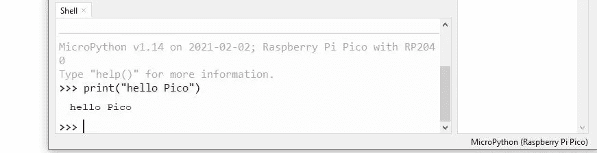

# MicroPython 初学者指南

> 原文：<https://medium.com/analytics-vidhya/a-beginners-guide-to-micropython-d91132532da2?source=collection_archive---------6----------------------->

近年来，ython 的人气激增。如今，从开发运维到统计分析到数据科学，甚至在桌面软件中，它都被广泛使用。但是很长一段时间以来，Python 在一个领域的使用明显缺失。从事微控制器工作的专业人员还没有采用这种语言。 **MicroPython** 吸引了来自其他平台的专业人士和爱好者，他们看到了这种语言的潜力和便利。这些开发者可能来自更成熟的平台，像 Arduino，Raspberry pi。许多人开始意识到使用 **MicroPython** ，以及一起指定 Python 和 MicroPython 的好处，不仅仅是为了快速原型和更快的上市时间。

如今，微控制器无处不在，从你的手机到你的办公室桌面，从家用电器到宇宙火箭。到处都在为你的设备增加智能和控制。它们将 CPU、内存和 IO 压缩到一个通用芯片中，而不是需要一整板的芯片来协同执行任务。为了让它们工作，固件代码被闪存或烧录到内存中。微控制器早在 Micropython 出现之前就已经存在了，但是为什么有人会从他们的传统编程转向 Micropython 呢？为了得到这些答案，我们先来看看什么是 Micropython。


(图片来源-[https://github.com/micropython/micropython](https://github.com/micropython/micropython))

# 微丝体

虽然我们很多人都知道 python 是一种解释型的、面向对象的、具有动态语义的高级编程语言。MicroPython 是对 **Python 3** 编程语言的一种精简而高效的利用，它包括 Python 标准库的一个小子集，并被优化为在微控制器和受限环境中运行。

MicroPython 是一个完整的 Python 编译器和运行时，运行在裸机上。您会得到一个交互式提示( **REPL** )来立即执行命令，并能够从内置文件系统运行和导入脚本。REPL 有历史，外壳，标签完成，自动缩进和粘贴模式，为一个伟大的用户体验。

MicroPython 充满了高级特性，比如交互式提示、任意精度整数、闭包、列表理解、生成器、异常处理等等。它旨在与普通 Python 兼容，并允许您轻松地将代码从桌面转移到微控制器或嵌入式系统。

## 它给传统习俗带来了什么好处？

***首先是*** ，该语言比竞争语言更容易被初学者和专业人士理解。它对于小型项目来说速度很快，对于工业用例来说足够强大。你可以从学习基础知识到做真正的工作，而且要快。

***秒*** ，Python 允许快速反馈。这是通过交互式输入命令并使用 REPL 获得响应来实现的。您甚至可以调整代码并立即运行，而不是重复代码-编译-上传-执行的循环。

***第三个*** ，外面庞大的 Python 代码和经验库支持，意味着作为 Python 程序员，你可以更快更轻松地做一些事情。

MicroPython 采用了许多先进的编码技术和技巧来保持紧凑的尺寸，同时仍然具有全套的特性。使用 MicroPython 并不需要成为 Python 专家，它的语法简洁易学，非常适合初学者。

# 哪个硬件支持 MicroPython


(图片来源—[https://store.micropython.org/product/PYBv1.1H](https://store.micropython.org/product/PYBv1.1H))

*   **Pyboard —** 首款 Micropython 主板完全支持语言和硬件外设。该板带有运行在其上的 MicroPython，因此您可以通过任何额外的设置开始使用代码。
*   **ESP8266—**Micropython 支持流行的 *ESP8266* 控制器。您可以访问 ADC、wifi、PWM、GPIOs、I2C/ SPI 等外设。通过 webREPL，您可以使用 web 浏览器对 ESP8266 进行编码。
*   **Teensy 3 . x—**Teensy 设备拥有一些对 Mircropython 的早期访问。虽然这个端口与其他板相比不太成熟，但您可以访问基本的 GPIOs。
*   **Raspberry Pi PICO —** 最近推出的 PICO 板为 MicroPython 提供了广泛的支持。MicroPython 的 Pico 端口包括用于访问低级芯片专用硬件的模块。要开始使用 Micropython 使用 Pico，请查看[*https://medium . com/analytics-vid hya/how-to-set-up-and-program-raspberry-pi-Pico-58 F5 c 75 c 382 a*](/analytics-vidhya/how-to-set-up-and-program-raspberry-pi-pico-58f5c75c382a)


(图片来源—[https://medium . com/analytics-vid hya/how-to-set-up-and-program-raspberry-pi-pico-58 F5 c 75 c 382 a](/analytics-vidhya/how-to-set-up-and-program-raspberry-pi-pico-58f5c75c382a))

# MicroPython 工作流

对于使用控制器，工作流本质上包括在 IDE 中编写代码，并将其烧录到控制器的内存中。有了 Micropython，情况就不同了。

## 获得 MicroPython REPL 提示

REPL 代表读取评估打印循环，是您可以在控制器上访问的交互式 MicroPython 提示符的名称。使用 REPL 是迄今为止测试代码和运行命令最简单的方法。您可以使用 [Putty](https://www.putty.org/) 终端来运行 get 这个提示符。

有两种方法可以访问 REPL:

*   **使用串口连接:**通过 UART 串口有线连接。

例如，要在 Mac 上获得串行 REPL，您可以编写:

```
$ screen /dev/tty.wchusbserial1430 115200
```

*   **使用 WebREPL:** 这是带 WiFi 的主板的一个选项。

```
**import** **webrepl_setup**
```

一旦你得到提示，你就可以开始实验了。您可以像在 Python 交互式会话中一样输入命令。MicroPython 将运行您输入的代码并打印结果。

您可以尝试以下命令:

```
>>> print("hello Pico")
  hello Pico
```

## 命令行工具和 ide

在 MicroPyhton 中编写代码的另一个简单方法是使用一些命令行工具，比如用于 python 的 [Thonny IDE](https://thonny.org/) 。



Thonny IDE 的外壳窗口

Thonny 内置了 Python 3.7，因此只需要一个简单的安装程序，您就可以开始学习编程了。最初的用户界面去掉了所有可能让初学者分心的功能。

# 创建和部署您的代码

为了执行您的代码，在大多数情况下，您将创建`.py`文本文件，并在您的 MicroPython 设备上执行它们。虽然有些设备具有实时处理功能，但有些设备需要将`.py`文件刻录到内存中。

## 第一个程序(板载 LED)

MicroPython 包含了`machine`模块，更具体地说是用于访问和使用 GPIO 管脚的`machine.Pin`类。

在命令行中复制给定的代码:

```
from machine import Pin
led = Pin(25, Pin.OUT)
led.on()
```

当你按下回车键时，你将会看到 pico 的 LED 灯亮起


资料来源- Aniket Arya

## ADC(温度读数)

Pico 附带的温度传感器连接到称为 ADC 或模数转换器的几个特殊引脚之一。标准 GPIO 引脚和 ADC 引脚的区别在于，GPIO 引脚仅支持高电平和低电平两种状态，而 ADC 引脚支持一系列值，具体取决于引脚上施加的输入电压。

`machine`模块提供了`ADC()`类来处理 ADC 引脚。以下代码可用于从 MicroPython shell 读取温度传感器:

```
from machine import ADC
from machine import Pin
from utime import sleepled = Pin(25, Pin.OUT)
temp_sensor = ADC(4)       //ADC pin
temperature = temp_sensor.read_u16() //to read tempearture
to_volts = 3.3 / 65535  //converting to 0 - 3.3v
temperature = temperature * to_volts
celsius_degrees = 27 - (temperature - 0.706) / 0.001721 //converting in celcius
while True:
    print("Temperature is")
    print(celsius_degrees)
    led.on()
    sleep(1)
    led.off()
    sleep(1)
```

执行此代码时，您会注意到温度读数和 LED 每*秒*闪烁一次。


外壳上打印的温度读数

# 结论

你从来没有想过嵌入式系统编程会如此容易。在传统语言中，你必须牺牲很多功能。但是使用 python，你可以提取所有的功能，并在硬件中压缩代码。在本文中，您了解了 MicroPython 的特性及其在 pico 上的一些代码。

MicroPython 正在继续发展，越来越多的控制器支持它。开发人员和爱好者总是在添加新的代码、工具、项目和教程。对于 MicroPython 开发人员来说，这是一个激动人心的时刻。

我希望这是对 MicroPython 的有趣而简单的介绍，以及在 Pico 微控制器上开始使用 MicroPython。

我将发布更多的程序和 MicroPython 的特性。