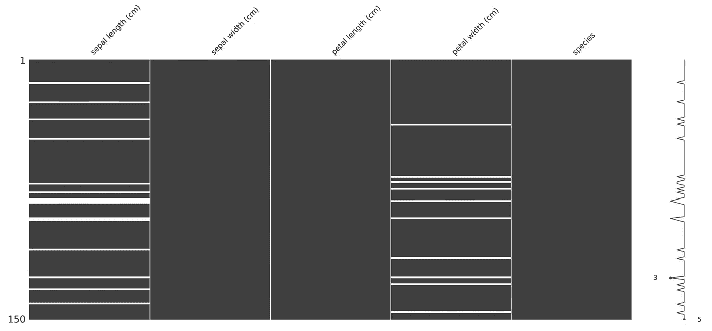
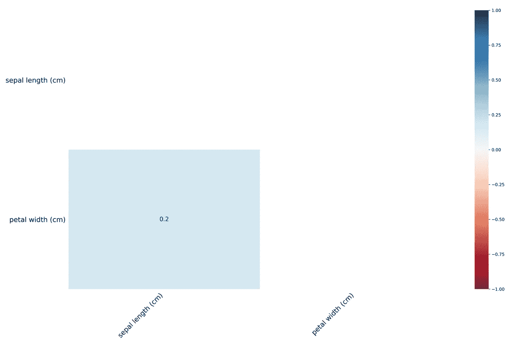
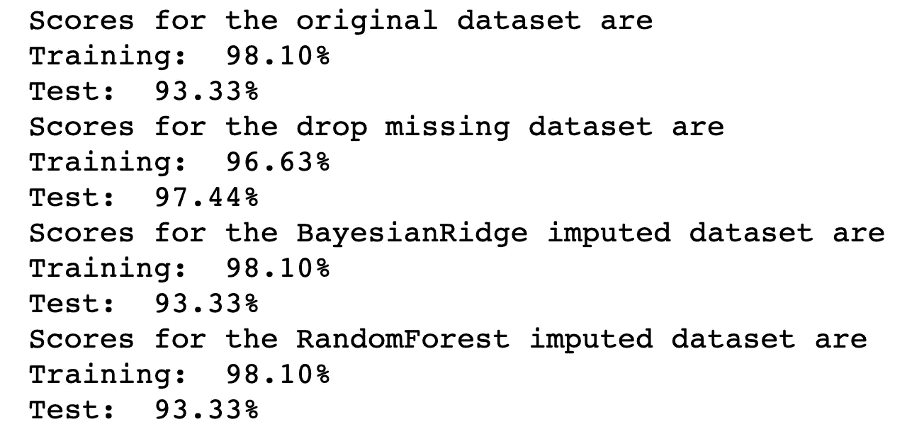

# 多元插补初学者指南

> 原文：<https://medium.com/analytics-vidhya/a-beginners-guide-to-multivariate-imputation-fe4ae5591544?source=collection_archive---------11----------------------->


来源:[https://atrium . ai/resources/learn-from-the-expert-the-constructions-of-missing-data/](https://atrium.ai/resources/learn-from-the-experts-the-consequences-of-missing-data/)

缺失数据是数据科学家在数据分析中最常遇到的问题之一。处理缺失值的几种快速解决方案是“从数据集中移除具有缺失值的观测值”或“用平均值、中值或众数填充缺失值”。然而，这些快速解决方案有多好呢？我们能做得更好吗？在本文中，我将(1)快速介绍不同类型的缺失值，(2)可视化缺失值，(3)使用 scikit-learn 实现多元插补，(4)测试插补数据集，以及(5)得出结论。

# 分类丢失的数据

缺失值可分为三类(1) **m** 缺失 **c** 完全缺失**a**t**r**andom(**mcar**)、 **m** 缺失**a**t**r**andom(**mar**)、 **m** 缺失**我认为，当值为 mcar 时，缺失值与观察值或缺失值没有关系。例如，病人由于他们自己不同的原因而错过了他们的预约，例如忘记了预约时间，不得不去接孩子等等。当值被标记时，缺失值与观察到的数据有关，但与数据集中的缺失数据无关。换句话说，丢失槽的理论值不会导致它们丢失。例如，由于该地区的暴风雪，多个患者可能会错过他们的预约。最后，当值为 mnar 时，缺失值与其理论值或另一个未观察到的变量相关。例如，患者可能会错过后续的预约，因为最初的治疗引起了副作用，使他们感觉太虚弱而不能去预约，因此副作用对于一些患者来说是不存在的。**

在 mcar 和 mar 的情况下，我们可以删除或估算缺失值，但没有好的方法来处理 mnar。假设我们已经研究了数据缺失的原因，并得出结论，我们正在处理的缺失值属于前两种情况，我们应该删除它们还是用平均值、中值或众数对它们进行估算？或者有没有更好的方法来填充缺失的值？

如果我们只是从数据集中删除丢失的值，我们就会丢失有价值的信息。当数据集很大时(数百个观察值和缺失值只占很小一部分)，这可能不是问题，但是当您处理小数据集时(例如我使用的 iris 数据集，它有 150 个观察值)，这可能会有问题。用同一个变量的均值、中值或众数来估算一个变量的缺失值怎么样(这里的技术术语是单变量估算)？假设你有一个关于房价的数据集，数据集中的两个变量是平方英尺的大小和卧室的数量。如果平均来说，房子的面积是 1500 平方英尺，卧室的数量是两个。在一栋 5000 平方英尺的豪宅里用两个房间来填卧室的数量，不觉得奇怪吗？事实证明，我们可以选择根据数据集中其他变量的信息来填充缺失值(多变量插补)。这可以通过 scikit-learn 的 IterativeImputer 轻松完成。

# **可视化丢失的数据(是的，即使它们丢失了，我们也能看到)**

为了演示插补过程，我使用了来自 scikit-learn 的虹膜数据集。

```
iris = load_iris() 
df = pd.DataFrame(data = np.c_[iris[“data”], iris[“target”]],\   columns = iris[“feature_names”] + [“species”])
```

这是一个小数据集，包含 150 个观察值和四个变量，包括萼片长度、萼片宽度、花瓣长度和花瓣宽度。目标变量是鸢尾的种类。数据集没有缺失值，所以我随机选择在萼片长度和花瓣宽度中引入 15 和 10 个缺失值。

```
np.random.seed(123)
mask = np.random.randint(0, 150, size = 15)
mask2 = np.random.randint(0, 150, size = 10)df_miss["sepal length (cm)"][mask] = np.nan
df_miss["petal width (cm)"][mask2] = np.nan
```

为了可视化数据集中的缺失值，我们可以使用 missingno 模块中的矩阵函数。

```
import missingno as msno
msno.matrix(df_miss, figsize=(10, 6))
```



五个黑色矩形块中的每一个都代表数据集中的一个变量，第一个和第四个块中的白色条代表变量的缺失值。missingno 的热图函数显示了变量的缺失值之间的相关性。它有助于我们理解不同变量的缺失值是否相互关联，以及关联到什么程度。



# 用迭代输入器输入缺失数据

```
from sklearn.experimental import enable_iterative_imputer
from sklearn.impute import IterativeImputerimputer = IterativeImputer(max_iter=10, random_state=123)
*# pull out non-target variables for imputation*
df.iloc[:, 0:4] = imputer.fit_transform(df_miss.iloc[:, 0:4])
```

当我们估算缺失值时，我们首先需要从数据集中移除目标变量。特别是在虹膜数据集中，是虹膜的种类。原因是我们不想用目标变量来估计其他变量的缺失值，然后在建立我们的分类模型时用估算的数据集来预测目标。仅使用几行代码(如前面的代码块所示)，我们现在就有了一个完整的数据集，缺失的值由数据集中非目标变量的回归估计。我想指出的一点是，IterativeImputer 的默认回归量是 BayesianRidge，但是您可以轻松地指定您感兴趣的回归量，我将在下一个代码块中展示这一点。迭代输入器的更多细节可以在[这里](https://scikit-learn.org/stable/modules/generated/sklearn.impute.IterativeImputer.html#sklearn.impute.IterativeImputer)找到。

```
*# initialize the RandomForest regressor*
from sklearn.ensemble import RandomForestRegressor
rf = RandomForestRegressor(n_estimators=10, random_state=123)*# specify estimator to be rf* 
rf_imputer = IterativeImputer(**estimator=rf**, random_state=123)
df.iloc[:, 0:4] = rf_imputer.fit_transform(df_miss.iloc[:, 0:4])
```

# 测试估算数据集

现在我们有了两个估算数据集，一个是原始数据集(直接从 scikit-learn 导入，没有缺失值)，另一个是删除了缺失值的数据集，我们可以看到这些数据集在模型拟合中的表现。

```
from sklearn.linear_model import LogisticRegression
from sklearn.model_selection import train_test_splitdatasets = [df, drop_missing, df_br, df_rf]
dfnames = ["original", "drop missing", "BayesianRidge imputed", "RandomForest imputed"]logit = LogisticRegression(C = 0.9, max_iter=200)
for i in range(len(datasets)):
    X_train, X_test, y_train, y_test = \ train_test_split(datasets[i].iloc[:, 0:4], datasets[i]["species"], \ test_size=0.3, random_state=123)
    logit.fit(X_train, y_train)
    print(f"Scores for the {dfnames[i]} dataset are")
    print("Training: {:6.2f}%".format(100*logit.score(X_train, y_train)))
    print("Test: {:6.2f}%".format(100*logit.score(X_test, y_test)))
```

我用所有的数据集做了一个简单的训练测试分割，然后拟合了一个逻辑回归模型来对鸢尾物种进行分类。结果如下:



从结果可以看出，模型在原始数据集和两个估算数据集上的性能是相同的，训练准确率为 98.10%，测试准确率为 93.33%。然而，当我们简单地删除缺失值时，我们的训练准确率为 96.63%，测试准确率为 97.44%。这里的重点不是精度有多高/低，而是数据集在建模上是否有相似的表现。在这个例子中很明显，估算的数据集与原始数据集具有更相似的性能。

# 结论

从上面的例子中，我们可以看出多元插补是处理缺失数据的一种简单有效的方法。我希望这篇文章对你有所帮助，如果你的数据分析程序中还没有多元插补的话，你可以试着实现多元插补。

感谢您通读这篇文章！我很想听到你的反馈。这篇文章的代码可以在[这里](https://github.com/sarazong/investigation_missing_data)找到。我的 Github 的链接可以在[这里](https://github.com/sarazong)找到。