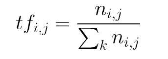

# 自然语言处理入门指南—第 4 部分

> 原文：<https://medium.com/analytics-vidhya/a-beginners-guide-to-natural-language-processing-part-4-734b995c53ea?source=collection_archive---------17----------------------->

经过之前的 3 篇文章(零件 [1](/swlh/a-beginners-guide-to-natural-language-processing-part-1-737b64b0c8cd) 、 [2](https://chraviraj.medium.com/a-beginners-guide-to-natural-language-processing-part-2-fdf73667df13) 、 [3](https://chraviraj.medium.com/a-beginners-guide-to-natural-language-processing-part-3-edad0799397a) ，你现在已经熟悉了文本数据的清理和标记。在将它们简化为根形式后，我们现在将它们表示为数字。

对于 NLP，初学者最常见的疑问是将文本表示为数字。它可能是关于理想方法的，也可能是关于缩减度量的。尽管这些疑问没有完美的答案，但我们许多人都是根据问题陈述来解决这些问题的。当我们试图解决单词预测问题时，单词的顺序比情感分析问题更重要，在情感分析问题中，单词所传达的意义具有更深远的影响。

但不管是什么问题，我们需要建立一个模型或方法，让我们在遇到新数据时制定解决方案。硬编码一个系统，用像“好”、“很好”、“惊人”等等这样的词来标记句子，作为肯定句，是一种天真的方法，并不真正需要 ML 或 NLP。但是，如果我们能够找到一种方法来类似地表示所有听起来积极的单词，那么我们就不必担心系统遇到新单词。

## 向量和矢量器

现在出现了一个问题——我们如何相似地表示相关单词？最常见的方法之一是用向量——一组数字。这些数字可以是正 int 或正负 float 值。矢量器是为单词/句子/文档形成矢量的包。

*   **计数矢量器**:BOW 是一种表示方法，通过计算每个单词在句子或文档中出现的次数，将文本转换成固定长度的矢量。它被称为单词“包”,因为关于文档中单词的顺序或结构的任何信息都被丢弃了。我们只是收集数据，并制作一个包含数据中所有独特单词的语料库。然后我们对这些单词做一个类似矩阵的表示。固定长度，等于 BOW 中唯一单词的数量，允许一个标准的表示——生成一个向量。

一个单词袋向量概念的例子。

我们根据词汇中的字数来转换句子。

考虑到句子——“坐着的猫”、“坐在帽子里的猫”、“戴帽子的猫”，一个标准的矢量器将生成一个固定的矢量，具有词汇表的大小。下面是使用 CountVectorizer 生成矢量的代码示例。

*   **TFIDF 矢量器** : TF-IDF 是一种统计度量，用于评估一个单词与文档集合中的一个文档的相关程度。

文档中单词的术语频率(TF)是单词在文档中出现的实例的原始计数。

单词在一组文档中的逆文档频率(IDF)是一个单词在整个文档集中的常见或罕见程度。这个指标的计算方法是，将文档总数除以包含一个单词的文档数，然后计算它的对数。

TFIDF 评分

我们将两者相乘得到最终值:单词在文档中出现的比例，以及该单词在一组文档中的逆文档频率。

给出 2 个句子:“汽车在路上行驶”和“卡车在高速公路上行驶”下面是 TFIDF 评分的一个小演示。

TFIDF 评分示例

我们根据生成的 TFIDF 分数转换句子。第一个句子向量将是[0，0.043，0，0，0，0，0.043，0]，第二个句子向量将是[0，0，0，0，0，0，0，0.043]。下面是使用 TfidfVectorizer 的 CountVectorizer 代码示例。

在下一篇文章中，我们将讨论嵌入以及为什么需要它们。

*新年快乐！任何帮助我提高的批评，我都非常感激！拍手，跟帖，分享！*