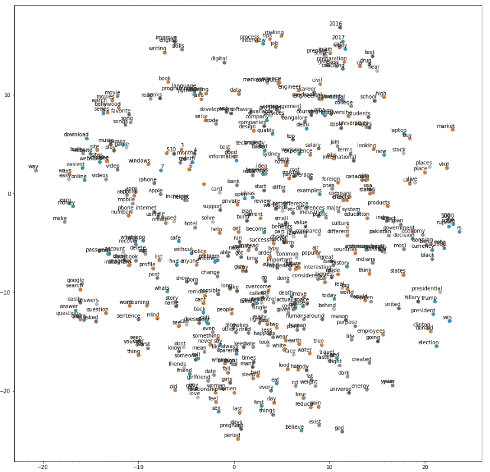

# 自然语言处理入门指南—第 5 部分

> 原文：<https://medium.com/analytics-vidhya/a-beginners-guide-to-natural-language-processing-part-5-10709cdc1d34?source=collection_archive---------16----------------------->

在[第 4 部分](/analytics-vidhya/a-beginners-guide-to-natural-language-processing-part-4-734b995c53ea)中，我们看到了什么是向量，以及如何使用 TFIDF 或简单计数来生成向量。我们有一个向量，表示整个语料库中唯一单词的数量。当我举一个例子时，只有 4-10 个独特的单词。因此，我的向量大小也是 4-10 个整数或浮点值。现在让我们来看一个只有 100 个独特单词的语料库。似乎可以接受，对吧？但是当我们开始转向更大的语料库时，向量大小将开始变得越来越麻烦。例如，如果在 10，000 单词的语料库中有 10 个单词的句子。我们的向量将有 9990 个 0，只有 10 个非零值——整数或浮点数。这样的稀疏矩阵变得难以浏览。对于我们来说，使用小尺寸的向量会更容易。但是我们不能准确地决定，哪些词，我们将不得不作为向量的一部分来表示，哪些词，我们将不得不离开。

我们在直接使用 TF-IDF/Count 矢量值时面临的另一个问题是，它们不能捕捉单词之间的关系。“男性”、“男人”、“警察”和“国王”这些词的向量之间可能没有任何相似之处。

为了避免这种选择问题，以及生成显示密切相关的单词之间的相似性的向量，我们使用单词嵌入的概念——固定长度的向量，也考虑句子中单词之间存在的语义关系。Word2Vec 是生成单词嵌入最常用的概念之一。在我们实现 Word2Vec 之前，我们还必须讨论另外两个概念 Skipgram 模型和连续词袋(CBOW)模型。

## Word2Vec 是什么？

谷歌在 2013 年推出的深度学习模型，用于为单词生成连续的密集向量(没有太多零的向量)。创建的向量捕获单词之间的上下文和语义相似性。它是一个无监督的模型，可以获取一个巨大的语料库，其中有大量独特的单词，并返回一个代表整个词汇的密集向量空间。通常，用户决定向量的长度，称为尺寸。与我们的 TF-IDF 或计数向量相比，维度通常比词汇表中唯一单词的数量小得多。

## CBOW 模型是什么？

在 Word2Vec 的这个架构中，我们试图根据目标单词(t-n，.，…t-1，t+1，……，t+n)。n 的值是我们根据所解决的问题选择的窗口大小。我们可以将 CBOW 架构建模为分类模型，其中我们使用上下文单词作为输入 x，并预测目标单词 y。

## 什么是 Skipgram 模型？

在这个模型中，我们尝试并预测上下文单词(t-n，.，…t-1，t+1，……，t+n)在目标单词(t)周围。我们给 skip-gram 模型输入 x 和标签 y 作为对(x，y)。我们通过使用[(target，context)，1]值作为正样本来训练它(target 是我们感兴趣的单词，context 是出现在目标单词附近的上下文单词)。标签 1 表示这是一个上下文和目标彼此相关的正对。我们还给出[(target，random)，0]对作为负样本，其中目标是我们感兴趣的单词，而 random 只是从我们的词汇表中随机选择的与我们的结果没有关联的单词。通过这个，我们教会了模型哪些词对是相关的，哪些是不相关的。这允许模型为相似的单词生成相似的嵌入。

下面是一个带有非常小的数据集的 Word2Vec 实现的演示。精度较低，但可以让您了解如何处理大型数据集。

至此，我们完成了“自然语言处理入门指南”系列。一旦生成了向量和嵌入，您就可以使用它们来解决 NLP 必须提供的几乎所有问题！

*感谢您的阅读！让我知道你对这个系列的看法！如果你喜欢，一定要分享给一些初学者，也帮助他们！干杯！拍手，分享，指正！* ❤