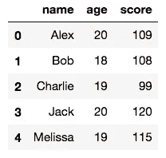
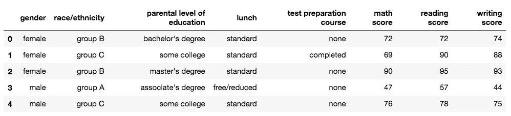
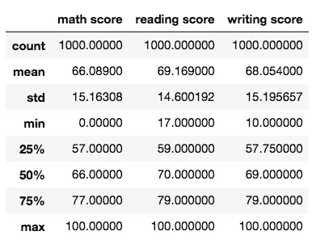
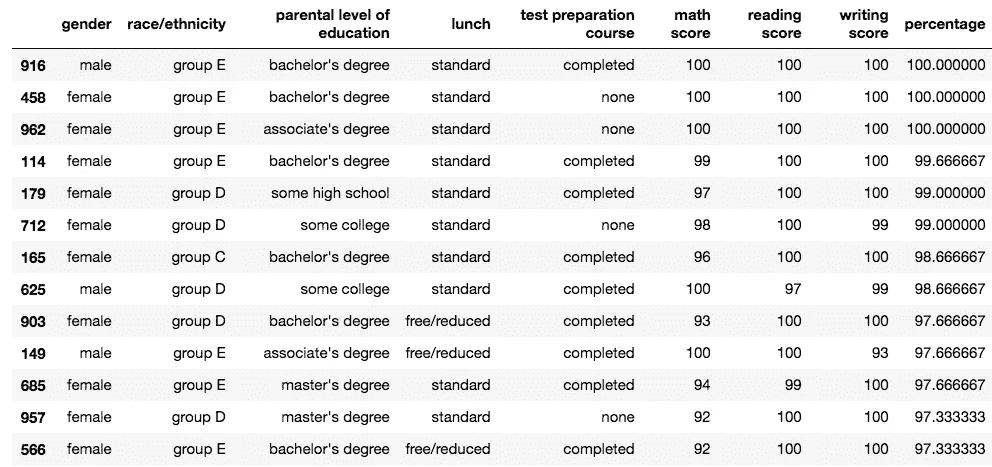

# 熊猫入门指南

> 原文：<https://medium.com/analytics-vidhya/a-beginners-guide-to-pandas-4ee424cf3360?source=collection_archive---------21----------------------->

## 开始数据分析的第一步。

自 2010 年 pandas 首次开源以来，它已经发展成为一个漂亮而广泛的数据分析库。它通常与 NumPy、scikit-learn、matplotlib 等计算和统计库结合使用。


在本文中，我将带您了解 pandas 中最常见的功能，以便您准备好进行一些探索性的数据分析。

pandas 有两种被反复使用的数据结构:序列和数据帧

# 系列

简单地说，series 是元素的一维数组，但是增加了一个特性:有一个显式的索引来寻址每个元素。要创建一个序列，需要传递一个数组(一个列表或者一个字典甚至一个元组)。还可以为索引传递一个显式数组。当索引一个序列时，把它想象成一个散列表、关联数组或字典数据结构。

```
>>> import pandas as pd
>>> series = pd.Series([1,2,3,4,5,6,7])
>>> series
0    1
1    2
2    3
3    4
4    5
5    6
6    7
dtype: int64>>> series.index
RangeIndex(start=0, stop=7, step=1)>>> #or pass an explicit index
>>> series2 = pd.Series([1,2,3,4,5,6,7], index['a','b','c','d','e','f','g'])
>>> series2
a    1
b    2
c    3
d    4
e    5
f    6
g    7
dtype: int64
```

# 数据帧

pandas 是为处理表格或异构数据而设计的。这是通过 DataFrame 数据结构实现的。它就像一个表格，包含可以被索引的行和列。创建数据集的方法有很多种，最常见的方法是传递一个字典。让我们创建一个。



```
>>> diction = {'name': ['Alex', 'Bob', 'Charlie', 'Jack', 'Melissa'],
          'age': [20, 18, 19, 20, 19],
          'score': [109, 108, 99, 120, 115]}
>>> dataframe1 = pd.DataFrame(diction)
```

为了展示 pandas 库的真正威力，我们现在将从 kaggle 的一个小数据集开始工作。这是一个学生考试成绩的数据集，以及它如何受到经济、个人和社会因素的影响。从[这里](https://www.kaggle.com/spscientist/students-performance-in-exams)下载数据集。

## 导入数据集

为了使用 pandas 导入 csv 格式的数据集，我们使用 pandas read_csv 函数。

```
>>> df = pd.read_csv('StudentsPerformance.csv')
```

## 检查数据

通常，当我们处理数据集时，我们对知道它包含哪些列以及每列描述了什么感兴趣。使用 pandas head()和 info()函数很容易做到这一点。

```
>>> df.head()
```



```
>>> df.info()
<class 'pandas.core.frame.DataFrame'>
RangeIndex: 1000 entries, 0 to 999
Data columns (total 8 columns):
gender                         1000 non-null object
race/ethnicity                 1000 non-null object
parental level of education    1000 non-null object
lunch                          1000 non-null object
test preparation course        1000 non-null object
math score                     1000 non-null int64
reading score                  1000 non-null int64
writing score                  1000 non-null int64
dtypes: int64(3), object(5)
memory usage: 62.6+ KB
```

## 检查空值

数据集通常包含空值，这在 ML 过程中会成为一个麻烦。我们可以使用 info()函数检查空值，或者对每个单独的列求和来检查列中的空值。

```
>>> df.isnull().sum()
gender                         0
race/ethnicity                 0
parental level of education    0
lunch                          0
test preparation course        0
math score                     0
reading score                  0
writing score                  0
dtype: int64
```

## 描述数据

描述了另一个非常有用函数()。这给出了一个 5 个数字的数据摘要，以及一些其他有用的统计数据，用于解释我们的数据所在的范围。

```
df.describe()
```



## 从数据中提问

探索数据集的主要原因是为了能够回答问题。例如，人们可能想通过查看数据集来了解“有多少学生通过了数学考试？”或者“有多少学生的分数在 80 分以上？”对熊猫来说，回答这些问题很容易。

```
>>> # how many students passed the math exam?
>>> passing_score = 40
>>> math_stats = df['math score'] >= passing_score
>>> print(math_stats.sum())
960>>> # how many students scored a percentage above 80?
>>> total_marks = df['math score'] + df['reading score'] + df['writing score']
>>> total = 3
>>> total_percentage = (total_marks/total)
>>> above_80 = total_percentage >= 80
>>> print(total_percentage[above_80].count())
198
```

## 按百分比对数据进行排序

既然我们已经计算了所有学生的百分比，我们可能希望根据他们的排名对数据进行排序。pandas 允许你根据你想要的列进行排序。为此，让我们在数据集中添加另一个名为“percentage”的列，并对其进行排序。

```
>>> df['percentage'] = total_percentage
>>> df.sort_values(by='percentage', ascending=False)
```



## 按值计数

有时我们可能对分析数据集中的特定列感兴趣。例如,“父母教育水平”列在整个列中包含 5 个唯一值。我们不妨统计一下这些数值。pandas value_counts()函数使这变得非常简单。

```
>>> df['parental level of education'].unique()array(["bachelor's degree", 'some college', "master's degree",
       "associate's degree", 'high school', 'some high school'],
      dtype=object)>>> df['parental level of education'].value_counts()some college          226
associate's degree    222
high school           196
some high school      179
bachelor's degree     118
master's degree        59
Name: parental level of education, dtype: int64
```

# 包扎

这里我只讨论了在探索性数据分析中重复使用的几个方便的函数。对于使用熊猫的完整指南，最好的来源是[文档](https://pandas.pydata.org/docs/)本身！