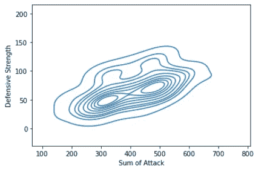

# Seaborn 初学者指南:从零开始学习的最简单方法

> 原文：<https://medium.com/analytics-vidhya/a-beginners-guide-to-seaborn-the-simplest-way-to-learn-rom-scratch-420938e89a6f?source=collection_archive---------10----------------------->

Seaborn 入门分步指南！


图像参考:[中等](https://www.google.com/url?sa=i&url=https%3A%2F%2Fmedium.com%2Fnightingale%2Fhow-to-create-a-thriving-data-visualization-culture-44caeffd9ae5&psig=AOvVaw25JFkUwK1jUORkvKq-ienE&ust=1613275464878000&source=images&cd=vfe&ved=0CA0QjhxqFwoTCLCY7PH95e4CFQAAAAAdAAAAABAJ)

***如果 matplotlib“试图让简单的事情变得简单，让困难的事情变得可能”，seaborn 也试图让一组定义明确的困难事情变得简单。***

# **Seaborn 的酷:**

Seaborn 最大的优势是其绘图功能的多样性。 ***它甚至可以让我们用一行代码做出复杂的情节！***

在本教程中，我们将使用三个库来完成这项工作——Matplotlib、Seaborn 和 Pandas。如果你是 Python 的完全初学者，我建议从开始着手，稍微熟悉一下 Matplotlib 和 Pandas。

> **如果你完全按照这个教程去做，你将能够用这三个库制作出漂亮的图表。然后，您可以将我的代码用作将来任何可视化任务的模板。**

让我们从著名的口袋妖怪数据集开始我们的 seaborn 之旅。在开始之前，我强烈建议您为每个图形编写自己的基本代码，并尝试用图形进行实验。

你可以在 Kaggle 上找到口袋妖怪数据集。然而，为了让您的旅程更容易，我缩短并清理了这个版本的数据集。

你可以在这里下载数据集:[https://github.com/shelvi31/Seaborn-Experiments](https://github.com/shelvi31/Seaborn-Experiments)

> ***我的超级拯救者:*** 我想提一个资源，每当我陷入困境时，它总是我的超级拯救者。[https://python-graph-gallery.com/](https://python-graph-gallery.com/)。

让我们现在开始:

我们将从导入必要的库开始:

```
#importing libraries
import pandas as pd
import matplotlib.pyplot as plt
import seaborn as sns
```

阅读 csv 文件

```
data = pd.read_csv(“Pokemon.csv”,encoding= ‘unicode_escape’)
```

我通过在 read_csv()命令中定义不同的编解码器包来切换 utf8 编解码器错误。

我们的数据看起来像这样…

```
data.head()
```

输出:


输出

这些列的名称没有清楚地简化它的目的。在实际处理数据集之前，了解数据集是很重要的。

这是数据集的简化描述。

> 这个数据集包括 150 个口袋妖怪，它是关于口袋妖怪游戏的(不是口袋妖怪卡或口袋妖怪 Go)。

在这个数据集中，我们有 150 行和 13 列。

列描述:

> #每个口袋妖怪的 ID
> # Name:每个口袋妖怪的名字
> # Type 1:每个口袋妖怪都有一个类型，这决定了弱点/对攻击的抵抗力
> # Type 2:一些口袋妖怪是双重类型的，有 2 个
> # Total:在此之后所有属性的总和，口袋妖怪有多强的一般指南
> # HP:生命值，或生命值， 定义一只口袋妖怪在昏厥前可以承受多少伤害
> #攻击:普通攻击(如抓伤、猛击)的基础调整值
> #防御:普通攻击的基础伤害抗性
> # SP 攻击:特殊攻击的基础调整值(如火焰冲击、气泡束)
> # SP 防御:特殊攻击的基础伤害抗性
> #速度:决定每轮哪只口袋妖怪先攻击
> #阶段:世代数
> #传奇:如果

我重新命名了列名，使我们的绘图更有意义，思路也更清晰。虽然这是可选的，但我强烈建议您这样做，以消除任何混淆的可能性。

```
data.rename(columns = {“#”:”No.”,”Type 1":”Pokemon_Type”,”Type 2":”PokemonType2",’Total’:’Sum of Attack’,”HP”:”Hit Points”,”Attack” : “Attack Strength”, “Defense”:”Defensive Strength”,”Sp. Atk”:”Special Attack Stenth”,”Sp. Def”:”Special Defense Strength”,”Stage”:”Generation”}, inplace = True)data.head()
```

我的输出现在看起来是:


好多了！

让我们从简单的分布图开始可视化。

# 分布图:

一个**分布图**显示一个**分布图**和一组数值的范围，这些数值是相对于一个尺寸绘制的。 ***直方图允许你绘制数值变量的分布*** 。

我本来可以使用***" data . hist(figsize =(12，10)，bins=20)"*** ，但是由于这个数据库中并不是所有的列都有数值。因此，我必须画出单独的分布图。

```
plt.figure(figsize=(4,3))
sns.distplot(x=data[“Sum of Attack”],color=”Orange”,kde=True,rug=True);
plt.show()
```


分布剧情输出:口袋妖怪攻击总和

seaborn 的 Displot 函数用密度曲线绘制直方图。我们可以使用 kde=" False "选项移除密度。使用 rug=" True "控制地毯的摆放。

在 python 中有许多绘制直方图的替代方法:

```
plt.figure(figsize=(3,3))
sns.histplot(x=data[“Sum of Attack”],color=”Green”);
plt.show()
```


输出:口袋妖怪攻击总数

另一种方法是:使用 plt.hist()

```
plt.figure(figsize=(3,3))
plt.hist(x=data["Sum of Attack"],color="Red",bins=20);
plt.show()
```


输出:直方图，Matplotlib

因此，对于许多绘制分布图的方法。所有函数`pyplot.hist`、`seaborn.coOutuntplot`和`seaborn.displot`都充当 matplotlib 条形图的包装器，如果手动绘制这样的条形图被认为太麻烦，可以使用这些函数。

*   对于离散变量，a `seaborn.countplot`更方便。
*   对于连续变量:使用`pyplot.hist`或`seaborn.distplot`。

## **共同分配地块:**

联合分布图结合了散点图和直方图的信息，为我们提供了二元分布的详细信息。

```
sns.jointplot(x=data[“Sum of Attack”],y=data[“Defensive Strength”],color=”Red”);
```


输出:接合图

**密度图:**

密度图显示两个变量之间的分布。

```
sns.kdeplot(x=data[“Sum of Attack”],y=data[“Defensive Strength”])
plt.show()
```



输出:密度图

# 条形图

> ***柱状图帮助我们形象化分类变量的分布:计数图是柱状图的一种。***

```
plt.figure(figsize=(10,6));
sns.countplot(x=data.Pokemon_Type,palette=pkmn_type_colors);
plt.show()
```


输出:条形图

# **热图**

**热图**帮助我们以热点和冷点的形式可视化类似矩阵的数据。暖色表示访客互动最多的部分。

```
plt.figure(figsize=(8,6));
sns.heatmap(data.corr());# Rotate x-labels with the help of matplotlib
plt.xticks(rotation=-45);
```


输出:热图

# **散点图:**

一个**散点图**(又名**散点图**、**散点图**)使用点来表示两个不同数值变量的值。水平轴和垂直轴上每个点的位置表示单个数据点的值。

> **散点图**用于观察变量之间的关系。

我在散点图的帮助下比较了我们神奇宝贝的攻击和防御数据。


输出:散点图

Seaborn 没有专门的散点图功能，这也是我们默认在这里看到一条对角线(回归线)的原因。

谢天谢地，seaborn 帮助我们调整了剧情:

*   fit_reg=False 用于删除回归线
*   hue='Stage '用于通过第三个变量值给点着色。因此，允许我们用颜色表达第三维的信息。

这里我把神奇宝贝的进化阶段作为第三个变量！

```
#Tweaking with scatter plotsns.lmplot(x=’Attack Strength’, y=’Defensive Strength’, data=data,
 fit_reg = False, #Deleting regression line
 hue=”Generation”); #Separating as per pokemon generation
```


输出:调整散点图

更多的密度落在 40–120 标记上，我将在 matplotlib 的帮助下改变轴的限制:

```
sns.lmplot(x=’Attack Strength’, y=’Defensive Strength’, data=data,
fit_reg = False, #Deleting regression line
hue=”Generation”); #Separating as per pokemon generationplt.ylim(20,130);
plt.xlim(25,125); 
```

我们现在可以看到一个更集中和更好的图表！


输出:更好的散点图

# 箱线图

箱线图用于描绘通过其**四分位数**的数字数据组。

> 盒状图也可能有从盒状图延伸的线，表示在**上下四分位数**之外的可变性，因此有盒须图和盒须图的术语

我们可以删除“攻击总数”栏，因为我们有单独的统计数据。我们也可以删除“世代”和“传奇”栏，因为它们不对抗属性。

```
plt.figure(figsize=(15,7));# Pre-format DataFrame
stats_data = data.drop([‘Sum of Attack’, ‘Generation’, ‘Legendary’], axis=1);

# New boxplot using stats_df
sns.boxplot(data=stats_data,
 showfliers=False); #Removing outlierssns.set_style(“whitegrid”)
```


输出:箱线图

记得在绘制图表之前保持 figsize。

# **小提琴剧情**

现在我将绘制小提琴图。

小提琴图是箱型图的替代品。它们显示分布(通过小提琴的厚度)而不仅仅是汇总统计。

> *这里我已经展示了神奇宝贝初级类型的攻击分布*

```
plt.figure(figsize=(15,7));
sns.violinplot(x=data.Pokemon_Type, y = data[“Attack Strength”]);
```


输出:小提琴情节

正如你所看到的，龙型比幽灵型有更高的攻击属性，但是他们也有更大的差异。

现在，神奇宝贝的粉丝可能会发现这个情节有些不和谐:*颜色是荒谬的。*为什么草型的颜色是粉色，或者水型的颜色是橙色？我们必须立即解决这个问题！

幸运的是，Seaborn 允许我们设置自定义调色板。我们可以简单地创建一个有序的颜色十六进制值的 Python 列表。

我已经使用 Bulbapedia 创建了一个新的调色板。

```
# using Bulbapedia to create a new color palette:#Bulbapedia : [https://bulbapedia.bulbagarden.net/wiki/Category:Type_color_templats](https://bulbapedia.bulbagarden.net/wiki/Category:Type_color_templates)pkmn_type_colors = [‘#78C850’, # Grass
 ‘#F08030’, # Fire
 ‘#6890F0’, # Water
 ‘#A8B820’, # Bug
 ‘#A8A878’, # Normal
 ‘#A040A0’, # Poison
 ‘#F8D030’, # Electric
 ‘#E0C068’, # Ground
 ‘#EE99AC’, # Fairy
 ‘#C03028’, # Fighting
 ‘#F85888’, # Psychic
 ‘#B8A038’, # Rock
 ‘#705898’, # Ghost
 ‘#98D8D8’, # Ice
 ‘#7038F8’, # Dragon
 ]
```

根据口袋妖怪类型的颜色修改小提琴情节:

```
plt.figure(figsize=(15,7));
sns.violinplot(x=data.Pokemon_Type, 
 y = data[“Attack Strength”],
 palette = pkmn_type_colors);
```


输出:更好的小提琴剧情:)

# **群集图**

如您所见，Violin 图非常适合可视化分布。

然而，由于我们的数据集中只有 150 个神奇宝贝，我们可能想简单地显示每个点。这就是**蜂群剧情**出现的地方。该可视化将显示每个点，同时“堆叠”具有相似值的点。

```
plt.figure(figsize=(12,5));
sns.swarmplot(x=data.Pokemon_Type,y=data[“Attack Strength”],palette=pkmn_type_colors);
```


蜂群剧情:口袋妖怪类型 Vs 攻击强度

这看起来不错，但为了更好的视觉效果，我们可以结合这两个！毕竟它们显示相同的信息。

# **上覆地块**

```
plt.figure(figsize=(10,10))sns.violinplot(x=data.Pokemon_Type, y = data[“Attack Strength”],
 inner=None, 
 palette = pkmn_type_colors);sns.swarmplot(x=”Pokemon_Type”,
y=”Attack Strength”,
data=data,
color=’black’, #making points black
alpha=0.5);plt.title(“Attacking Strength as per Pokemon’s Type”);
```


重叠地块

> **要点注意事项**:
> 
> inner=None:移除小提琴内部的小节
> 
> alpha=0.5:使点稍微透明:记住 alpha 值必须是浮点数，不要保留在""
> 
> 你可以在这里找到 seaborn color 的参考资料:[https://python-graph-gallery . com/100-calling-a-color-with-seaborn/](https://python-graph-gallery.com/100-calling-a-color-with-seaborn/)

# 因子图

因子图可以很容易地通过分类来分隔图。

```
plt.figure(figsize=(5,15))
factplot= sns.factorplot(x="Pokemon_Type",y="Attack Strength",data=data,hue="Generation",col="Generation",kind="swarm");factplot.set_xticklabels(rotation=-45)
plt.show()
```


因子图:对于单独的分类类别

**快速注释:**

*   plt.xticks(rotation=-45):不起作用，因为它只旋转最后一个图
*   需要使用:set_xticklabels

您可以通过简单地更改变量名并运行相同的代码行来制作更多类似上面的可视化效果。

我将把它作为一个练习留给你去做，让你更好地掌握 Python 的可视化技巧。


Img Ref: [福布斯](https://www.google.com/url?sa=i&url=https%3A%2F%2Fwww.forbes.com%2Fsites%2Fbernardmarr%2F2020%2F05%2F22%2Fthe-9-best-analytics-tools-for-data-visualization-available-today%2F&psig=AOvVaw25JFkUwK1jUORkvKq-ienE&ust=1613275464878000&source=images&cd=vfe&ved=0CA0QjhxqFwoTCLCY7PH95e4CFQAAAAAdAAAAABAD)

本文到此为止！我希望你觉得这个教程很有帮助，并能使用它。祝您在数据科学之旅中好运，并祝您学习愉快！

Seaborn 提供了大量的图表和特性。你总能从 https://seaborn.pydata.org/那里学到更多。

> 学习的美妙之处在于没有人能把它从你身边夺走！— B.B .金