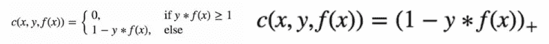

# SVM 入门

> 原文：<https://medium.com/analytics-vidhya/a-beginners-introduction-to-svm-c641c3ff2769?source=collection_archive---------17----------------------->

*虽然存在许多可以对线性可分数据进行分类的分类器，例如逻辑回归，但是* ***支持向量机(SVM)*** *可以使用* ***内核技巧*** *来处理高度非线性的问题，该内核技巧隐式地将输入向量映射到更高维的特征空间。*

> 让我们在接下来的几分钟里深入探讨一下这个问题！


图片来源:谷歌图片

我们正在讨论的这种转换—以这样一种方式重新排列数据集，使得它可以线性求解。

> 在这篇文章中，我们将看看 SVM 如何工作，了解核函数，超参数和 SVM 的利弊以及 SVM 的一些现实生活中的应用。希望你能从中有所收获:)

***支持向量机*** ，也称为支持向量网络，是一个非常强大的模型家族，使用基于方法的学习，可以用于*分类*和*回归*问题。

他们的目标是找到 ***决策边界*** 来分隔不同类别成员的观察。换句话说，SVM 是一个由 ***分离超平面正式定义的 ***判别分类器*** 。***

## 核函数

你一定想知道内核函数是什么——让我们一会儿就明白它们是什么

下图用一个简单的一维例子展示了一个 1D 函数。假设给定点如下，它将描绘一条垂直线，并且没有其他垂直线将数据集分开。


现在，如果我们考虑一个 2 维表示，如下图所示，有一个超平面*(2 维中的任意线)*将红色和蓝色点分开，可以使用支持向量机将它们分开。


随着我们不断增加维度空间，能够分离数据的需求最终会减少。这个映射， *x - > (x，x2)* ，被称为内核函数。

> 在维空间增长的情况下，计算变得更加复杂，需要应用**内核技巧**来廉价地解决这些计算。

超平面是比给定的输入数据更低维度的空间中的平面，其将数据分成类别。如果一个空间是三维空间，那么超平面就是二维平面。如果一个空间是二维的，那么它的超平面就是一维直线。


## 工作

另一种情况是，绿色和红色对象的完全分离显然需要曲线(比直线更复杂)。基于绘制分隔线来区分不同类成员的对象的分类任务被称为 ***超平面*** *分类器。*

> 支持向量机特别适合处理这样的任务。


我们如何知道我们是否在处理正确的超平面？

*现在，让我们用一个线性方程来表示新的平面，如下:*

```
f(x) = ax + b
```

让我们考虑这个等式给出了来自*绿色三角形类*的所有*值≥ 1* 和来自*金星类的所有 *≤ -1* 。*该平面与两类中最近点的距离至少为 1。*(模数为一)。*


> 三角形的 **f(x) ≥ 1** ，星形的 **f(x) ≤ 1** 或 **|f(x)| = 1**

*超平面和该点之间的距离可以使用下面的等式计算:*

```
M1 = |f(x)| / ||a|| = 1 / ||a||
```

*总保证金为:*

```
*1 / ||a|| + 1 / ||a|| = 2 / ||a|*
```

为了最大化可分性，我们将不得不 ***最大化||a||*** 的值。这个特定值被称为*权重向量。*

我们可以最小化权重值，这是一个非线性优化任务。其中一种方法是使用***【KKT】***条件，使用 ***拉格朗日乘数λi.***


## 大幅度直觉

> 在逻辑回归中，采用线性函数的输出，并使用 sigmoid 函数将该值压缩在[0，1]的范围内。如果该值大于阈值，比如 0.5，则标签 1 被分配，否则标签 0 被分配。
> 
> 更多关于**逻辑回归** — [**逻辑回归**](/analytics-vidhya/a-comprehensive-guide-to-logistic-regression-e0cf04fe738c) 的全面指南

在*支持向量机*的情况下，采用线性函数，如果输出大于 1，我们将其识别为一个类别，如果输出为-1，则将其识别为另一个类别。

> 由于在 SVM 阈值被改变为 1 和-1，我们获得了这个值的加强范围([-1，1])，其作为余量。

## 成本函数和梯度更新

在 SVM 算法中，我们最大化数据点和超平面之间的间隔。帮助最大化余量的损失函数被称为 ***铰链损失。***



铰链损失函数

> **铰链损耗函数**(左边的函数可以表示为右边的函数)

如果预测值和实际值符号相同，则成本为 0。

如果没有，我们计算损失值。我们还添加了一个****代价函数*** 。正则化参数的目标是平衡余量最大化和损失。*

**添加正则化参数后，成本函数如下:**

**

*SVM 的损失函数*

*现在我们有了损失函数，我们对权重求偏导数来求梯度。使用梯度，我们可以更新我们的权重。*

**

*梯度*

*当没有错误分类时，即我们的模型正确地预测了我们的数据点的类别时，我们只需要根据正则化参数更新梯度。*

**

*梯度更新-无错误分类*

*当存在错误分类时，即我们的模型在预测我们的数据点的类别时出错，我们将损失与正则化参数一起包括进来以执行梯度更新。*

**

*梯度更新-分类错误*

****线性可分超平面不存在怎么办？****

*支持向量机也许可以帮助你找到一个分离超平面，但是*只有当它存在的时候。*在某些情况下不可能定义超平面，这种情况发生*是由于数据中的* ***噪声*** *。*其实，另一个原因可以是 ***非线性边界*** 也一样。*

> *下面的第一张图描述了噪声，第二张图显示了非线性边界。*

**

*噪音*

**

*非线性边界*

*对于这种由于数据中的噪声而出现的问题，最好的办法是减少余量本身，引入 ***松弛。****

**

*如果我们引入一个 ***核，就可以解决非线性边界问题。*** *下面提到一些可以介绍的内核函数:**

**

*一个 ***径向基函数(RBF)*** 是一个*实值函数*，其值取决于输入和某个固定点之间的距离。*

> *在机器学习中，径向基函数核，或 RBF 核，是各种核化学习算法中使用的一种流行的核函数。*

*两个样本 **x** 和**x’**上的 RBF 核，表示为某个 ***输入空间****中的特征向量，定义为:**

**

## *调谐参数/超参数*

**您不需要在所有情况下都调整参数。Sklearn 工具包中有内置函数可以使用。然而，有一些方法可以用来做同样的事情:**

*   ****内核****
*   ****正规化****
*   ****伽玛****

> *较低的 Gamma 值会创建松散的训练数据集。另一方面，较高的 gamma 值可以使模型更加适合。*

****【C】和【γ】超参数****

***C** 是软边际成本函数的参数，它控制每个单独支持向量的影响。这个过程包括用错误惩罚换取稳定性。*

> *小 C 倾向于强调边际，而忽略训练数据中的离群值**(软边际)**，而大 C 可能倾向于过度拟合训练数据**(硬边际)。***

***gamma** 参数是 RBF 核(高斯函数)标准差的倒数，用作两点之间的相似性度量。*

> *较小的伽玛值定义了方差较大的高斯函数。另一方面，大的伽马值定义了具有小方差的高斯函数。*

## *应用程序*

*   **人脸检测**
*   **文本和超文本分类**
*   **图像分类**
*   **生物信息学**
*   **蛋白质折叠和远程同源性检测**
*   **手写识别**
*   **广义预测控制**

## *优势*

*   **支持向量机在处理高维空间数据时非常有效**
*   **它是内存高效的，因为它使用了支持向量中训练点的子集**
*   **当维数大于观察数时非常有效**

## *不足之处*

*   **不适合非常大的数据集**
*   **对于有很多离群值的数据集，效率不是很高**
*   **它不直接提供概率估计的指示**

# *其他资源和参考*

*[](https://tp6145.medium.com/svm-from-scratch-c2decb4a2d15) [## SVM 从零开始

### 支持向量机或 SVM 是最受欢迎的监督学习算法之一，用于

tp6145.medium.com](https://tp6145.medium.com/svm-from-scratch-c2decb4a2d15) [](https://github.com/tanvipenumudy/Winter-Internship-Internity/blob/main/Day%2012%20-%20SVM/Day-12%20Notebook%20%28SVM%29.ipynb) [## tanvipenumudy/Winter-实习-实习

### 存储库跟踪每天分配的工作-tanvipenumudy/Winter-实习-实习

github.com](https://github.com/tanvipenumudy/Winter-Internship-Internity/blob/main/Day%2012%20-%20SVM/Day-12%20Notebook%20%28SVM%29.ipynb) 

> 希望你喜欢并充分利用这篇文章！敬请关注我即将发布的博客！如果你觉得我的内容有帮助/有帮助，请确保**鼓掌**和**跟随**！*