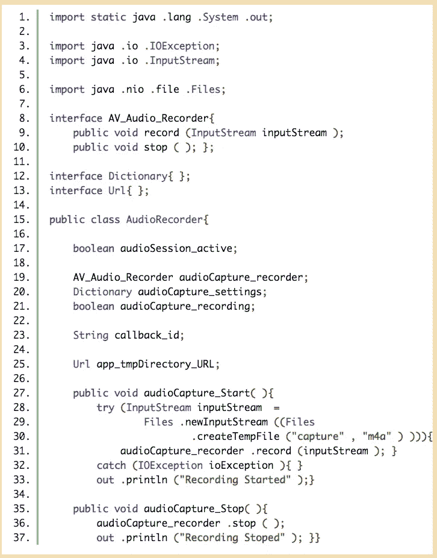
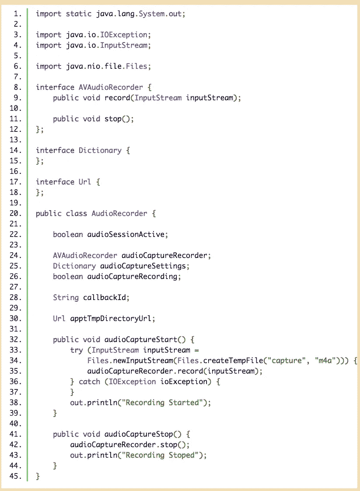
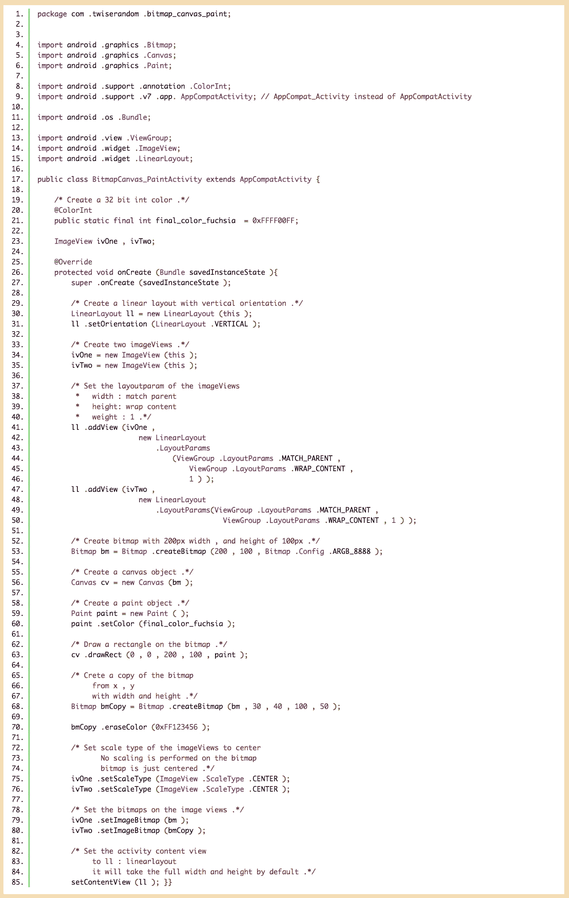
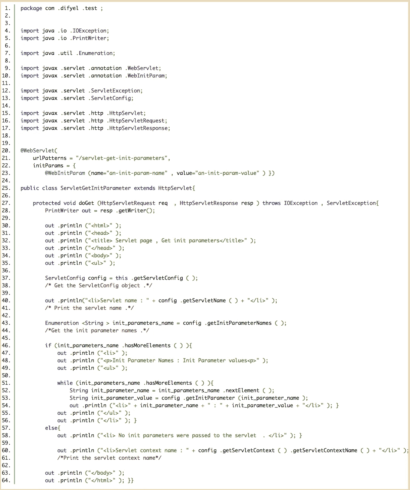

# 一种更好的方式来编写代码，使其更具可读性和可理解性！

> 原文：<https://medium.com/analytics-vidhya/a-better-way-to-write-code-for-it-to-be-more-readable-and-understandable-f498a8da5a9d?source=collection_archive---------20----------------------->

这个想法是，一个词必须是可读的，第一眼就能理解。所以每个单词在视觉上都有*的可用意义。例如，假设正在编写一个录音机 api:*

****

*所以想法是要有一个 ***字可读且可理解的代码*** ，这可以这样做:*

****一变*** ，如`audioCapture_recorder`，必须全是小写，其目力有意义的字，必须用`_`隔开。*

****一法*** ，如`audioCapture_Start`，其首字，全为小楷，其后续字，以大写字母开头，与其成字，用`_`隔开。*

****接口，以及*** 类，如`AV_Audio_Recorder`，它们的每一个字都必须有第一个字母，大写，并形成目力有意义的单词，用`_`隔开。*

****空格是*** 非常重要的用法。它用于分离导入，以及方法和字段的调用。它还用于将参数列表与方法名分开。*

****括号和圆括号*** ，被累积到一个地方，使代码看起来更简洁。*

*一个安卓代码，说明了 ***这个概念，这个概念*** ，原代码可以在[这里找到](https://twiserandom.com/android/graphics/what-is-a-bitmap-in-android/#BitmapcreateBitmapBitmap_src)。*

**

****再比如*** ，其中的原始代码，可以在[这里找到](https://difyel.com/javaee/servletconfig-and-the-config-implicit-object-a-tutorial/)，靠近页面底部。*

**

**最初发表于 2021 年 2 月 12 日*[*https://twiserandom.com*](https://twiserandom.com/discuss/a-better-way-to-write-code-for-it-to-be-more-readable-and-understandable/)*。**