# 浅析西雅图的空中旅馆

> 原文：<https://medium.com/analytics-vidhya/a-brief-analysis-of-airbnbs-in-seattle-5770f058ce26?source=collection_archive---------8----------------------->


在这篇文章中，我将使用 python 探索 Aribnb 关于西雅图的数据(从 2016 年开始)。

首先……我们需要了解 Airbnb 是什么，与他们自己的定义保持一致[Airbnb 是一个在线社区/平台，允许其用户列出他们在世界任何地方的空间并预订独特的住宿，所以基本上是一个巨大的酒店，每个房间都由不同的人拥有和管理。](https://www.airbnb.com/help/article/2503/what-is-airbnb-and-how-does-it-work)

现在，让我们想象一下，我们想要成为这个社区的一部分，开始过一些美好的经历，但也开始通过利用我们拥有的额外房间或投资一处房产来积累一些本杰明……我们首先想到的是如何正确地做这件事，我们应该收取多少费用？我们应该提供什么才能有竞争力？我们的定价策略每季应该改变多少？

利用 Kaggle 的[西雅图 Airbnb 开放数据](https://www.kaggle.com/airbnb/seattle/data)和 python 上非常有用的数据分析工具集，在这篇文章中，我将尝试回答以下三个问题:

*   哪一个社区最适合开设 airbnb？
*   每月的价格变化有多大？
*   做一个超级主持人有区别吗？

包含所有代码的 jupyter 笔记本将在这个[链接](https://github.com/sholopolis/medium_seattle_airbnb_analysis)上

## 让我们看看现有的数据

首先，让我们导入必要的库…

然后我们可以在西雅图 Airbnb 开放数据网站下载这 3 个文件，并查看里面的内容…

让我们看看日历

```
calendar dataframe
Shape: (1393570, 4)
------------------------
Proportion of NAN Values:
------------------------
listing_id     0.0
date           0.0
available      0.0
price         32.9
dtype: float64Proportion of NAN values on price column by value on available col:
------------------------
           price
available       
f          100.0
t            0.0|    |   listing_id | date                | available   | price   |
|---:|-------------:|:--------------------|:------------|:--------|
|  0 |       241032 | 2016-01-04 00:00:00 | t           | $85.00  |
|  1 |       241032 | 2016-01-05 00:00:00 | t           | $85.00  |
|  2 |       241032 | 2016-01-06 00:00:00 | f           | nan     |
|  3 |       241032 | 2016-01-07 00:00:00 | f           | nan     |
|  4 |       241032 | 2016-01-08 00:00:00 | f           | nan     |------------------------
number of days each listing has : [365]dates describe
------------------------
count                 1393570
unique                    365
top       2016-07-24 00:00:00
freq                     3818
first     2016-01-04 00:00:00
last      2017-01-02 00:00:00
Name: date, dtype: object
```

日历数据框架包含每天的供货情况和清单数据，以及当天的价格，我们有每个清单全年的数据，现在是清单数据框架...

```
Shape : (3818, 92)
------------------------
Proportion of NAN Values:
------------------------
license                        100.0
square_feet                     97.0
monthly_price                   60.0
security_deposit                51.0
weekly_price                    47.0
notes                           42.0
neighborhood_overview           27.0
cleaning_fee                    27.0
transit                         24.0
host_about                      22.0
host_acceptance_rate            20.0
review_scores_accuracy          17.0
review_scores_checkin           17.0
review_scores_value             17.0
review_scores_location          17.0
review_scores_cleanliness       17.0
review_scores_communication     17.0
review_scores_rating            17.0
last_review                     16.0
first_review                    16.0
reviews_per_month               16.0
space                           15.0
host_response_rate              14.0
host_response_time              14.0
neighbourhood                   11.0
thumbnail_url                    8.0
medium_url                       8.0
xl_picture_url                   8.0
host_neighbourhood               8.0
summary                          5.0
dtype: float64columns
------------------------
id                            longitude                       
listing_url                   is_location_exact               
name                          property_type                   
summary                       room_type                       
space                         accommodates                    
description                   bathrooms                       
experiences_offered           bedrooms                        
neighborhood_overview         beds                            
notes                         bed_type                        
transit                       amenities                       
thumbnail_url                 price                           
medium_url                    weekly_price                    
picture_url                   monthly_price                   
xl_picture_url                security_deposit                
host_id                       cleaning_fee                    
host_url                      guests_included                 
host_name                     extra_people                    
host_since                    minimum_nights                  
host_location                 maximum_nights                  
host_about                    calendar_updated                
host_response_time            has_availability                
host_response_rate            availability_30                 
host_acceptance_rate          availability_60                 
host_is_superhost             availability_90                 
host_thumbnail_url            availability_365                
host_picture_url              calendar_last_scraped           
host_neighbourhood            number_of_reviews               
host_listings_count           first_review                    
host_total_listings_count     last_review                     
host_verifications            review_scores_rating            
host_has_profile_pic          review_scores_accuracy          
host_identity_verified        review_scores_cleanliness       
street                        review_scores_checkin           
neighbourhood                 review_scores_communication     
neighbourhood_cleansed        review_scores_location          
neighbourhood_group_cleansed  review_scores_value             
city                          requires_license                
state                         jurisdiction_names              
zipcode                       instant_bookable                
market                        cancellation_policy             
smart_location                require_guest_profile_picture   
country_code                  require_guest_phone_verification
country                       calculated_host_listings_count  
latitude                      reviews_per_month               
None
```

这里，每个列表有 92 列，我们有关于列表本身的信息、关于主机的信息、地理信息、评论摘要、可用性等。我们还删除了一些列(“scrape_id”、“last_scraped”、“license”、“square _ feet”)，因为它们要么是不相关的，要么是缺少了太多对以后有用的值。

接下来是我们的评论数据框架:

```
Shape : (84849, 6)
------------------------
Proportion of NAN Values:
------------------------
comments         0.0
listing_id       0.0
id               0.0
date             0.0
reviewer_id      0.0
reviewer_name    0.0
dtype: float64Dates describe
------------------------
count                   84849
unique                   1930
top       2015-09-21 00:00:00
freq                      580
first     2009-06-07 00:00:00
last      2016-01-03 00:00:00
Name: date, dtype: object
```

在这一页上，我们有每个列表的评论，没有任何列缺少值，看起来我们有比日历数据框更广泛的日期范围。

# 问题

## 哪一个社区最适合开设 Airbnb？

要回答这个问题，我们需要使用地理数据，为此，我们将使用在[西雅图地理数据站点](https://data-seattlecitygis.opendata.arcgis.com/datasets/SeattleCityGIS::city-clerk-neighborhoods/about)上可用的数据集，其中包含城市职员使用的街区边界。对于这个任务，我们将使用 [**Geopandas**](https://geopandas.org/) (增加了地理空间分析功能的 pandas)首先，让我们来看看 Seattle neighborhoods 数据集中的内容。

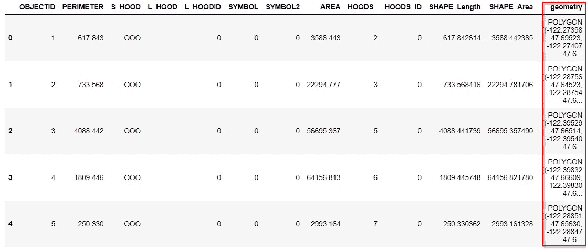

太棒了，geometry 列包含西雅图每个邻域的多边形([shapely polygons](https://shapely.readthedocs.io/en/stable/manual.html#polygons))。geo pandas 使我们只需调用 geodataframe 上的 plot 方法即可轻松绘制该列。

```
seattle_shapes.plot()
```

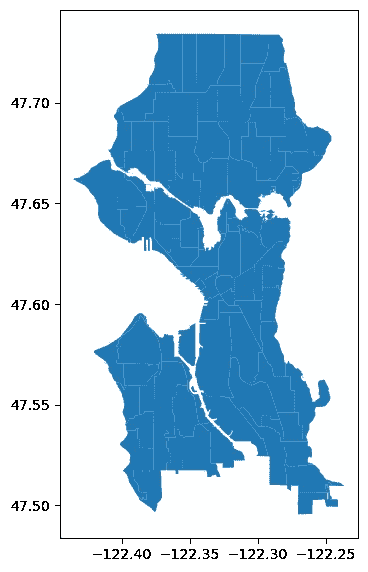

现在，我们可以使用 [geopandas 空间连接函数](https://geopandas.org/docs/user_guide/mergingdata.html#spatial-joins)来确定每个列表的邻域，但首先，我们需要将列表数据框架转换为地理数据框架，并将每个列表的位置作为其几何。

```
geo_listings = gpd.GeoDataFrame(listings, geometry=gpd.points_from_xy(listings.longitude, listings.latitude))# because of warning, not necessary
geo_listings.crs = seattle_shapes.crs
```

让我们把它标在西雅图社区地图上，以便再次确认。

```
ax = seattle_shapes.plot(color='white', edgecolor='black')
geo_listings.plot(ax=ax, color="green", markersize=1)
```

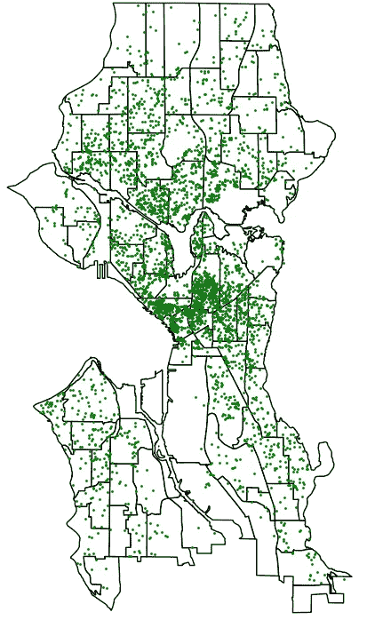

太好了，现在我们可以将每个列表分配到其对应的社区，并使用它来计算每个社区的 Airbnb 列表数量及其平均价格。

让我们想象一下…

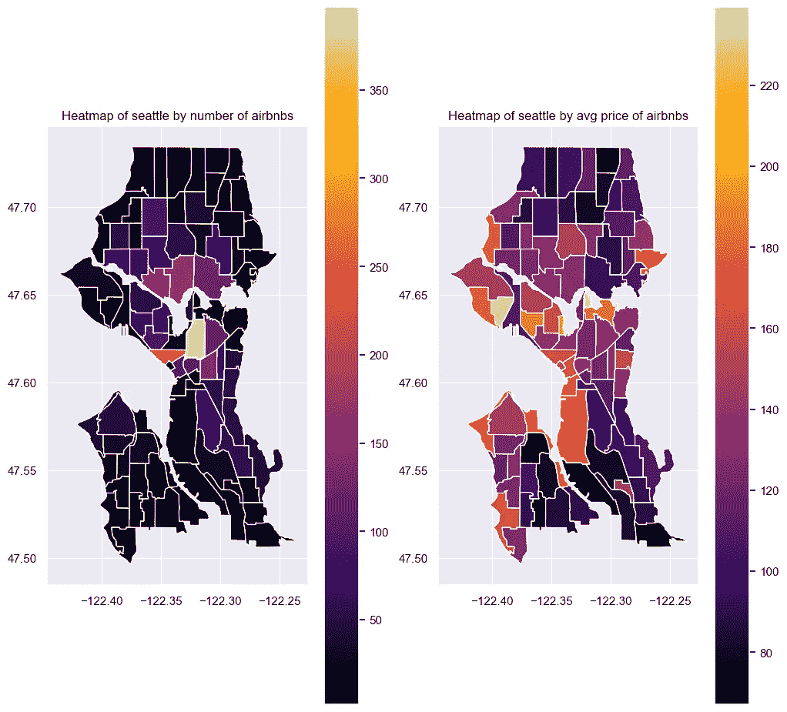

附近的“airbnb 密度”有一个清晰的模式，越靠近中心的 Airbnb 越多，我自己不是西雅图人，我想谷歌一下这是为什么。根据 Santorini Dave 在他的帖子[中所说，西雅图最适合住宿的地方](https://santorinidave.com/best-places-seattle):

> 对于大多数游客来说，西雅图最好的住宿地点是市中心(以及邻近的派克市场)。西雅图大部分最好的酒店、顶级餐厅、景点和商店都坐落在这里——所有这些都在一个密集、紧凑、适合步行的区域内。从这里看普吉特湾的景色令人难以置信，当地的交通线路(轻轨、公共汽车、有轨电车和单轨铁路)汇集在市中心，这使得在没有汽车的情况下游览大西雅图变得很容易。

就平均价格而言，它们真的无处不在…

我们可以使用这两个变量来指导自己并回答这个问题，我们想要的是在一个受欢迎且平均价格高的社区有一个 airbnb 列表**，但是，**我们在这里遗漏了一个非常重要的部分，房价，我们需要这个信息来给出 airbnb 平均价格的背景，并对我们可能获得的 ROI 有一个更好的感觉。

幸运的是，我们可以从 [Geoda Data en Lab 的网站](https://geodacenter.github.io/data-and-lab/KingCounty-HouseSales2015/) (2015)获得这些数据，并轻松计算出每平方英尺的平均价格。

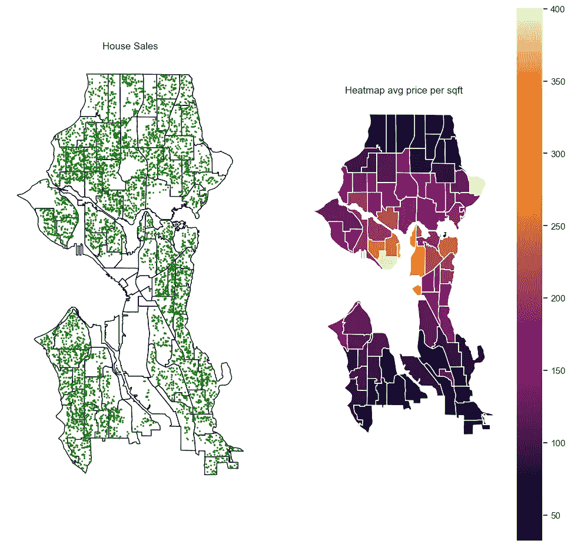

你可能注意到的第一件事是，在从谷歌地图和 [youtube](https://www.youtube.com/watch?v=8OY9teoWmz8) 上查看这些社区后，这些图上没有房屋销售信息。这是有道理的，这些是西雅图工业区的一部分。

最后，我们可以回答这个问题，当然，答案会因人而异，取决于他们能够承担多少投资。我想说最好给出一个指导方针而不是一个单一的答案，我们将在我们调查的 3 个轴(平均 airbnbs 数量、平均挂牌价格、平均每平方英尺价格)的每一个轴上的 10 个[分位数](https://en.wikipedia.org/wiki/Quantile)中对每个社区进行分类，以指导我们的决策。

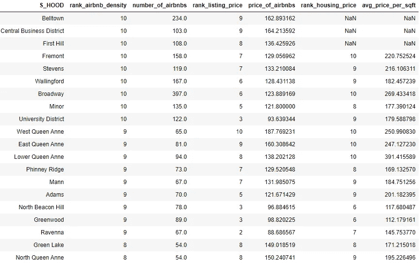

哎呀，我们没有 airbnbs 密度最高的 3 个社区的每平方英尺平均价格的数据…

利用我们所掌握的信息，让我们试着计算一下这三个社区的每平方英尺的平均价格。在谷歌上搜索房价，我找到了房地产服务网站 Redfin，该网站提供 5 年的住宅市场分析数据，这正是我们需要的，因为我们正在分析 2016 年的数据，这篇文章写于 2021 年。

我们只需查找该社区，然后点击“查看市场洞察”链接，便可获得以下数据:

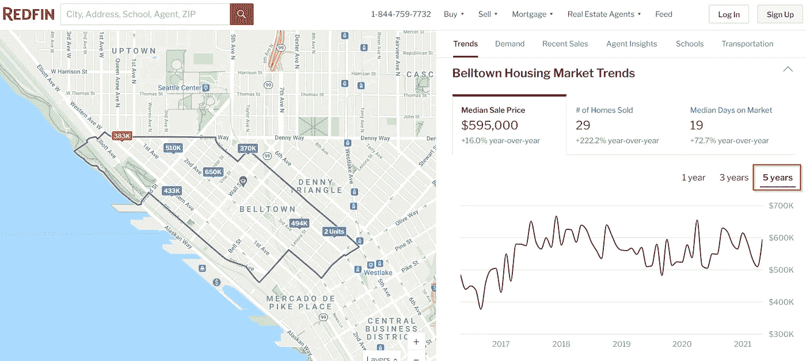

[链接至 Belltown 的市场洞察页面](https://www.redfin.com/neighborhood/188/WA/Seattle/Belltown/housing-market)

因此，这里我们有当前每平方英尺的平均价格(在页面底部)和过去 5 年的房价中值，我们将应用 2016 年至 2021 年房价中值与当前每平方英尺平均价格的增长率来计算 2016 年每平方英尺的平均价格。

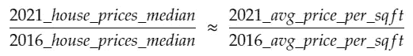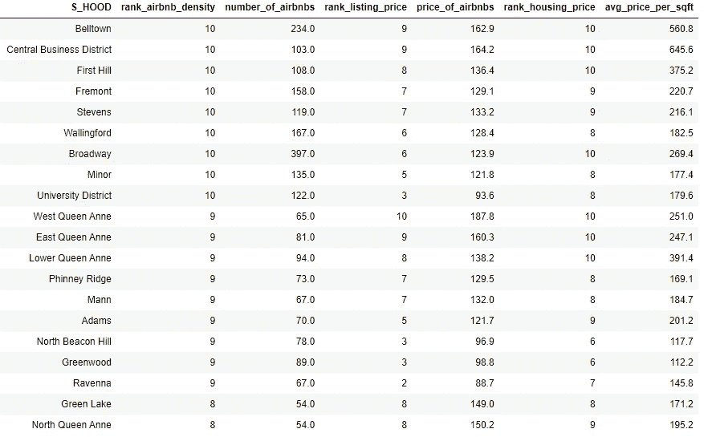

现在，我们可以用这张表来指导我们的决定，是买房子还是看看我们的房产与其他房产相比如何。

## 每月的价格变化有多大？

接下来，我们想知道一年中的价格变化，这将有助于了解每月的需求变化，也有助于我们正确定价。

由于不同列表的价格差异很大，为了能够比较它们的价格变化，我们需要使用相对于一年中每个列表的价格分布显示这些变化的单位。为此，我们将计算他们价格的 [z 值](https://en.wikipedia.org/wiki/Standard_score)以及他们相对于年平均价格的百分比变化。

让我们想象一下…

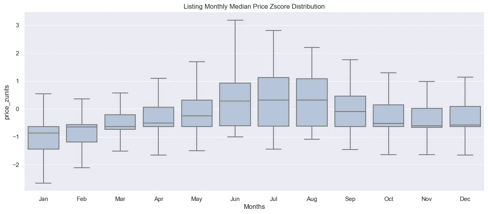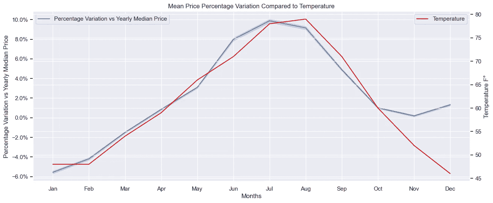

查看 z 得分图，我们可以看到价格变化很大，尤其是在 6 月份，价格可以达到平均值的 3 个标准差。第二张图显示了标价与其年中值的变化情况，也显示了温度在一年中的变化情况，很明显，天气在这里起了很大的作用，由于天气条件好，随后有更多的活动，6 月至 8 月的价格最高(比年中值高 7%)，此后，随着冬季从 10 月到 2 月的到来，价格下降，由于假期，11 月至 12 月的价格可能不会下降那么多。

## 做一个超级主持人有区别吗？

首先，我们需要定义成功，以便能够判断它是否有所不同，一个简单而实用的定义是评论数量乘以平均总体评论分数。

然后我们可以画出成功的分布如何在超级宿主和非超级宿主之间进行比较…

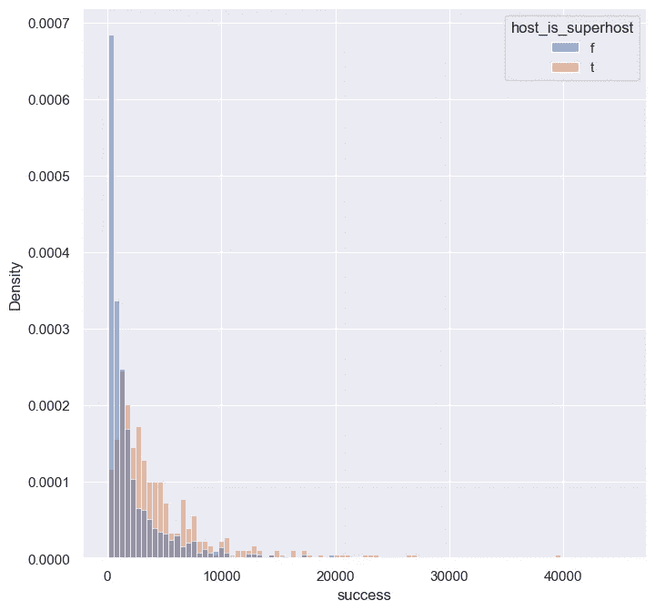

查看这两种分布，我们可以清楚地看到，超级主机平均比非超级主机做得更好，但是为了检查我们的假设，我们应该应用统计测试，因为这两种分布显然不是正态分布，我们必须进行[曼恩-惠特尼 *U* 测试](https://en.wikipedia.org/wiki/Mann%E2%80%93Whitney_U_test)。

```
2.42e-09
```

正如所料，我们测试的 p_value 证实了作为一个超级主机确实有所不同。

# 希望你觉得这有趣和/或有用，谢谢你的阅读！