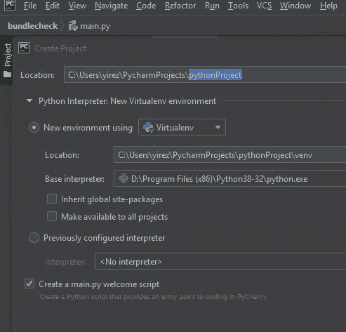
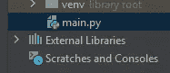
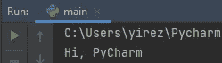
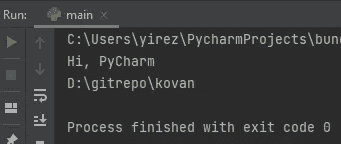
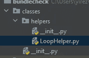
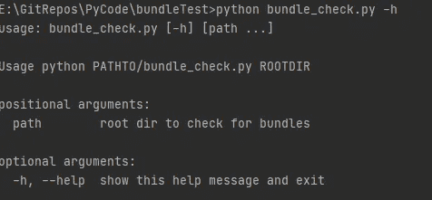

# Python 的(简短)速成课程

> 原文：<https://medium.com/analytics-vidhya/a-brief-crash-course-in-python-b172ed041d74?source=collection_archive---------15----------------------->

我们遇到了检查包文件的需要，以查看是否所有标签都被正确地添加到了所有相关文件中。由于这个脚本(或我们使用的任何东西)将从我们的 Jenkins 管道中使用，我的第一反应是 bash，但是，为什么我们不使它有趣些，用 python 来做呢？我没有这方面的经验，所以让我们直接开始吧。

首先，让我们从 [Python](https://www.python.org/downloads/) 本身开始，然后安装 [PyCharm 社区](https://www.jetbrains.com/pycharm/download/)，因为它是免费的，看起来很有前途。它和 Intellij IDEA 有着相同的界面，所以这并不是一个太不和谐的变化。

现在让我们打开 PyCharm 并选择新项目，用下面的配置创建一个。



创建一个 main.py 来看看主类的结构

所以现在，我们应该有下面的位，没有别的。



主类


要运行/调试的配置

当您通过上面绿色的 run 按钮运行它时，您应该看到以下内容



耶，我们现在可以把 python 添加到我们的简历中了

我们的任务是检查一个目录中的一些文件，但是这个目录会随着每次构建而改变，因此我们需要通过一个参数来获取这个目录。因此，让我们编辑我们的配置


添加您想要检查包的任何目录

最后，代码。让我们谈一谈。打开 main.py 并粘贴下面的代码。

```
import sys

def print_hi(name):
    print(f'Hi, {name}')

if __name__ == '__main__':
    print_hi('PyCharm')
    try:
        directory_name = sys.argv[1]
        print(directory_name)
    except:
        print('Please pass directory_name')
```

因此，在这里，我们导入 sys 模块，它执行以下操作(您可以在导入语句中通过 ctrl+左键单击 sys 来查看详细信息)。简而言之，它允许访问 cli 参数。

```
*"""
This module provides access to some objects used or maintained by the interpreter and to functions that interact strongly with the interpreter.
Dynamic objects:

argv -- command line arguments; argv[0] is the script pathname if known
...*
```

***if*** 位是主类的开始。显然，所有代码都必须以空行结束。带有***print_hi(' py charm ')***的下一部分在它上面一点的位置调用 print _ hi 方法，并打印传递的参数。还要注意导入、方法定义和主类之间的两行空格。Pyhton 关心这些事情:d .缩进也很重要，因为没有像其他高级语言那样定义开始和结束的{}。

```
def print_hi(name):
    print(f'Hi, {name}') if __name__ == '__main__':
    print_hi('PyCharm')
```

另外，注意这一点。

```
 try:
        directory_name = sys.argv[1]
        print(directory_name)
    except:
        print('Please pass directory_name')
```

当您运行 main.py 时，您应该会得到；



让我们从 main 中删除 def print_hi 方法及其用法，然后继续在子目录中创建新文件，这样我们就不会像野蛮人一样将代码写入 main.py。我假设这个逻辑在 python 中也成立。

我创造了一个这样的 LoopHelper。注意 __init__。py 文件，它显然允许我们从 main 导入新文件(如果需要，也可以从其他文件导入)。



LoopHelper.py 内容是这样的；

```
import os

def loop_through(dir_name):
    directory = os.fsencode(dir_name)
    for file in os.listdir(directory):
        filename = os.fsdecode(file)
        if filename.endswith(".properties"):
            print(os.path.join(directory, filename))
            continue
        else:
            continue 
```

所以基本上，我们已经创建了一个带有参数**目录名**的方法 **loop_through** 。我们使用 fsencode 方法对**目录名**进行适当编码。然后我们列出并遍历文件，解码文件以获得路径，然后什么也不做。

```
***os.fsencode()*** method in Python is used to encode the specified filename to the filesystem encoding with ‘*surrogateescape*‘ error handler, or ‘*strict*‘ on Windows;
```

让我们使用 main 中的新类，将它添加到最上面。基本上是文件夹结构，然后是类名。

```
from classes.helpers import LoopHelper...
""" 
usage is like;
FileName.ClassName.whateverMethod"""LoopHelper.LoopHelper().loop_through(sys.argv[1])
```

因此，有了这些信息，让我们修改我们的 main.py 如下，而我们在这里，让我们改变它的名字也像 bundle_check.py

```
from classes.helpers import LoopHelper
import sys
import argparse

if __name__ == '__main__':
    parser = argparse.ArgumentParser(
        description='''Usage python PATHTO/bundle_check.py ROOTDIR ''')
    parser.add_argument('path', nargs='*', default=[1], help='root dir to check for bundles')
    args = parser.parse_args()

    print("Bundle check in dir: " + sys.argv[1])
    LoopHelper.LoopHelper().loop_through(sys.argv[1])
```

这里有一些额外的东西。最后两行是我们知道的，它表示我以 dir 的形式获得了这个参数，并将 arg 传递给 loop_through 方法。

如果有人使用我们的脚本，比如弹出的 **python bundle_check.py -h** ，上面的几行是为了提供帮助；



现在主要的工作是 LoopHelper 类。我把它分成了几个部分，

```
import os
import mmap
import sys class LoopHelper:
    *"""
    Main Helper class containing the logic for bundle checking.

    Depending on the failed value;
    return sys.exit 1 if failed is true,
    return sys.exit 0 if failed is false
    """* TR_POSTFIX = '_tr.'
    EN_POSTFIX = '_en.'
    BUNDLE_EXT = 'properties'
    TR_BUNDLE_EXT = TR_POSTFIX + BUNDLE_EXT
    EN_BUNDLE_EXT = EN_POSTFIX + BUNDLE_EXT
    failed = 0
...
```

LoopHelper 类有几个常量，我们将使用它们来检查文件匹配操作。失败是我们将要玩的一个职业领域。如果我们得到一个包不匹配，这将被设置，所以应用程序将退出代码 1，否则应用程序将退出代码 0。

现在让我们看看方法；

```
def analyse_files(self, root_dir):
def nitpick(self, source_file, target_file, target_postfix):
```

analyse_files 使用目录来工作，并使用 os.walk 递归遍历文件的所有目录。对于目录中的每个文件，它将目录名与文件名合并以获得完整的路径。

然后，它检查文件名是否与 _tr.properties 的包扩展名匹配，并生成预期的 _en 等价物。这两个文件路径都被发送到 pick 方法进行检查。这同样适用于相反的情况。

如果出现问题，它会设置失败标志并列出有问题的文件。

```
def analyse_files(self, root_dir):
    *"""
    Prepares for analyses of files in work dir
    Checks for existence of TR_BUNDLE_EXT file, tries to find related EN_BUNDLE_EXT file and sends
    it to nitpick method and vice versa.

    Sets failed to 1 if any label or file is missing.* ***:param*** *root_dir: the root dir to check for bundles
    """* for dir_path, dir_name, files in os.walk(root_dir):
        for file in files:
            complete_path = os.path.join(dir_path, file)
            try:
                if file.endswith(self.TR_BUNDLE_EXT):
                    tr_file_path = ""
                    en_file_path = complete_path.replace(self.TR_POSTFIX, self.EN_POSTFIX)
                    self.nitpick(complete_path, en_file_path, self.EN_POSTFIX)  # check for missing tr items in en

                if file.endswith(self.EN_BUNDLE_EXT):
                    en_file_path = ""
                    tr_file_path = complete_path.replace(self.EN_POSTFIX, self.TR_POSTFIX)
                    self.nitpick(complete_path, tr_file_path, self.TR_POSTFIX)  # check for missing en items in tr
            except Exception as generic:
                self.failed = 1
                print(generic)
                print('Related files:\n' + (en_file_path or complete_path)
                      + '\n' + (tr_file_path or complete_path) + '\n')
```

现在吹毛求疵的方法完全是另外一回事。它接受一个带有目标后缀的源文件和目标文件(因为我不想再费事去找它了)，并打开 source 进行循环，目标作为只读内存映射来查找所述标签。如果它不能在目标中找到标签，它设置失败，但继续前进。这是为了向开发人员展示所有缺失的包，并减轻我们不断构建的负担。

```
def nitpick(self, source_file, target_file, target_postfix):
    *"""
    Tries to find labels in source file in target file* ***:param*** *source_file:* ***:param*** *target_file:* ***:param*** *target_postfix: The target postfix to easily find missing label harboring files
    """* with open(source_file) as file, open(target_file) as file_en:
        mmap_en_file = mmap.mmap(file_en.fileno(), 0, access=mmap.ACCESS_READ)  # get mmap for en file
        for bundle_line in file:  # bundle lines in source file
            if bundle_line.find('=') >= 0:
                bundle_key = bundle_line[0:bundle_line.find('=')].strip()  # get bundle key

                if mmap_en_file.find(bundle_key.encode()) == -1:
                    # if not able to find line in target file, set as failed
                    print('Key-val pair -> ' + os.path.basename(
                        source_file) + ' : ' + bundle_key + ' not found in ' + target_postfix)
                    self.failed = 1
```

实际上差不多就是这样。此脚本使用以下命令运行；

```
python bundle_check.py DIR_TO_CHECK
```

可以集成到管道中，如下所示，因为它返回失败代码 1。

```
python bundle_check.py DIR_TO_CHECK && echo 'OK' || echo 'Not OK'
```

有些地方可以改进，我们很乐意听听您的想法。感谢阅读。