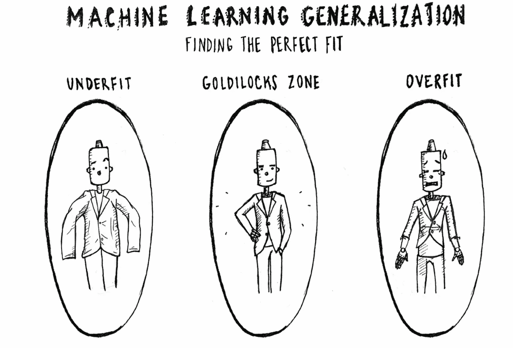
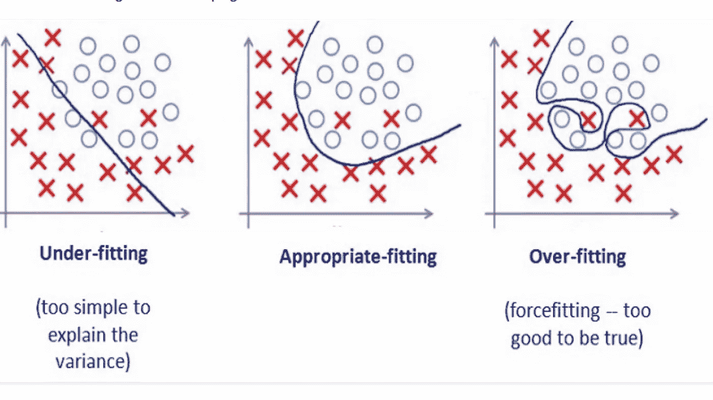

# 过度拟合、欠拟合、方差和偏差的简要说明

> 原文：<https://medium.com/analytics-vidhya/a-brief-explanation-of-overfitting-underfitting-variance-and-bias-d407c4c63bc8?source=collection_archive---------21----------------------->

我知道这是一个非常基本的概念，许多机器学习爱好者可以用比我更好的语言来表达它，但尽管它们可能是基本的，但有很多次(比我想接受的次数更多)，我真的对方差和偏差之间的差异感到困惑，或者像**高方差**或**低偏差**这样的术语是什么意思

## 偏差和方差(它们到底是什么)？

偏差是 ML 算法为学习给定数据下的表示而做出的一组假设。简而言之，如果一个模型在训练数据上表现很好，就说它有**低偏差**(因为它训练得很好，不做任何假设，知道发生了什么)，所以如果一个模型对数据做了更多的假设(是的，你猜对了)，它就有**高偏差。**

**低偏差算法**的一些例子是 k 近邻和支持向量机，而逻辑回归和朴素贝叶斯等算法一般是**高偏差算法。**

ML 中的方差是指数据中存在的信息。因此，**高方差**指的是 ML 模型能够很好地捕捉提供给它的数据中存在的整体信息的质量，而**低方差**表达的正好相反。SVM 是高方差算法的一个例子，而朴素贝叶斯是低方差算法的一个例子。

## 过度拟合和欠拟合

当 ML 模型在训练数据上表现很好，但在来自测试集或验证集的数据上表现很差时，这种现象被称为**过度拟合。**(就像一匹马只能在它以前练习过的赛道上以最大速度奔跑，而不能在锦标赛(真实世界)的赛道上奔跑)。发生这种情况的原因可能有很多，这里有一些常见的原因。

这个模型在数据方面非常复杂。在这种情况下，具有很高层次的决策树和具有许多层的神经网络是模型复杂性的很好例子。

*数据有很多特征，但人口实例很少。*

**过拟合**的模型也被视为非常**高方差的模型。正则化**是最广泛使用的防止过度拟合的方法。

如果一个模型在训练数据上惨败，就说这个模型有一个**高偏差**，这个模型是**欠拟合**。也可能有很多原因导致不合适。最常见的有:

这个模型太简单了，以至于无法学习给它的数据的底层表示。

在将数据输入到 ML 模型之前，数据的特征没有被很好地设计。

从我们从上面学到的东西中，我们可以得出结论，过度拟合的 ML 模型可能会遇到 T2 高方差的问题，而 T4 拟合不足的模型可能会遇到高偏差的问题。

结束了！(至少目前如此)

**PS** :如果你有任何疑问，你可以给我发邮件[这里](http://pavankunchalapk@gmail.com/)，你可以在我的 linkedin 上联系我[这里**这里**](https://www.linkedin.com/in/pavan-kumar-reddy-kunchala/) ，你也可以在我的 Github 上查看我的其他代码(里面有非常酷的东西)这里 [**这里**](https://github.com/Pavankunchala)

我也在寻找深度学习和计算机视觉领域的自由职业机会，如果你愿意合作，请给我发邮件([pavankunchalapk@gmail.com](mailto:pavankunchalapk@gmail.com))

祝你有美好的一天！