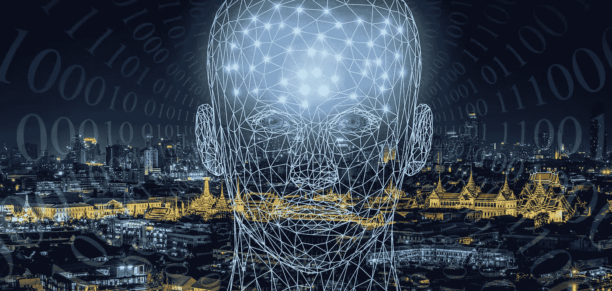

# 人工智能简史

> 原文：<https://medium.com/analytics-vidhya/a-brief-history-of-artificial-intelligence-a45ac033b79b?source=collection_archive---------29----------------------->

人工智能(AI)已经成为当今的一个常用词，它不再让我们惊讶于我们日常生活中使用的一些基于人工智能的系统能够实现什么。然而，这是几十年进步的结果。在这篇文章中，我向你介绍人工智能的简史。几乎所有这些都是斯图尔特·j·拉塞尔和彼得·诺维格所著的《人工智能的现代方法》一书中一章的总结。在这里可以找到:

