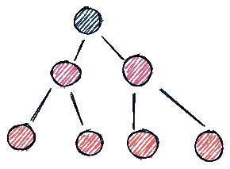
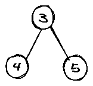

# 使用 Python 的二叉查找树(BST)简介

> 原文：<https://medium.com/analytics-vidhya/a-brief-introduction-to-binary-search-tree-bst-in-python-2da1813abd7e?source=collection_archive---------12----------------------->


为了更好地理解，一个倒置的树干的插图。

## 为什么叫树？

它被称为“树”,因为它隐约像一个带树枝的倒树干。

*   单词“binary”表示树中的每个“节点”最多可以有 2 个子节点(左或右)。
*   节点可以有 0、1 或 2 个子节点。没有任何子节点的节点有时也被称为“叶子”。
*   顶部的单个节点称为“根”节点，它通常是执行搜索、插入等操作的地方。开始吧。

# 二叉树



首先，我们将创建一个简单的二叉树(没有任何额外的属性),包含数字作为节点中的键。这里有一个例子:



```
#simple class representing a node within a binary tree.class **TreeNode**:
    def **__init__**(self, key):
        self.key = key
        self.left = None
        self.right = None#create objects representing each node of the above treenode0 = TreeNode(3)
node1 = TreeNode(4)
node2 = TreeNode(5)#c*onnect* the nodes by setting the .left and .right properties of the root node. And we're done! We can create a new variable *tree* which simply points to the root node, and use it to access all the nodes within the tree.node0.left = node1
node0.right = node2#Going forward, we'll use the term "tree" to refer to the root node. The term "node" can refer to any node in a tree, not necessarily the root.
```

## 遍历二叉树

一个*遍历*指的是恰好访问一棵树的每个节点一次的过程。*访问一个节点*一般是指将该节点的键添加到一个列表中。有三种方法可以遍历二叉树并返回访问过的键的列表:

***依次遍历***

1.  以递归方式遍历左边的子树。
2.  遍历当前节点。
3.  按顺序递归遍历右边的子树。

***前序遍历***

1.  遍历当前节点。
2.  递归前序遍历左子树。
3.  递归地遍历右边的子树。

***后序遍历***

1.  递归后序遍历左子树。
2.  递归后序遍历右边的子树。
3.  遍历当前节点。

```
#implementation of inorder traversal of a binary treedef **traverse_in_order**(node):
    if node is None: 
        return []
    return(traverse_in_order(node.left) + 
           [node.key] + 
           traverse_in_order(node.right))
```

## 二叉树的高度和大小

二叉树的*高度/深度*定义为从其根节点到叶子的最长路径的长度。

```
#computation of height/depth of a binary treedef **tree_height**(node):
    if node is None:
        return 0
    return 1 + max(tree_height(node.left), tree_height(node.right))# computation of number of nodes in a binary treedef **tree_size**(node):
    if node is None:
        return 0
    return 1 + tree_size(node.left) + tree_size(node.right)
```

# 二叉查找树

二叉查找树或 BST 是满足以下条件的二叉树:

1.  任何节点的左子树只包含键小于该节点键的节点
2.  任何节点的右子树只包含键大于该节点键的节点

```
#Function to check if a binary tree is a binary search tree and to find the minimum and maximum key in a binary treedef **is_bst**(node):
    if node is None:
        return True, None, None

    is_bst_l, min_l, max_l = is_bst(node.left)
    is_bst_r, min_r, max_r = is_bst(node.right)

    is_bst_node = (is_bst_l and is_bst_r and 
              (max_l is None or node.key > max_l) and 
              (min_r is None or node.key < min_r))

    min_key = min(remove_none([min_l, node.key, min_r]))
    max_key = max(remove_none([max_l, node.key, max_r]))

    *print(node.key, min_key, max_key, is_bst_node)*

    return is_bst_node, min_key, max_key
```

## BST 中的插入

使用 BST 属性有效地执行插入:

1.  从根节点开始，将要插入的键与当前节点的键进行比较
2.  如果键更小，递归地将它插入到左子树中(如果它存在的话),或者如果左子树不存在，将它作为左子树附加。
3.  如果键比较大，递归地将它插入到右边的子树中(如果存在的话),或者如果右边的子树不存在，将它作为右边的子树附加。

```
#Implementation of insertiondef **insert**(node, key, value):
    if node is None:
        node = BSTNode(key, value)
    elif key < node.key:
        node.left = insert(node.left, key, value)
        node.left.parent = node
    elif key > node.key:
        node.right = insert(node.right, key, value)
        node.right.parent = node
    return node
```

## 在 BST 中查找特定的节点

```
#Implementation of finding a nodedef **find**(node, key):
    if node is None:
        return None
    if key == node.key:
        return node
    if key < node.key:
        return find(node.left, key)
    if key > node.key:
        return find(node.right, key)
```

## 更新 BST 中的值

```
#Implementation of updatedef **update**(node, key, value):
    target = find(node, key)
    if target is not None:
        target.value = value
```

## 按照键的排序顺序检索 BST 中存储的所有键-值对

```
def **list_all**(node):
    if node is None:
        return []
    return list_all(node.left) + [(node.key, node.value)] + list_all(node.right)
```

# 二分搜索法树的应用

BST 由于其有序的结构而被广泛应用。

*   BST 用于索引和多级索引。
*   它们也有助于实现各种搜索算法。
*   这有助于维护有序的数据流。
*   使用自平衡 BST 在内部实现 TreeMap 和 TreeSet 数据结构。