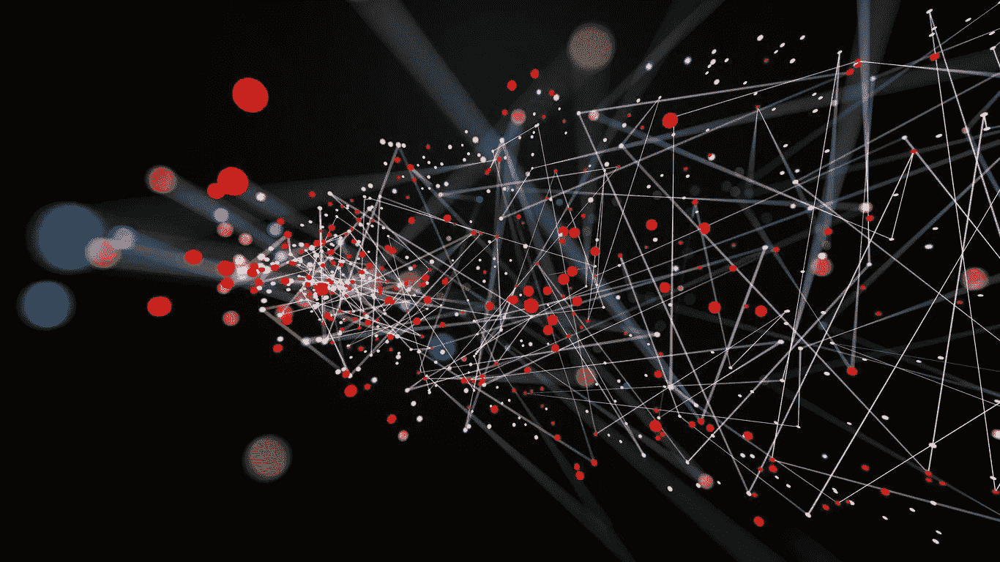

# 深度学习简介

> 原文：<https://medium.com/analytics-vidhya/a-brief-introduction-to-deep-learning-ccfd901d4611?source=collection_archive---------16----------------------->

深度学习是机器学习的一个子集，使用多层神经网络从原始数据中提取有用的特征。它广泛推进了计算机视觉、语音识别和自然语言处理等各个领域的最新技术。

本文旨在通过涵盖以下几点来介绍深度学习:

*   机器学习和深度学习有什么区别？
*   深度学习网络是如何工作的？
*   深度学习网络的应用

# 机器学习与深度学习

深度学习是机器学习的一类；因此，它被认为是一种具有特殊能力的机器学习技术。如图 1 所示，机器学习侧重于计算机在没有特定预编程规则的情况下进行学习。它从一组特定的给定数据和标签中找出规则。

图 1:传统编程与机器学习

深度学习通过模仿人类大脑的结构来完成同样的任务。它使用多层神经网络，无需人工干预即可计算出规则。在机器学习中，需要人工干预来执行特征提取和数据标注。而在深度学习中，多层互连节点允许通过渐进的复杂深度学习算法来识别和提取特征和模式，这使得深度学习能够进行无监督学习。

图 2:机器学习与深度学习— [图源](https://serokell.io/blog/ai-ml-dl-difference)

# 深度学习是如何工作的？

如前所述，深度学习基于多层互连节点(也称为神经元)，称为深度神经网络。深度神经网络包括三个主要层，即输入层、隐藏层和输出层。输入和输出图层被视为可见图层。输入层是网络接收数据进行处理的地方，输出层是分类、检测或预测问题的结果。图 3 只显示了输出层的一个节点，但是根据任务的不同，输出层可以包含更多的节点。深度神经网络中的“深度”一词指的是数据经过变换的隐含层数。与由两到三个隐藏层组成的传统神经网络相比，深度神经网络可以由数百个隐藏层组成。

图 3:深度神经网络的结构

网络学习依赖于两个主要过程，即*正向传播*和*反向传播*。注意，正向传播和反向传播的细节超出了本文的范围。还有，更复杂的深度学习算法通常用于解决各种问题，比如[卷积神经网络](https://towardsdatascience.com/a-comprehensive-guide-to-convolutional-neural-networks-the-eli5-way-3bd2b1164a53)和[递归神经网络](https://towardsdatascience.com/recurrent-neural-networks-d4642c9bc7ce)。下面给出正向传播和反向传播的简单定义。

*正向传播*是将输入转换为输出的一组操作。一个节点的输出直接作为输入馈送到下一层中的另一个节点。每个节点都有一个激活(a ),节点之间的每个连接都有一个特定的权重(w)。恒定偏差(b)用于估计新节点(w*a)的值开始产生有意义的影响的位置。激活函数(F ),如 sigmoid 或 reLU，用于调整输出，得出以下公式:

*反向传播*旨在通过更新权重和偏差来最小化误差。它计算损失函数(也称为成本函数)相对于网络的权重、偏差和激活的梯度。

# 深度学习应用

深度学习正在应用于各个领域，下面列出了其中的一些领域。

## 1.自动文本生成

这个应用程序使用深度学习语言模型来捕获语料库的风格，此外还学习如何拼写和标点符号，以便生成新的文本。可用于此任务的最流行的语言模型之一是递归神经网络(RNNs)。rnn 以其在文本生成、翻译、情感分析、语音识别等任务中的成功而闻名。这是因为特定时间步长的输出不仅取决于当前输入，还取决于先前时间步长的输出。rnn 使用它们的内部存储器，这允许它们记住当前和先前的输入，这使得序列建模的任务更容易。

## 2.机器翻译

机器翻译是将特定的单词、短语、句子甚至文档从一种语言自动翻译成另一种语言的任务。最知名的机器翻译工具之一是谷歌翻译。谷歌翻译的准确性多年来大幅提升，这要归功于它的谷歌神经机器翻译(GNMT)，这是一个能够进行深度学习的大型人工神经网络。

## 3.自动语音识别

自动语音识别是将口头语言转换成文本的过程。它包括语音识别和说话人识别等子领域。Siri 和 Amazon Echo 等应用程序依赖语音识别才能成功运行。

## 4.图像识别

深度学习在图像识别领域也取得了很多成功。图像识别是在一定的数字图像中检测特定的人、动物、物体和若干变量的过程。卷积神经网络(CNN)是一类深度学习，主要用于图像识别。CNN 部署了称为卷积的数学运算。它们通过反向传播和采用多个图层(如卷积、池化和完全连接图层)自动从要素的空间等级中学习。

## 5.卫生保健

深度学习已经广泛惠及医疗保健行业。深度学习在医疗保健领域的一些应用包括血液样本分析、药物发现、医学成像、阿尔茨海默病检测和基因组理解。

上面的列表提到了深度学习的一些应用。必须指出的是，该列表可以进一步扩展，以包括更多领域，如自动驾驶汽车、金融、艺术修复、自然灾害预测等。

如今，深度学习在塑造我们的生活中发挥着重要作用。它正被结合到各个领域并被广泛应用。所以，理解什么是深度学习很重要。本文简要介绍了深度学习，解释了它与机器学习的不同之处，它是如何工作的，并陈述了它的一些主要应用。

## 其他有用的资源:

*   [https://medium . com/ai-in-plain-English/artificial-intelligence-vs-machine-learning-vs-deep-learning-what-the-difference-dccce 18 EFE 7 f](/ai-in-plain-english/artificial-intelligence-vs-machine-learning-vs-deep-learning-whats-the-difference-dccce18efe7f)
*   [https://medium . com/breathe-publication/top-15-deep-learning-applications-the-will-rule-the-world-in-2018-beyond-7c 6130 c 43 b 01](/breathe-publication/top-15-deep-learning-applications-that-will-rule-the-world-in-2018-and-beyond-7c6130c43b01)