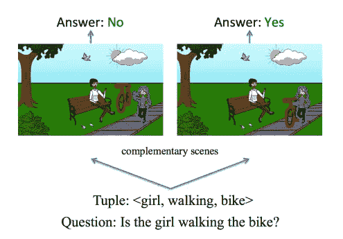
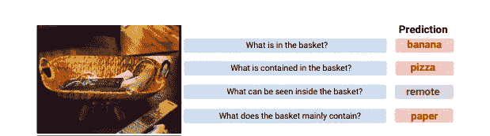
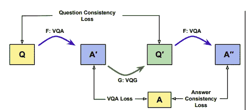

# 基于图像的问答系统及其最新研究概述

> 原文：<https://medium.com/analytics-vidhya/a-brief-on-q-a-generation-from-images-and-its-recent-research-8f575f8b2cfa?source=collection_archive---------20----------------------->

在思考和研究从图像生成文本的可能性时，我偶然发现了一个有趣的视觉问题/答案生成的话题。最初，这似乎是一个直截了当的话题(尽管在 ML 中没有什么是足够直截了当的)，但随着我的深入，我发现了一些障碍和见解，值得一提和讨论。

# VQA 和 VQG:你知道他们吗？

不要太花哨！视觉问答模型应该回答人类围绕特定图像提出的问题。问题的格式和结构可以随提问者而改变，但考虑到图像中显示的主题大多是唯一且明确的，答案应保持不变，并且与模型中的预期相同。

*视觉问题生成是指从图像中生成答案不可知或特定答案的问题。*(答案不可知简单说就是答案独立)。有多种结合 LSTMs 和强化学习的模型，这些模型被训练成在关注答案类型的需要的同时生成问题。

# 一些挑战…

*   在 VQA，尽管使用了像注意力这样最先进的机制，但只要在图像中引入小的变化，同时保持问题不变，就可以毫不费力地欺骗模型。下面给出的图片可以澄清这种情况，这是一个主要原因的关注。

礼貌:[论文](https://arxiv.org/pdf/1511.05099.pdf)

*   也就是说，模型也非常容易对问题中的句法变化做出反应，并且可能无法建立问题和图像之间的相关性。当不同的用户以稍微不同的方式和结构询问相同的问题时，句法变化是最常见的。同样的问题的重新措辞会使脆弱的模型混乱，使它注定失败，因为大多数学习周期不包括重新措辞的问题训练。

礼貌:[论文](https://scontent-del1-1.xx.fbcdn.net/v/t39.8562-6/59465115_419590282108748_7282827485203398656_n.pdf?_nc_cat=102&ccb=2&_nc_sid=ae5e01&_nc_ohc=K3frPNSlAKIAX8FdBBt&_nc_oc=AQni_8SEnsk7s4Q027jYsvPQ6DbewuMbLf5mEZR5iGgCnzrlhrQ5auzzTxOJu8kdnTY&_nc_ht=scontent-del1-1.xx&oh=a9240abbbf0e98c5626e2957263327c6&oe=60306214)

# 解决问题…

弗吉尼亚理工大学(Virginia Tech)的一项颇为引人注目的研究表明，创建图像中存在的重要主题元组，并用这些元组训练多模态人工智能，同时将修改后的图像作为输入一起传递，可以使模型学习复杂性，并在图像语义变化的情况下提供鲁棒性。这种方法部分解决了前面提到的第一个问题。更多关于论文的细节可以在[*这里*](https://arxiv.org/pdf/1511.05099.pdf) 找到。

转到第二个问题，脸书人工智能最近发布了一个更新版本的[*【VQA】重新措辞数据集*](https://facebookresearch.github.io/VQA-Rephrasings/) ，解决了围绕所提问题中句法变化的问题。*该数据集在 40k 张图片上提供了 40k 个问题的三种手写形式*，使其成为各种实验的最新首选实体。

最近，脸书人工智能还提出了一种循环训练方法，这种方法对于视觉问答挑战似乎是鲁棒的。 ***模型不可知的循环训练框架训练用于回答特定问题的 VQA 模型，然后围绕这些答案，VQG 模型生成与原始问题有些相似的问题。这些重新措辞的 cum 生成的问题然后再次由先前的 VQA 模型回答。*** 这种循环方法确保了模型的稳健性，避免了因问题的重新表述而导致的混乱。

> **换句话说，模型正在被训练来预测问题的相同(正确)答案及其(生成的)重新措辞。**~脸书艾论文

礼貌:[论文](https://scontent-del1-1.xx.fbcdn.net/v/t39.8562-6/59465115_419590282108748_7282827485203398656_n.pdf?_nc_cat=102&ccb=2&_nc_sid=ae5e01&_nc_ohc=K3frPNSlAKIAX8FdBBt&_nc_oc=AQni_8SEnsk7s4Q027jYsvPQ6DbewuMbLf5mEZR5iGgCnzrlhrQ5auzzTxOJu8kdnTY&_nc_ht=scontent-del1-1.xx&oh=a9240abbbf0e98c5626e2957263327c6&oe=60306214)

这一个就这么多了！我希望它能丰富和帮助你的探索之旅。:)

**参考文献** : [脸书艾论文](https://scontent-del1-1.xx.fbcdn.net/v/t39.8562-6/59465115_419590282108748_7282827485203398656_n.pdf?_nc_cat=102&ccb=2&_nc_sid=ae5e01&_nc_ohc=K3frPNSlAKIAX8FdBBt&_nc_oc=AQni_8SEnsk7s4Q027jYsvPQ6DbewuMbLf5mEZR5iGgCnzrlhrQ5auzzTxOJu8kdnTY&_nc_ht=scontent-del1-1.xx&oh=a9240abbbf0e98c5626e2957263327c6&oe=60306214)