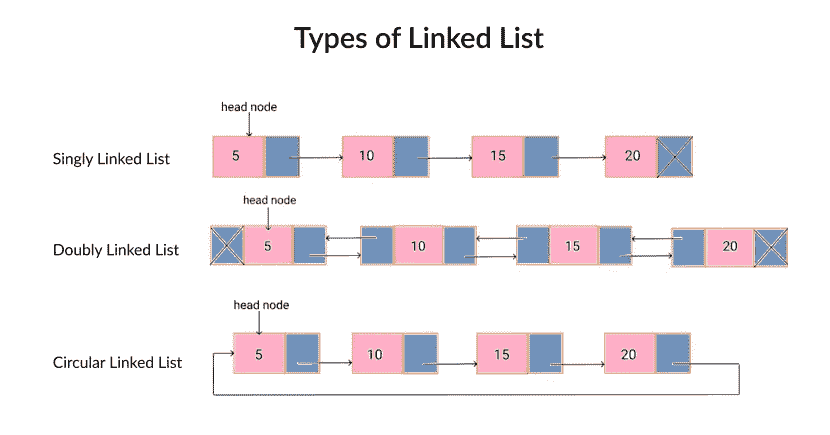
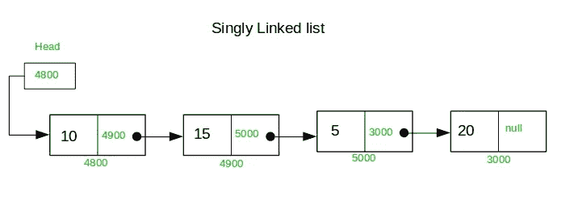
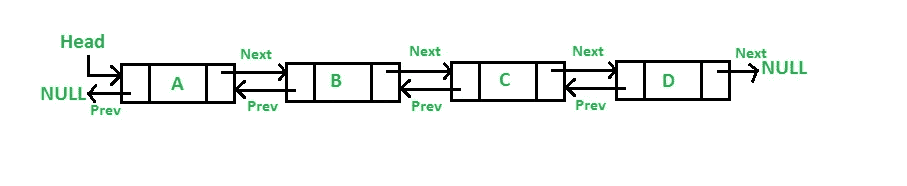
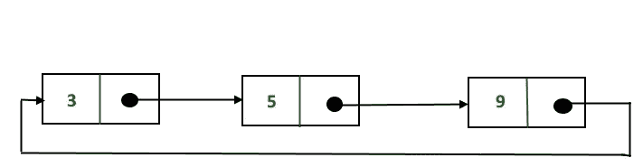
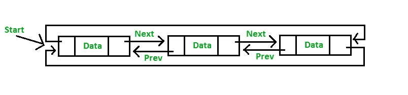

# Python 中链表的简要概述

> 原文：<https://medium.com/analytics-vidhya/a-brief-overview-of-linked-list-in-python-eaf4aa8821be?source=collection_archive---------11----------------------->

# 链表

链表是节点的列表，其中每个节点包含存储的值和下一个节点的地址。



# 单向链表

单链表包含具有数据字段和“下一个”字段的节点，该字段指向一行节点中的下一个节点。可以在单链表上执行的操作包括插入、删除和遍历。



为极客向极客大喊

**头:引用指向第一个节点**
**尾:引用指向最后一个节点**

尾节点的下一个引用变量为空。可以通过从头开始跟踪节点来找到尾节点。

# 节点类

```
class Node:

    def __init__ (self, d, n=None):
        self.data = d
        self.next_node = n

    def __str__ (self):
        return (str(self.data))
```

# 单链表类

```
class LinkedList:

    def __init__(self, r = None):
        self.root = r
        self.size = 0

    def add(self, d):
        new_node = Node(d, self.root)
        self.root = new_node
        self.size += 1

    def remove(self, d):         
        # Store head node
        temp = self.root

        # If head node itself holds the key to be deleted
        if (temp is not None):
            if (temp.data == d):
                self.root = temp.next_node
                self.size -= 1
                temp = None
                return True

        # Search for the key to be deleted, keep track of the
        # previous node as we need to change 'prev.next'
        while(temp is not None):
            if temp.data == d:
                self.size -= 1
                # Unlink the node from linked list
                prev.next_node = temp.next_node
                return True
            prev = temp
            temp = temp.next_node

        # if data was not present in linked list
        if(temp == None):
            return False

    def print_list(self):
        this_node = self.root
        while this_node is not None:
            print(this_node, end=' -> ')
            this_node = this_node.next_node
        print('None\n')
```

# 运行代码

```
myList = LinkedList()
myList.add(3)
myList.add(2)
myList.add(1)

print('The root of the linked list:')
print(myList.root, '\n')

print('Size & the linked list structure:')
print("size="+str(myList.size))
myList.print_list()

myList.remove(3)
myList.remove(2)

print('Linked list after removing the nodes with data 2 and 3:')
print("size="+str(myList.size))
myList.print_list()

print('The root of the linked list:')
print(myList.root)# Results: *******************************************************The root of the linked list:
1 

Size & the linked list structure:
size=3
1 -> 2 -> 3 -> None

Linked list after removing the nodes with data 2 and 3:
size=1
1 -> None

The root of the linked list:
1
```

# 使用内置库:collection.deque

```
from collections import dequellist = deque("abcde")
llistdeque(['a', 'b', 'c', 'd', 'e'])llist.appendleft("z")
llistdeque(['z', 'a', 'b', 'c', 'd', 'e'])llist.popleft()
llistdeque(['a', 'b', 'c', 'd', 'e'])
```

collections.deque 也可以用于实现队列和堆栈。这是一个更一般的结构。我将在以后的文章中讨论德克。让我们看看其他类型的链表及其属性。

# 双向链表

在“双向链表”中，除了下一个节点链接之外，每个节点还包含指向序列中“前一个”节点的第二个链接字段。这两个链接通常被称为“下一个”和“上一个”(“上一个”)。



为极客向极客大喊

# 循环链表

*   在循环链表中，所有的节点都链接在一个连续的圆圈中，不使用 null。对于有前面和后面的列表，存储对列表中最后一个节点的引用。
*   最后一个节点之后的下一个节点是第一个节点。元素可以添加到列表的后面，也可以在固定的时间内从前面删除。
*   使最后一个节点指向列表的第一个节点的想法被称为“循环”或“循环链接”；否则，它被称为“开放的”或“线性的”。
*   循环链表既可以是单向的(第一种)，也可以是双向的(第二种)。



单向循环链表



双向循环链表

# 链接列表的其他详细信息

与数组不同，链表不在连续的位置存储元素；相反，它们分散在内存中的任何地方，通过节点结构相互连接。这样，很容易在链表中添加和删除元素。因为我们只需要改变链接而不是创建数组，但是搜索是困难的，并且经常需要 O(n)时间来找到单链表中的一个元素。

**链表结构常用的方法:**

*   添加(d)，
*   删除(d)，
*   找到(d)，
*   大小()，
*   isEmpty()，
*   first()，
*   last()，
*   addFirst(e)，
*   addLast(e)，
*   removeFirst()，
*   removeLast()

现在，您已经熟悉了这些概念，请访问 [Leet code](https://leetcode.com/tag/linked-list/) 来练习一些现实生活中的问题，并使用本概述中总结的思想来解决它们。万事如意！

## 谢谢你看我的帖子。我希望你学到了一些有用的东西*🙌 🎉