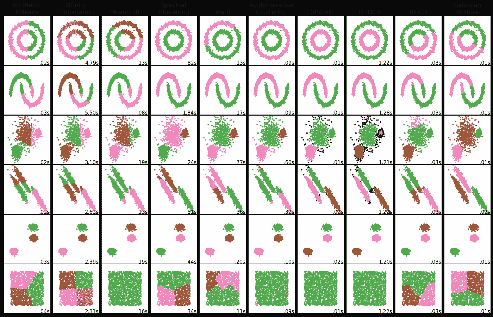

# 聚类算法的备忘单

> 原文：<https://medium.com/analytics-vidhya/a-cheatsheet-to-clustering-algorithms-a2d49fa2cc69?source=collection_archive---------13----------------------->

聚类算法是全世界机器学习实践者用于分类问题的最流行的算法之一。所有聚类算法中最流行的是 K-means 聚类，但在这个故事中，我们将看到它是如何工作的，有哪些其他可用的选项，何时使用哪个，它们有什么不同，等等。

# **K-表示**

*   它要求我们在应用该算法之前知道可以形成的聚类的可能数量。它假设集群是凸形的
*   k-means 上的许多文档页面，包括 [scikit learn 的官方文档页面](https://scikit-learn.org/stable/modules/generated/sklearn.cluster.KMeans.html#sklearn.cluster.KMeans)，都使用了只有一个特征的重复数据(编造的)数据。因此，在散点图的帮助下，可以容易地在视觉上识别集群的数量。
*   但是在现实世界中，您很难找到只有一个特征的数据。因此，知道集群的数量有点困难。
*   有一些技巧，如询问利益相关者、肘法、[、剪影系数](https://scikit-learn.org/stable/modules/generated/sklearn.metrics.silhouette_score.html#sklearn.metrics.silhouette_score)，可以帮助我们确定集群的数量。
*   它使用类内平方和(WCSS)作为其目标函数(深度学习术语中的损失函数)，以在每次迭代中改进自己。
*   K 均值聚类的一种变体是[小批量 K 均值聚类](https://scikit-learn.org/stable/modules/generated/sklearn.cluster.MiniBatchKMeans.html#sklearn.cluster.MiniBatchKMeans)。它使用输入数据的样本。除此之外，其他都一样。与常规的 K-means 聚类相比，该模型的准确性稍差。

K-Means 和 MiniBatchKMeans 聚类算法的比较

# 亲和传播

*   在每次迭代中，[它](https://scikit-learn.org/stable/modules/generated/sklearn.cluster.AffinityPropagation.html#sklearn.cluster.AffinityPropagation)在样本对之间发送消息，直到收敛。
*   该消息包括一个样本作为另一个样本的适合性，其响应于来自其他对的值而被更新。

# 均值漂移

*   [它](https://scikit-learn.org/stable/modules/generated/sklearn.cluster.MeanShift.html#sklearn.cluster.MeanShift)通过更新每个簇的质心来工作。然后对这些质心进行过滤，去除相似或近似重复的质心，并返回一组质心。

# 谱聚类

*   [它](https://scikit-learn.org/stable/modules/generated/sklearn.cluster.SpectralClustering.html#sklearn.cluster.SpectralClustering)使用了[亲和矩阵](https://deepai.org/machine-learning-glossary-and-terms/affinity-matrix)的概念，然后进行聚类。
*   它适用于少量的聚类，但不适用于对特征向量的分量进行聚类。
*   一般用于图像分割。

# 分层聚类

*   有点类似于随机森林。它通过连续合并或拆分嵌套的簇来使用它们，并且这种层次结构被表示为二叉树。
*   [聚集聚类](https://scikit-learn.org/stable/modules/generated/sklearn.cluster.AgglomerativeClustering.html#sklearn.cluster.AgglomerativeClustering)是[层次聚类](https://en.wikipedia.org/wiki/Hierarchical_clustering)的精确复制，但采用自下而上的方法。它递归地合并最小地增加给定链接距离的聚类对。

# 基于密度的噪声应用空间聚类

*   K-means 假设聚类是凸形的，而 [DBSCAN](https://scikit-learn.org/stable/modules/generated/sklearn.cluster.DBSCAN.html#sklearn.cluster.DBSCAN) 不太关心形状，而是关心数据点的密度。因此，形成的簇可以是任何形状。
*   它使用 eps 值，该值是两个样本之间的最大距离，一个样本被认为与另一个样本相邻。这不是群集内点的距离的最大界限。这是为数据集和距离函数选择的最重要的 DBSCAN 参数。
*   Optics 是 DBSCAN 的通用版本，其 eps 要求在一个范围内，而不是单一值。

# 桦树

*   桦树[构建了一棵称为聚类特征树的树。这实质上使它成为一个层次聚类。](https://scikit-learn.org/stable/modules/generated/sklearn.cluster.Birch.html#sklearn.cluster.Birch)
*   BIRCH 算法有两个参数，阈值和分支因子。分支因子限制了节点中子聚类的数量，阈值限制了进入样本和现有子聚类之间的距离。
*   该算法可被视为实例或数据简化方法，因为它将输入数据简化为直接从 CFT 的叶子获得的一组子聚类

# 高斯混合模型

*   [高斯混合](https://scikit-learn.org/stable/modules/mixture.html#mixture)中有四类模型。球形、对角线、捆绑或完全协方差。
*   这是学习混合模型的最快算法
*   他们实现了[期望最大化](https://scikit-learn.org/stable/modules/mixture.html#expectation-maximization) (EM)算法