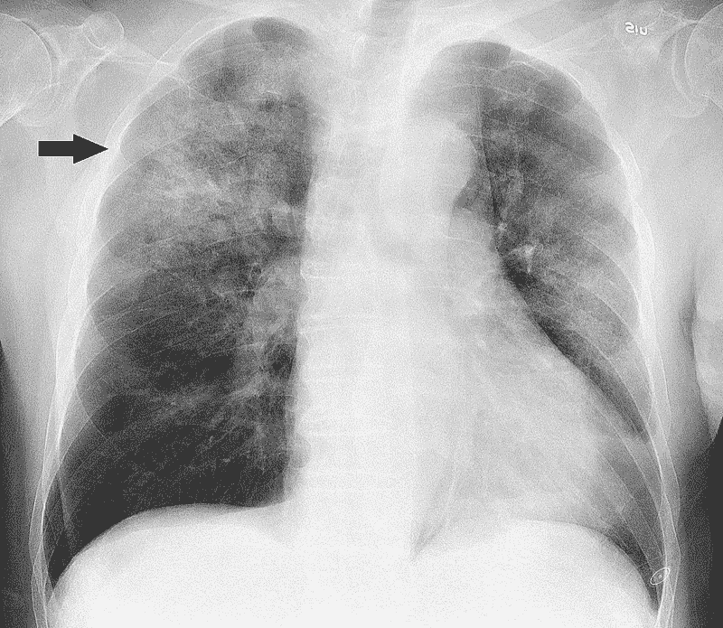
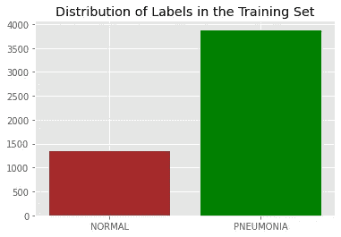
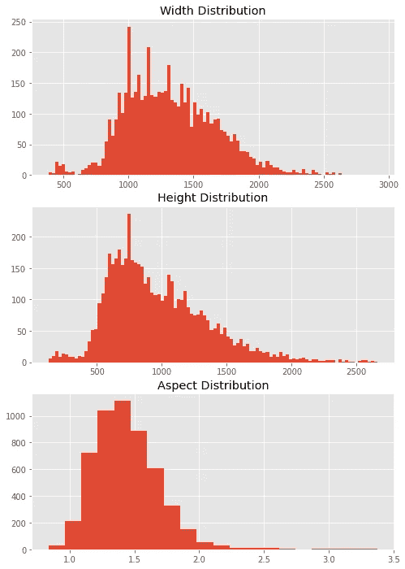
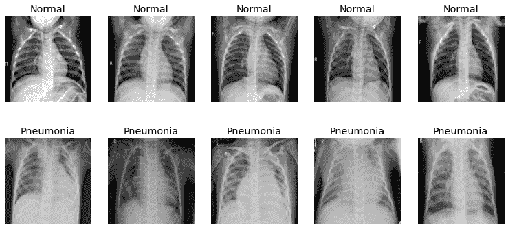
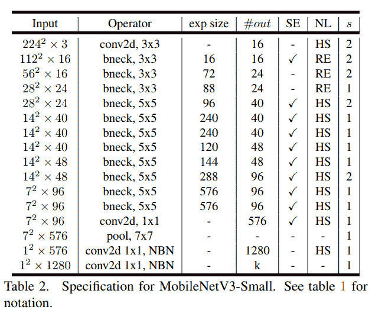
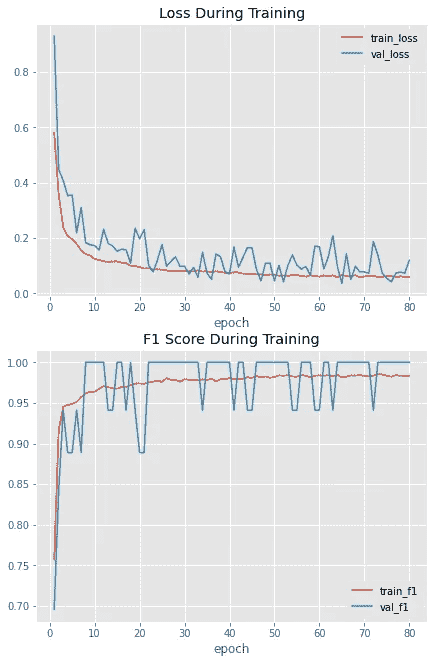
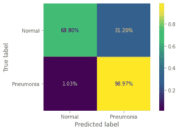

# CNN 用 PyTorch 一步一步对肺炎进行分类

> 原文：<https://medium.com/analytics-vidhya/a-cnn-to-classify-pneumonia-step-by-step-using-pytorch-13a90905abd7?source=collection_archive---------7----------------------->

神经网络已经主导了机器学习领域大约十年了，并且一年比一年好。鉴于医学数据的重要性及其广泛应用，自然会看到神经网络被用于解决生物医学问题。在本文中，我们将使用 MobileNetV3 来解决医学领域中的一个分类问题。敬请期待！

注:这个问题的代码可以通过[这个 Google Colab 笔记本](https://colab.research.google.com/drive/1Mo5wrQZB3Jpyf095TvGkmZF9nerXF7Iq?usp=sharing)、[这个 Kaggle 内核](https://www.kaggle.com/etfaret/mobilenetv3-transferlearning-train-in-20-mins)、[这个 GitHub repo](https://github.com/FeryET/pneumonia_analysis) 获得。本文总结了代码背后发生的事情。笔记本上描述了一步一步的过程。

# 介绍

据[维基百科](https://en.wikipedia.org/wiki/Pneumonia):

> **肺炎**是[肺部](https://en.wikipedia.org/wiki/Inflammation)[的一种](https://en.wikipedia.org/wiki/Lung)炎症，主要影响被称为[肺泡](https://en.wikipedia.org/wiki/Pulmonary_alveolus)的小气囊。典型的症状包括某种组合的[多产](https://en.wikipedia.org/wiki/Phlegm)或[干咳](https://en.wikipedia.org/wiki/Cough)、[胸痛](https://en.wikipedia.org/wiki/Chest_pain)、[发烧](https://en.wikipedia.org/wiki/Fever)和[呼吸困难](https://en.wikipedia.org/wiki/Shortness_of_breath)。病情的严重程度是可变的。

医生用来确定患者是否患有肺炎的方法之一是分析他们的 x 光图像。使用这些图像中的信息，他们可以看到肺炎如何影响病人，它有多严重，以及肺部的哪个部分受其影响最大。您可以在图 1 中看到一个例子。



图一。患有严重肺炎的肺部。患者是一名 88 岁的男子，他有一周的发烧、咳嗽和疲劳。测试表明，他正在对付甲型流感病毒和甲型流感嗜血杆菌。这种情况在肺的右上部分尤为明显。由维基百科提供。

## 数据集

我们针对这个问题使用的数据集是“[胸部 X 线图像(肺炎)](https://www.kaggle.com/paultimothymooney/chest-xray-pneumonia/code)”，最初由[本文](https://www.cell.com/cell/fulltext/S0092-8674(18)30154-5)介绍。它由大约 5，863 张正常和患病患者肺部的高质量 x 射线图像组成，这些患者具有不同的性别和年龄组，患病患者的病因被指示为细菌或病毒。它被分成三个不同的组，训练，测试和验证。训练子集的分布不均衡，肺炎患者占大多数(见图 2)。数据集还包括不同维度的图像，这使得调整大小预处理步骤是必要的。(参见图 3)。



图二。列车组是不平衡的，大多数病例是处理肺炎的患者。



图 3。列车子集中 x 射线图像的宽度、高度和纵横比的分布。

# 预处理

正如我上面提到的，图像大小在宽度和高度上都有所不同，没有唯一的纵横比。为了解决这个问题，我们应该选择一个基本尺寸，所有的图像都可以调整到这个尺寸，这样我们就可以给网络提供完全相同尺寸的图像。看看图 3，我们可以得出结论，使用比大多数图像更小但仍能保持图像细节的尺寸是非常重要的一步。尺寸越大，我们拥有的细节就越多。考虑到这一点，我们仍然不能使输入图像的尺寸大于数据集的一个显著的块。因此，我选择了 256x256。选择这个的一个原因是我们需要选择一个能被 32 整除的图像大小，因为 MobileNetV3 的架构。您可以在图 4 中看到调整后的训练集的示例。



图 4。数据集中两个类的样本，大小调整为 256x256。

由于数据集已经过预处理和质量控制，我们不需要进一步处理数据。x 射线图像没有标准的尺寸、照明、对比度协议，进一步处理数据可能会给模型带来一定的隐含偏差。我们在训练阶段使用数据扩充，以使模型对输入域中的这些类型的变化具有鲁棒性。

# 模型

## 体系结构

我们在这个项目中使用的模型是 MobileNetV3。MobileNetV3 是一个非常轻量级的 CNN，适合在资源有限的手机中使用，这使得它对于缺乏良好的预训练基线和特定领域的问题非常有吸引力。另外，我们正在使用像 Google Colab 或 Kaggle 这样有时间限制的资源。因此，使用一个小而强大的 CNN 更有意义。我们将使用一个在图像网络上预先训练的移动网络，并将微调它后面的层。我们用的 MobileNetV3 是小版本，因为我们在尽量减少参数的数量。您可以在图 5 中看到该模型的架构。



图 5。MobileNetV3 小版本的架构。由 Howard 等人提供，复制自 MobileNetV3 的原始论文。

我们使用模型的主干，即 7x7 池层之前的所有层，下一步，冻结主干中除最后一个瓶颈层和随后的 conv2d 层之外的所有层。我们冻结前两层的原因是，他们已经学习了输入图像的丰富的一般表示，并且已经拥有对输入空间的大量概括理解，可以将输入空间映射到非常复杂的非线性空间。后面几层创建了最终的“决定性”特性，这些特性通常更加针对具体的问题。此外，与我们自己引入的其他层相比，我们对这些未冻结层采用小得多的学习速率，从而微调最后两层，而不是重置它们。

在主干之后，我们使用一个全局平均池层，它将 8x8 功能图映射到 1x1，然后是一个 dropout 和一个使用 Softmax 激活的具有两个输出的线性层。最终模型的架构描述如下(使用 torch-summary):

表 1。肺炎网络架构。

正如你所看到的，最后一个反向残差层和下面的 ConvBNActivation 层是我们微调的原始主干中仅有的两个层。

## 失败

由于训练集中标签的不平衡，我们使用加权交叉熵损失来得到一个更加平衡的模型。计算损失权重的公式为:

```
weight[label] = n_total_samples/ (n_label_samples * num_labels)
```

使用这个公式，我们可以确保少数类样本的权重大于多数类样本的权重，因此我们可以学习输入数据的平衡表示。

# 培养

为了训练模型，定义了一个训练师类，可以在笔记本上看到。所有训练参数都可以在笔记本的“常量”标题下找到。关于训练器类的一个值得注意的事情是使用早期停止作为正则化方案来避免过度拟合，并且对于最终的测试数据，只使用在验证数据上具有最佳性能的模型。

而且我们用的优化器是 AdamW，权重衰减 5e-2。线性层的学习速率选择为 1e-2，微调 CNN 后面层的学习速率选择为 1e-6。要注意的另一件重要事情是，我们使用带有热重启的余弦退火方案，以便衰减两个参数组的学习速率。每次重新启动后，周期的长度也会变得更长，使得模型的学习性能在训练阶段结束时保持稳定。您可以在图 6 中看到模型的训练历史。



图 6。肺炎链球菌的训练史。

您可以在表 2 和图 7 中看到模型在测试集上的性能。

表二。试验数据上肺炎杆菌的性能。



图 7。肺炎的混淆矩阵。

从结果中可以明显看出，该模型在检测实际的肺炎病例时具有非常高的可信度，同时有将正常人归类为患病的趋势。虽然这在大多数情况下听起来不好，因为对疾病进行分类的重要性远远大于错误分类，但在这种情况下，这实际上并不是一件坏事。如您所见，该模型对于正常类具有非常高的精度，这意味着它在说患者健康时具有很高的可信度。88%的准确率和 87%的加权 f1 分数，显示了这种轻量级模型的能力。

# 结论

在本文中，我们使用了一个经过预训练的 MobileNetV3，一个非常轻量级的 CNN，来对肺炎患者和健康人的 x 射线图像进行分类。通过微调 MobileNetV3 的后面几层，并使用早期停止和余弦退火方案来提高模型的学习能力，我们开发了一个稳健的模型，该模型具有非常好的性能，特别是风险调整后的性能。