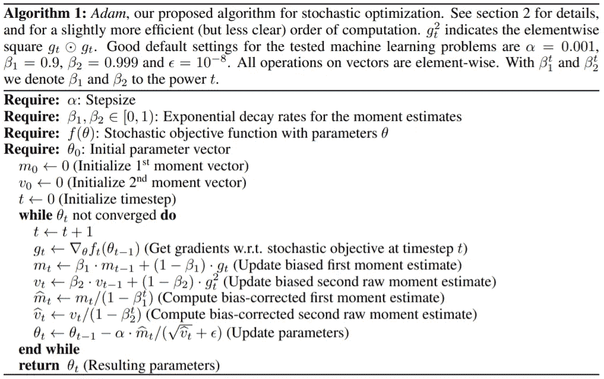

# Adam 和 RMSprop 优化器完全指南

> 原文：<https://medium.com/analytics-vidhya/a-complete-guide-to-adam-and-rmsprop-optimizer-75f4502d83be?source=collection_archive---------0----------------------->

从算法开始到实现。

最优化是一门数学学科，它在定量的明确定义的意义上确定“最佳”解决方案。由偏微分方程支配的过程的数学优化在过去十年中已经取得了相当大的进展，并且从那时起，它已经被应用于各种各样的学科，例如，科学、工程、数学、经济学，甚至商业。最优化理论提供了解决结构良好的最优化问题的算法以及对这些算法的分析。典型的优化问题包括在给定约束下最小化或最大化的目标函数。最优化理论提供了解决结构良好的最优化问题的算法以及对这些算法的分析。机器学习(尤其是神经网络)中的优化算法旨在最小化一个目标函数(通常称为损失或成本函数)，该目标函数直观上是预测数据和期望值之间的差异

基于随机梯度的优化在许多科学和工程领域具有重要的实际意义。这些领域中的许多问题都可以归结为要求参数最大化或最小化的标量参数化目标函数的优化。梯度下降是一种优化算法，它使用目标函数的梯度来导航搜索空间。文献中存在几种基于梯度下降的优化算法，但仅举几个例子，梯度下降优化算法的分类如下:

# **一阶优化算法**

一阶方法使用函数的一阶导数来最小化。

1.  动力
2.  内斯特罗夫加速梯度
3.  阿达格拉德
4.  阿达德尔塔
5.  **RMSprop**
6.  **亚当**
7.  阿达马克斯
8.  那达慕
9.  阿姆斯格勒

# **二阶优化算法**

二阶方法利用 Hessian 矩阵(损失函数相对于其参数的二阶导数矩阵)的估计。

1.  牛顿法
2.  共轭梯度
3.  拟牛顿法
4.  Levenberg-Marquardt 算法。

在本文中，我们将从 Adam 和 RMSprop 的算法开始，到它在 python 中的实现，然后我们将比较它的性能。

> 设 J(θ)是一个由模型的参数θ ∈ Rn 参数化的函数，该函数是充分可微的，可以求其最小值。梯度法建立的序列原则上应该接近最小值。为此，我们从任意值 x_0(例如随机值)开始，并通过以下方式构造递归序列:

其中η是学习率。

梯度下降的 Python 代码

在正常的随机梯度下降算法中，我们固定了所有递归序列的学习率值，因此导致收敛缓慢。对于像 Adam 和 RMSprop 这样的**自适应方法，每个参数的学习率是可变的。即使输入样本不是线性可分的，这种方法也能保证收敛到一个精心选择的学习率的误差函数的最小值。**

虽然 **ADAGRAD** 对于稀疏设置工作良好，但是已经观察到它的性能在损失函数非凸且梯度密集的设置中恶化，这是由于在这些设置中学习速率的快速衰减，因为**在更新**中使用了所有过去的梯度。为了解决这个问题，已经提出了 ADAGRAD 的几个变体，例如 **RMSprop、ADAM、ADADELTA** 等，这些变体使用过去梯度平方的**指数移动平均值**来减轻学习速率的快速衰减，本质上将更新的可靠性限制在仅仅过去的几个梯度。

# RMSprop 优化器

RMSprop 是一种用于训练神经网络的基于梯度的优化技术。它是由反向传播之父杰弗里·辛顿提出的。当数据通过函数传播时，像神经网络这样非常复杂的函数的梯度有消失或爆炸的趋势(参考消失梯度问题)。Rmsprop 是作为小批量学习的随机技术开发的。

RMSprop 通过使用平方梯度的移动平均值来归一化梯度，从而处理上述问题。这种标准化平衡了步长(动量)，减少了大梯度的步长以避免爆炸，增加了小梯度的步长以避免消失。

简而言之，RMSprop 使用自适应学习率，而不是将学习率视为超参数。这意味着学习率随着时间而变化。

RMSprop 的更新规则:

RMSprop 优化器的更新规则

# **让我们用 Python 编码**

RMSprop 的 Python 代码

# **亚当优化器**

Adam (Kingma & Ba，2014)是一种基于一阶梯度的随机目标函数算法，基于低阶矩的自适应估计。Adam 是许多机器学习实践者正在使用的最新最先进的优化算法之一。由第二矩归一化的第一矩给出了更新的方向。

亚当的更新规则:

图 1:亚当算法[1]

# **让我们用 Python 编码**

ADAM 优化器的 python 代码如下所示，

ADAM 优化器的 Python 代码

是啊，就这么简单。

# **结果**

我已经从头开始编码神经网络，并实现了上述优化器。然后，在包含 60，000 个训练样本和 10，000 个测试样本的 MNIST 手写数据集上，对该神经网络进行 100 个时期的训练。

图 2:结果

# 延长

仅供参考，我还实现了 Adamax 优化器，它是 Adam 优化器的扩展，正如您从结果中看到的那样。如果您对 Adamax 的实现更感兴趣，我推荐读者阅读迪德里克·p·金马、吉米·巴雷的论文。亚当:一种随机优化方法。

# **结论**

在本文中，我们已经看到了基于梯度优化的简单且计算高效的算法。我们已经看到了 RMSprop 和 ADAM 优化器是如何简单且易于实现的。实验证实了对凸问题收敛速度的分析。

如果你更有兴趣从头开始看神经网络的详细代码，你可以在我的 Github 上找到。

【https://github.com/sanghvirajit/Feedforward_Neural_Network 

# **参考文献**

[1] [迪德里克·p·金马，吉米·巴雷。亚当:一种随机优化方法。](https://arxiv.org/pdf/1412.6980.pdf)

[2] [Tieleman，t .和 Hinton，g .讲座 6.5 — RMSProp，COURSERA:用于机器学习的神经网络。2012 年技术报告。](https://docs.google.com/viewer?url=http%3A%2F%2Fwww.cs.toronto.edu%2F~hinton%2Fcoursera%2Flecture6%2Flec6.pdf)