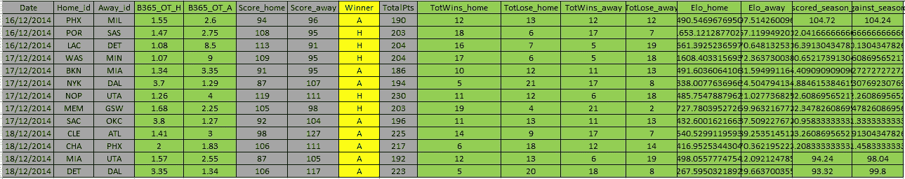

# 用 R 语言拟合机器学习模型的完整指南

> 原文：<https://medium.com/analytics-vidhya/a-complete-guide-to-fitting-machine-learning-models-in-r-24a3dea2ee82?source=collection_archive---------13----------------------->

> 这比你想象的要简单

本文描述了如何在 *R* 中使用各种机器学习模型进行训练和预测。 *R* 是一种强大的编程语言，主要面向统计研究，尽管它有更广泛的应用。我们将公开**的语法实现**，另外我们将描述每个模型的常用**拟合选项**和**超参数**，如何使用**交叉验证**，以及最终**如何做出预测**。我们还将展示如何**保存模型**。

我们将使用的数据可以在[1]中找到。它由 12 054 场 *NBA* 比赛，以及日期、最终结果和一些体育分析中常用的预测变量(输赢记录、攻防表现)组成。这只是一个示例数据集，显然我要展示的代码与这个特定的数据集无关。数据集如下所示:

图 1:数据集概述(绿色为预测变量，黄色为结果，灰色为杂项信息)

0-加载库和数据

I —随机森林

二——LDA、QDA 等。

III —支持向量机

四、平均神经网络

V —做出预测

**0 —加载库和数据**

首先，我们导入库，加载数据集，并只选择预测变量 *X* 和独立变量 *Y* (在我们的数据集的情况下是*赢家*)来创建我们的训练和测试集。下面的模型将被训练来预测分类变量——因为 *Y* 要么是主队( *H* )要么是客场(*A*)——但是预测定量输出的代码是严格相同的。

*注意:完整代码可从【2】*获得

图 2:导入库、数据，并设置训练集和测试集

我们最终定义 *trainControl* 对象以进行交叉验证，该工具是可选的，但它减少了训练过程中的差异，并将在训练过程中使用:

图 3:定义 10 重交叉验证

**I —随机森林**

我们将使用 *randomForest* 包来构建和训练一个随机森林模型。通常的关键参数是我们平均的树的数量( *ntree* )和用于构建的度量(*度量*)。更多细节可在[3]中找到。

图 4:在 R 中训练和保存一个随机森林模型

**二——LDA、QDA 等。**

我们将在那里使用 *MASS* 包[4]中包含的 *train()* 函数。这非常有用，因为自变量'*方法'*允许我们在各种已经包含的模型中训练任何种类的 ML 模型。方法的详细列表和进一步的文档可在[5]中找到。构建和拟合 QDA 模型的代码如下所示:

图 5:在 R 中拟合并保存一个 QDA 模型

**III —支持向量机**

尽管可以用 *train()* 功能训练 *SVM* 车型，但我们在这里将使用 *e1071* 包。该软件包包含用于 *SVM* 模型的高级方法，以这种方式存在多种选项，例如分类类型、内核类型(*线性*、*径向*、*多项式*、自定义函数)、度量，以及训练模型预测分类概率的可能性。更多文档可在[6]中找到。

图 6:在 R 中拟合并保存一个 SVM 模型

**IV —平均神经网络(avNNet)**

在这最后一部分，我们将概述一下 *avNNet* 包。这是一个特殊的包，允许建立和训练平均神经网络:具体来说，该函数适合一定数量的具有不同起始种子的神经网络，对它们进行平均，并从中建立一个独特的模型。该过程允许减少训练过程中的变化，从而获得更鲁棒的模型。关键参数是构建的 NN 的数量(*重复*)和每个模型的隐藏层数(*大小*)。更多文档可在[7]中找到。

图 7:在 R 中拟合和保存 avNNet 模型

**V —做出预测**

一旦我们训练并保存了我们的模型，根据新数据进行预测可能会很有趣。我们只需要加载模型，然后借助 *predict()* 函数进行预测。这里的关键参数是*类型的*参数。更多文档可在[8]找到。

图 8:从 R 中保存的模型进行预测

不要犹豫留下任何反馈/问题/ *掌声*或者联系我获取更多信息。

**另一篇文章** *(用机器学习构建体育博彩算法)* [新冠肺炎如何阻止我在 2020 年成为百万富翁|作者 sébastien Cararo | Analytics vid hya | 2020 年 12 月| Medium](/analytics-vidhya/how-covid-19-prevented-me-from-being-a-millionnaire-in-2020-5b2144e8bdef)

**联系人:** sebcararo@hotmail.fr

**来源**

[1]数据集位置

[https://raw . githubusercontent . com/SEB 943/PCA _ and _ ML _ R/main/Data/Example _ dataset . CSV](https://raw.githubusercontent.com/Seb943/PCA_and_ML_R/main/Data/Example_dataset.csv)

[2]整个代码

[PCA _ and _ ML _ R/fittinglmodelsinr。R 在主 SEB 943/PCA _ and _ ML _ R(github.com)](https://github.com/Seb943/PCA_and_ML_R/blob/main/Codes/FittingMLmodelsInR.R)

[3]随机森林文件

[randomForest 函数| R 文档](https://www.rdocumentation.org/packages/randomForest/versions/4.6-14/topics/randomForest)

[4]批量包装文档

[MASS.pdf(r-project.org)](https://cran.r-project.org/web/packages/MASS/MASS.pdf)

[5] *质量*包中的列车*功能*

[列车功能| R 文档](https://www.rdocumentation.org/packages/caret/versions/4.47/topics/train)

[6] e1071 包装文件( *SVM* )

[r-project.org e1071.pdf](https://cran.r-project.org/web/packages/e1071/e1071.pdf)

[7] avNNet 软件包文档

[avNNet 函数| R 文档](https://www.rdocumentation.org/packages/caret/versions/6.0-86/topics/avNNet)

[8]预测功能文档

[预测函数| R 文档](https://www.rdocumentation.org/packages/stats/versions/3.6.2/topics/predict)

图 9:封面图片